# 谷歌云储存库 CI/CD

> 原文：<https://dev.to/codingcatdev/google-cloud-repositories-ci-cd-14l3>

> 原帖:[https://ajonp.com/lessons/google-cloud-repositories-ci-cd/](https://ajonp.com/lessons/google-cloud-repositories-ci-cd/)

[https://www.youtube.com/embed/MijHRE5h6Gg](https://www.youtube.com/embed/MijHRE5h6Gg)

# 总结

我们将继续我们在 [Firebase 项目托管](https://ajonp.com/lessons/1-creating-firebase-project/)中的 hello world 示例，并扩展到使用 CI/CD 将我们的站点发布到 Firebase。最终的托管示例将在初始项目文件夹中创建站点(在我的例子中是 ajonp-lesson-1)

1.  源代码库定价
2.  创建 Github 存储库
3.  创建 Google 云资源仓库
4.  创建 docker 文件以上传到 Firebase
5.  为 Google Cloud Build 创建 cloudbuil.yaml 以触发构建
6.  设置触发器
7.  提交以使触发器运行
8.  更新内容更改 Hello World

# 我为什么要使用 Google Source Repositories？

> 因为更便宜！(我是用小本预算开发的)
> 缺点是它不像 git clone 那样易于使用

[](https://res.cloudinary.com/practicaldev/image/fetch/s--2D5BXAjE--/c_limit%2Cf_auto%2Cfl_progressive%2Cq_auto%2Cw_880/https://res.cloudinary.com/ajonp/image/upload/f_auto%2Cfl_lossy%2Cq_auto%2Cw_50/v1543865880/ajonp-ajonp-com/Logos/Github/Git-Icon-Black.jpg)

## Github

不要误会我的意思，我认为每月 7 美元是一笔很大的交易，但你必须在你想开始使用私人回购的时候支付。

[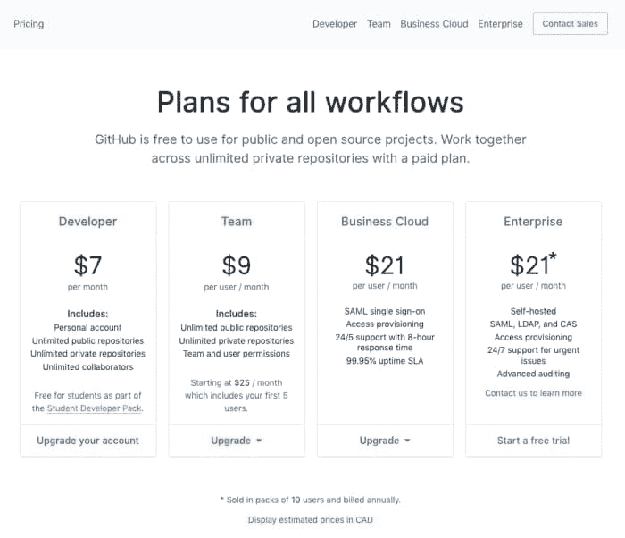](https://res.cloudinary.com/practicaldev/image/fetch/s--6FNh9kBQ--/c_limit%2Cf_auto%2Cfl_progressive%2Cq_auto%2Cw_880/https://res.cloudinary.com/ajonp/image/upload/f_auto%2Cfl_lossy%2Cq_auto%2Cw_700/v1543865368/ajonp-ajonp-com/2-lesson-gcp-cloud-build/github_pricing.jpg)

[](https://res.cloudinary.com/practicaldev/image/fetch/s--61wOm8yF--/c_limit%2Cf_auto%2Cfl_progressive%2Cq_auto%2Cw_880/https://res.cloudinary.com/ajonp/image/upload/f_auto%2Cfl_lossy%2Cq_auto%2Cw_50/v1543865897/ajonp-ajonp-com/Logos/Google%2520Cloud/Cloud_Source_Repositories.jpg)

## 谷歌云源码库

基本上是免费的，直到你达到一个大的水平。

[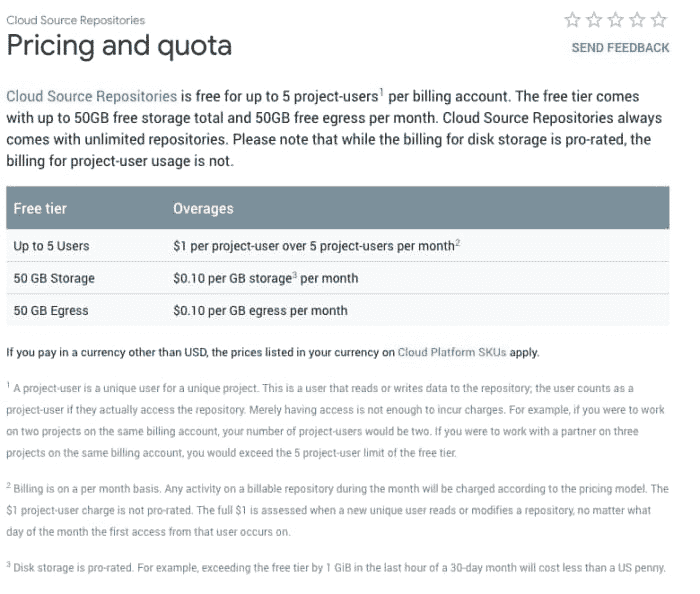](https://res.cloudinary.com/practicaldev/image/fetch/s--t4cg2Z56--/c_limit%2Cf_auto%2Cfl_progressive%2Cq_auto%2Cw_880/https://res.cloudinary.com/ajonp/image/upload/f_auto%2Cfl_lossy%2Cq_auto%2Cw_700/v1543865368/ajonp-ajonp-com/2-lesson-gcp-cloud-build/gcr_pricing.jpg)

# Github

## 创建资源库

选择新建

[](https://res.cloudinary.com/practicaldev/image/fetch/s--5_OSgaZO--/c_limit%2Cf_auto%2Cfl_progressive%2Cq_auto%2Cw_880/https://res.cloudinary.com/ajonp/image/upload/f_auto%2Cfl_lossy%2Cq_auto%2Cw_700/v1543865368/ajonp-ajonp-com/2-lesson-gcp-cloud-build/git_new.jpg)

为回购创建名称

[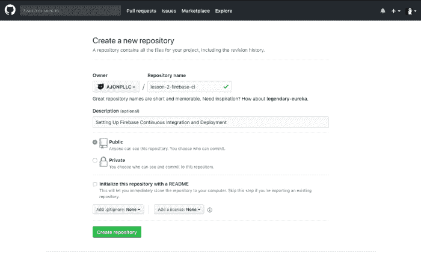](https://res.cloudinary.com/practicaldev/image/fetch/s--ttjBJVo5--/c_limit%2Cf_auto%2Cfl_progressive%2Cq_auto%2Cw_880/https://res.cloudinary.com/ajonp/image/upload/f_auto%2Cfl_lossy%2Cq_auto%2Cw_700/v1543865368/ajonp-ajonp-com/2-lesson-gcp-cloud-build/github_new_repo.jpg)

克隆我们现有的“Hello World”项目

```
git clone https://github.com/AJONPLLC/lesson-1-firebase-project.git
cd lesson-1-firebase-project/ 
```

Enter fullscreen mode Exit fullscreen mode

## 删除远程引用

当您克隆一个现有的存储库时，您需要清理远程引用以将其存储到一个新的存储库中。

让我们看看目前的遥控器

```
git remote -v 
```

Enter fullscreen mode Exit fullscreen mode

这应该会显示如下内容

> 原点[https://github.com/AJONPLLC/lesson-1-firebase-project.git](https://github.com/AJONPLLC/lesson-1-firebase-project.git)(取)
> T3】原点[https://github.com/AJONPLLC/lesson-1-firebase-project.git](https://github.com/AJONPLLC/lesson-1-firebase-project.git)(推)

让我们拿掉这个遥控器

```
git remote rm origin 
```

Enter fullscreen mode Exit fullscreen mode

## 添加新创建的回购

```
git remote add origin https://github.com/AJONPLLC/lesson-2-firebase-ci.git
git push -u origin master 
```

Enter fullscreen mode Exit fullscreen mode

[](https://res.cloudinary.com/practicaldev/image/fetch/s--nW-99pis--/c_limit%2Cf_auto%2Cfl_progressive%2Cq_auto%2Cw_880/https://res.cloudinary.com/ajonp/image/upload/f_auto%2Cfl_lossy%2Cq_auto%2Cw_50/v1543865871/ajonp-ajonp-com/Logos/Google%2520Cloud/logo_gcp_hexagon_rgb.jpg)

# 谷歌云

> 截至目前*2018 年 12 月 3 日*谷歌有这样的消息:
> 从 12 月 3 日开始，这个版本的云资源仓库将永久重定向到新版本的云资源仓库。立即试用新版本的快速代码搜索、改进的代码浏览器等等。

## 谷歌云源码库

打开[源云储存库](https://source.cloud.google.com/)。
现在你可以选择“添加存储库”。

### 添加谷歌云仓库(单机版)

选择“创建新存储库”选项。

[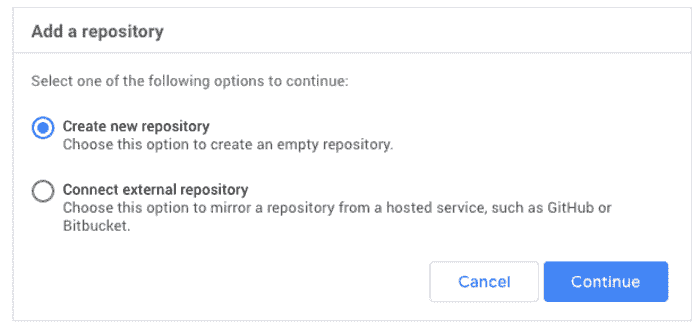](https://res.cloudinary.com/practicaldev/image/fetch/s--khVKkeTW--/c_limit%2Cf_auto%2Cfl_progressive%2Cq_auto%2Cw_880/https://res.cloudinary.com/ajonp/image/upload/f_auto%2Cfl_lossy%2Cq_auto%2Cw_700/v1543868087/ajonp-ajonp-com/2-lesson-gcp-cloud-build/gcr_create_repo.jpg)

在第一课中，您应该有一个从 firebase 创建的项目，您可以使用“项目”下的下拉菜单进行选择。然后点击“创建”(不是创建项目，除非你想把它分开)。

[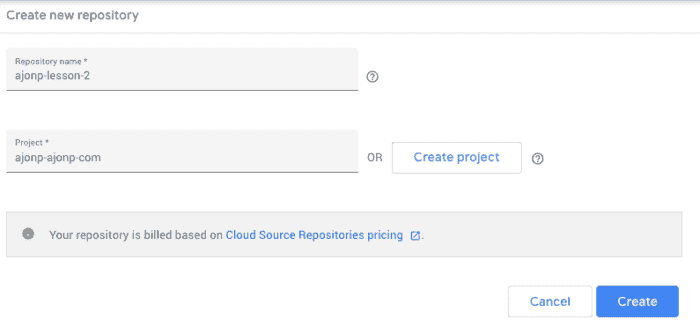](https://res.cloudinary.com/practicaldev/image/fetch/s--I_xXu3pi--/c_limit%2Cf_auto%2Cfl_progressive%2Cq_auto%2Cw_880/https://res.cloudinary.com/ajonp/image/upload/f_auto%2Cfl_lossy%2Cq_auto%2Cw_700/v1543869018/ajonp-ajonp-com/2-lesson-gcp-cloud-build/gcr_new_repo.jpg)

### 添加代码到谷歌云仓库

通常，在新的回购中，您现在可以克隆它并开始工作。

[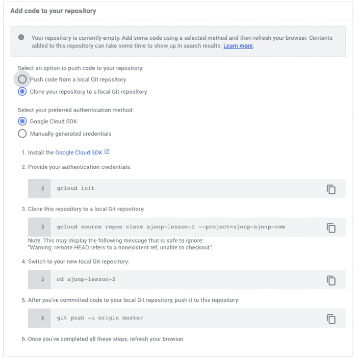](https://res.cloudinary.com/practicaldev/image/fetch/s--GF4rJDuV--/c_limit%2Cf_auto%2Cfl_progressive%2Cq_auto%2Cw_880/https://res.cloudinary.com/ajonp/image/upload/f_auto%2Cfl_lossy%2Cq_auto%2Cw_700/v1543869150/ajonp-ajonp-com/2-lesson-gcp-cloud-build/gcr_add_code.jpg)

对于这个例子，我们将选择“从本地 Git 存储库推送代码”,因为我们已经有了一个正在处理的例子。

[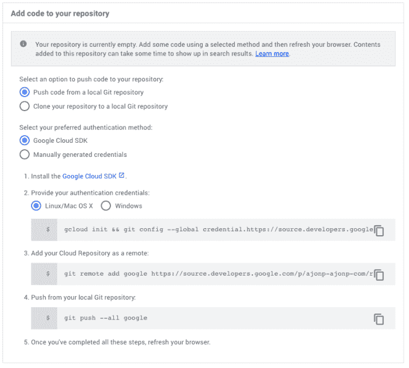](https://res.cloudinary.com/practicaldev/image/fetch/s--rwhej3uL--/c_limit%2Cf_auto%2Cfl_progressive%2Cq_auto%2Cw_880/https://res.cloudinary.com/ajonp/image/upload/f_auto%2Cfl_lossy%2Cq_auto%2Cw_700/v1543869327/ajonp-ajonp-com/2-lesson-gcp-cloud-build/gcr_push_code.jpg)

你可以跳过第一个命令(除非你跳过了第一课和 GitHub 托管)。

首先确认我们有你项目的正确来源(我的应该是第 2 课而不是第 1 课)

```
git remote -v 
```

Enter fullscreen mode Exit fullscreen mode

> 原点〔t1〕https://github . com/ajonpllc/lesson-2-fire base-ci . git〔t1〕〔fetch〕〔T2〕T3〕原点〔T4〕https://github . com/ajonpllc/lesson-2-fire base-ci . git〔t5〕(推送)

现在添加 Google Source Repository 作为一个额外的远程位置

```
git remote add google https://source.developers.google.com/p/ajonp-ajonp-com/r/ajonp-lesson-2 
```

Enter fullscreen mode Exit fullscreen mode

再次查看您的遥控器，您应该会看到两个。

> Google[https://source . developers . Google . com/p/ajonp-com/r/ajonp-lesson-2【fetch】
> 
> 【Google】https://source . developers . Google . com/p/ajonp-com/r/ajonp-lesson-2](https://source.developers.google.com/p/ajonp-ajonp-com/r/ajonp-lesson-2)(推送)

对于 VSCode 中的多个远程，您可以访问 git 选项卡，然后“...”，然后“推到……”。这会给你看遥控器。
[T3】](https://res.cloudinary.com/practicaldev/image/fetch/s--9ugf-EuR--/c_limit%2Cf_auto%2Cfl_progressive%2Cq_auto%2Cw_880/https://res.cloudinary.com/ajonp/image/upload/f_auto%2Cfl_lossy%2Cq_auto%2Cw_700/v1543870094/ajonp-ajonp-com/2-lesson-gcp-cloud-build/vscode_multi_remotes.jpg)

要删除基于 GitHub 的 remote，您可以执行，但是我们现在不会这样做，因为我们想测试将代码推送到两个库。

```
git remote remove origin 
```

Enter fullscreen mode Exit fullscreen mode

## 创建 Dockerfile

我喜欢为我所有的 docker 文件创建一个文件夹，这样你就可以很容易地找到并访问它们。在[官方指南](https://cloud.google.com/cloud-build/docs/configuring-builds/build-test-deploy-artifacts#deploying_artifacts)中有很多参考，但是他们似乎总是把这个文件放在你的 cloudbuild.yaml 文件旁边(在我看来这混淆了事情)。

[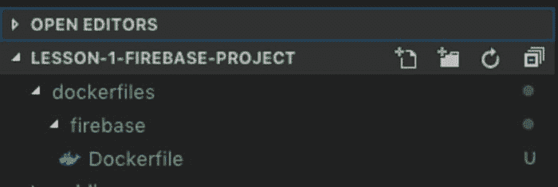](https://res.cloudinary.com/practicaldev/image/fetch/s--Eix24Dg3--/c_limit%2Cf_auto%2Cfl_progressive%2Cq_auto%2Cw_880/https://res.cloudinary.com/ajonp/image/upload/f_auto%2Cfl_lossy%2Cq_auto%2Cw_700/v1543870825/ajonp-ajonp-com/2-lesson-gcp-cloud-build/dockerfiles.jpg)

这个 docker 文件利用了 node 中预先构建的节点映像。

docker files/firebase/docker file

```
# use latest Node
FROM node
# install Firebase CLI
RUN npm install -g firebase-tools

ENTRYPOINT ["/usr/local/bin/firebase"] 
```

Enter fullscreen mode Exit fullscreen mode

我们需要确保计费和云构建 API 已经设置好。你可以遵循一个很棒的指南[启用计费](https://cloud.google.com/cloud-build/docs/quickstart-docker)。

同样，我们这样做很便宜，其他地方会为此收取月费。谷歌每天允许 120 分钟的构建时间！！
[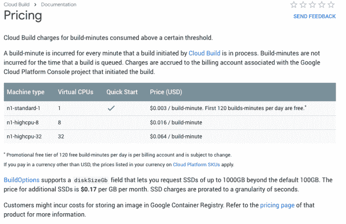T3】](https://res.cloudinary.com/practicaldev/image/fetch/s--NO4sRj16--/c_limit%2Cf_auto%2Cfl_progressive%2Cq_auto%2Cw_880/https://res.cloudinary.com/ajonp/image/upload/f_auto%2Cfl_lossy%2Cq_auto%2Cw_700/v1543871788/ajonp-ajonp-com/2-lesson-gcp-cloud-build/gcb_build_pricing.jpg)

## 创建 Cloudbuild

这个 cloudbuild.yaml 文件将利用 gcloud 触发器。
[https://cloud.google.com/cloud-build/docs/cloud-builders](https://cloud.google.com/cloud-build/docs/cloud-builders)

cloudbuild.yaml(放在根目录中)

```
steps:
# Build the firebase image
- name: 'gcr.io/cloud-builders/docker'
  args: [ 'build', '-t', 'gcr.io/$PROJECT_ID/firebase', './dockerfiles/firebase' ]
# Deploy to firebase
- name: 'gcr.io/$PROJECT_ID/firebase'
  args: ['deploy', '--token', '${_FIREBASE_TOKEN}']
# Optionally you can keep the build images
# images: ['gcr.io/$PROJECT_ID/hugo', 'gcr.io/$PROJECT_ID/firebase'] 
```

Enter fullscreen mode Exit fullscreen mode

> 你可能已经注意到这里有一个有趣的行，它允许在我们的云部署中设置一个名为 _FIREBASE_TOKEN 的参数，所以它不会泄露到我们的 GitHub/GCP 仓库中。
> 参数:['deploy '，'- token '，' ${_FIREBASE_TOKEN}']

我们将需要一个来自 firebase 的令牌，用于下一个 Patterson

```
firebase login:ci 
```

Enter fullscreen mode Exit fullscreen mode

这将引导您完成整个过程(与之前的登录相同)。当这在终端中完成时，您应该会收到一个令牌，如

> 1/8V _ izve co 3 ky 8 exampleonlypnlgpglpavofc _ 0 yx 3 qx2ne _ Zxs
> 以及一条消息
> 示例:FIREBASE deploy-TOKEN " $ FIREBASE _ TOKEN "

您将需要捕获这个令牌，或者让您的终端打开以设置触发器。

## 设置触发器

回到谷歌云平台[控制台](https://console.cloud.google.com/home/dashboard)。使用汉堡导航云构建> [触发](https://console.cloud.google.com/cloud-build/triggers)。

[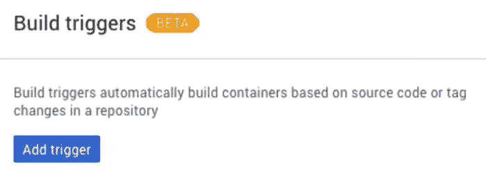](https://res.cloudinary.com/practicaldev/image/fetch/s--DuLO6SuN--/c_limit%2Cf_auto%2Cfl_progressive%2Cq_auto%2Cw_880/https://res.cloudinary.com/ajonp/image/upload/f_auto%2Cfl_lossy%2Cq_auto%2Cw_700/v1543872438/ajonp-ajonp-com/2-lesson-gcp-cloud-build/gcp_add_trigger.jpg)

### Github 触发器

选择 Github 作为来源，然后进行鉴定。

[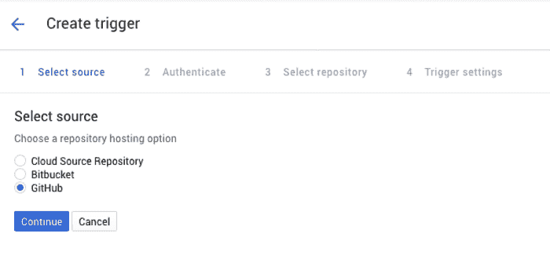](https://res.cloudinary.com/practicaldev/image/fetch/s--CpAZeS32--/c_limit%2Cf_auto%2Cfl_progressive%2Cq_auto%2Cw_880/https://res.cloudinary.com/ajonp/image/upload/f_auto%2Cfl_lossy%2Cq_auto%2Cw_700/v1543872708/ajonp-ajonp-com/2-lesson-gcp-cloud-build/Github_trigger_source.jpg)

选择存储库

[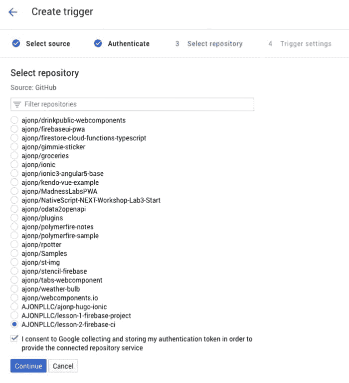](https://res.cloudinary.com/practicaldev/image/fetch/s--k6XOVs-R--/c_limit%2Cf_auto%2Cfl_progressive%2Cq_auto%2Cw_880/https://res.cloudinary.com/ajonp/image/upload/f_auto%2Cfl_lossy%2Cq_auto%2Cw_700/v1543872708/ajonp-ajonp-com/2-lesson-gcp-cloud-build/Github_select_repo.jpg)

设置触发器设置

> 密切注意添加上面步骤中的 Firebase 令牌。

[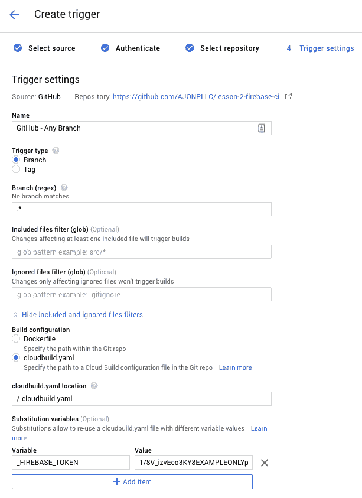](https://res.cloudinary.com/practicaldev/image/fetch/s--p0TrmA4R--/c_limit%2Cf_auto%2Cfl_progressive%2Cq_auto%2Cw_880/https://res.cloudinary.com/ajonp/image/upload/f_auto%2Cfl_lossy%2Cq_auto/v1543872941/ajonp-ajonp-com/2-lesson-gcp-cloud-build/Github_trigger_settings.jpg)

### GitHub 提交触发器

现在您可以运行命令来添加变更 dockerfile 和 cloudbuild.yaml

```
git add .
git commit -m "docker and cloudbuild added" 
```

Enter fullscreen mode Exit fullscreen mode

现在请记住，我们已经在本地提交了这些更改，我们仍然需要将它们推送到 origin(这是我们的 GitHub remote)

```
git push --set-upstream origin master 
```

Enter fullscreen mode Exit fullscreen mode

你现在可以通过进入[谷歌云平台-云构建历史](https://console.cloud.google.com/cloud-build/builds)来检查你的触发器没有失败

[](https://res.cloudinary.com/practicaldev/image/fetch/s--gAqNa_sb--/c_limit%2Cf_auto%2Cfl_progressive%2Cq_auto%2Cw_880/https://res.cloudinary.com/ajonp/image/upload/f_auto%2Cfl_lossy%2Cq_auto/v1543873527/ajonp-ajonp-com/2-lesson-gcp-cloud-build/gcp_build_history.jpg)

### Google 源库触发器

这将是相同的设置。

[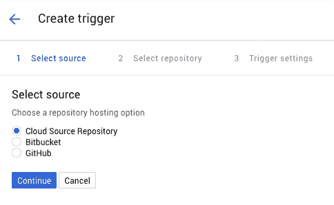](https://res.cloudinary.com/practicaldev/image/fetch/s--yikG7e35--/c_limit%2Cf_auto%2Cfl_progressive%2Cq_auto%2Cw_880/https://res.cloudinary.com/ajonp/image/upload/f_auto%2Cfl_lossy%2Cq_auto/v1543873802/ajonp-ajonp-com/2-lesson-gcp-cloud-build/gcp_create_trigger.jpg)

[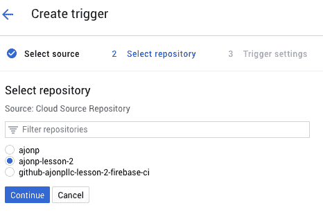](https://res.cloudinary.com/practicaldev/image/fetch/s--xeQcE5Qt--/c_limit%2Cf_auto%2Cfl_progressive%2Cq_auto%2Cw_880/https://res.cloudinary.com/ajonp/image/upload/f_auto%2Cfl_lossy%2Cq_auto/v1543873802/ajonp-ajonp-com/2-lesson-gcp-cloud-build/gcp_select_repo.jpg)

现在我们只需要将数据推送到不同的远程位置(谷歌云存储库)

```
git push --set-upstream google master 
```

Enter fullscreen mode Exit fullscreen mode

# 更新内容——看 CI/CD 在行动

更新你的索引文件来显示一些变化。

public/index.html

```
<!DOCTYPE html>
<html>
  <head>
    <meta charset="utf-8">
    <meta name="viewport" content="width=device-width, initial-scale=1">
    Welcome to Firebase Hosting
  </head>
  <body>
    Firebase is not building everytime I commit, just from following<a href="https://ajonp.com/lessons/2-firebase-ci/">Google Cloud Repositories CI/CD</a>
    
  </body>
</html> 
```

Enter fullscreen mode Exit fullscreen mode

添加、提交、推送文件

```
git add .
git commit -m "CI/CD"
git push --set-upstream google master 
```

Enter fullscreen mode Exit fullscreen mode

[实例](https://ajonp-lesson-1.firebaseapp.com/)