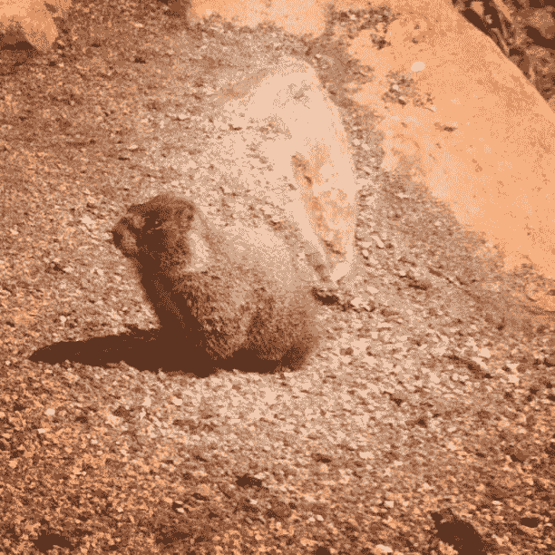

# 地鼠遇见等离子体:网络组装实验

> 原文：<https://dev.to/jeremylikness/gopher-meet-plasma-a-webassembly-experiment-4anl>

#### 利用 WASM 编码在围棋中生成等离子效果

在编程的早期，世界各地的黑客都参与了被称为“[演示场景](http://www.pouet.net/)的活动它今天仍然蓬勃发展，但我最熟悉的是“老派”阶段，主要涉及使用硬件黑客和其他技巧将个人电脑推向极限。我们可以“哄骗”视频处理器在不该画的区域画画，并通过巧妙的计时产生比“允许”更多的颜色或精灵。那是一段有趣的时光，我学到了很多。

<figure> 

<figcaption>我没有地鼠图片。满足于一只土拨鼠？</figcaption>

</figure>

一种流行的效应叫做等离子体。它不仅看起来很酷，而且可能会占用大量处理器资源，因此实现它被认为是一个很好的技巧。真正优秀的程序员能够生成透明的等离子体并覆盖多个图层，生成“干涉”图案，甚至可以动态旋转画布。

2010 年，我决定采用一些“老派”效果，并在 Silverlight 中实现它们[。后来，我把它们从](https://csharperimage.jeremylikness.com/2010/12/old-school-silverlight-effects.html)[带到了 Windows 8](https://csharperimage.jeremylikness.com/2012/12/going-old-school-on-windows-8.html) ，最后用画布做了一个 [JavaScript 实现](https://jsfiddle.net/jeremylikness/bVY6t/)。现在我正在涉足 WebAssembly，等离子体似乎是一个非常合理的尝试效果。我选择用 Go 语言来解决它，以继续提高我的知识。我总是喜欢学习新的语言。

> 嘿，你看！如果你更喜欢铁锈，我用铁锈做了同样的实验！看看这个:

 [## 等离子体生锈:另一个网络组装实验

### 杰里米·利克内斯·⚡️3 月 7 日 195 分钟阅读

#javascript #web #webassembly #rust](/jeremylikness/plasma-gets-rust-y-another-webassembly-experiment-10d2)

现在，回到地鼠和去...

👀看它在行动[这里](https://blazorhealthapp.z5.web.core.windows.net/plasma.html)🔗访问源代码[这里](https://github.com/JeremyLikness/PlasmaWasmGo/)

### 第一次尝试:一路走好

对于我的第一次尝试，我遵循了优秀的“[世界上最简单的 WebAssembly 入门与 Go](https://medium.freecodecamp.org/webassembly-with-golang-is-fun-b243c0e34f02) ”教程。我采用了类似的方法，并在 Go 应用程序中设置了一切来执行与 HTML DOM 的互操作。我不会在这里重复努力来开始，但是一般来说，在你有了当前的`wasm_exec.js`副本和一些引导代码之后，编译 Go to WASM 就像下面这样简单:

`GOOS=js GOARCH=wasm go build -o plasma.wasm plasma.go`

我的设置如下所示: