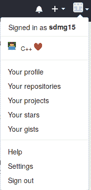
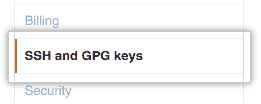
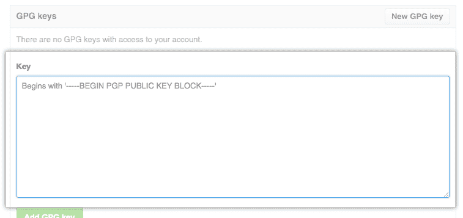
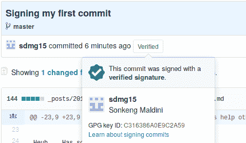

# GPG-签名您的 Git 提交

> 原文：<https://dev.to/sdmg15/gpg-signing-your-git-commits-3epc>

你有没有想过 github/gitlab 中每个提交 hash 旁边的“已验证”按钮是什么意思？也许你想每次都这样？如果你和我一样好奇，想要拥有它，那就来吧！在这篇文章中，我将指导你如何使用 Git 和 Github(而不是 mandotory)对你的提交进行 GPG 签名。已经兴奋了？我们走吧！

# 为什么我需要以任何方式签署我的提交？

如果你是一个开源软件的开发者(或者不是),处理人的钱或者至少是关键的信息，那么你可能需要签署你的承诺来证明是你而不是其他人做了改变。这样，如果有人控制了你的源代码，并且在没有用你的 GPG 密钥签名的情况下进行提交，那么人们会认为这是可疑的提交。用一句话来说，签署你的提交有助于其他人知道所做的更改来自可信的来源(你或维护代码的组织)。

# GPG 密码术？

Heuh...有人说过密码学吗？

GPG 代表**G**NU**P**rivacy**G**uard 它允许你对你的数据和通信进行加密和签名。它使用一套加密算法来实现这些操作。使用 GPG 工具，我们将在下面安装您生成的密钥对:**私钥**和**公钥**。私钥是签署提交所需要的(所以就像您的密码一样，您需要将其加密)。公钥是您可以与每个人共享的。

不要惊慌，你不需要掌握所有这些算法或概念来让你的提交被标记为“已验证”😄。但是如果你想了解更多关于密码学的知识，请查看[这个](https://www.wikiwand.com/en/Cryptography)和[这个](https://www.wikiwand.com/en/GNU_Privacy_Guard)。

好的，谢谢这些链接，但我想得到我的承诺签署😏

# 生成新的 GPG 密钥

操作相对简单。
我们将使用 [Github](https://github.com) 作为我们源代码的托管平台。让我们别再浪费时间了。

注意:你将在下面看到的所有命令都只在 **Ubuntu** 上测试过。

如果你还没有任何现有的 GPG 键，那么继续准备，否则跳到第 4 步。

Github 支持以下 GPG 密钥算法:

*   RSA(**R**ivest**S**hamir**A**dleman)
*   埃尔加马尔
*   DSA ( **D** 数字 **S** 签名* A *算法)
*   ECDH(**E**liptic**C**urve**D**iffie**H**ellman)
*   ECD sa(**E**liptic**C**urve**D**digital**S**ignature)
*   EdDSA ( **E** 矮化曲线 **D** 数字 **S** 数字 **A** 算法)

如果你用 Github 不支持的算法生成你的密钥，你可能会得到错误(我相信这是你不希望的)。不出错的一个方法是继续按照我的步骤来做...

**1。**我们将需要首先安装 GPG 命令行工具。
为此，打开你最喜欢的终端(在我的例子中是用`Ctrl + Alt + T`)并运行下面的命令:

```
 sudo apt update
    sudo apt install gpg 
```

Enter fullscreen mode Exit fullscreen mode

要检查是否所有东西都已安装，您可以运行命令`gpg --version`。为此目的所需的最低版本是`2.1.17`。
如果一切正常，那么让我们进入第二步。

**注意:**点击【https://www.gnupg.org/download/】的[按钮](https://www.gnupg.org/download/)从源代码或您的平台获取实用程序

**2。**要生成新的密钥对，请将以下文本粘贴到您的终端
`gpg --full-generate-key`或`gpg --full-gen-key`中。

*   系统将提示您选择所需的密钥类型。我们可能会发现 Github 幸运地支持的 *RSA* ，它甚至是默认算法。我们会选择它。按回车键并继续；

*   在下一个提示中输入`4096`，它代表密钥的位长度；

*   此时，系统会提示您指定密钥的有效期。如果您不想让密钥过期，请输入`0`(让我们选择此选项)；

确认有效期后，您将被要求提供一些与密钥相关的个人信息。

**注意:**确保你将输入的电子邮件地址是 Github 上经过**验证的电子邮件地址**。

*   输入并验证您的信息后，您将被要求输入一个**密码**。这里的密码短语是在使用私钥之前需要输入的密码。这是防止别人使用你的钥匙的防护装置。输入一个强的，小心翼翼的保存！

你现在可以一边喝着咖啡，一边等待密钥的产生被终结☕

我的已经完成生成。您将得到与这个
类似的输出

```
 gpg: key F9BE7A92520A3D02 marked as ultimately trusted
  gpg: revocation certificate stored as '/home/user/.gnupg/openpgp-revocs.d/1C4ACE74C12E904FBAFA79EDF9BE7A92520A3D02.rev'
  public and secret key created and signed.

  pub   rsa4096 2019-04-01 [SC]
        1C4ACE74C12E904FBAFA79EDF9BE7A92520A3D02
  uid                      john <john@mail.com>
  sub   rsa4096 2019-04-01 [E] 
```

Enter fullscreen mode Exit fullscreen mode

这意味着您的密钥已经成功生成🎉

*我已经花了太长时间来签署我的承诺，我将放弃*

嘿，不要放弃，只剩下几步了！

**3。**下面的命令只显示了美国公钥(注意 *pub* )，但是签名提交或标签需要私钥。输入以下命令显示所有可用 GPG 密钥的私钥:`gpg --list-secret-keys --keyid-format LONG`。它现在会向您输出类似这样的内容:

```
sec   rsa4096/F9BE7B91520A3D02 2019-04-01 [SC]
      1C4ACE74C12E904FBAFA79EDF9BE7A92520A3D02
uid                 [ultimate] me <me@mail.com>
ssb   rsa4096/3CA2083CEAA89B9E 2019-04-01 [E] 
```

Enter fullscreen mode Exit fullscreen mode

在运行命令之前，确保周围没有人👀但是，即使有人有你的私钥并且不知道你的密码，这个人也不可能使用你的密钥，这就是为什么总是建议设置一个密码。

**4。**从前面的输出中你需要复制你想要使用的密钥的**密钥 id** 。在我们的例子中，密钥 id 是`F9BE7B91520A3D02`并与命令
一起使用

```
 gpg --armor --export F9BE7B91520A3D02 
```

Enter fullscreen mode Exit fullscreen mode

它将为您打印一大组随机字符，以代表您的公钥的`-----BEGIN PGP PUBLIC KEY BLOCK-----`开始，以`-----END PGP PUBLIC KEY BLOCK-----`结束。我们现在将它添加到我们的 github 帐户。

# 告诉 Github 我生成的密钥

成功生成密钥后，我们现在通知 Github 关于生成的密钥。

**1。**在任一页面的右上角，点按您的个人资料照片，然后点按“设置”。如下图所示

[](https://res.cloudinary.com/practicaldev/image/fetch/s--ZH3qpKzQ--/c_limit%2Cf_auto%2Cfl_progressive%2Cq_auto%2Cw_880/https://zupimages.net/up/19/14/8dqm.png)

**2。**在用户设置工具条中，点击 SSH 和 GPG 键。

[](https://res.cloudinary.com/practicaldev/image/fetch/s--BghZMC1n--/c_limit%2Cf_auto%2Cfl_progressive%2Cq_auto%2Cw_880/https://zupimages.net/up/19/14/yh61.png)

**3。**点击新 GPG 键。

[](https://res.cloudinary.com/practicaldev/image/fetch/s--fmTXUFvY--/c_limit%2Cf_auto%2Cfl_progressive%2Cq_auto%2Cw_880/https://zupimages.net/up/19/14/1l38.png)

**4。**在“密钥”字段中，粘贴您在生成 GPG 密钥时复制的 GPG 密钥。

[](https://res.cloudinary.com/practicaldev/image/fetch/s--m_6S7tEZ--/c_limit%2Cf_auto%2Cfl_progressive%2Cq_auto%2Cw_880/https://zupimages.net/up/19/14/0lmr.png)

**5。**现在点击**添加 GPG 键**。

[](https://res.cloudinary.com/practicaldev/image/fetch/s--Bx6IAdmO--/c_limit%2Cf_auto%2Cfl_progressive%2Cq_auto%2Cw_880/https://zupimages.net/up/19/14/ye61.png)

嘿，老兄，我不用 Github，我该怎么办？

如果你正在使用 Gitlab，这个过程与 Github 非常相似。但是如果你没有使用它们，那么你需要阅读你最喜欢的主机的文档来知道如何做。

# 告诉 GIT 你的签名密钥

在这一点上，我们几乎完成了！只需要运行一个命令来通知 Git，我们现在想要为我们的每个提交使用签名密钥:

```
 git config --global user.signingkey YOUR_KEY_ID_HERE 
```

Enter fullscreen mode Exit fullscreen mode

运行我们之前用来列出密钥 ID 的命令，选择您想要使用的一个，然后用它替换 YOUR_KEY_ID_HERE。所以在我们的例子中，我们将有`git config --global user.signingkey F9BE7B91520A3D02`

*我刚刚用`git commit -m "Testing"`做了一个新的提交，但是没有成功，这是怎么回事？*

哈，我知道你真的很忙😅

对于明确签名的提交，您需要向您键入的命令添加另一个选项(`-S`)。所以如果我们总结一下，我们会有:

```
 git commit -S -m "Signing commit" 
```

Enter fullscreen mode Exit fullscreen mode

要签署您的标签(发布)，还有一个可用的选项:

```
 git tag -s mytag # Creates a signed tag

git tag -v mytag # Verifies the signed tag 
```

Enter fullscreen mode Exit fullscreen mode

# ...Github 中的视觉效果

提交之后，您现在可以将更改推送到上游服务器(在我们的例子中是 Github)。如果你按下 Github，你将会有**验证过的**徽章被添加到你所有的提交中😄

[](https://res.cloudinary.com/practicaldev/image/fetch/s--xpAbcbqZ--/c_limit%2Cf_auto%2Cfl_progressive%2Cq_auto%2Cw_880/https://zupimages.net/up/19/14/2ttv.png)

那不美吗？它同时结合了美丽和安全！

那就是我们所说的黑魔法吗？:思考 _ 面对:

是的，不知何故！可以把密码学签名当做一个！

# 总结

最后，我们实现了我们的目标，即使用 GPG (Gnu 隐私保护)密钥签署我们的提交。请注意，即使不做我们在 Github 中做的所有事情，而是在 **Git** 中做这些事情，您仍然可以签署您的提交，如果您用您的公钥将提交散列交给某人，他将能够证明您是或不是进行提交的人。Github 只是有一个漂亮的结果显示(带有“已验证”的徽章)。

**PS:** *原载于我的[博客](https://sdmg15.com/blog/2019/03/31/gpg-signing-your-git-commits/)*

# 参考文献

1.  [https://help . github . com/en/articles/generating-a-new-gpg-key](https://help.github.com/en/articles/generating-a-new-gpg-key)

2.  [https://help.github.com/en/articles/signing-commits](https://help.github.com/en/articles/signing-commits)

3.  [https://www.wikiwand.com/en/Cryptography](https://www.wikiwand.com/en/Cryptography)