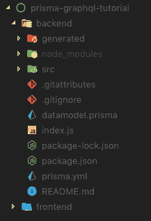

# GraphQL 基础-第 4 部分:连接前端和后端

> 原文：<https://dev.to/doylecodes/graphql-basics-part-4-connecting-frontend-and-backend-35p7>

对于那些跟随我的人来说，很抱歉，距离本系列的上一篇文章已经过去了近一个月！我确实在所有事情都已经完成的情况下开始了这个系列，而且很明显我还有一些东西要学！对学习有好处，对正规博客帖子没好处。我写这篇文章是因为所有的学习:

## 文章不再可用

我们开始吧！

## 为前端做准备

好的。我们需要做的第一件事是做一些家务。(如果你一直跟着我，我们已经把所有东西都放在一个文件夹里了。我现在要做的是将所有内容转移到一个结构中，后端的当前文件在一个“后端”文件夹中，而我有一个单独的“前端”文件夹来存放所有内容。

所以，在我的项目的根目录下，我添加了一个*后端*文件夹和一个*前端*文件夹，然后把所有存在的东西放到后端文件夹中。我必须相应地更新所有的 require(' ')语句，但是在 VS 代码中，这一切都是自动发生的。

所以现在我们有了这个结构: [](https://res.cloudinary.com/practicaldev/image/fetch/s--t410TiNX--/c_limit%2Cf_auto%2Cfl_progressive%2Cq_auto%2Cw_880/https://thepracticaldev.s3.amazonaws.com/i/r1ms5lgzxpy97x5cc324.png)

您应该能够进入后端/在您的终端中，并通过运行`nodemon index.js`来确保一切仍在工作。

如果一切正常，我喜欢在我的*包中添加一个脚本，这样我就不用记住那个命令了。在 *package.json* 中，继续添加以下代码。它将允许您通过键入`npm run dev`而不是`nodemon index.js`来启动后端服务器。* 

```
"scripts": {
    "dev": "nodemon index.js"
  }, 
```

Enter fullscreen mode Exit fullscreen mode

## 前端用 Next.js

对于这个项目，我将使用 Next.js。这是一个非常健壮的框架，提供了很多好东西，比如 React 的服务器端渲染。它也很容易上手，因为它有类似于 *pages* 文件夹的特性，其中该文件夹中的所有组件都成为您可以导航到的页面。它也有一个链接到其他页面的好方法，超级简单，所以它非常适合这个目的。

### 设置 Next.js

首先，我们需要进入我们的*前端*文件夹，我们将安装 Next、React 和 React DOM。此外，我们还为组件、页面创建了一个文件夹，并为高阶组件创建了一个 lib 文件夹。

```
npm init -y
npm install --save react react-dom next
mkdir pages components lib 
```

Enter fullscreen mode Exit fullscreen mode

安装了 Next 之后，我们现在可以做很多事情了！

*   为 Apollo 创建一个高阶组件
*   创建 custom _app.js 组件(传递给 Apollo 客户端组件的主应用程序)
*   创建一个 custom _document.js 组件(覆盖服务器端呈现的普通文档创建。

### 创建一个高阶组件

首先，我们需要再安装一些东西。

```
npm i --save next-with-apollo apollo-boost 
```

Enter fullscreen mode Exit fullscreen mode

**接下来是 Apollo:** 这基本上是一个组件，我们将 Apollo 客户端传递给它，它将最终包装我们的整个应用程序。
**Apollo Boost:**Apollo Boost 只是一个包，包含了最常用的 Apollo 客户端包。本质上有许多单独的软件包可以使用，但大多数人使用一个核心集，所以他们都有作为阿波罗-助推器。

为了制作这个特设组件，我在我的 *lib* 文件夹中创建了 *ApolloHOC.js* 。

```
import withApollo from 'next-with-apollo';
import ApolloClient from 'apollo-boost';

function createClient({ headers }) {
  return new ApolloClient({
    uri: process.env.NODE_ENV === 'development' ? `http://localhost:4000` : `http://localhost:4000`,
    request: operation => {
      operation.setContext({
        fetchOptions: {
          credentials: 'include',
        },
        headers,
      });
    },
  });
}

export default withApollo(createClient); 
```

Enter fullscreen mode Exit fullscreen mode

所以，让我们浏览一下上面的代码。首先，我们导入 next-with-apollo 和 apollo-boost。

接下来，我们将创建 createClient 函数，该函数接受报头(用于 SSR)并返回 Apollo 客户端的一个实例。为此，我们传入后端的端点(localhost:4000 ),并将请求设置为在所有请求中包含标头凭据，并传递这些标头。

基本上，我们需要将消息头和所有请求一起传递(这是 next-with-apollo 的一个功能),还需要将 credential 设置为“include ”,这样我们的应用程序就可以进行身份验证。对于本教程来说有点过了，但是对于其他项目来说是一个很好的起点。

最后，我们从 next-with-apollo 导出我们需要的特设`withApollo`,传递给 apollo 客户机。

### 创建我们的 custom _app.js

接下来，我们需要在 out pages 目录中创建一个 custom _app.js 文件。这在 [Next.js 文档](https://nextjs.org/docs/#custom-app)中有很好的记录，但它本质上是我们用 withApollo 组件包装我们的整个应用程序，以向 Apollo 客户端展示我们的整个前端。我的 custom _app.js 如下。

```
import App, { Container } from 'next/app';
import { ApolloProvider } from 'react-apollo';
import withApollo from '../lib/ApolloHOC';

class MyApp extends App {
  static async getInitialProps({ Component, ctx }) {
    let pageProps = {};

    if (Component.getInitialProps) {
      pageProps = await Component.getInitialProps(ctx);
    }

    return { pageProps };
  }

  render() {
    const { Component, pageProps, apollo } = this.props;
    return (
      <Container>
        <ApolloProvider client={apollo}>
            <Component {...pageProps} />
        </ApolloProvider>
      </Container>
    );
  }
}

export default withApollo(MyApp); 
```

Enter fullscreen mode Exit fullscreen mode

基本上，我的示例(如上)和 Next.js 文档中提供的示例之间的唯一区别是，我还从 props 中析构了`apollo`,并将其作为 props 放入 ApolloProvider 中。我不记得在哪里找到了这些例子，但是阿波罗供应商的文档解释了如何包装你的应用程序。好了，现在我们的组件应该可以访问 Apollo 客户端了！

### [T1】创建 custom _document.js](#create-custom-documentjs)

我做的另一件事是创建一个 [custom _document.js](https://nextjs.org/docs/#custom-document) 。自定义文档是将*用于改变初始服务器端呈现的文档标记*。基本上，我主要用它来连接样式化的组件，但是对于服务器端渲染来说，它似乎有很多用途。

```
import Document, { Head, Main, NextScript } from 'next/document';
import { ServerStyleSheet } from 'styled-components';

export default class MyDocument extends Document {
  static getInitialProps({ renderPage }) {
    const sheet = new ServerStyleSheet();
    const page = renderPage(App => props => sheet.collectStyles(<App {...props} />));
    const styleTags = sheet.getStyleElement();
    return { ...page, styleTags };
  }

  render() {
    return (
      <html>
        <Head>{this.props.styleTags}</Head>
        <body>
          <Main />
          <NextScript />
        </body>
      </html>
    );
  }
} 
```

Enter fullscreen mode Exit fullscreen mode

我从带有样式化组件的 [Next.js 示例中获得了他的 custom _document.js](https://github.com/zeit/next.js/blob/master/examples/with-styled-components/pages/_document.js)

### 多装几个

如果你现在尝试启动所有的东西，你将会得到一些错误，因为一些对等依赖正在进行。我在 *_document.js* 中也有需要的`styled-components`，所以，让我们安装下面的:

```
npm i --save styled-components graphql react-apollo 
```

Enter fullscreen mode Exit fullscreen mode

### 基本页面

为了准备制作第一个 graphQL 查询和变异，我们需要几个基本页面。继续在 pages 目录中创建文件 *addItem* 和 *viewItems* ，并放入以下内容:

#### addItem.js

```
import React from 'react';

const addItem = () => {
  return (
    <div>
      <p>Add item form will go here</p>
    </div>
  );
};

export default addItem; 
```

Enter fullscreen mode Exit fullscreen mode

#### [T1】view items . js](#viewitemsjs)

```
import React from 'react';

const viewItems = () => {
  return (
    <div>
      <p>Items will show here!</p>
    </div>
  );
};

export default viewItems; 
```

Enter fullscreen mode Exit fullscreen mode

### 检查一切正常！

好的，在检查一切正常之前，我会(和后端一样)在前端打开我的*包。json* ，添加脚本`"dev":"next"`，这样我就可以输入`npm run dev`来启动前端了。

你现在可以在前端的*和后端的*目录下运行`npm run dev`，并开始运行！您应该能够从`addItem.js`文件中的段落标记导航到 **localhost:3000/addItem** 以查看“添加项目表单将在此处显示”，类似地，导航到 **localhost:3000/viewItems** 以查看“项目将在此处显示！”。

## 全部设置完毕！

希望现在一切都好了！在下一篇文章中，我将研究如何创建一个 GraphQL 查询！