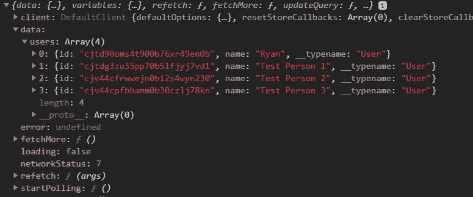

# graph QL basics-part 5:graph QL want in Apollo client(阿波罗客户端中的图形 SQL 愿望)

> 原文：<https://dev.to/doylecodes/graphql-basics-part-5-graphql-queries-in-apollo-client-2ibd>

## 图形 SQL 愿望

为了开始使用 GraphQL 查询，我们将首先看看 GraphQL 查询是什么样子的，然后我们将看看在 Apollo 前端编写查询是什么样子的。

如果您一直在学习本教程，那么到目前为止，我们已经有了下面的数据模型:

```
type User {
  id: ID! @unique
  name: String!
}

type Item {
  itemId: ID! @unique
  name: String!
  cost: Int!
  shortDescription: String
  longDescription: String
} 
```

Enter fullscreen mode Exit fullscreen mode

使用 GraphQL，我们可以按如下方式为特定用户编写一个查询:

```
{
  query GET_USER_QUERY {
    user {
      id
      name
    }
  }
} 
```

Enter fullscreen mode Exit fullscreen mode

这是每一关的情况:

*   这表明我们正在编写一个查询，我们将其命名为 GET_USER_QUERY。为了清楚起见，我喜欢在名称中添加“查询”或“突变”。
*   `user`:这是具体的查询。这也是我们的阿波罗服务器将在**解析器**中寻找的。基本上，我们告诉 graphQL 服务器运行“用户”解析器，这类似于在 REST API 中从 website.com/user 发出请求。
*   `id, name`:最后，在`user`中，我们声明了我们希望返回的内容，即用户的 id 和名称。(不过，如果我们愿意，我们可以只要求其中一个)

## REST API 和 GraphQL 对比

如果您来自 REST API 领域，这就有点不同了。基本上，使用 REST API，您最终会到达某个 URL 端点，比如*somesite.com/user*，并向该 URL 传递一个查询或参数。您可以使用 express 服务器获取这些查询参数，并在任何逻辑中使用它们与数据库进行对话，然后将数据返回给您。(非常简单的解释，显然，我假设你有一些熟悉)

在 REST API 中，您有一些针对某些请求/发布的端点。一个例子是*website.com/users*获取用户列表或者*website.com/posts*获取完整的帖子列表。所有不同的请求都需要一个端点。

使用 GraphQL，您的服务器被设置为以相同的方式接受所有请求，但类似于 REST API 如何拥有不同的端点来处理请求的逻辑，GraphQL 服务器有不同的*解析器*来告诉每个 GraphQL 如何被处理。

[](https://i.giphy.com/media/xT0xeJpnrWC4XWblEk/giphy.gif)

## 从前端编写 GraphQL 查询

同样，如果您一直关注本系列，当我们最初设置 graphQL 服务器时，我们能够对沙箱端点(我们项目中的 localhost:4000)运行查询。这很好，但是，我们需要能够从我们的应用程序中运行查询，下面是我们如何做到这一点！

*   **向 Prisma DB**
    添加用户首先，我们需要向我们的数据库添加一些用户，以便查询一些内容。我们可以通过编程来实现这一点，但我认为在 GraphQL、Prisma 和 Apollo 中启动查询更容易，所以我所做的只是进入我的 Prisma DB，并直接从 Prisma Admin 添加一些用户。
    [](https://res.cloudinary.com/practicaldev/image/fetch/s--709c2Npu--/c_limit%2Cf_auto%2Cfl_progressive%2Cq_auto%2Cw_880/https://thepracticaldev.s3.amazonaws.com/i/sux4a42xm110otqez7rt.JPG) 
    在管理控制台中转到您的用户，有一个+按钮(在上面的照片中我用黄色突出显示了它)，您只需点击即可直接添加用户。

*   **添加 graphql-tag**
    我们需要将包 [graphql-tag](https://github.com/apollographql/graphql-tag) 添加到我们的项目中。这让我们可以使用模板文字将 GraphQL 语言解析成 Apollo 查询。简直`npm i graphql-tag`！

*   **制作一个用户组件**
    Ok！因此，要编写查询，我们首先需要一个组件。我们首先需要在我们的项目前端/组件目录中创建一个名为 *Users.js* 的文件。在里面，我们需要一些东西(除了正常的 react 东西依赖)。

    *   graphql-tag:用于包装 graphql 查询。
    *   查询:来自 react-apollo 库的查询渲染属性。我们应该有一个基本的开始，如下所示:

```
 import React, { Component } from 'react';
  import gql from 'graphql-tag';
  import { Query } from 'react-apollo';

  class Users extends Component {
    render() {
      return (
        <p>I'm the user component.</p>
      );
    }
  }

  export default Users; 
```

Enter fullscreen mode Exit fullscreen mode

*   **向用户组件添加 GraphQL 查询**接下来，我们需要添加实际的查询。为了更好地理解从头编写查询的流程，我们将创建一个查询来获取所有用户。为此，我们使用 gql 标记并创建一个变量，在 gql 标记中保存查询。

```
const GET_USERS_QUERY = gql`
  query GET_USERS_QUERY {
    users {
      id
      name
    }
  }
`; 
```

Enter fullscreen mode Exit fullscreen mode

*   **使用 Apollo 客户机中的查询组件**为了运行我们的查询，我们使用了 Apollo 客户机中的查询组件。这本质上是一个渲染道具，它接受我们的查询作为道具，在科学的背后运行对数据库的查询，并返回数据供我们使用！

为了确保一切正常，我们可以将组件放在类中，将查询作为道具传递，在类中，我们有一个返回“数据”的函数。

```
class Users extends Component {
  render() {
    return (
      <Query query={GET_USERS_QUERY}>
        {(data) => {
          console.log(data)
          return <p>check log</p>
        }}
      </Query>
    );
  }
} 
```

Enter fullscreen mode Exit fullscreen mode

您可以看到我们的函数是如何接受从查询中返回的数据的，现在我们只是返回一个段落标记“check log ”,因为我们正在将数据记录到控制台。

*   **创建一个用户页面**查看我们需要的任何东西，创建一个新页面，我们可以在我们的应用程序中导航到这个页面。在 frontend/pages 目录中，我创建了一个名为 *users.js* 的新文件，并放置了以下内容:

```
import React from 'react';
import Users from '../components/User';

const users = () => {
  return (
    <Users />
  );
};

export default users; 
```

Enter fullscreen mode Exit fullscreen mode

因为我们使用的是 Next.js，所以在/pages 目录中创建一个新组件将会创建 *users* 路径，这就是我们放置 users 组件的地方。

现在我们应该能够转到 **localhost:3000/users** ，并在日志中看到我们的数据！

*   糟糕。修复错误好的，如果你一直 100%地跟随，你现在会看到错误。完全公开，我没有提前计划好这一切，我意识到的一个问题是，当设置我们的服务器时，由于我们的前端和后端来自不同的位置，存在一些 CORS 问题。

这都可以通过将我们的 *backend/index.js* 修改成这样来解决:

```
const express = require('express');
const { Prisma } = require('prisma-binding');
const { ApolloServer } = require('apollo-server-express');
const { importSchema } = require('graphql-import');
const cors = require('cors');

const typeDefs = importSchema('./src/schema.graphql');
const Query = require('./src/Query');
const Mutation = require('./src/Mutation');

const db = new Prisma({
  typeDefs: './generated/prisma.graphql',
  endpoint: 'https://us1.prisma.sh/prisma-tutorial/prisma-graphql-tutorial/dev',
  secret: 'currentlyDrinkingPhilzCoffee'
});

const server = new ApolloServer({
  typeDefs,
  resolvers: {
    Mutation,
    Query
  },
  context: ({ req }) => ({
    ...req,
    db
  })
})

const app = express();

var corsOptions = {
  origin: 'http://localhost:3000',
  credentials: true // includes headers for the requests to backend
}

app.use(cors(corsOptions));

server.applyMiddleware({
  app,
  path: '/',
  cors: false // disbles default apollo-server cors and uses the express middleware cors in-lieu. 
})

app.listen({ port: 4000}, () => 
  console.log(`🚀 Server ready at localhost:4000`)
); 
```

Enter fullscreen mode Exit fullscreen mode

这与我们之前进行的一项重大调整非常相似。(希望稍后会有另一篇文章来解释原因...)默认情况下，Apollo Server 实际上处理 CORS，如果您的前端和后端托管在不同的地方，这就会成为一个问题。我在这里做的基本上是这样的:

*   将常量`{ ApolloServer } = require('apollo-server')`更改为`require('apollo-server-express')`
*   创建了一个快速应用程序
*   添加了 cors 中间件，并为我们的应用程序传递了更具体的选项，包括前端请求的来源。
*   将 express 中间件应用于我们的 express 服务器，并将 Apollo 服务器 cors 设置为 FALSE，这意味着 Apollo cors 被禁用，我们将使用 cors 中间件。

如果一切顺利，应该不会再有 http-header 错误了！*但是我们仍然没有得到任何数据返回，这是为什么呢？*嗯，我们为`users`创建了一个查询，但是我们没有给我们的阿波罗服务器任何**解析器**来处理这个查询。到目前为止，我们只有一个针对个人用户的单一查询。最后一步应该是创建一个解析器来实际获取所有用户。

*   **用户解析器**这其实很简单。首先，转到 backend/src/schema.graphql 并向我们的 graphql 模式添加一个`users`查询。添加用户后，查询类型应该如下所示:

```
type Query {
  user(id: ID!): User
  users: [User]
} 
```

Enter fullscreen mode Exit fullscreen mode

因此，我们添加了一个用户查询，它将返回一个用户对象数组。

接下来，我们需要为查询编写逻辑，所以我们转到 backend/src/Query.js，在我们已经有了用户查询之后创建一个用户查询。

```
const Query = {
  user(parent, args, context, info) {
    if (!context.request.userId) {
      return null;
    }
    return context.db.query.user({
      where: { id: context.request.userId }
    }, info);
  },
  users(parent, args, context, info) {
    return context.db.query.users();
  }
}; 
```

Enter fullscreen mode Exit fullscreen mode

这是一个非常简单的查询，因为我们在询问所有用户。我们只是访问 Prisma users()方法，它之所以对我们可用，是因为我们早在创建服务器时就将它传递给了上下文对象。因此，我们访问上下文，然后访问 prisma 数据库(db)，然后我们访问 Prisma 查询，并在没有附加选项的情况下调用用户()。(您可以传递给 users()更多选项，但我们只想要所有用户)。

## 查询完毕！

此时，(已修复所有错误)您应该能够转到 *localhost:3000/users* 并查看记录到控制台的数据对象，其中包含某处的所有用户。我有我下面看到的。
[](https://res.cloudinary.com/practicaldev/image/fetch/s--vTxxuq8a--/c_limit%2Cf_auto%2Cfl_progressive%2Cq_auto%2Cw_880/https://thepracticaldev.s3.amazonaws.com/i/ys1bwdcztsyrjsqjnndm.JPG) 
你可以在返回的对象中看到，我们实际上在 data.users 下嵌套了用户

我们有数据了！但是我们可以稍微清理一下。

```
<Query query={GET_USERS_QUERY}>
        {({data: {users} }) => {
          return (
            users.map(user => {
              return <p key={user.id}>{user.name}</p>
            })
          )
        }}
      </Query> 
```

Enter fullscreen mode Exit fullscreen mode

因为我们知道我们想要的数据在对象的“数据”中，所以我们可以重构它，然后进一步析构数据中的用户。这让我们可以使用“users”来访问用户数组在查询组件的返回中，我们可以映射用户数组，返回一个

标记，将“key”设置为它们的 id (React want 的唯一键)，并在标记中返回用户名。所以，如果你有 4 个用户，你会得到一个所有用户的输出到 DOM 的列表。耶！

## 重述

概括地说，进行查询包括以下核心步骤:

1.  **编写查询**。
2.  **将查询**添加到 GraphQL 模式中。
3.  **创建解析器**来处理来自客户端的查询。

希望这是对 Apollo 中的基本查询以及用解析器中的 Prisma 方法实现它们的一个很好的介绍。下一步，突变！