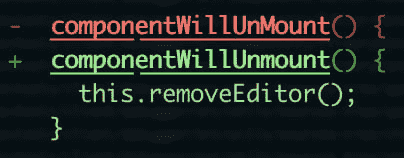

# GraphQL 片段和使用它们的好处

> 原文：<https://dev.to/graphqleditor/graphql-fragments-and-the-benefits-of-using-them-3efc>

在这篇短文中，我将尝试为您分解 GraphQL 片段的概念。GraphQL 中有哪些片段，如何从使用它们中获益？

### GraphQL 片段

在 [GraphQL](https://graphql.org/) 中，你有时需要在多个查询中查询相同的字段。这需要重新定义这些字段，这可能会导致微小但非常恼人的错误。

> 大卫·沃尔什🦊@ davidwalshblog再见我生命中的两个小时...2019 年 4 月 17 日下午 14:49[](https://twitter.com/intent/tweet?in_reply_to=1118526853948612608)[](https://twitter.com/intent/retweet?tweet_id=1118526853948612608)601[](https://twitter.com/intent/like?tweet_id=1118526853948612608)3155

这就是为什么 GraphQL 包含称为片段的可重用单元。片段让您构建可重用的查询逻辑片段(相当于[设计系统](https://dev.to/tomekponiat/what-s-design-system-and-why-you-need-one-31fh)的 UI 组件)。查询的一小部分，随时准备在需要的地方使用，使我们的工作更加有效，并可能降低犯一个简单的错别字的几率。

假设我们有一个包含一些标准字段的`user`类型，比如:

```
type  User  {  name:  String!  age:  Int!  twitter:  String!  facebook:  String!  phone:  String!  email:  String!  street:  String!  zipcode:  String!  city:  String!  } 
```

我们可以用`fragment`来代表一组特定的字段，即*在线联系方式* :

```
fragment  onlineDetails  on  User  {  name  email  twitter  facebook  } 
```

因此，当查询在线细节时，我们可以**引用片段，而不是分别查询所有字段** :

```
{  getUsers  {  ...  onlineDetails  }  } 
```

打字更少，代码更干净，生活更轻松:)

### 使用碎片的好处

GraphQL 片段允许您重用部分查询，并提供如下品质:

*   **一致性** -更高的信心，你总是在正确的领域工作，即当运行突变时，你知道你更新了正确的数据。
*   更好的代码组织 -片段提高了 GraphQL 代码的结构&可重用性，这在团队协作方面非常方便
*   **改进与 GraphQL 服务器的通信**——查询片段将组件与任何不需要的数据隔离开来。

听起来不错吧？因此，如果您想知道是否值得使用 GraphQL 片段，答案很简单——是的！