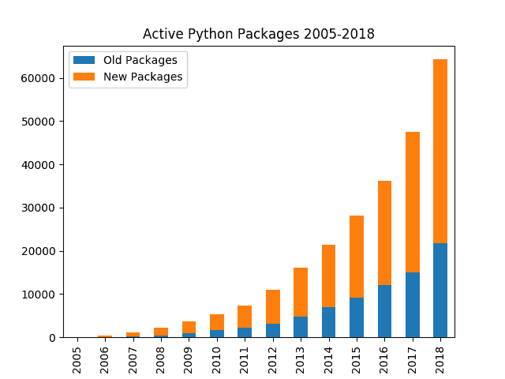
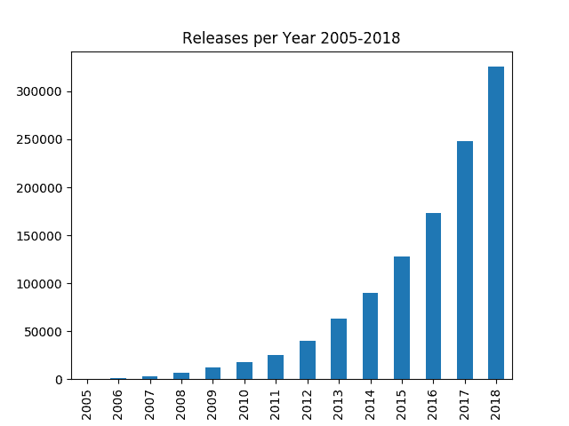
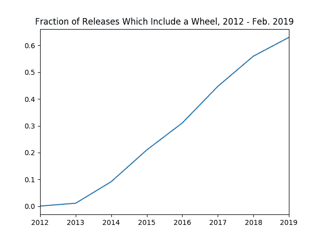

# Python 生态系统的发展

> 原文：<https://dev.to/alexbecker/growth-of-the-python-ecosystem-43hf>

关于构建 PyPI 镜像的一件很酷的事情是，在我的指尖有这么多关于 Python 生态系统的数据。我决定探究自从 PyPI 在 2003 年创立以来，生态系统是如何演变的。我的大部分分析从 2005 年开始，因为那时 PyPI 添加了`upload_time`字段。

在此期间，Python 生态系统一直在稳步发展。随着 PyPI 在 Python 社区中获得近乎全面的采用，经过最初几年的高速增长，每年积极开发的包的数量——意味着他们至少有一个版本或新的发行版上传——每年增加 28%到 48%。

如此图所示，每年主动维护的包中，大多数(~66%)都是新的，其中大多数不会继续维护。然而，保持超过 1 年的包的数量仍然有稳定和强劲的增长。发行数量的增长更为强劲，每年增长 31%到 59%,尽管增速有所放缓。这意味着平均来说，软件包得到了更多的发布，这是变得更加成熟和更好维护的一个很好的代理。

我偶然发现的最令人惊讶的结果来自于查看每个包的发布数量。根据我个人频繁升级依赖项的经验，其中一些是我所期望的，比如 AWS 的 [botocore](https://pypi.org/project/botocore/) 位于第 15 位。但是加密货币交易库 [cctx](https://pypi.org/project/ccxt) 立即脱颖而出。在撰写本文时，它已经发布了 4659 个版本，是其他任何软件包的 3 倍多，尽管它还不到 2 岁！当我试图加载它时，它的 [libraries.io](https://libraries.io) 页面通常会在 30 秒后超时。我不确定这是优秀的维护者还是糟糕的维护者，但这的确令人印象深刻。

另一件有趣的事情是关于发布 Python 包的实践是如何变化的。最大的变化当然是 Python 3 的发布。2012 年引入并在 [PEP 427](https://www.python.org/dev/peps/pep-0427/) 中编纂的二进制轮子，被普遍认为是分发 Python 包的最佳方式。但是软件包作者的采用需要时间。 [Python Wheels](https://pythonwheels.com/) 追踪 PyPI 的 360 个下载量最大的包中 Wheels 的采用情况；在撰写本文时，其中的 82.5%在其发布中包含了车轮分布。其他> 60k 包的长尾有点落后，但包括至少 1 个车轮分布的所有版本的百分比正在稳步增长，在 2018 年刚刚超过 50%。

不是每个包都会作为一个轮子分发；特别是
[由于捆绑的 LibSSL 和系统预先存在的 LibSSL 之间的冲突，psycopg2 将很快停止发布车轮](http://initd.org/psycopg/docs/install.html#disabling-wheel-packages-for-psycopg-2-7)。但很少有包裹有这样的理由不作为轮子分发，所以我预计采用率将保持强劲，直到 90%或更高——这张图表明这将在 2022 年底发生。