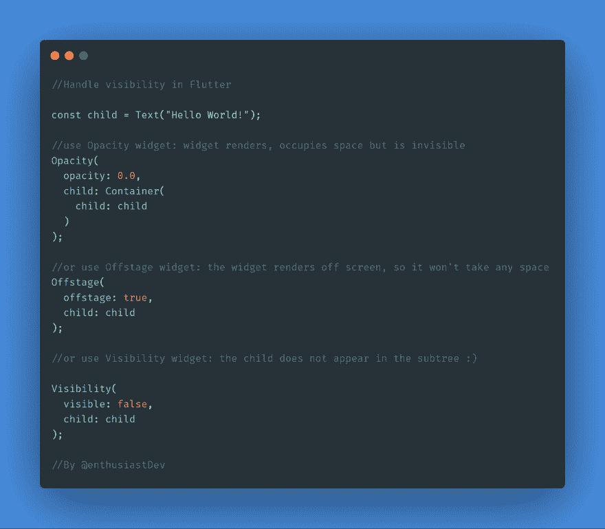

# 在 Flutter 中轻松处理小部件可见性

> 原文：<https://dev.to/ethiel97/handle-widgets-visibility-easily-in-flutter-5501>

谈到在 Flutter 中管理小部件的可见性，您有很多选择。Flutter 为此提供了一些很酷的小部件。我们来看看他们:)

假设您想要隐藏下面的小部件。

`const child = Text("Hello World");`

## 1。使用不透明度部件

```
 Opacity(
      opacity: 0.0,
      child: Container(
          child: child
      )
    ); 
```

这个小部件简单地将孩子的不透明度设置为零，但仍然呈现它。所以孩子是隐藏的，但占用空间，你可以和他互动。

## 2。使用后台小部件

```
 Offstage(
      offstage: true,
      child: child
      )
    ); 
```

后台在屏幕外呈现子部件。这意味着小部件不会呈现在子树中，因此不会占用任何空间。

## 3。使用可见性小部件

```
 Visibility(
      visible: false,
      child: child
      )
    ); 
```

这里，子部件不在子树中呈现，Flutter 使用一个缩小的盒子来代替它。结果与使用`Offstage`的结果非常相似。

根据你的需要使用你想要的任何东西。

下图总结了所有情况。

[](https://res.cloudinary.com/practicaldev/image/fetch/s--tSR-5ho---/c_limit%2Cf_auto%2Cfl_progressive%2Cq_auto%2Cw_880/https://i.imgur.com/HALRsLA.png)

这个帖子到此为止。谢谢:)