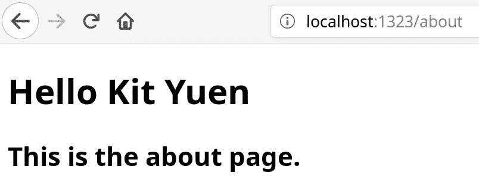

# 在 Go Echo 框架中处理 HTTP 请求(1)

> 原文：<https://dev.to/ykyuen/handling-http-request-in-go-echo-framework-1-5ack>

*最初发布在[水手长博客](https://blog.boatswain.io/post/handling-http-request-in-go-echo-framework-1/)上。*

* * *

在上一篇文章中，我们讨论了如何在 [Echo](https://echo.labstack.com/) 框架中设置嵌套模板。

*   [在 Go Echo web 框架中设置嵌套的 HTML 模板](https://blog.boatswain.io/post/setup-nested-html-template-in-go-echo-web-framework/)

在接下来的几节中，我们将继续讨论如何在 [Echo](https://echo.labstack.com/) 服务器中发出 HTTP 请求，并将结果返回给客户端。让我们从上一篇文章中的[例子](https://gitlab.com/ykyuen/golang-echo-template-example)开始。

## 设置一个 API 端点

首先，创建一个新的 API 端点并返回一个简单的 JSON，稍后由 [Echo](https://echo.labstack.com/) 服务器本身调用。

### 在 api 文件夹中创建新端点

与硬编码的 JSON 请求不同，我们的新 API 端点从 JSON 数据、表单数据或查询参数中获取请求输入，如在 *model/example_request.go* 中定义的，然后将其返回给客户端。

*模型/示例 _ 请求. go*T2】

```
package model

type ExampleRequest struct {
  FirstName string `json:"first_name" form:"first_name" query:"first_name"`
  LastName  string `json:"last_name" form:"last_name" query:"last_name"`
} 
```

*API/get _ full _ name . go*T2】

```
package api

import (
  "fmt"
  "net/http"

  "github.com/labstack/echo"

  "gitlab.com/ykyuen/golang-echo-template-example/model"
)

func GetFullName(c echo.Context) error {
  // Bind the input data to ExampleRequest
  exampleRequest := new(model.ExampleRequest)
  if err := c.Bind(exampleRequest); err != nil {
    return err
  }

  // Manipulate the input data
  greeting := exampleRequest.FirstName + " " + exampleRequest.LastName

  return c.JSONBlob(
    http.StatusOK,
    []byte(
      fmt.Sprintf(`{
        "first_name": %q,
        "last_name": %q,
        "msg": "Hello %s"
      }`, exampleRequest.FirstName, exampleRequest.LastName, greeting),
    ),
  )
} 
```

### 为上述 API 端点设置路由

在 _main.go*中添加我们新的 API 端点路由。

```
...
func main() {
  // Echo instance
  e := echo.New()

  // Instantiate a template registry with an array of template set
  // Ref: https://gist.github.com/rand99/808e6e9702c00ce64803d94abff65678
  templates := make(map[string]*template.Template)
  templates["home.html"] = template.Must(template.ParseFiles("view/home.html", "view/base.html"))
  templates["about.html"] = template.Must(template.ParseFiles("view/about.html", "view/base.html"))
  e.Renderer = &TemplateRegistry{
    templates: templates,
  }

  // Route => handler
  e.GET("/", handler.HomeHandler)
  e.GET("/about", handler.AboutHandler)

  // Route => api
  e.GET("/api/get-full-name", api.GetFullName)

  // Start the Echo server
  e.Logger.Fatal(e.Start(":1323"))
} 
```

### 测试新的 API 端点

运行 [Echo](https://echo.labstack.com/) 服务器，看看它是否工作。

[](https://res.cloudinary.com/practicaldev/image/fetch/s--AZCMpouu--/c_limit%2Cf_auto%2Cfl_progressive%2Cq_auto%2Cw_880/https://thepracticaldev.s3.amazonaws.com/i/ol8hlhtvhniowb38uuee.jpg)

这个新的端点可以直接服务于浏览器客户端，也可以由 [Echo](https://echo.labstack.com/) 服务器本身调用。

## 从 Echo 服务器调用 API

### 创建响应结构类型

类似于 *model/example_request.go* ，我们需要为 HTTP 响应定义另一个结构类型。

*模型/示例 _ 响应. go*

```
package model

type ExampleResponse struct {
  FirstName string `json:"first_name"`
  LastName  string `json:"last_name"`
  Msg       string `json:"msg"`
} 
```

### 在“关于”页面显示新的问候信息

让我们修改 about 页面处理程序，使其显示问候消息。

*handler/about _ handler . go*T2】

```
package handler

import (
  "encoding/json"
  "io/ioutil"
  "net/http"

  "github.com/labstack/echo"

  "gitlab.com/ykyuen/golang-echo-template-example/model"
)

func AboutHandler(c echo.Context) error {

  tr := &http.Transport{}
  client := &http.Client{Transport: tr}

  // Call the api
  resp, err := client.Get(
    "http://localhost:1323/api/get-full-name?first_name=Kit&last_name=Yuen",
  )

  if err != nil {
    return err
  }

  defer resp.Body.Close()
  body, err := ioutil.ReadAll(resp.Body)

  // Unmarshal the response into a ExampleResponse struct
  var exampleResponse model.ExampleResponse
  if err = json.Unmarshal(body, &exampleResponse); err != nil {
    return err
  }

  // Please note the the second parameter "about.html" is the template name and should
  // be equal to one of the keys in the TemplateRegistry array defined in main.go
  return c.Render(http.StatusOK, "about.html", map[string]interface{}{
    "name": "About",
    "msg": exampleResponse.Msg,
  })
} 
```

### 测试关于页面

启动 [Echo](https://echo.labstack.com/) 服务器，浏览 about 页面。我们可以看到新的问候信息。

[](https://res.cloudinary.com/practicaldev/image/fetch/s--ldUh7mWv--/c_limit%2Cf_auto%2Cfl_progressive%2Cq_auto%2Cw_880/https://thepracticaldev.s3.amazonaws.com/i/dnhkmwc8q949at6dfsom.jpg)

### 项目结构

完成上述更改后，项目结构应该是这样的。*(项目被重命名为**handling-http-request-in-go-echo-example-1**，如果要更改项目名称，请确保在 [Golang](https://golang.org/) 源文件中正确设置了 **import** 语句。)*

```
handling-http-request-in-go-echo-example-1/
  ├── api/                     # folder of api endpoints
  │   ├── get_full_name.go     # api for get full name
  ├── handler/                 # folder of request handlers
  │   ├── home_handler.go      # handler for home page
  │   └── about_handler.go     # handler for about page
  ├── model/                   # folder of custom struct types
  │   ├── example_request.go   # struct type of get_full_name request
  │   └── example_response.go  # hstruct type of get_full_name response
  ├── vendor/                  # dependencies managed by dep
  │   ├── github.com/*
  │   └── golang.org/*
  ├── view/                    # folder of html templates
  │   ├── base.html            # base layout template
  │   ├── home.html            # home page template
  │   └── about.html           # about page template
  ├── Gopkg.lock               # dep config file
  ├── Gopkg.toml               # dep config file
  └── main.go                  # programme entrypoint 
```

## 总结

本文向您展示了如何在 [Echo](https://echo.labstack.com/) 框架中设置一个简单的 API 端点。由于 [Go](https://golang.org/) 是一种**强类型**语言，我们必须先将 JSON 转换成定义良好的 struct 类型，这样我们才能操作它的内容。例如:

*   将 GET 请求输入绑定到 *api/get_full_name.go* 中的 **exampleRequest** 。
*   将 GET 响应解组到*处理程序/about_handler.go* 中的**示例响应**中。

要调用 API 调用，我们可以简单地使用 [Go](https://golang.org/) 标准 [net/http](https://golang.org/pkg/net/http/) 库。

完整的例子可以在[gitlab.com](https://gitlab.com/ykyuen/handling-http-request-in-go-echo-example-1)找到。