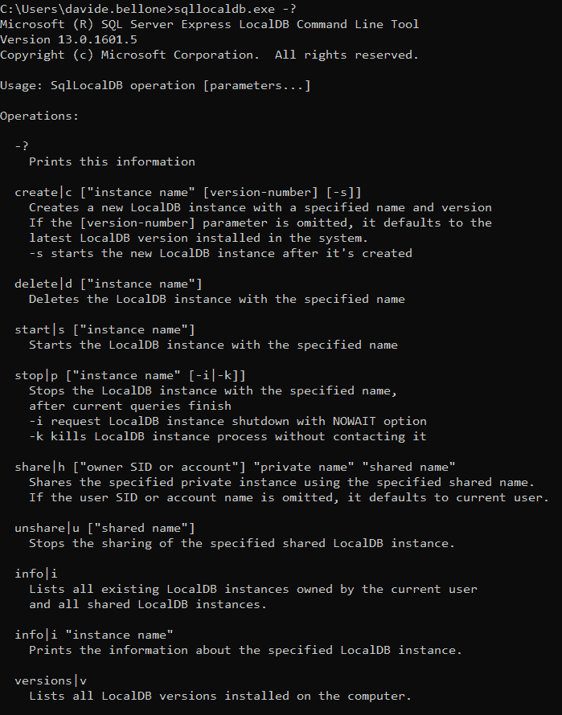

# 您曾经忘记过您的 SQL server 实例名吗？

> 原文：<https://dev.to/bellonedavide/have-you-ever-forgotten-your-sql-server-instance-name-5hcc>

有时候，当我打开 SQL Server Management Studio(SSMS)时，我会浪费时间去思考并试图找出我的 LocalDb 的名称。

解决方法很简单:打开终端，运行`SQLLocalDb.exe i`，其中 *i* 代表*信息*。

现在您可以看到已配置数据库的列表。

要在 SSMS 使用它，请记住使用 Windows 身份验证。

如果你需要一个特定实例的更多信息，只需运行`SQLLocalDB.exe i "InstanceName"`，其中*实例名*必须替换为你要寻找的真实名字。

该命令显示关于指定 SQL 实例的一些信息:这些信息包括版本、所有者和当前状态。

如果您想要所有可用命令的列表，运行`SQLLocalDB.exe -?`。这些命令允许您创建和删除 SQL 实例，停止和启动现有实例等等。

重要的是要记住，这里空格被视为分隔符，所以如果您的 DB 在其名称中包含空格，您必须用引号将名称括起来。