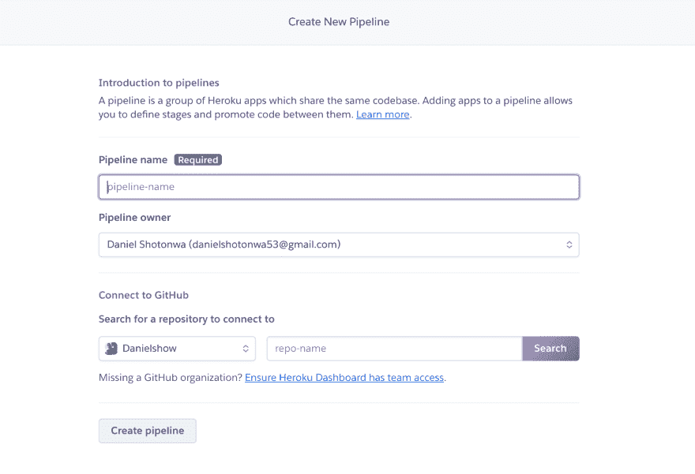
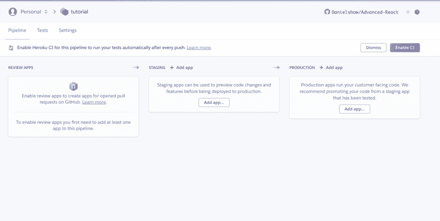

# heroku 持续部署

> 原文：<https://dev.to/danielshow/heroku-for-continous-deployment-m4f>

[](https://res.cloudinary.com/practicaldev/image/fetch/s--bXWG8_F8--/c_limit%2Cf_auto%2Cfl_progressive%2Cq_auto%2Cw_880/https://cdn-images-1.medium.com/max/1600/1%2AFSkUtK8pYPBSNeaVotU4Ug.jpeg)

嘿，有很多关于持续集成、部署和测试的讨论。我们忽略了一个足够强大的工具，它可以让我们的小规模应用程序无缝地持续部署。

多年来，我只需通过我的终端使用以下方式登录，即可将我的应用程序部署到 Heroku:

```
$ heroku login 
```

之后，我在 Heroku 上从我的终端创建了一个应用程序，使用:

```
$ heroku create application-name 
```

这就是我所需要的，我添加任何需要的环境变量并配置我的附加组件，然后将我的代码推送到 Heroku，使用:

```
$ git push heroku master 
```

* * *

繁荣🎉🎉🎉🎉🎉我们应用程序在 Heroku 上运行，但这是 Heroku 唯一能做的吗🤔？我将向您展示如何使用 Heroku 进行持续部署，如何使用试运行和生产应用程序，如何根据您的拉取请求检查应用程序，以及如何在运行测试后自动部署。

* * *

*我们开始吧*

首先，你要做的第一件事是创建一个账户，从你的浏览器登录到 [Heroku](https://www.heroku.com) 。仪表板显示您创建的所有应用程序。为了持续部署，我们将创建一个*管道*而不是一个应用程序。点击`new`，你会看到一个下拉菜单选择要创建的内容，选择 create `new pipeline`。

[](https://res.cloudinary.com/practicaldev/image/fetch/s--6ZJrUVzH--/c_limit%2Cf_auto%2Cfl_progressive%2Cq_auto%2Cw_880/https://thepracticaldev.s3.amazonaws.com/i/ukygmzpx99xdvzr13cfj.png)

你会看到类似上面的图片👆，键入一个管道名称(任何您喜欢的名称)，键入一个存储库名称，如果您已经将 Heroku 帐户连接到 Github，它将自动完成。单击“创建管道”以创建所需的管道。

[](https://res.cloudinary.com/practicaldev/image/fetch/s--gIhrWcYL--/c_limit%2Cf_auto%2Cfl_progressive%2Cq_auto%2Cw_880/https://cdn-images-1.medium.com/max/1600/1%2A8qSW7KsxHEi0DRQEIQZHZA.png)

创建管道后，您就有了这个很酷的仪表板，显示您可以使用管道做的一切。

*   启用审阅应用程序
*   创建临时应用程序
*   创建生产应用程序

单击“添加应用程序”为试运行和生产环境创建一个应用程序。单击您创建的试运行应用程序，并导航到 Deploy 选项卡。转到“自动部署”,并选择您想要部署到试运行开发的分支，最好试运行的分支是“开发”。选中复选框`Wait for CI to pass before deploy`以确保您的测试在部署应用程序之前通过。

对生产环境执行相同的步骤，并自动部署主分支。

* * *

最后一步是创建审查应用程序，使我们的拉请求能够自动部署到 Heroku，并拥有自己的应用程序，以确保我们可以在部署到 staging 之前审查它是否工作正常。

回到 pipeline 仪表盘，我们尚未触及的最后一个选项卡是`enable review apps`。点击按钮启用审核应用程序，您将看到一个弹出窗口，选择您的分期申请并点击`Create an app.json file`。

这将带您进入一个页面，其中包含您的申请的一些信息，向下滚动并单击一个按钮以提交回购。这将向 Github 提交一个`app.json`文件。它还会弹出一个模式，为您的评论应用程序选择设置。勾选`create review apps automatically`和`destroy stale review apps`复选框。单击“启用”以完成该过程。

万岁，提出一个拉请求，你应该看到拉请求已经部署到 Heroku，合并拉请求后，审查应用程序将被自动删除。

感谢阅读。目前就这些。

丹尼尔秀