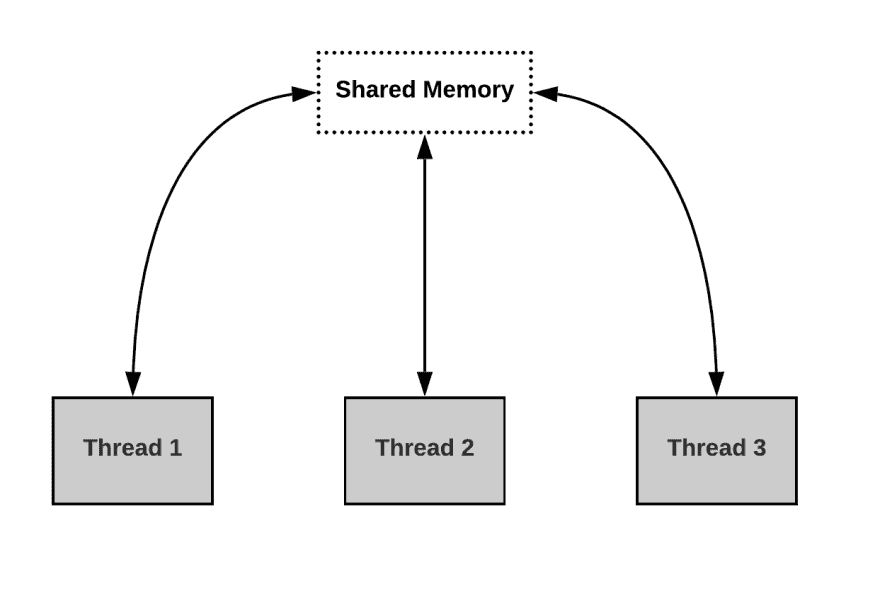
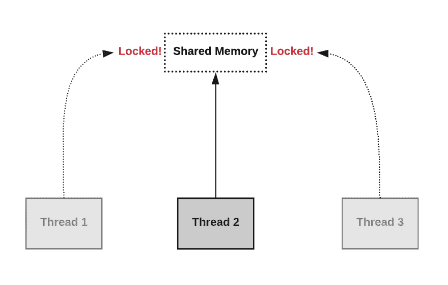
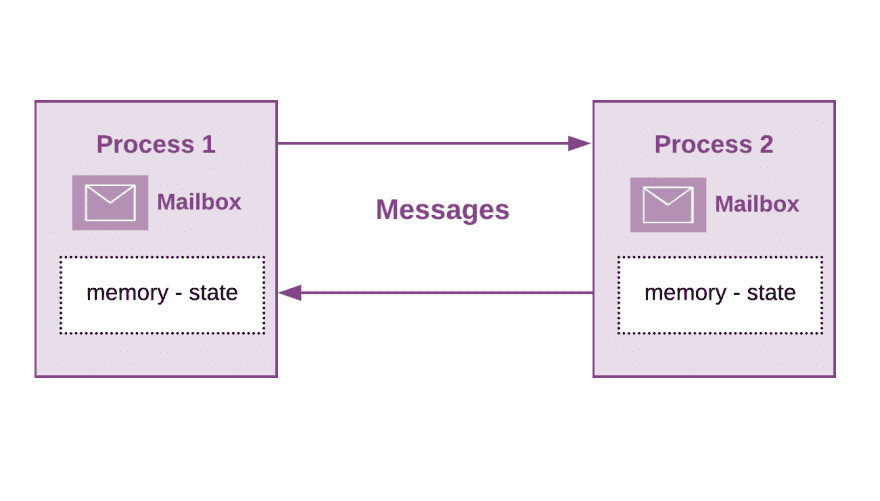
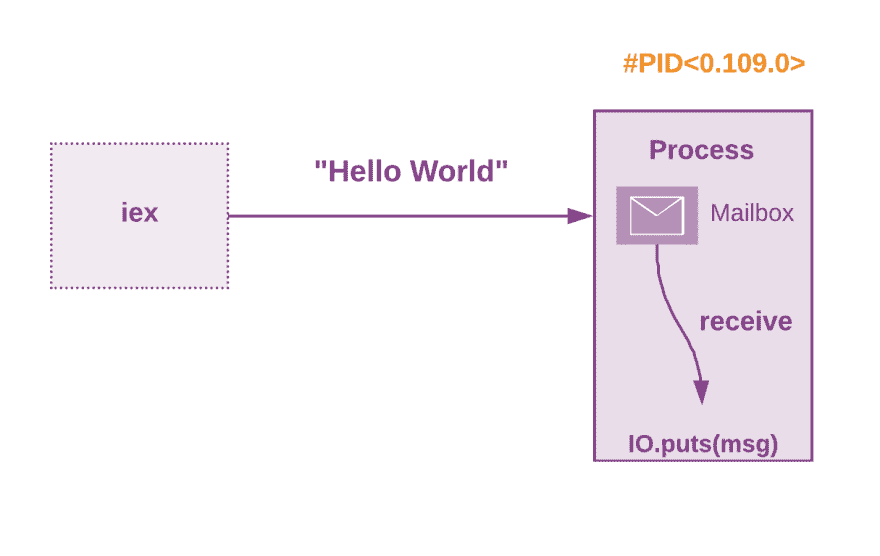
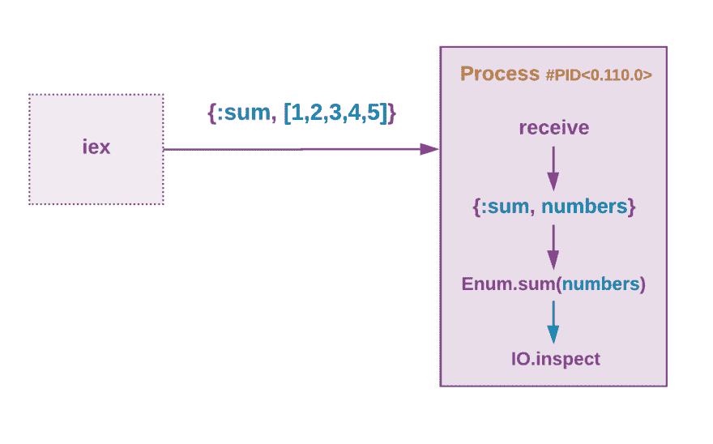
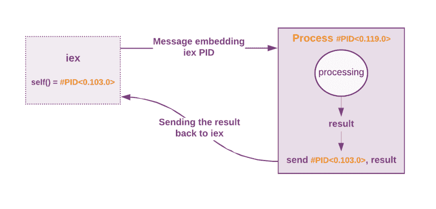
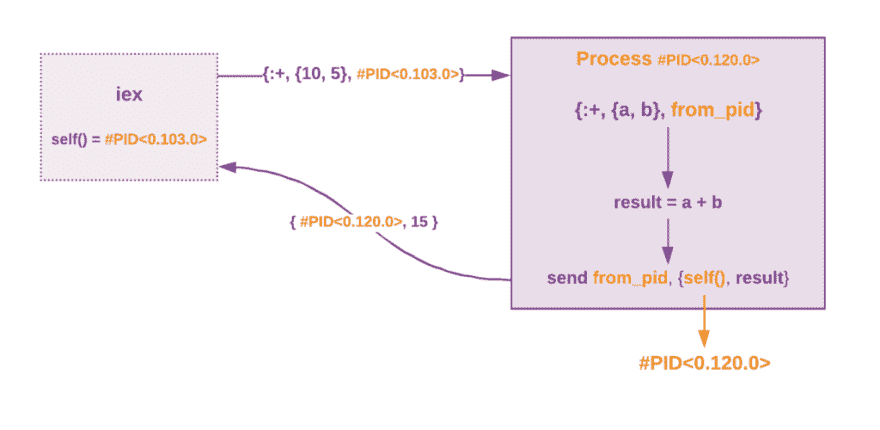

# 嘿，进程，有你的消息！

> 原文：<https://dev.to/alvisesus/hey-process-there-is-a-message-for-you-19a2>

你对仙丹和凤凰有热情吗？订阅 Poeticoding 时事通讯，加入快乐的普通读者，通过电子邮件接收新帖子。

# [T1】简介](#intro)

[我们已经看到了如何产生新的进程](https://www.poeticoding.com/spawning-processes-in-elixir-a-gentle-introduction-to-concurrency/)来并发运行我们的代码，同时执行多个 HTTP 请求，获取加密货币价格。

如果流程之间没有消息和协调，查看结果的唯一方法是让每个流程在完成后打印每个价格。

```
iex> ["BTC-USD", "ETH-USD", "LTC-USD", "BCH-USD"] \
|> Enum.map(fn product_id->  
    spawn(fn -> Coinbase.print_price(product_id) end)
end)

BTC-USD: 3704.51000000
ETH-USD: 125.15000000
LTC-USD: 45.64000000
BCH-USD: 122.83000000 
```

在`iex`控制台中，我们为每个产品生成一个运行`Coinbase.print_price/1`功能的进程。当一个进程收到结果时，它打印价格，然后退出。
这个例子只关注`spawn`功能和流程的创建，但是它也显示了流程之间缺乏协调。

# 共享内存与消息传递

大多数语言(如 Java、Ruby、Python 等。)使用共享内存并发模型，其中线程可以写入和读取共享内存块。

[](https://res.cloudinary.com/practicaldev/image/fetch/s--Z2Zh5vGh--/c_limit%2Cf_auto%2Cfl_progressive%2Cq_auto%2Cw_880/https://1o6jjh24p1t92lcqci49qg8a-wpengine.netdna-ssl.com/wp-content/uploads/2019/03/threads_shared_memory.png)

由于许多线程可以同时改变同一块内存，为了避免竞争情况，我们使用锁来协调线程，并确保一次只有一个线程写入内存。[我简单讲了 Python 和 Ruby 如何使用 GIL](https://www.poeticoding.com/spawning-processes-in-elixir-a-gentle-introduction-to-concurrency/#erlang-processes) (全局解释器锁)来保护共享内存。GIL 一次只允许一个线程写入共享内存，因此很难实现并行。

[](https://res.cloudinary.com/practicaldev/image/fetch/s--5_vbBubE--/c_limit%2Cf_auto%2Cfl_progressive%2Cq_auto%2Cw_880/https://1o6jjh24p1t92lcqci49qg8a-wpengine.netdna-ssl.com/wp-content/uploads/2019/03/threads_locks.png)

**Erlang** 和 **Elixir** 走向另一个方向，实现了一个并发模型(Actor Model)，其中进程**被隔离，**不共享任何内存**。一个进程中的内存不能被任何其他进程直接改变。

太好了，但是如果它们不共享内存，我们如何控制和协调它们呢？用**消息**。

每个进程都有一个**邮箱**，可以接收其他进程的消息。例如，使用消息，一个进程可以请求另一个进程进行计算并返回结果。

[](https://res.cloudinary.com/practicaldev/image/fetch/s--TSzOwsae--/c_limit%2Cf_auto%2Cfl_progressive%2Cq_auto%2Cw_880/https://1o6jjh24p1t92lcqci49qg8a-wpengine.netdna-ssl.com/wp-content/uploads/2019/03/message_passing_elixir_erlang_processes.png)

# 发送第一条消息

让我们从一个简单的例子开始:我们向一个新的进程发送消息。一旦收到，消息就被打印到终端。

当消息被发送到进程时，它首先被存储到进程的邮箱中。然后，我们使用`receive`在邮箱中找到第一条[匹配给定模式](https://www.poeticoding.com/the-beauty-of-pattern-matching-in-elixir/)的消息。

```
iex> pid = spawn fn ->
  receive do
    msg -> IO.inspect(msg)
  end
end
#PID<0.109.0> 
```

*   `spawn`创建一个返回其`pid`、`#PID<0.109.0>`的进程。
*   我们传递的匿名函数在这个新进程中运行。
*   在函数的开始，我们调用`receive`来等待消息。

```
iex> send pid, "Hello World"
"Hello World" 
```

*   通过`send/2`，我们*异步*(它立即返回)将消息`"Hello World"`发送给由`#PID<0.109.0>`标识的流程。
*   `receive`(正在等待消息)将接收到的字符串与捕获模式进行匹配，并打印出来。

[](https://res.cloudinary.com/practicaldev/image/fetch/s--rBENX1xZ--/c_limit%2Cf_auto%2Cfl_progressive%2Cq_auto%2Cw_880/https://1o6jjh24p1t92lcqci49qg8a-wpengine.netdna-ssl.com/wp-content/uploads/2019/03/send_a_message_to_process.png)

# 流程，请帮我计算一下

现在让我们试着让我们的进程计算一组整数的和。
With `send/2` with 不仅限于字符串消息，**我们实际上可以发送任何 Elixir 的数据类型**。

```
iex> pid = spawn fn ->
  receive do
    {:sum, numbers} when is_list(numbers)-> 
      Enum.sum(numbers) 
      |> IO.inspect(label: "sum result")
  end
end

#PID<0.110.0> 
```

这次`receive`只寻找特定类型的消息:一个元组，其中第一个元素是原子`:sum`，第二个元素是列表。

```
iex> send pid, {:sum, [1,2,3,4,5]}
sum result: 15 
```

通过这种方式，由于消息传递和模式匹配，我们可以轻松地将数字列表作为消息的一部分传递，并控制流程将要执行的操作。

[](https://res.cloudinary.com/practicaldev/image/fetch/s--F7P571_G--/c_limit%2Cf_auto%2Cfl_progressive%2Cq_auto%2Cw_880/https://1o6jjh24p1t92lcqci49qg8a-wpengine.netdna-ssl.com/wp-content/uploads/2019/03/elixir_sum_of_list_of_numbers_concurrent_process.png)

# 接收并处理多条消息

在上面的例子中，一旦消息被接收和处理，函数就结束，使进程退出。

使用 PID，我们可以检查进程是否还活着

```
iex> Process.alive? pid
false 
```

为了能够接收和服务许多消息，我们需要保持我们的流程活跃。为此，我们需要使用递归进行循环。

让我们考虑另一个例子，这次我们有不同的运算，两个数的`:+`(和)`:-`(差)。

```
defmodule Example do
    def next_message do
        receive do
            {:+, {a,b}}->
                IO.puts("#{a} + #{b} = #{a+b}")
            {:-, {a,b}}->
                IO.puts("#{a} - #{b} = #{a+b}")
        end
        next_message()
    end
end 
```

为了简单起见，我们在一个模块中定义函数。与匿名函数相比，这种方式的递归更简单，因为我们不必将函数作为参数。

一旦我们处理完消息并到达函数的末尾，我们就进行一次递归调用`next_message()`，重新运行函数。

了解进程如何一次计算一条消息是很重要的。如果我们想同时处理不同的消息，我们需要将它们发送到不同的进程。

我们可以使用`spawn/3`，传递模块、函数名和参数，避免使用任何匿名函数。

```
iex> pid = spawn Example, :next_message, []
#PID<0.119.0>

iex> send pid, {:+, {10, 5} }
10 + 5 = 15
iex> send pid, {:-, {10, 5} }
10 - 5 = 15 
```

我们看到这一次我们的函数是如何循环的，使得这个过程遍历多个消息。

为了让进程退出，我们可以使用`Process.exit/2`向它发送一个退出信号。

```
iex> Process.alive?(pid)
true
iex> Process.exit(pid, :halt)
true
iex> Process.alive?(pid)
false 
```

# 发回结果

很多时候，打印结果是不够的。我们希望得到结果或者确认在另一个过程中发生了什么。

我们看到，我们可以用任何数据类型发送消息。原来我们也可以发一个 PID。因此，除了消息之外，我们还可以将流程的 PID 发送到我们想要返回结果的地方。

[](https://res.cloudinary.com/practicaldev/image/fetch/s--WFp51YHG--/c_limit%2Cf_auto%2Cfl_progressive%2Cq_auto%2Cw_880/https://1o6jjh24p1t92lcqci49qg8a-wpengine.netdna-ssl.com/wp-content/uploads/2019/03/elixir_process_send_result_back.png)

返回调用它的进程的 PID。如果我们在 iex 上调用它，它会显示当前的控制台进程 ID。

```
iex> self()
#PID<0.103.0> 
```

让我们将 PID 元素添加到上一个示例的`receive`块中的模式中。

```
def next_message do
    receive do
        {:+, {a,b}, from_pid}->
            send from_pid, a + b
        {:-, {a,b}, from_pid}->
            send from_pid, a - b
    end
    next_message()
end 
```

我们没有打印结果，而是将其发送回`from_pid`。

```
iex> pid = spawn Example, :next_message, []
#PID<0.120.0>

iex> send pid, {:+, {10, 5}, self() }
{:+, {10, 5}, #PID<0.103.0>} 
```

*   我们生成了一个进程，该进程等待我们想要执行的操作的消息。
*   我们发送一条消息，这次嵌入 iex PID 作为元组的第三个元素
*   `next_message`函数接收消息，并使用`from_pid`发送回结果。

`:erlang.process_info/2`是一个有用的(和**调试而已！**)函数，我们可以用它来检查一个进程的邮箱。

```
iex> :erlang.process_info self(), :messages
{:messages, [15]} 
```

太好了，我们收到了结果消息。我们现在只需要使用适当的方式将变量绑定到结果。我们使用`receive`块。

```
iex> sum_result = receive do
...>   res -> res
...> end
15
iex> sum_result
15 
```

为了简单起见，我们只是发回了结果，没有任何其他信息。一般来说，这不是一个很好的做法，因为在一个进程的邮箱中，我们会发现来自多个进程的消息。

最好修改`next_message`函数，将发送者的 PID 和结果一起嵌入。

```
def next_message do
    receive do
        {:+, {a,b}, from_pid}->
      send from_pid, {self(), a + b}
    ...
  end
end

iex> send pid, {:+, {10, 5}, self() }
{:+, {10, 5}, #PID<0.103.0>} 
```

[](https://res.cloudinary.com/practicaldev/image/fetch/s--5uQwWZoZ--/c_limit%2Cf_auto%2Cfl_progressive%2Cq_auto%2Cw_880/https://1o6jjh24p1t92lcqci49qg8a-wpengine.netdna-ssl.com/wp-content/uploads/2019/03/sending_message_back_with_pid-1024x500.png)

这一次，在我们收到的消息中，结果是发送者的 PID。

```
iex> :erlang.process_info self(), :messages
{:messages, [{#PID<0.120.0>, 15}]} 
```

这很有用，因为我们现在可以使用 [`^`引脚操作符](https://www.poeticoding.com/the-beauty-of-pattern-matching-in-elixir/#pin-operator)来获取来自`pid`的消息。

```
iex> receive do
...> {^pid, result} -> result
...> end
15 
```

# 总结有用的资源

直接使用`spawn`和`send`是理解并发和消息传递如何工作的好方法。

但是大多数时候，最好使用像`Task`或`GenServer`这样的模块，它们构建在`spawn`和`send`之上。它们为我们提供了一种更简单的方法来处理流程和消息，而不必重新发明轮子。

要了解任务有多强大和简单，[文档显然是一个很好的开始](https://hexdocs.pm/elixir/Task.html)。Elixir 是我见过的最好的文档之一，非常清晰，有很多例子。

珀西·格伦瓦德也写了一篇很棒的文章,展示了在 Elixir 中使用任务模块时并发代码是多么干净

如果你有兴趣了解更多关于**演员模型**的信息，这里有另外两个很好的资源:

Hewitt，Meijer 和 Szyperski:演员模特
你能看到的关于演员模特的最好的视频之一，由它的创作者解释。

[10 分钟内的演员模型](https://www.brianstorti.com/the-actor-model/)
如果你没有时间观看 40 分钟的视频，Brian Storti 在本文中清楚地解释了什么是演员模型。

# 你对仙丹和凤凰有激情吗？

订阅 Poeticoding 时事通讯，加入快乐的普通读者，通过电子邮件接收新帖子。