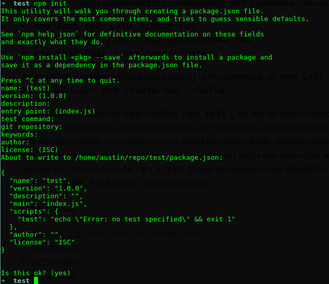
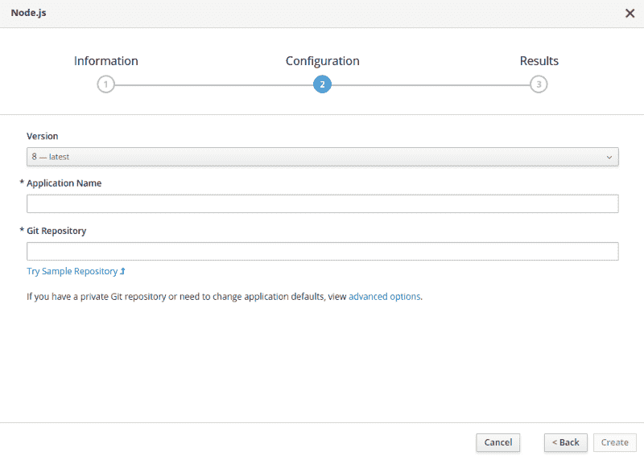
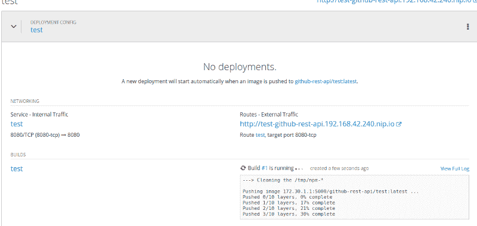

# 在 Openshift 上托管静态网站

> 原文：<https://dev.to/austincunningham/hosting-static-websites-on-openshift-3hm3>

我想在 Openshift 上托管一个网站。

## Express.js

因为支持节点运行时，所以我决定使用一个简单的 Express.js 服务器作为主机。我有一个 git 存储库，根目录下有一个 index.html 文件。我运行了 npm init 并排除了所有默认值。

[](https://res.cloudinary.com/practicaldev/image/fetch/s--43Ofb1-O--/c_limit%2Cf_auto%2Cfl_progressive%2Cq_auto%2Cw_880/https://cdn-images-1.medium.com/max/800/1%2Ay0SGXo1kGNP9Yr1b3yJjkw.png%3Fstyle%3Dcenterme)

这就是我设置一个节点应用程序所需要的，然后我继续向它添加 express . js

```
npm install --save express 
```

Enter fullscreen mode Exit fullscreen mode

我还在 package.json
中添加了一个启动脚本

```
"scripts":  {  "test":  "echo \"Error: no test specified\" && exit 1",  "start":  "node index.js"  }, 
```

Enter fullscreen mode Exit fullscreen mode

增加了 index.js Express 服务器

```
var express = require('express');
var app = express(); 
// serves files from the root directory
app.use(express.static('./'));
app.listen(8080, function () {    
  console.log('Listening at http://localhost:8080');  
}); 
```

Enter fullscreen mode Exit fullscreen mode

我提交了对 git 远程 repo 的更改。我在 Openshift 中创建了一个新项目，浏览了目录，选择了节点。

[](https://res.cloudinary.com/practicaldev/image/fetch/s--r-9T3t-Y--/c_limit%2Cf_auto%2Cfl_progressive%2Cq_auto%2Cw_880/https://cdn-images-1.medium.com/max/800/1%2ADLudZsgJhftBGDuWNmy_hA.png%3Fstyle%3Dcenterme)

我输入了一个应用程序名和我的 index.html 所在的 Git 存储库，然后单击 create。节点版本对这个小应用程序来说并不太重要。

[](https://res.cloudinary.com/practicaldev/image/fetch/s--mcmnNSLN--/c_limit%2Cf_auto%2Cfl_progressive%2Cq_auto%2Cw_880/https://cdn-images-1.medium.com/max/800/1%2AfeRCaU3P8idh-DJoej-Dug.png%3Fstyle%3Dcenterme)

该项目继续构建和拉动 git 回购。您可以在项目概述中查看进度

[](https://res.cloudinary.com/practicaldev/image/fetch/s--Q2X3-qmF--/c_limit%2Cf_auto%2Cfl_progressive%2Cq_auto%2Cw_880/https://cdn-images-1.medium.com/max/800/1%2AA1FkfKEZUqybx_4-78sa7A.png%3Fstyle%3Dcenterme)

一旦构建完成，我就可以从 Openshift 提供的 url 访问我的静态站点。

## Nginx

原来截至 2018 年 5 月的 Openshift 现在目录里有 Nginx。因此，托管静态网站的路线更容易一些。你仍然需要一个在根目录下有 index.html 的 git repo，但是你可以用零代码来建立你的站点。创建一个新项目，并从目录中选择 Nginx。

[](https://res.cloudinary.com/practicaldev/image/fetch/s--4xzEKUVd--/c_limit%2Cf_auto%2Cfl_progressive%2Cq_auto%2Cw_880/https://cdn-images-1.medium.com/max/800/1%2A8jQrOH5MNgrmTAxWcAqt5A.png%3Fstyle%3Dcenterme)

步骤与部署上面的节点应用程序非常相似，即添加应用程序名称和 git 存储库，一旦构建完成，您的站点就在路由上了——外部流量。

[我的博客](https://austincunningham.ddns.net)