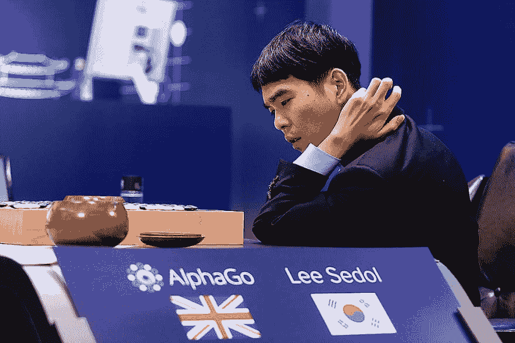
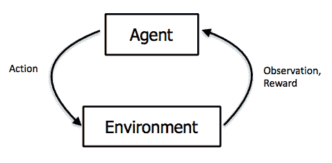

# AI 如何学习玩游戏

> 原文：<https://dev.to/rodolfomendes/how-ai-learns-to-play-games-33jn>

在过去的几年里，我们已经看到计算机程序赢得了我们认为人类不可战胜的游戏。这种观点认为，对于一个给定的位置，这个游戏有太多可能的走法，计算机程序不可能计算出所有的走法并选择出最佳的走法。然而，在 1997 年，世界见证了在其他情况下被认为是不可能的事情:IBM 深蓝超级计算机以 3.5 - 2.5 的比分战胜了当时的世界冠军 T2 的加里·卡斯帕罗夫。只有当 DeepMind 的 [AlphaGo](https://en.wikipedia.org/wiki/AlphaGo) 以 4-1 的比分战胜 18 次获得世界冠军的 [Lee Sedol](https://en.wikipedia.org/wiki/Lee_Sedol) 时，这样的胜利才能再次实现。

在 1997 年 5 月 11 日结束的六盘棋系列赛中，国际象棋世界冠军加里·卡斯帕罗夫勉强接受了 IBM 深蓝计算机团队的负责人 C.J. Tan 博士的握手。
鸣谢:罗杰·瑟雷斯迪/新闻通讯

IBM 深蓝团队主要依靠蛮力和计算能力作为他们赢得比赛的策略。“深蓝”配备了数以千计的超大规模集成电路芯片，专门用于评估国际象棋的位置，每秒钟能够评估 2 亿个位置。此外，深蓝软件有一个数据库，其中有 4000 多个开局和 70 多万个大师级游戏。

<figure> 

<figcaption>李世石与谷歌开发的计算机程序 AlphaGo 进行了五局比赛。(图片由谷歌通过 Getty Images 提供)</figcaption>

</figure>

然而，由于可能的电影数量要高得多，所以用蛮力策略来玩围棋是不可行的。相反，DeepMind 必须让 AlphaGo 更加智能，以防止所有这些计算。与 Lee Sedol 对战的版本结合了机器学习和树搜索技术，以及一些启发式方法来检测特定的游戏模式，例如 [nakade](https://en.wikipedia.org/wiki/List_of_Go_terms#Nakade) 。最初，该算法是用人类玩的游戏训练的，在达到一定程度后，它开始通过与自己的其他实例进行游戏来学习。在赢得与 Sedol 的比赛后，DeepMind 团队继续改进 AlphaGo，其最新版本名为 AlphaZero，仅通过与自己对弈来训练。

在 AlphaGo 取得成功后， [DeepMind](https://deepmind.com/blog/) 、 [OpenAI](https://openai.com/blog/) 和其他研究公司开始在更复杂的游戏中工作，如 [Starcraft2](https://twitter.com/rodolfo_mmendes/status/1134993972420644864) 和 [Dota2](https://twitter.com/rodolfo_mmendes/status/1134062075154767872) 。那么，计算机程序怎样才能学会玩这种游戏，达到专业的熟练程度呢？这些令人难以置信的成就可能是应用了一种叫做**强化学习**的强大人工智能技术。

## 什么是强化学习？

强化学习是一种人工智能范式，其中智能代理通过反复试验学习执行任务，并与环境进行交互。在强化学习中，代理不是像在监督学习中那样从标记的数据集学习，而是获得关于环境的信息，基于该信息执行动作，然后接收指示动作是否正确的强化信号。

<figure> 

<figcaption>智能体执行一个动作，从环境中接收一个观察和一个奖励。</figcaption>

</figure>

例如，假设我们想教一个机器人在房间里行走而不撞到墙壁。使用不同类型的传感器，我们可以收集关于环境的信息，如机器人和墙壁之间的距离以及机器人在不同方向的速度。为了向代理指示它正在正确地执行任务，我们必须能够对奖励信号进行编码，以便与状态一起读取。我们可以通过用+1 信号奖励任何方向上的一步，并在检测到冲突时用-1 信号惩罚代理来做到这一点。因此，用一种非常简单的方式来说，强化学习代理所做的是记录行动所收到的回报，这样它就可以学习在给定其当前状态的情况下选择哪一个是最好的。

## 结论

几十年来，强化学习已被证明是一种非常强大的机器学习范式，并已被应用于创建智能机器人、聊天机器人、交易机器人、自动驾驶汽车和其他需要自动化和优化的领域。复杂的游戏，如国际象棋、围棋以及最近的 Starcraft2 和 Dota2，被研究人员用作基准，以建立当前最先进的强化学习算法。

如果你对深入强化学习感兴趣，查看我们的帖子[强化学习中的 5 门顶级课程](https://dev.to/rodolfomendes/top-5-free-courses-in-reinforcement-learning-18j0)，获得由顶尖公司和大学提供的 5 门免费课程列表。在以后的文章中，我们将通过冰湖游戏的例子来探索强化学习的基本概念。

原帖:[AI 如何学习打游戏](https://reinforcementlearning4.fun/2019/06/03/how-ai-learns-play-games/)