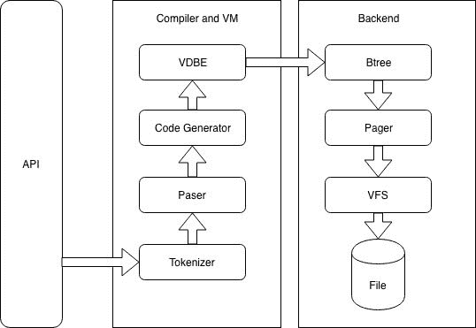
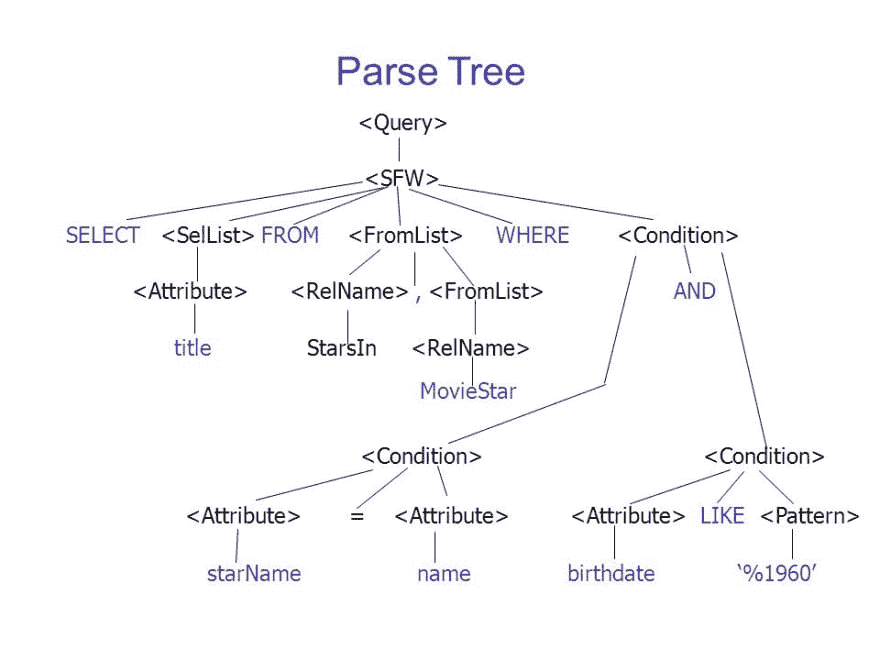

# 数据库内部如何工作

> 原文：<https://dev.to/dhanushkadev/how-database-internally-works-pfh>

在计算机程序中，数据库是处理数据的心脏。它提供了一种快速存储和检索数据的有效方法。由于数据库具有复杂的体系结构，所以在代码级学习数据库内部体系结构并不容易。由于复杂性，研究一个复杂的数据库并不容易。但是，SQLite 是一个很好的小型数据库，在数百万设备和操作系统中使用。关于 SQLite 数据库有趣的事实是，代码是高度可读的。几乎所有的代码都有很好的注释，并且架构是高度分层的。这篇文章旨在探讨 SQLite 数据库的高级架构。正如我之前提到的，SQLite 有一个高度分层的架构，可以分为七层。我们将逐一介绍每一层。

[](https://res.cloudinary.com/practicaldev/image/fetch/s--D0h0vl9o--/c_limit%2Cf_auto%2Cfl_progressive%2Cq_auto%2Cw_880/https://thepracticaldev.s3.amazonaws.com/i/0j7zny07h3cy8iaxxjaw.jpeg)

### 令牌

第一层称为标记化器。记号赋予器的目的是为给定的 SQL 查询创建记号。Tokenizer 从左到右扫描 SQL 查询，并生成一个标记列表。以下是 SQL tokenizer 中使用的一些标记类型。
运算符标记运算符标记用于在 SQL 查询中标记化算术运算符。下面是一组运算符标记的示例。
"-" as token 减去
"(" as token LP
"+" as token 加上
Keyword tokens 关键字 token 用来对 SQL 查询中使用的关键字进行标记化。ADD、SELECT、ROW、INSERT 是关键字标记的例子。
空白标记该标记用于分隔其他标记。在这里，注释也被标识为空白标记

### 解析器

Paser 曾经通过读取令牌流来生成解析树。SQLite 使用 Lemon 解析器来解析 SQL 查询。Lemon parser 允许 SQLite C 编译器从给定的语言规则集生成相关的 C 代码。语言规则是通过使用上下文无关文法(CFG)来定义的。以下 SQL 语句的解析器树示例如下。

`SELECT title FROM StartsIn, MovieStar WHERE starName=”Jack” AND birthday like “%1990”`

[](https://res.cloudinary.com/practicaldev/image/fetch/s--ACfSxSQu--/c_limit%2Cf_auto%2Cfl_progressive%2Cq_auto%2Cw_880/https://thepracticaldev.s3.amazonaws.com/i/xci6imuaxzjgfgxfw6oz.jpg) 
下面举个例子，CFG 规则生成一个程序来计算一个简单的数学表达式。

```
 1  program ::= expr(A).   { std::cout << "Result=" << A << std::endl; }
   2
   3  expr(A) ::= expr(B) MINUS  expr(C).   { A = B - C; }
   4  expr(A) ::= expr(B) PLUS  expr(C).   { A = B + C; }
   5  expr(A) ::= expr(B) TIMES  expr(C).   { A = B * C; }
   6  expr(A) ::= expr(B) DIVIDE expr(C).  {

   7           if(C != 0){
   8             A = B / C;
   9            }else{
   10             std::cout << "divide by zero" << std::endl;
   11             }
   12  }  /* end of DIVIDE */

  13  expr(A) ::= INTEGER(B). { A = B; } 
```

这里的减、加、乘和除是由记号赋予器生成的操作符记号。在这段代码中，从第 3 行到第 6 行定义了用于数学运算的 CFG。Lemon parser 优先于这些函数，按照给定的顺序进行操作。认为给定的表达式要评估的是“3+5*6/3”。标记化的输出将是

`3 PLUSE 5 TIMES 6 DIVIDE 3`

根据优先级，Lemon 解析器首先评估第 6 行，然后评估 6/3。然后它计算第 5 行中的 TIMES 操作，结果将是 10。最后，它评估第 4 行并生成最终结果 13。该结果将打印在优先级最低的第 1 行。所有的 SQL 规则都定义在与我在前面的例子中描述的相同的结构中。

### 代码生成器和虚拟机

在 SQL 查询解析时，SQLite 会生成一系列需要运行才能生成结果的指令。这些指令中的每一个都有一些要执行的操作和输入。这与调用带参数的函数是一样的。这些生成的代码运行在虚拟机之上。虚拟机逐一读取每个指令并对其进行评估。为了理解什么是可用的操作以及虚拟机是如何工作的，我们需要很好地理解 Btree。

### BTREE

Btree 是一种数据结构，用于根据数据的值将数据存储为树。二叉树的最简单形式是二叉树。数据库使用 B 树数据结构来存储索引，以提高数据库的性能。数据记录存储在 B+树结构中。如果没有索引使用，只有 B+树用于存储数据。游标是一种特殊的指针，用来指向给定了页 id 和偏移量的记录(或行)。您可以使用光标浏览所有数据记录。为了找到使用索引的给定 B 树中的数据，SQLite 开始将光标移动到根节点的第一个元素，并执行 B 树搜索。如果没有可用的 Btree 索引，SQLite 将使用线性搜索在 B+树中搜索匹配的记录。你可以在本文的[中找到更多关于 Btree 的细节。
要在 B+树上搜索数据，代码生成器生成的操作顺序如下。您可以通过在查询的开头添加“explain”关键字来检查特定 SQL 查询需要运行的指令序列。](https://madushandhanushka.wordpress.com/2019/03/26/how-database-btree-indexing-works/) 

`explain select * from foo where value = "value";`

```
0 |ColumnCount   |1 |0 |
1 |ColumnName    |0 |0 |value
2 |Open          |0 |3 |foo     // Open cursor and point it to the third page which is root page for foo table(p3 is not important )
3 |VerifyCookie  |46|0 |       // Make sure schema not changed
4 |Rewind        |0 |11|       // Go to first entry
5 |Column        |0 |0 |       // read data and push it on stack
6 |Column        |0 |0 |
7 |Ne            |1 |10|       //Pop the top two elements from the stack.  If they are not equal, then jump to instruction P2\.  Otherwise, continue to the next instruction.
8 |Column        |0 |0 |
9 |Callback      |1 |0 |       // Pop P1 values off the stack and form them into an array

10|Next          |0 |5 |       // Move cursor to next record, if data exit goto P2 else go to next line
11|Close         |0 |0 |       // Close the cursor 
```

### 寻呼机

页面是文件系统中事务的最小单位。存储在页面上的 B 树和 B+树。当数据库需要从文件中读取数据时，它以页面的形式请求数据。一旦页面被加载到数据库引擎中，如果页面被频繁访问，它就可以在缓存中存储页面。页码是从一页开始的。第一页称为根页。页面的大小是不变的。

### VFS(虚拟文件系统)

Unix 和 Windows 上的文件访问互不相同。VFS 提供了通用的 API 来访问文件，而不考虑它运行的操作系统的类型。这个 API 包括打开、读取、写入和关闭文件的函数。下面是一些在 VFS 使用的 API 来读取，写入数据到一个文件。你可以在这篇[博客文章](https://madushandhanushka.wordpress.com/2019/03/26/how-database-works-backend-architecture/)中找到更多关于寻呼机和 VFS 的信息。

### 结论

在这篇文章中，我试图从较高的层面解释 SQLite 数据库的实现。如果你有兴趣了解更多关于 SQLite 的内部架构，我愿意与你分享我的知识。因此，如果有任何需要补充的澄清/改进，请评论下来。这里还有[我的后端实现，用来理解 SQLite 架构。在这个存储库中，我试图将 SQLite 中的每一层分开，并为每一层编写一些测试。](https://github.com/madushadhanushka/simple-sqlite)