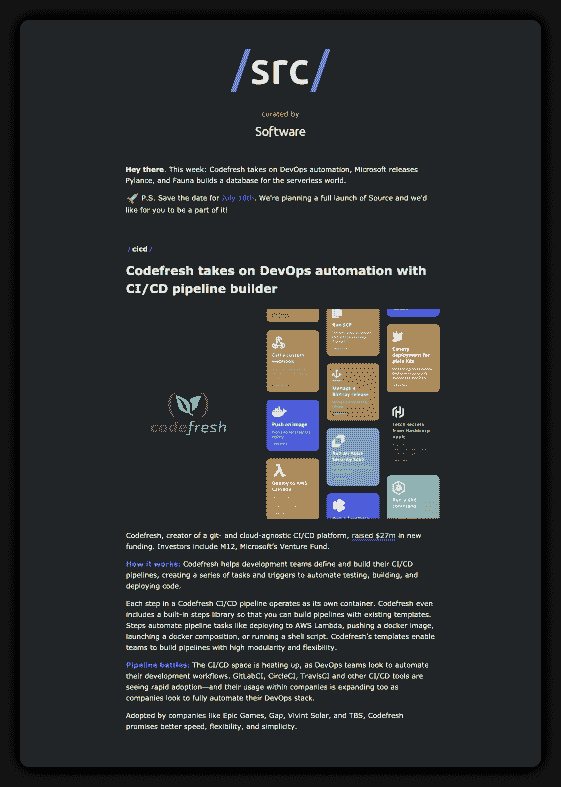
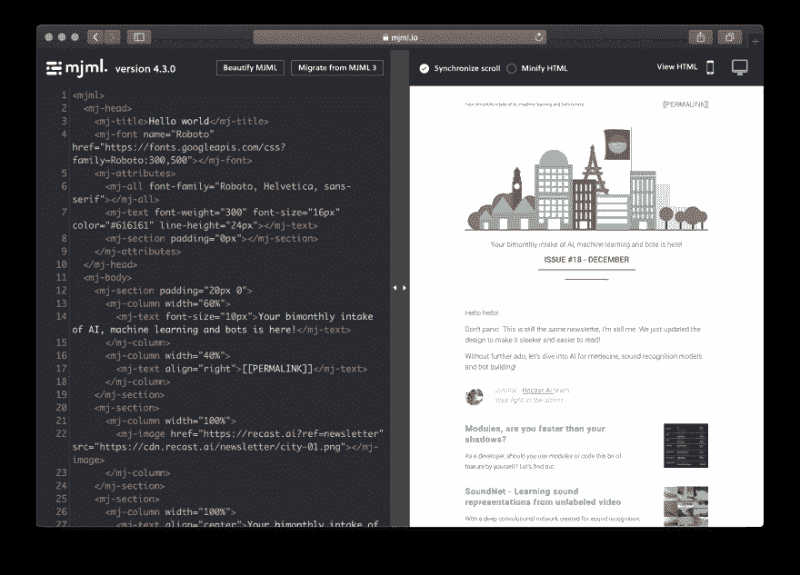
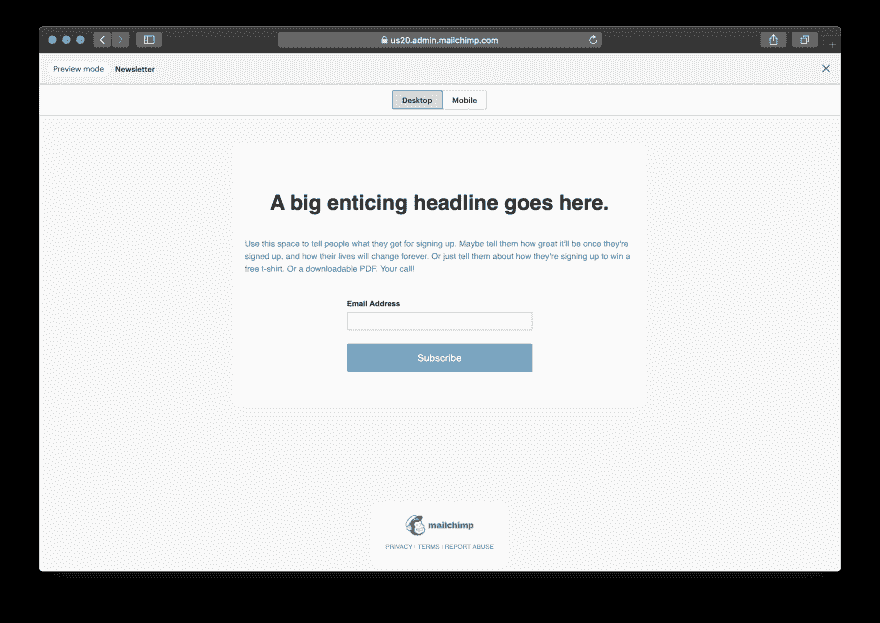

# 开发者如何以$0.00 的价格发布定制简讯

> 原文：<https://dev.to/thegeoffstevens/how-developers-can-release-custom-newsletters-for-0-00-o17>

我将向您展示如何通过几个简单的步骤来构建您自己的定制新闻稿。本教程中的所有工具都是免费使用的，整个过程不需要花费任何东西就可以完成。

我将使用电子邮件框架从头开始构建一个电子邮件简讯模板，从 VS 代码内部测试我的电子邮件，用 Mailchimp 创建一个基本的注册页面，并通过 Mailchimp 将我的电子邮件发送给我的订户。

[](https://res.cloudinary.com/practicaldev/image/fetch/s--upEW1nfN--/c_limit%2Cf_auto%2Cfl_progressive%2Cq_auto%2Cw_880/https://thepracticaldev.s3.amazonaws.com/i/mesql50bbnvem37druq7.png)

一路上会有很多走捷径或进一步扩展的机会——不要觉得必须严格按照我的步骤来。

## 为什么你应该定制你的时事通讯

你总是可以使用拖放工具或预建模板来创建电子邮件——Mailchimp 和 Sengrid 都提供了一种无需任何编码就能设计电子邮件的简单方法。

然而，从零开始创建你自己的电子邮件是值得的，原因有二。

首先，建立你自己的邮箱是提高你的网络开发技能的好方法。您将了解更多关于如何使用 HTML 和 CSS 为读者创造引人入胜的体验。

其次，定制电子邮件有助于你从其他时事通讯中脱颖而出。

在设计我的时事通讯时， [Source](https://www.software.com/src/newsletter) ，我真的想通过以最容易理解的格式发布内容来节省开发者的时间。我定制了这份时事通讯，使用深色主题，蓝色文本突出每个新想法或项目，供您浏览。

这里有一个小例子:

<figure>

[](https://res.cloudinary.com/practicaldev/image/fetch/s--UmJOFLOo--/c_limit%2Cf_auto%2Cfl_progressive%2Cq_auto%2Cw_880/https://dev-to-uploads.s3.amazonaws.com/i/wvd3ih5j7h4vi06wnqo9.png)

<figcaption>A small sample of [Source](https://www.software.com/src/newsletter)</figcaption>

</figure>

对电子邮件的设计有更大的控制权，可以让你根据你的受众量身定制，并向你的读者提供最大的价值。

让我们开始吧！

## 用 HTML、CSS 和 MJML 创建你的时事通讯

所有的电子邮件模板都是用 HTML 和 CSS 构建的，它们是网络的组成部分。然而，创建电子邮件很复杂，因为 Gmail 和 Outlook 等电子邮件客户端可能会以不同的方式呈现相同的电子邮件。类似于建立一个网站，可能有许多样板代码来处理基本需求。

[](https://res.cloudinary.com/practicaldev/image/fetch/s--Zh6fyokc--/c_limit%2Cf_auto%2Cfl_progressive%2Cq_auto%2Cw_880/https://cdn-images-1.medium.com/fit/t/1600/480/1%2AlerCdbwFn94jqbchvlA4Dg.png)

有许多框架可以通过自动处理一些最常见的电子邮件需求，例如跨不同电子邮件客户端和设备的响应能力，来简化电子邮件构建过程。我发现 MJML 是一个特别容易学习的框架，对于快速构建电子邮件模板来说非常强大。

使用 MJML 的一些好处包括:

*   使用 MJML 的语义语法编写更少的代码，节省时间并更有效地编码
*   在最流行的电子邮件客户端，甚至是 Outlook 上创建响应性设计的电子邮件
*   利用可重用和可扩展的组件节省时间

开始使用 MJML 有几种方法。

如果你不想处理安装依赖项的麻烦，你可以免费使用在线编辑器。这是一种快速有效的开始方式。这里可以找到编辑[。](https://mjml.io/try-it-live)

如果您想在本地使用 MJML，您可以使用您选择的代码编辑器(例如 VS Code、Sublime 和 Atom)。要安装 MJML，您还需要安装[节点](https://nodejs.org/en/download/)。之后，安装 MJML 就很简单了。只需打开您的终端并运行:

`npm install mjml`

接下来，为你的代码编辑器安装 MJML 插件: [VS 代码](https://marketplace.visualstudio.com/itemdetails?itemName=attilabuti.vscode-mjml)，[崇高](https://packagecontrol.io/packages/MJML-syntax)，或者 [Atom](https://atom.io/users/mjmlio) 。

现在你可以开始创建你的电子邮件了。MJML 有很好的文档可以指导你理解基本原理。从风格上来说，MJML 的工作方式类似于 HTML 和 CSS，它添加了一些新元素，可以与您可能已经熟悉的典型 HTML/CSS 语法结合使用。

MJML 提供了一些预配置的元素，它们将取代标准的 HTML 元素，比如`<mj-body>`、`<mj-section>`、`<mj-column>`和`<mj-text>`。它们的工作方式与 HTML 相似，但更适合电子邮件客户端。

有几个模板可供您选择开始使用。我建议对现有项目进行调整，这样你可以更快地跳到最终产品。我最喜欢的模板之一是重铸，你可以在线预览和编辑[这里](https://mjml.io/try-it-live/templates/recast)。

[](https://res.cloudinary.com/practicaldev/image/fetch/s---lLRjGPg--/c_limit%2Cf_auto%2Cfl_progressive%2Cq_auto%2Cw_880/https://thepracticaldev.s3.amazonaws.com/i/vjxqjwmtxhz7f0mdcz92.png)

如果您使用的是 VS 代码，输入命令`MJML: Template`弹出一个模板列表，然后选择 Recast。

当您创建电子邮件时，您可以通过单击编辑器顶部靠近选项卡的 MJML 图标或键入命令`MJML: Open Preview to the Side`来切换预览模式。预览将实时刷新。

## 测试您的电子邮件:从内部发送电子邮件 VS 代码

实时预览窗格是快速查看您的电子邮件外观的好方法，但最好通过给您自己和一些朋友发送一封测试电子邮件来正式检查您的电子邮件模板。

要直接从 VS 代码发送电子邮件，安装节点包`nodemailer`。 [Nodemailer](https://nodemailer.com/about/) 让你可以代表你的电子邮件账户从你的电脑上轻松发送电子邮件。你还需要一个 Gmail 账户。只需运行:

`npm install nodemailer`

接下来，通过命令面板打开`settings.json`，打开你的 VS 代码设置。在`json`文件中更改或添加以下值:

```
“mjml.mailer”: “nodemailer”,
“mjml.nodemailer” : {
    “service”: “Gmail”,
    “auth”: {
        “user”: “your Gmail address”,
        “pass”: “your Gmail password”
    }
} 
```

Enter fullscreen mode Exit fullscreen mode

现在你已经准备好测试你的邮件了！打开命令面板，输入`MJML: Send Email`。该扩展将提示您输入电子邮件的主题行和收件人列表。

一旦你完成了必要的步骤，去检查你的收件箱，你应该会看到一封来自你自己的新创建的电子邮件！

最后，使用命令`MJML: Export HTML`从您的 MJML 文件生成一个 HTML 文件。跟踪您创建的 HTML 文件，因为我们稍后需要将它上传到 Mailchimp。

## 创建登录页面:Mailchimp 入门

一旦你准备好你的电子邮件，前往 [Mailchimp](https://mailchimp.com/) 并创建一个免费账户。

Mailchimp 为他们的服务提供了一个慷慨的免费层，包括 2000 名订户和每月 12000 封电子邮件。您还将获得一个免费的登录页面来收集注册信息。

免费层的一个小缺点是，你所有的电子邮件都将有 Mailchimp 页脚，但它们相当不显眼。

让我们从建立一个免费的登录页面开始。为此，请从您的控制面板中单击“创建”按钮，然后选择“登录页面”Mailchimp 有一些很棒的模板，你可以对它们做一些小的调整来添加你的时事通讯名称和描述。

[](https://res.cloudinary.com/practicaldev/image/fetch/s--Z0uDTcNW--/c_limit%2Cf_auto%2Cfl_progressive%2Cq_auto%2Cw_880/https://thepracticaldev.s3.amazonaws.com/i/lwjgx074uczdbqvq6q79.png)

一旦你定制了登陆页面模板，你将有机会链接你自己的 URL 或者通过 Mailchimp 创建一个免费的 URL。Mailchimp URL 的一部分将随机生成，但您可以在最后添加自定义文本——它看起来类似于[https://mailchi . MP/[随机生成]/[您的文本]](https://mailchi.mp/%5Brandomly-generated%5D/%5Byour-text%5D) 。

您可以向您的朋友和您最喜爱的社区共享和宣传此链接。

## 发送您的邮件

最后，让我们发送你的第一封邮件。

在您的 Mailchimp 仪表盘上，点击“创建活动”按钮。接下来，点击“电子邮件”,按照步骤创建一个新的电子邮件。您将有机会上传您在创建简讯时生成的 HTML 文件。

完成这些步骤后，您可以立即发送新闻稿，也可以安排在将来发布。

仅此而已！现在是时候扩大你的订户名单了！

**感谢阅读。查看[来源](https://www.software.com/src/newsletter)，我们的每周简讯**。没有垃圾邮件，没有绒毛。让开发人员快速了解他们需要的信息。