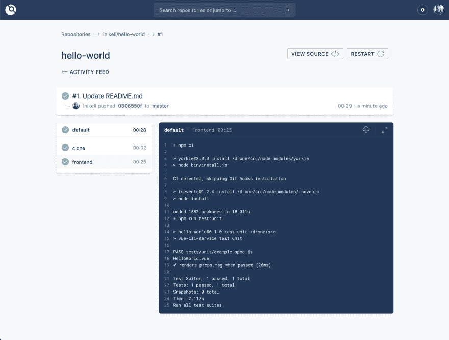
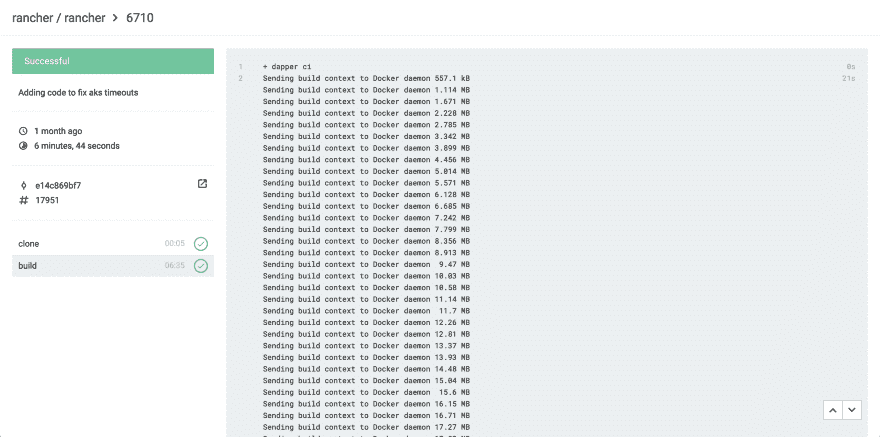
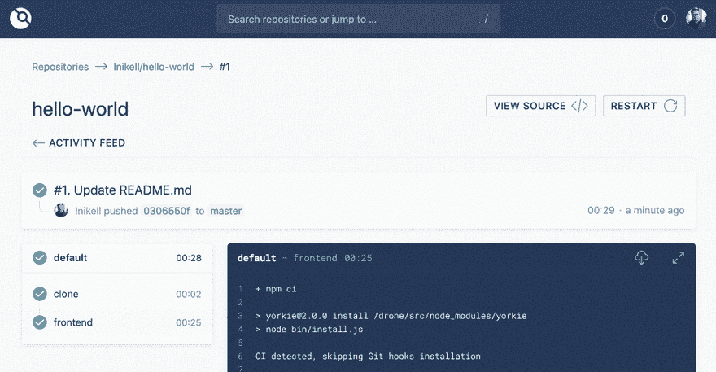
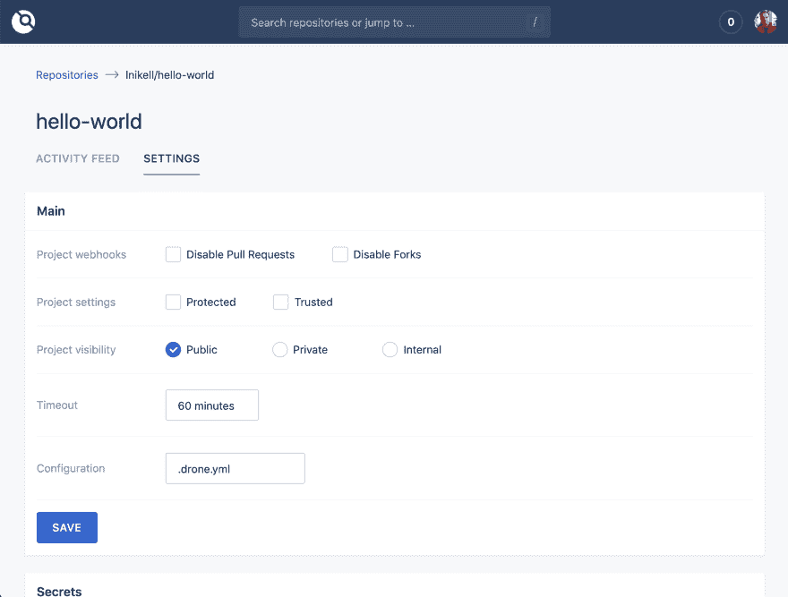
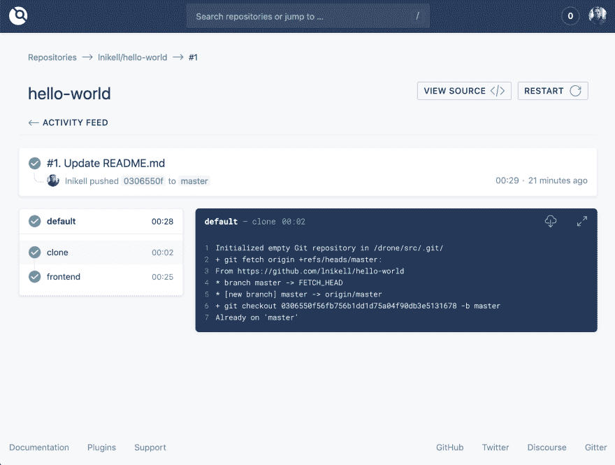
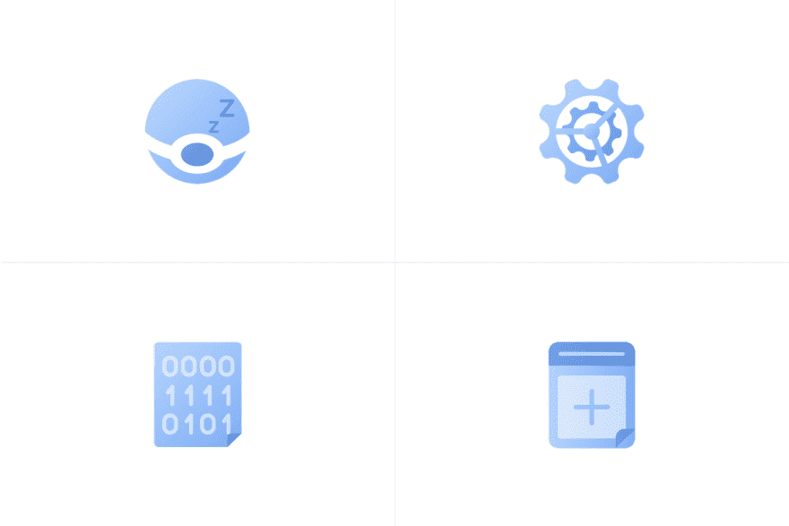

# 我们如何让开源 CI 变得更好？

> 原文：<https://dev.to/alex_barashkov/how-did-we-make-open-source-ci-better-15b0>

在本文中，我们将讨论 [Drone CI](https://drone.io/) ，这是一个非常强大、轻量级、基于 docker、多管道、多平台、开源的 CI/CD 工具。Drone 于 2012 年推出，像许多其他开源工具一样，由开发者制作并为开发者服务，因此缺乏用户友好的界面。

**我希望我们最终改变了它……**

我们在 [Pixel Point](https://pixelpoint.io/) 每天在很多不同的项目中使用无人机，所以我们决定改进它。经过几个月的工作，我们很高兴地宣布新的无人机版本 1.0.0，现在可以使用了。

**新版本**

**旧版本**

### 研究以前的方案

这些变化的主要目的是改善 UX，然后是 UI。我们回顾了在 Github 上发现的无人机存在的问题，然后收集了我们的开发人员和无人机创始人 Brad Rydzewski 的反馈。

基于此，我们编制了一份主要问题清单:

*   复杂而晦涩的导航
*   令人困惑的取消构建操作
*   在存储库激活期间缺少用户交互
*   缺乏对移动和平板设备的响应设计支持
*   没有明确定义的主页
*   界面可扩展性问题，没有空间容纳新功能
*   模糊设置保存

我们还创建了一系列新的、即将推出的特性，包括多管道构建、对 cron 作业的支持以及新的存储库设置。

### 新的想法和实现

**关键导航–搜索**
首先，我们决定将“搜索”功能作为跨存储库导航及其激活的关键组件。它位于每个页面的顶部，可以通过快捷方式“/”访问。使用 search 时，您可以看到存储库的摘要和最新版本的状态。

我们为存储库设计卡片，使用最有用的信息，并试图创造尽可能灵活的解决方案。例如，主页上卡片的标题是存储库的名称，而第二行是包含重要信息的可读短语。

我们基于提交、事件、分支和提交消息的作者来构建它。该解决方案比表视图具有更好的伸缩性，在表视图中，每一列都专用于一个特定的字段。使用我们的解决方案，您可以轻松地折叠它，并打破移动视图的界限。

**标签**
我们改变了存储库页面，这样你可以在打开时看到标签。这为设置页面提供了一个很好的导航方法，并允许我们在未来添加新的标签(我们已经有一些在工作中)。

**单个设置页面**
不是将某些设置拆分成不同的页面，现在它们都在一个页面中。激活新存储库后，您会立即被重定向到设置页面，因为这通常是您配置存储库的第一个位置。

**新构建页面**
我们致力于统一组件，因此主要组件和关于构建状态的简短细分信息与前几页相同。左边的导航现在支持多管道。在顶部，我们增加了按钮的空间，我们计划在未来的版本中增加新的功能。

**日志很重要**
为了更好地阅读和浏览日志，我们增加了全屏模式和下载日志的功能，如果您的日志很大，并且您想在您个人最喜欢的编辑器中查看它们，这将非常有用。

**同步不会妨碍您的工作**
一些无人机客户端有一个庞大的存储库列表，用无人机同步它们需要一些时间。以前，同步是一项全屏任务，不允许您关闭屏幕或继续使用现有的存储库列表。现在，它只是一个同步播放动画的小按钮。

**巧妙加载**
在新版本中，当你在第一个 app 上加载数据然后跳转到另一个页面时，Drone 会借鉴现有的列表，并显示一个明确的指示，即数据正在加载。不再等待或观看纺纱工；如果有数据，它会立即渲染。

**空州的漂亮图标**
我们花了很大的力气来制作漂亮的空州，并且制作了很多不同的图标，你可以在不同的页面上欣赏。

### 你还能对无人机有什么期待？

已经有计划发布无人机 1.1 版本，主要功能包括:

*   构建页面中针对特定环境的“部署”按钮
*   通过分支和环境过滤构建的能力
*   为刚刚安装无人机的用户提供用户友好的工具提示
*   实时更新的新方法
*   改进的用户管理

请继续关注并在 Github 或 T2 Twitter 上订阅发布更新。