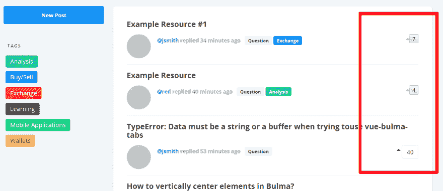

# “输入数据”是如何存储的？(初学者帮助)

> 原文：<https://dev.to/harrisonkugler/how-does-input-data-get-stored-beginner-help-----1dac>

简单的问题/概念我正在努力掌握，提前感谢您的帮助，这个社区对我来说是一个巨大的工具。🙌👏

好吧，那么...以下面这个例子为例(点击视频链接)，我如何假设性地存储“赞”。

[https://www . use loom . com/share/e 8342 ACD 84 e 440 e 283 f1 ababd 758 eb0 b](https://www.useloom.com/share/e8342acd84e440e283f1ababd758eb0b)

这会在数据库中完成吗？(你会推荐哪个，我用过 MongoDB，一直在玩 google firestore)

数据是如何发送的？这和 Vue 中的‘状态管理’有关系吗？这就是 nuxt.js 和 vuex 这样的工具派上用场的地方吗？(这些问题有意义吗？🤪😅)

干杯🎉

[https://www . use loom . com/share/e 8342 ACD 84 e 440 e 283 f1 ababd 758 eb0 b](https://www.useloom.com/share/e8342acd84e440e283f1ababd758eb0b)