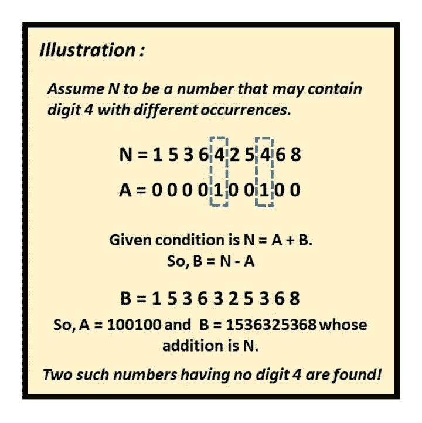

# Python 中简单的类型转换对我有多大帮助！来自 Code Jam 2019 的问题的解决方案。

> 原文：<https://dev.to/mistryvatsal/how-easy-type-conversion-in-python-helped-me-a-solution-to-problem-from-code-jam-2019-573d>

**放弃的解决方案**——来自[谷歌代码堵塞](https://codingcompetitions.withgoogle.com/codejam)今年资格赛的一个问题感觉很容易编码。

您可以在此[链接](https://codingcompetitions.withgoogle.com/codejam/round/0000000000051705/0000000000088231)查看完整的问题描述。

## 问题(来源:Google Code Jam 2019 网站)

有人刚刚赢得了代码果酱彩票，我们欠他们 N 个果酱硬币！然而，当我们试图打印一张过大的支票时，我们遇到了一个问题。整数 N 的值包括至少一个数字 4...我们的超大支票打印机键盘上的 4 键坏了。

幸运的是，我们有一个变通办法:我们将向获胜者发送两张正整数金额 A 和 B 的支票，这样 A 和 B 都不包含任何数字 4，并且 A + B = N。请帮助我们找到满足这些条件的任何一对值 A 和 B。

## 接近

在读出问题描述的同时，我读出了大约 10 ⁰⁰.的输入约束和范围因此，考虑一个非常直接的基于循环的解决方案是一个坏主意，这将打击时间复杂性，显示噩梦般的消息"*时间限制已超过！*”。

所以我想到用绳子的帮助来解决这个问题。蟒蛇救了我！

假设您已经通过上面的链接阅读了问题描述，有一个数字 N 可能包含出现任意次的数字 4。任务是找出两个数字 A 和 B，使得 A 和 B 不包含任何出现的数字 4，并且 A 和 B 的总和应该等于 N(A+B=N)。

所以我想创建一个新的数，现在假设 A，它的长度与 N 相同(*长度表示数字*的位数)。这个想法是，在构造数字 A 的时候，我们会一个数字一个数字地分析数字 N。对于数字 N 中出现的每一个数字 4，我们将在数字 a 中添加数字 1。对于 N 中的其余数字，在数字 a 中添加数字 0。

我从 n 中减去新构造的 A，得到了另一个数 B，你看，我得到了两个不包含数字 4 的数 A 和 B，它们的和等于 n。

为了实现这个逻辑，除了 Python，我什么也想不到。从整数到字符串或字符串到列表和 viz 的简单类型转换使得实现这一工作变得如此容易。

## 实现

代码。