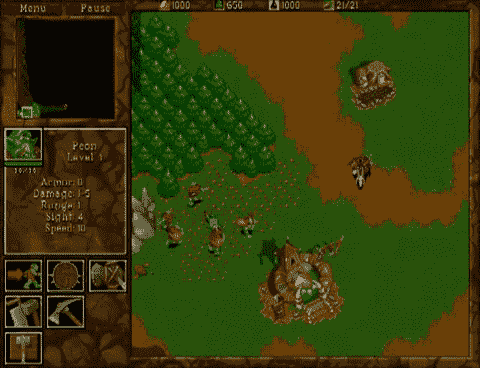
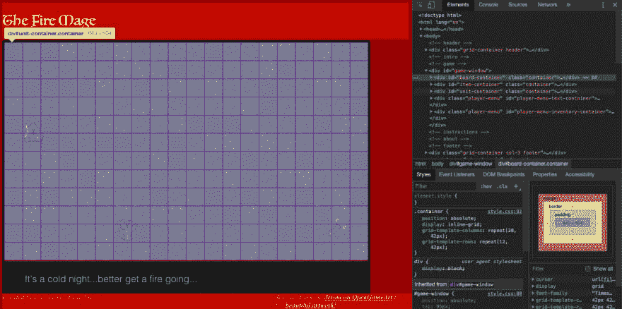
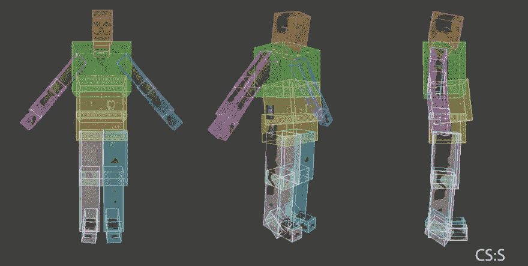

# 我是如何(意外地)用香草 JS 从零开始制作游戏引擎的

> 原文：<https://dev.to/isalevine/how-i-accidentally-made-a-game-engine-from-scratch-with-vanilla-js-4m80>

## 2019 年 7 月 29 日更新:“火法师”现在部署在 Heroku 上！看看这里:【https://the-fire-mage.herokuapp.com/ T2】

[](https://res.cloudinary.com/practicaldev/image/fetch/s--xAmw-MMf--/c_limit%2Cf_auto%2Cfl_progressive%2Cq_66%2Cw_880/https://thepracticaldev.s3.amazonaws.com/i/1y4m9ajy5nemk242rvv1.gif) 
*游戏引擎在运转，与概念验证游戏《烈火法师》*

[这是我的 Github 到 Javascript 前端的链接](https://github.com/isalevine/the-fire-mage-frontend)，这是[到 Rails 后端的链接](https://github.com/isalevine/the-fire-mage-backend)！
*(很抱歉两个人都还没有自述文件——继续读下去，看看它在我的待办事项列表上！)*

最近在西雅图的 Flatiron，我们有一个项目是用 Javascript 前端和 Rails 后端做一个单页应用程序。我决定我也想利用这个项目学习尽可能多的 CSS，同时练习 DOM 操作。受到复古电子游戏的启发，我决定制作一款类似魔兽争霸 2 和星际争霸的即时战略游戏。我的范围很简单:有一个单元，选择它，告诉它移动，这个单元与对象交互，并有一些消息和动画将它们联系在一起。

[](https://res.cloudinary.com/practicaldev/image/fetch/s--un9BBbSX--/c_limit%2Cf_auto%2Cfl_progressive%2Cq_66%2Cw_880/https://thumbs.gfycat.com/KindEsteemedFritillarybutterfly-size_restricted.gif)

我一开始没有意识到的是，我需要构建一个完整的游戏引擎来让所有这些小事件发生！

最初，我被提供帮助设置 Bootstrap 和 Canvas 和 Phaser 作为工具来帮助我制作游戏。但是我越看他们，我越觉得我在追求我的核心使命。我半吊子地尝试设置 Bootstrap，并把我遇到的小困难作为一个标志: ***我应该用普通的 Javascript 从头开始构建整个游戏引擎。*T3】**

在这篇博文中，我想回顾一下我在工作中从 Javascript 和 CSS 中获得的一些技巧和经验。

# CSS 网格

[](https://res.cloudinary.com/practicaldev/image/fetch/s---7092bEh--/c_limit%2Cf_auto%2Cfl_progressive%2Cq_auto%2Cw_880/https://thepracticaldev.s3.amazonaws.com/i/hc0ue6vaa5979t3hdo5n.png) 
*CSS 网格在行动。*

*有益链接:*
[【https://www.w3schools.com/css/css_grid.asp】](https://www.w3schools.com/css/css_grid.asp) [https://hacks . Mozilla . org/2017/10/an-introduction-to-CSS-Grid-Layout-part-1/](https://hacks.mozilla.org/2017/10/an-introduction-to-css-grid-layout-part-1/)
[https://developer . Mozilla . org/en-US/docs/Web/CSS/CSS _ Grid _ Layout](https://developer.mozilla.org/en-US/docs/Web/CSS/CSS_Grid_Layout)

当我放弃 Bootstrap 的时候，我很高兴地发现 CSS 内置了网格功能。以下是我对他们的一些了解:

## 网格术语:列、行、间隙

上面的链接有很棒的插图，展示了这个术语以及它如何翻译到页面上，但作为一个快速的纲要:

**列**是列。
排**排**排。
**列间距**是列与列之间的间距。
**行间距**是行与行之间的间距。
**间隙**是**的简写，包括**列间隙和行间隙。

每个都可以相应地编号和调整大小，以创建所需的网格。

## 设置它们

要建立一个网格，需要为网格容器创建一个 CSS 类。将“display”属性设置为“grid”(对于块级)或“inline-grid”:

```
.grid-container {
  display: grid;
} 
```

## 设置列/行尺寸

有几种方法可以设置列数和行数以及它们的大小，但是我发现最方便的方法是使用' repeat()'方法，结合' grid-template-columns '和' grid-template-rows '属性:

```
.container {
  position: absolute;
  display: inline-grid;
  grid-template-columns: repeat(20, 42px);
  grid-template-rows: repeat(12, 42px);
} 
```

在上面的代码片段中，repeat()方法有两个参数:**列/行的数量**，以及**每个列/行的大小**。上面的代码生成了一个 20 列 12 行的网格(这次是内嵌元素),每个单元格为 42x42 像素。

因为我的项目规模非常有限，所以我使用像素计数对大部分 CSS 进行编码。您还可以使用分数符号将网格中的剩余空间细分为相等的部分，例如，“3fr”将占据 1/3 的空间，“2fr”将占据 1/2 的空间，“1fr”将占据整个空间，等等。(设置不同大小的列/行有更多的细微差别，但我将遵从上面的链接。)

## 用网格-列-开始/结束+网格-行-开始/结束设置位置

CSS Grid 有一种简便的方法将其他元素附加到它自身:指定你希望它去的开始和结束列和行:

```
.item1 {
  grid-column-start: 1;
  grid-column-end: 3;
} 
```

*(来自 W3 学校的片段)*

使用从左到右表示列号的整数，这将拉伸您的元素以覆盖从 grid-column-start 的左上角开始，到 grid-column-end 的左上角结束的列。(网格-行-开始和网格-行-结束也是如此。)上面的代码片段将用类“item1”拉伸元素以覆盖第 1 列和第 2 列，并在第 3 列之前停止。

## 项目专用

因此，CSS 是一个很好的工具，但对于我的游戏引擎来说并不是一个完美的工具。最终，游戏的最终外观需要消除行和列之间的间隙，对于网格层上的元素，我只能将它们附加到特定的网格单元上，而不能浮在它们之间。结果，我最后只把地形图像放在了网格层，因为它们是静态的，并且(目前)没有被单位或物品交互。

# Javascript 类

我一直犹豫要不要全身心投入 Javascript 类，但是这个项目帮助我看到了它们提供的效用。我的项目要求的一部分涉及到保存一些数据，所以我想跟踪单位和物品在游戏板上的位置。这样，如果浏览器刷新，我可以重新加载游戏，只要位置足够频繁地保存到数据库中。

知道这个位置内存在创建点击框和碰撞检测中是至关重要的，我决定重构我的所有代码(在这一点上，2 或 3 天的 DOM 操作),以便为游戏绘制的所有东西——棋盘、图层容器、地形图像、单位和物品的单元格——都是类实例。这是一个值得花的下午，因为后来我有几个优势:

## 我的游戏的类实例记住了它们的 div，反之亦然

查看 Cell 类的代码，它被扩展来创建单元和项目:

```
class Cell {
  constructor(containerQuery, position, onMap = true) {
    this.position = position;
    this.onMap = onMap

    this.div = div
    div.cell = this

    this.div.setAttribute('style', `left: ${this.position.left}px; top: ${this.position.top}px`)
  }
} 
```

注意每个单元格都有一个. div 属性，每个 div 都有一个. Cell 属性？我仍然不能 100%确定是否有更简单的方法来建立这种连接，但对我来说，通过类实例或 div 灵活地获取单元和项目变得很重要，因此能够调用(div.cell)和(this.div)来获取正确的数据非常方便。一个例子是来自 endgame 事件的这个片段，其中项目“tree”修改了它的类列表:

```
 treeCell.div.classList.add('slow-fadeout')
      treeCell.div.classList.add('special-effect')
      treeCell.div.classList.remove('item') 
```

## 类实例记住了他们 div 在棋盘上的位置

我创建了一个“position”属性，它指向一个具有可以在 HTML 样式中使用的位置的对象，并构建了一个 helper 方法来将 div 的位置转换为“position”属性:

```
class Cell {
  constructor(containerQuery, position, onMap = true) {
    this.position = position;
  }
}

function positionCreator(div) {
  return {
    left: div.getBoundingClientRect().left,
    top: div.getBoundingClientRect().top,
    width: div.getBoundingClientRect().width,
    height: div.getBoundingClientRect().height
  }
} 
```

*positionCreator()方法由 JR 在 JSFiddle 上的[这段神奇的代码提供。](https://jsfiddle.net/jlr7245/217jrozd/3/)*

然后，当我添加允许单元移动的函数时，我包含了根据 div 的当前位置更新类实例的 position 属性的代码，每秒重新计算 20 次(每 50 毫秒):

```
while (transitionOn) {
      let hitboxUpdater = setInterval(()=>{

        if (transitionOn === false) {
          clearInterval(hitboxUpdater);
          updateCells()
        }

        selectedUnit.cell.hitboxPosition = positionCreator(selectedUnit.cell.hitbox())

        let containerX = unitContainer.div.getBoundingClientRect().x
        let containerY = unitContainer.div.getBoundingClientRect().y
        selectedUnit.cell.position = positionCreator(selectedUnit)
        selectedUnit.cell.position.left -= containerX
        selectedUnit.cell.position.top -= containerY

        collider.checkContainerUnitCollision(selectedUnit, boardContainer)
        collider.checkItemUnitCollision(selectedUnit)
    }, 50)
    break;
 } 
```

当 transitionOn 变量为“true”时，setInterval()函数根据 selectedUnit 在游戏 div 中的位置更新其单元格位置，然后检查与游戏边框和其他单元格的冲突。

最后，将 console.logs 添加到函数中(现在大部分都被删除或注释掉了)让我可以方便地读出 Chrome 开发工具中的 div 位置，这有助于我在创建点击框和冲突检测时进行调试。

## 继承使得建立和定制不同的游戏职业变得容易，比如物品和单位

好吧，好吧，我知道原型是 Javascript 的特殊*事情*，并且[继承与组合是一个巨大的主题](https://stackoverflow.com/questions/2238642/is-there-anything-composition-cannot-accomplish-that-inheritance-can)，但是有几个继承真的有帮助的小例子！

在我决定让单元和项目成为“单元”类型后，我创建了扩展单元的“单元”和“项目”类。这允许我调试和调整一个而不影响另一个。最终，只有几处不同，但这在干编程中是很好的实践——毕竟，只有单元需要库存，而不是项目！

```
class Unit extends Cell {
  constructor(name, container, position, onMap) {
    super(container, position, onMap)
    this.name = name
    this.cellType = "unit"
    this.gameSessionId = currentGameSession.id

    this.inventory = []
  } 
```

然而，我要说，下次有机会，我很高兴尝试以组合为中心的方法，而不是以继承为中心的方法！

# 点击框、碰撞检测和碰撞事件

[](https://res.cloudinary.com/practicaldev/image/fetch/s--VEN9PRkH--/c_limit%2Cf_auto%2Cfl_progressive%2Cq_auto%2Cw_880/https://blog.counter-strike.net/wp-content/uploads/2012/03/hitboxes_0000_CSS.jpg) 
*反恐精英*中的 hitboxes 示例

这是该项目的皇冠上的宝石:创建一个游戏引擎，允许对象通过碰撞进行交互。这是通过给每个交互元素一个 hitbox，并在元素运动时不断检查 hitbox 冲突(从而可能产生冲突)来实现的。

## 使用 CSS 和辅助函数快速添加它们

交互式元素的构造函数的一部分是用“hitbox”类创建一个子 div，从而给它们一个更小的内部 div 作为它们的 hitbox:

```
.cell > .hitbox {
  position: absolute;
  border-style: solid;
  border-width: 1px;
  /* border-color normally set to yellow to add visibility */
  border-color: transparent;
  width: 85%;
  height: 85%;
  left: 5%;
  top: 5.5%;
} 
```

当元素移动并每秒更新 20 次位置时，它们的点击框位置也会更新。

## 碰撞检测和碰撞事件

我之前已经包含了这个 JSFiddle 的链接，但是我再重复一遍:[https://jsfiddle.net/jlr7245/217jrozd/3/](https://jsfiddle.net/jlr7245/217jrozd/3/)(感谢 JR！！！)

这成了我事实上的目标:练习足够多的 Javascript 来直观地理解并为我的游戏重新创建它。这个片段是一个优雅的普通 JS 代码，它移动 div，并在检测到碰撞时改变它们的颜色。通过测量每个 div 相对于彼此的位置来检测冲突。这段代码有几个要点:

### 1。this.position 和 posititionCreator()

JR 的代码最终说服我将所有东西都重构为 Javascript 类。我知道这个类和这个函数的优雅是我想要复制的

```
class BaseDiv {
  constructor(position) {
    this.position = position;
  }
}

function positionCreator(currentDiv) {
  return {
    left: currentDiv.getBoundingClientRect().left,
    top: currentDiv.getBoundingClientRect().top,
    height: currentDiv.getBoundingClientRect().height,
    width: currentDiv.getBoundingClientRect().width
  };
} 
```

### 2。用四个位置条件测量碰撞

这段代码显示了检查 div 重叠的条件。综合起来，它们确定两个矩形 div 是否接触:

```
if (currentDiv.position.left < this.moveableDiv.position.left + this.moveableDiv.position.width &&
currentDiv.position.left + currentDiv.position.width > this.moveableDiv.position.left &&
currentDiv.position.top < this.moveableDiv.position.top + this.moveableDiv.position.height &&
currentDiv.position.height + currentDiv.position.top > this.moveableDiv.position.top) {
    hasJustCollided = true; 
```

### 3。将所有条件和逻辑/控制流存储在一个“碰撞器”变量中

这是天才的最后一击:创建一个包含检测碰撞所需的所有逻辑的变量，并适当地触发正确的碰撞事件:

```
const collider = {
  moveableDiv: null,
  staticDivs: [],
  checkCollision: function() {
    let hasJustCollided = false;
    for (let i = 0; i < this.staticDivs.length; i++) {
      const currentDiv = this.staticDivs[i];
      if (currentDiv.position.left < this.moveableDiv.position.left + this.moveableDiv.position.width &&
      currentDiv.position.left + currentDiv.position.width > this.moveableDiv.position.left &&
      currentDiv.position.top < this.moveableDiv.position.top + this.moveableDiv.position.height &&
      currentDiv.position.height + currentDiv.position.top > this.moveableDiv.position.top) {
        hasJustCollided = true;
        if (!this.moveableDiv.ref.classList.contains('collision-state')) {
          this.moveableDiv.ref.classList.add('collision-state');
        }
      } else if (this.moveableDiv.ref.classList.contains('collision-state') && !hasJustCollided) {
          this.moveableDiv.ref.classList.remove('collision-state');
        }
    }
  },
}; 
```

### 我的挑战

有了这个漂亮的代码作为指导，我开始在自己的代码上一点一点地构建类似的东西。自然，我在将代码片段改编成我自己的代码时遇到了一些挑战:

#### 单位-边界碰撞和单位-物品碰撞是很不一样的！

除了不同大小和类型的碰撞(毕竟，单位总是在游戏的边界内，因此根据上面的代码总是发生碰撞)，边界碰撞需要非常不同的结果——即，阻止移动而不是触发新的事件。

当一个单位与游戏的边界发生冲突时，我想阻止这个单位继续移动，这样他们就可以留在游戏里了。然而，简单地停止单位的移动意味着它被卡住了——最终，我的解决方案是将碰撞单位从边界“弹开”几个像素，这样他们就可以分配一个新的移动目标而不会被卡住:

```
 let unitHitboxPosition = selectedUnit.cell.hitboxPosition
      let containerHitboxPosition = container.hitboxPosition

      // left side - extra-padding 8px, rebound 3px
      if (unitHitboxPosition.left <= containerHitboxPosition.left + 8) {
          console.log("BORDER COLLISION DETECTED!! (left)")
          selectedUnit.style.left = parseInt(getComputedStyle(selectedUnit).left.replace("px", "")) + 3 + "px"
        }
      // top side - extra-padding 10px, rebound 3px
      if (unitHitboxPosition.top <= containerHitboxPosition.top + 10) {
          console.log("BORDER COLLISION DETECTED!! (top)")
          selectedUnit.style.top = parseInt(getComputedStyle(selectedUnit).top.replace("px", "")) + 3 + "px"
        }
      // right side - extra-padding 7px, rebound -1px
      if (unitHitboxPosition.left + unitHitboxPosition.width >= containerHitboxPosition.left + containerHitboxPosition.width - 7) {
          console.log("BORDER COLLISION DETECTED!! (right)")
          selectedUnit.style.left = parseInt(getComputedStyle(selectedUnit).left.replace("px", "")) - 1 + "px"
        }
      // bottom side - extra-padding 10px, rebound -1px
      if (unitHitboxPosition.top + unitHitboxPosition.height >= containerHitboxPosition.top + containerHitboxPosition.height - 10) {
          console.log("BORDER COLLISION DETECTED!! (bottom)")
          selectedUnit.style.top = parseInt(getComputedStyle(selectedUnit).top.replace("px", "")) - 1 + "px"
        } 
```

#### 计算离散运动与流体运动的碰撞需要不同的监听器

我已经谈到了这一点，但我必须重新计算单位位置并每秒检查 20 次检测的原因是因为单位做的流体运动，而不是在原始代码片段中进行的谨慎跳跃(按箭头键= >移动 5 个像素)。通过每秒 20 次重新检查碰撞，在用户注意到该单元远离碰撞之前，碰撞很可能被足够快地捕捉到以触发事件。

#### 如果发生碰撞事件后，一些元素从板上消失了怎么办？

Javascript 类派上用场的另一个地方是“onMap”属性，它让我决定是否在板上呈现一个单元格。为了使用户体验感觉更自然，我向这些碰撞事件添加了一些 setTimeout()和 CSS 动画——这样，当类属性被更新并且单元格被从板上移除时，用户可以看到很酷的动画。

```
function itemCollisionEvent(unitCell, itemCell) {

  if (itemCell === axeCell && unitCell === mageCell) {
    itemCell.onMap = false
    addItemToInventory(unitCell, axeCell.name)
    updateCells()
    displayTextMessage("Axe gained to your inventory!")

    itemCell.div.classList.remove('item')
    itemCell.div.classList.add('fadeout', 'special-effect')

  }
} 
```

我真的很感激有机会练习制作 CSS 动画和过渡，它们补充了底层代码并提供了更好的用户体验，而不是简单地坐在它上面！(另外，它让我对视频游戏加载屏幕时发生的事情非常欣赏...)

# 数据库与效率

关于这一点，我没有太多要说的，除了我特别构建了一些尽可能糟糕的方面来说明效率问题(并最终获得识别修复它们的方法的实践)。我希望我的游戏引擎不仅能在刷新时记住单位和物品的位置，还能记住随机生成的地形(特别是。png 文件名)。

现在回想起来，我发现我可以将这些数据存储为一个整数字符串——但是当我在 Rails 中创建后端时，我意识到我可以尝试低效数据库调用的时间延迟。因此，我对它进行了编码，这样每个新游戏都会立即将 240 行保存到地形表中。它们中的每一个都只包含一个图像源 url 和一个用于查找的游戏会话 id 号——肯定是低效的！

尽管如此，我给自己提出了两个问题，我觉得这是更大的效率问题的缩影:

#### a .我该如何设计一个在查询数据库和渲染板子时感觉流畅的用户体验？

当重新加载一个游戏会话时，需要从数据库中检索 240 行，用于在游戏开始前重绘地图。最终，我围绕这一点构建了主菜单的过渡时间，这样当数据库被查询时，菜单隐藏了不完整的面板。这并不能解决问题，但提供了更流畅的用户体验，即使底层问题已经解决，这种体验也能正常工作。

#### b .在一个游戏会话结束后，我如何高效地销毁数据库中未使用的数据？

完全公开，这不是我内置的功能。我没有在 Heroku 上部署它的原因是因为数据库的限制——我的数据库一度在 Terrains 表中有超过 120，000 行！在我没完没了地等待我的种子文件删除所有当前记录(“没完没了”的意思是正好四分钟)之后，有效清除这些记录的必要性变得显而易见。这是我在上一篇博客中开始研究的[效率问题类型的一个完美例证:在运行操作达到一定阈值后，时间的增长变得无法控制。真的，在视频游戏中没有什么好时机会让玩家为了*任何事情*等上整整四分钟！](https://dev.to/isalevine/exploring-data-structures-from-a-ruby-background-pt-1-arrays-5bma)

这是 Javascript 类提供帮助的另一个例子。endgame 事件的一部分是游戏会话的“complete”属性被设置为“true ”,这将允许定期查询清除数据库时容易识别。(我的想法是，残局动画是这个在后台运行的完美时机。)对于被放弃的游戏，我计划使用数据库时间戳来清除任何过期的游戏会话，最有可能是在创建后 10 分钟。我预计这种伪垃圾收集将使玩家免于可怕的四分钟等待时间。

[](https://res.cloudinary.com/practicaldev/image/fetch/s--g4TwVfx7--/c_limit%2Cf_auto%2Cfl_progressive%2Cq_66%2Cw_880/https://media1.tenor.cimg/864b9edabb63ae39dc9e0d20d0d7407e/tenor.gif)

# 下一步

我不认为这个项目完成了！尽管这是一个为期一周的任务，但 Brian Pak 鼓励我清理并开源这个引擎。以下是我的目标和与此相关的下一步:

### 准备开源:

1.  清理代码，为清晰起见添加注释，并恢复生成有用调试信息(如点击事件位置)的 console.logs。
2.  最后写一个自述文件，描述如何创建单位、物品、地形和碰撞事件。
3.  创建一个非游戏专用版本的引擎——目前，该引擎与我为其制作的概念验证游戏“火法师”密不可分

### 对发动机进行扩展:

1.  为已完成和过期的游戏会话添加数据库伪垃圾收集。
2.  更改地形数据保存到数据库的方式。
3.  在 Heroku 上部署一个可测试的版本，并在其他浏览器上测试。
4.  (拉伸目标)通过允许多个浏览器访问和更新同一个游戏会话，使用 Rails 的 Action Cable 来实现多人游戏。
5.  (延伸目标)增加基本的攻击/战斗功能，采用原版塞尔达的风格(选择库存物品，触发攻击，渲染攻击动画和碰撞事件)

我希望你能在这里找到一些有用的 Javascript 和 CSS 技巧！请留意关于开源该引擎的后续帖子，并随时在这里或直接在 Github 上提供反馈和建议！再一次，[这是我的 Github 到 Javascript 前端的链接](https://github.com/isalevine/the-fire-mage-frontend)，这是[到 Rails 后端的链接](https://github.com/isalevine/the-fire-mage-backend)！