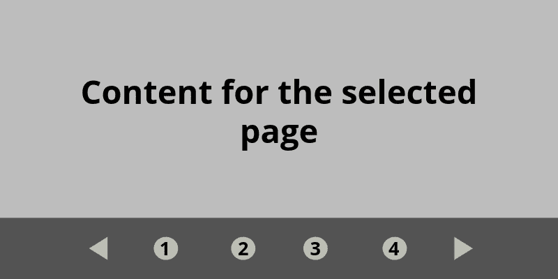

# 我如何建立一个自定义的步进器/向导组件使用角材料 CDK

> 原文：<https://dev.to/mokkapps/how-i-built-a-custom-stepperwizard-component-using-the-angular-material-cdk-4f34>

最近，我不得不重构一个非常复杂的遗留 Angular 组件，我想与你分享我的经验。

## 遗留组件

根据设计，组件应该是这样的:

[](https://res.cloudinary.com/practicaldev/image/fetch/s--Wv9UQenz--/c_limit%2Cf_auto%2Cfl_progressive%2Cq_auto%2Cw_880/https://www.mokkapps.de/legacy-component-design-5fa8df8752e8a42ad5a09d6349f52a33.svg)

基本上，您可以通过单击导航箭头或单击底部导航区域中的某个步骤来自由浏览内容。

遗留组件的 HTML 模板类似于这个简单的例子:

```
<div *ngIf="isContent1 && !isContent2 && !isFinished && !noError">
  Content 1
</div>

<div *ngIf="!isContent1 && isContent2 && !isFinished && !noError">
  Content 2
</div> 
```

Enter fullscreen mode Exit fullscreen mode

所以基本上每个内容页面都有一个包含多个`*ngIf`语句的`div`容器。因为每次只能看到一个内容容器，它们的可见性由`*ngIf`指令控制。

乍一看，这听起来对您来说没那么糟糕，但是这种方法有一些主要问题:

*   它包含大量令人困惑的陈述
*   未考虑可达性
*   默认情况下不支持键盘交互
*   管理哪个状态是活动的必须手动实现
*   这是一个需要测试的定制解决方案
*   它提供了不可伸缩的组件架构

此外，我们得到了一个新的要求:应该能够以线性方式在内容页面之间切换。也就是说，从第一个内容页面转到第二个内容页面应该只有在第一个页面完成的情况下才是可能的，而不应该允许向后转。

## 重构

为了能够满足新的要求，我开始研究现有的提供类似逻辑的组件，并发现了，例如， [Angular Archwizard](https://github.com/madoar/angular-archwizard) 。

这个组件真的很好，在最新的 Angular 版本中也很好，但是我不能根据我们的设计要求轻易地修改样式。

所以我继续我的研究，偶然发现了[角状材料 CDK 步进器](https://material.angular.io/cdk/stepper/overview)，这正是我一直在寻找的。

## 棱角分明的物质 CDK

在[官方网站](https://material.angular.io/cdk/categories)上，他们将组件开发套件(CDK)描述为:

> 组件开发工具包(CDK)是一套工具，它实现了常见的交互模式，同时对它们的表现形式没有偏见。它代表了 Angular Material 库中核心功能的抽象，没有任何特定于材料设计的样式。可以把 CDK 想象成一个空白状态，在这个状态下，你可以开发你自己的定制组件。

基本上，CDK 分为两部分:“公共行为”和“组件”

### 常见行为

> 实现常见应用程序功能的工具

以下是 CDK 提供的常见行为列表:

[](///static/f8e406a7f22d720d41ed52804a1c6a1e/b9c4f/cdk-common-behavior.png)

### 组件

> 具有有用功能的非样式组件

下图显示了 CDK 提供的组件列表:

[](///static/827bdb53239bbbc1fb352e85fcdc7cd2/991e9/cdk-components.png)

### CDK 踏步机

所以 [CdkStepper](https://material.angular.io/cdk/stepper/overview) 正是我一直在寻找的:一个经过良好测试的步进功能，我可以按照自己的意愿设计。基本上，它由一个用于管理步进器中每个步骤状态的`CdkStep`和一个包含步骤(`CdkStep`)并主要管理哪个步骤处于活动状态的`CdkStepper`组成。

### 入门

将 CDK 添加到您的角度项目非常简单:

```
npm install --save @angular/cdk 
```

Enter fullscreen mode Exit fullscreen mode

或者对于`Yarn` :

```
yarn add @angular/cdk 
```

Enter fullscreen mode Exit fullscreen mode

您还需要将`CdkStepperModule`添加到您的角度模块:

```
import { NgModule } from '@angular/core';
import { BrowserModule } from '@angular/platform-browser';
import { CdkStepperModule } from '@angular/cdk/stepper'; // this is the relevant important

import { AppComponent } from './app.component';

@NgModule({
  imports: [BrowserModule, CdkStepperModule], // add the module to your imports
  declarations: [AppComponent],
  bootstrap: [AppComponent],
})
export class AppModule {} 
```

Enter fullscreen mode Exit fullscreen mode

### 演示步进器项目

由于[官方文档](https://material.angular.io/cdk/stepper/overview)没有提供任何代码示例，我在 Stackblitz 上创建了一个[简单的演示项目，我想在下面的部分中描述它。](https://stackblitz.com/edit/angular-basic-cdk-stepper?embed=1&file=src/app/custom-stepper/custom-stepper.component.ts)

#### 创建 CustomStepperComponent

第一步是为`CdkStepper`创建一个新的角度组件，以便修改它。因此，组件需要从`CdkStepper`开始延伸。下面的例子是一个自定义 CDK 步进器组件的最小实现:

```
import { Directionality } from '@angular/cdk/bidi';
import { ChangeDetectorRef, Component } from '@angular/core';
import { CdkStepper } from '@angular/cdk/stepper';

@Component({
  selector: 'app-custom-stepper',
  templateUrl: './custom-stepper.component.html',
  styleUrls: ['./custom-stepper.component.css'],
  providers: [{ provide: CdkStepper, useExisting: CustomStepperComponent }],
})
export class CustomStepperComponent extends CdkStepper {
  constructor(dir: Directionality, changeDetectorRef: ChangeDetectorRef) {
    super(dir, changeDetectorRef);
  }

  onClick(index: number): void {
    this.selectedIndex = index;
  }
} 
```

Enter fullscreen mode Exit fullscreen mode

这个基本组件的 HTML 模板:

```
<!-- This is where the content from each CdkStep is projected to -->
<ng-container [ngTemplateOutlet]="selected.content"></ng-container>

<!-- This is the navigation bar of the stepper -->
<footer>
  <button cdkStepperPrevious>Previous</button>
  <button *ngFor="let step of _steps; let i = index;" (click)="onClick(i)">Step {{i + 1}}</button>
  <button cdkStepperNext>Next</button>
</footer> 
```

Enter fullscreen mode Exit fullscreen mode

现在我们已经可以在另一个组件
中使用新的`CustomStepperComponent`

```
<app-custom-stepper>
  <cdk-step>
    <input type="text" name="a" value="a" />
  </cdk-step>
  <cdk-step>
    <input type="text" name="b" value="b" />
  </cdk-step>
</app-custom-stepper> 
```

Enter fullscreen mode Exit fullscreen mode

每一步都需要包装在一个`<cdk-step>`标签中。对于多个步骤，您当然可以使用`*ngFor`并在其中使用您的自定义步骤组件:

```
<app-custom-stepper>
  <cdk-step *ngFor="let step of mySteps; let stepIndex = index">
    <my-step-component [step]="step"></my-step-component>
  </cdk-step>
</app-custom-stepper> 
```

Enter fullscreen mode Exit fullscreen mode

### 线性模式

上面的例子允许用户在所有步骤之间自由导航。`CdkStepper`还提供了[线性模式](https://material.angular.io/cdk/stepper/overview#linear-stepper)，要求用户在继续之前完成之前的步骤。

您可以为整个步进器使用一个表单，也可以为每个单独的步骤使用一个表单来验证一个步骤是否完成。或者，您可以将`completed`属性传递给每个步骤，并根据您自己的逻辑设置属性值，而不使用表单。

一个不使用表单的简单例子可以是这样的:

```
<app-custom-stepper linear>
  <cdk-step editable="false" [completed]="completed">
    <input type="text" name="a" value="Cannot proceed to next step" />
    <button (click)="completeStep()">Complete step</button>
  </cdk-step>
  <cdk-step editable="false">
    <input type="text" name="b" value="b" />
  </cdk-step>
</app-custom-stepper>

export class MyComponent {
  completed = false;

  completeStep(): void {
    this.completed = true;
  }
} 
```

Enter fullscreen mode Exit fullscreen mode

这些步骤被标记为`editable="false"`,这意味着一旦该步骤被标记为完成，用户就不能返回到该步骤。在第一步完成之前，无法通过点击`Complete Step`按钮导航至第二步。

如果您正在执行第 2 步，则无法导航回第 1 步。

## 结论

我对`CdkStepper`非常满意，它提供了我重构遗留组件所需的所有功能。没有必要为这个逻辑编写测试，它自动提供键盘交互支持并关心可访问性。

我的建议是:如果你需要为你的 Angular 应用程序实现一个通用的行为或组件逻辑，请先看看 Angular Material CDK 或类似的库。不要自己实现它们，因为你永远也不会得到和 Angular Material 一样的被维护的、广泛使用的开源项目相同的质量。