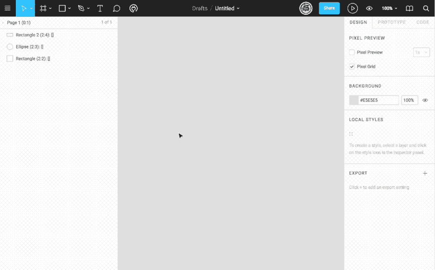
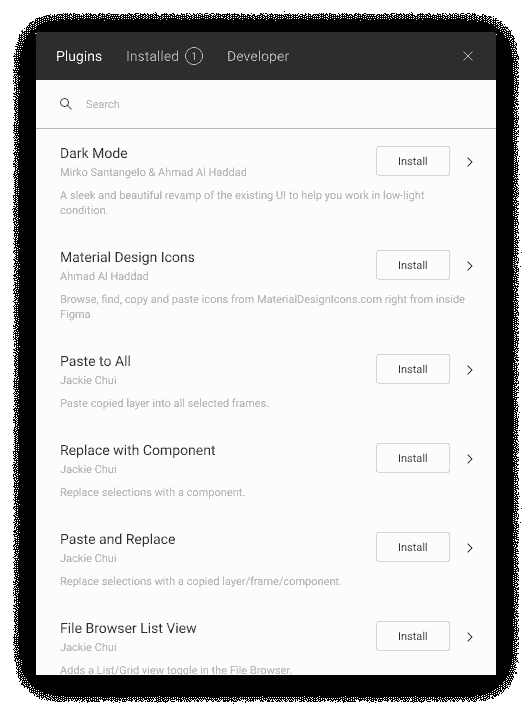

# 我如何为 Figma 创建了一个插件系统，并在两周内获得了 4000 个用户

> 原文：<https://dev.to/cdes/how-i-created-a-plugin-system-for-figma-and-got-4000-users-in-under-2-weeks-3466>

附注:我不是一个人做的。

是时候我来谈谈 Figma 的非官方插件系统(Figma Plus)以及它是如何诞生的了。

就我个人而言，我整个职业生涯都受益于技术社区工作。是我回报的时候了。

老实说..菲格玛太棒了。

然而，我来自 Sketch，有一件事总是让我无法接受，那就是缺少插件。

直到，我看到了 [Figma 黑暗 UI 插件](https://spectrum.chat/users/mirko-santangelo?thread=f5349d6d-563f-40ae-83e0-9aec9976fb63)。

我愣了一下，虽然对自己说…

[](https://res.cloudinary.com/practicaldev/image/fetch/s--5SgrsPhl--/c_limit%2Cf_auto%2Cfl_progressive%2Cq_66%2Cw_880/https://cdn-images-1.medium.com/max/495/0%2AMmhHcuuetb6YmsZt.gif)

自从我知道互联网的存在，我就一直在给网站注入 CSS 和 JS..而且我从来没有想到 Figma *也是*一个网站！

我好奇的想..一定有办法的…！

所以，我挑战自己，不仅仅要做一个插件…而是 Figma 的一个插件系统。

我开始四处闲逛..这是我第一次写插件系统，但我确实…

和..

[虚构人物诞生](https://github.com/cdes/figma-advanced-rename-plugin/tree/70bfe3ea9e8f58ae5b5ee1ebad33cbb8c4211f23)！

*这个链接是针对一个旧的提交在现在的高级重命名插件的回购中。*

#### 但如何？

[](https://res.cloudinary.com/practicaldev/image/fetch/s--m0VSG0WE--/c_limit%2Cf_auto%2Cfl_progressive%2Cq_66%2Cw_880/https://cdn-images-1.medium.com/max/250/1%2A2O65ddLFxnSOLmfyKI_ing.gif)

是的，我明白了。我来解释一下… Figma 是一个网站。向网站添加你自己的 CSS 和 Javascript 是非常容易的。所有的创业公司都是这样建立起来的。

它开始是一个挑战，却发现还有其他人也试图这样做。我们最终联手了。

有一个重要的发现使这一切成为可能。

窗户。应用

这是 Figma 的前端 javascript 应用程序，与他们的后端通信..并且在窗口对象上可用…甜！

然而，我们不得不对 app.js 进行逆向工程，以找到有用的可公开访问的 API。

### fig ma 的非官方插件系统

该系统由两个主要部分组成，工厂和虚构物。

#### 工厂:

工厂注入一个下拉菜单 Figma 的 UI，并迭代/src/figments 目录中的插件(figments ),为每个插件添加一个选项。

#### 虚构人物:

每个 figment 是一个具有 3 个必需属性的对象:name、setup()、main()。

#### 示例插件

```
const counter = {

// Displayed in the injected menu
 name: "Counter",

state: {
 counter: 0
 },

// Think of it as the constructor for your figment
 setup() {
 console.log(`Counter ${this.state.counter}`);
 },

// Called when a user clicks on the injected menu option
 main() {
 this.state.counter++;
 console.log(`Counter ${this.state.counter}`);
 }

}

export default counter; 
```

Enter fullscreen mode Exit fullscreen mode

然后，我创建了我的第一个插件系统。噪音。

### 模拟与逆向工程

现在，我第一次尝试创建插件是批量重命名，在 Figma 做他们的之前😝。

我不知道从哪里开始，所以我开始做我知道的事情，模拟用户交互来自动选择然后重命名图层。

第一个问题是我使用 document.querySelectorAll 选择层，但是由于 Figma 使用的是“虚拟列表”，所以并不是所有层都在要选择的 DOM 中。因此，第一版的限制是 50 层(取决于你的屏幕有多高)。

在与它斗争了几个星期后， [Jackie](https://twitter.com/jackiechuichui) 发布了他的“查找和替换插件”。我看到他在访问一些奇怪的东西… window.App。

我看了看他在做什么，瞧，插件完成了。

批层重命名器(比 Figma 的好)

现在，尽管制作重命名器很繁琐，但它甚至还没有接近内容生成器插件。我差点为此丢了小命。

我竭尽全力尝试模拟复制/粘贴、读取剪贴板、模拟拖放、加密和解密图像。我学到了很多关于 blobs，剪贴板，逆向工程，试错法。

[](https://res.cloudinary.com/practicaldev/image/fetch/s--vJ9BWPrB--/c_limit%2Cf_auto%2Cfl_progressive%2Cq_66%2Cw_880/https://cdn-images-1.medium.com/max/1024/1%2Ahleq92gVs0OT-0z-Y7q7Ig.gif)

我最初的实现有点幼稚..我没有考虑如何动态加载新插件。这意味着每当一个新的插件被创建/更新时，我必须重建我的系统。我本来最终可以做到的，但那会花去我很多时间。

#### 还没准备好

正如我之前说过的，但准确地说……我需要解决多个问题:

1.  开发插件的简化方法。
2.  开发者发布他们创建的插件的简单方法。
3.  Figma 用户浏览和安装那些已发布插件的一种方式。
4.  为“桌面版 Figma”用户提供以上所有内容。

通过创建一个插件系统，我只是解决了 1/4 的问题。一个人做太多了。

—

### 组装

[](https://res.cloudinary.com/practicaldev/image/fetch/s--aLe98to_--/c_limit%2Cf_auto%2Cfl_progressive%2Cq_66%2Cw_880/https://cdn-images-1.medium.com/max/300/1%2AWAwW8ewr9u4DdZ80uhSpBQ.gif)

我在 Figma 的社区写我的插件系统的那天，棒极了的 Jackie Chui 刚刚发布了他的 Find & Replace 插件，太棒了。

经过小小的讨论，我们决定合作。米尔科、[杰基](https://twitter.com/jackiechuichui)和我一起创造我渴望做的事情，甚至更多！

### 唉，这个问题我们必须解决

这是我做过的最大的兼职项目之一。它有很多我没做过的新东西。这就是它的厉害之处！

事不宜迟…

**问题#1:一个系统**

它已经启动了，人们正在为 Figma 创建插件作为 Chrome 扩展。虽然这可能很好，但不是最好的解决方案。我们想标准化我们(和其他人)为 Figma 创建插件的方式。

我们已经开始创建一个创建、安装和开发插件的标准方法。

1.  我们将创建一个适用于浏览器和桌面的插件管理器。
2.  管理器应该读取一个 JSON 文件，该文件包含所有可用插件的目录，并提供可安装在用户机器上的插件。
3.  为 Figma 提供一套有用的 API，这样开发者可以更容易地创建插件。

需要注意的一点是，不要将您局限于工厂式的生命周期..新的插件系统应该允许你创建自己的插件生命周期。它只是一个运行在 Figma 内部的 Javascript 应用程序。

**问题#2:一个经理**

我们想为发现、安装和开发插件创造一个成熟的用户体验。

由于我们决定经理将在 Figma 内部，我们希望它看起来像本地人。

成龙的作品让我们惊叹不已。在几周的时间里，他设法设计并开发了一个用 Vue.js 构建的插件管理器。它非常神奇，完成了工作甚至更多。

它为用户提供了一种浏览、过滤、安装和卸载插件的方式。它还会在每次你重新打开 Figma 时自动更新你的插件！

**问题#2:开发者**

用了管理器之后，用 Figma 试我的插件是皮塔饼。每当我更改一行代码时，我都必须这样做:

1.  构建我的 JS(我用 es6)。
2.  复制代码包。
3.  Reload Figma.
4.  粘贴到 Chrome DevTool 中。
5.  试试我的代码。
6.  重复一遍。

这么多，只是为了测试一个小变化。我们必须有一个开发者模式。我设法为插件管理器创建了一个本地列表来加载，它很适合我。直到我把我的想法告诉了 Jackie，他创造了一个更好的解决方案。

在插件管理器中，有一个开发人员选项卡，它为您提供方便的工具来包含本地主机提供的 JS/CSS 文件一次，然后只需这样做:

1.  构建我的 JS(我用 es6)。
2.  Reload Figma.

这是一个更好的开发体验。

**问题#3:安全性**

由于我们将在您的浏览器中运行 JS 代码，我们想确保您安装的代码是安全的。这就是为什么为了提交插件，你需要在 repo 中创建一个 PR。我们将测试插件，看看它没有做一些可疑的事情，然后批准它。

我们还希望确保您安装的代码保持不变，并且如果开发人员更改插件代码，管理器不会运行插件，直到开发人员在管理器 repo 中提交 pull 请求。我们依靠 Github 版本+ JSDelivr 来缓存它们。目前，它按照预期完成了工作。

问题#4: Figma

让我们面对现实吧……fig ma 是专有软件，他们随时都可以决定让我们停机，我们对此不能说什么，因为这是他们的。

—

### 我们做到了！

<figure>[](https://res.cloudinary.com/practicaldev/image/fetch/s--3AMg5Veb--/c_limit%2Cf_auto%2Cfl_progressive%2Cq_auto%2Cw_880/https://cdn-images-1.medium.com/max/532/1%2AB1VSP6Jijjo7hKaBAzIRlA.png)

<figcaption>【figma plus】</figcaption>

</figure>

我们想为发现、安装和开发插件创造一个成熟的用户体验。

这是一段颠簸的旅程，但它最终完成了:

1.  一个插件管理器，供人们浏览和安装插件。
2.  开发者可以通过在插件管理器报告中打开一个 PR 来发布他们的插件。
3.  开发者可以用他们喜欢的方式编写插件。
4.  所有这些都可以通过使用 [Figma Plus 安装程序](https://figmaplus.com)为“桌面版 Figma”所用。
5.  编写下一个很酷的插件的有用文档和指南。
6.  我们创作的一个漂亮的登陆页面。

你可以在[这里](https://spectrum.chat/figma/extensions-and-api/introducing-figma-plus-the-unofficial-plugin-system-for-figma~8ebc36ab-755c-4172-b7bc-61eabf9d4046)阅读完整的介绍文章。

### 一封感谢信

令人惊叹的杰基，和我一起做所有的工作，只是站着不动，对他做的每一件事感到惊讶。谢谢你。

鼓舞人心的 [Mirko](https://twitter.com/mirkosantangelo) ，创造了开启这一切的黑暗 UI 插件，设计了网站，并捐赠了徽标。谢谢你。

谢谢 [Github](https://github.com/) 、 [JsDelivr](https://jsdelivr.com) 、 [Slack](http://slack.com) 和[谱](http://spectrum.chat)。您出色的软件让我们的工作变得更加轻松。

### 迅速消亡

在发布 Figma Plus 之后，我们有 14 个插件与之捆绑。不到两周:

*   从社区添加了 3 个插件(图玛 RTL、图玛图标化和图玛到漫威)。
*   我们有将近 4000 个用户，安装了超过 12K 个插件。

有几个小问题…

为了让开发者在本地测试他的插件，我们必须绕过 Figma 的某些安全措施。但这只是针对开发者的。至于安装插件的用户，安全措施没有受到影响。

我们知道这是一种折衷，并在我们的文档中警告过开发者。

此外，我们所做的所有工作都是基于对 Figma 的 JavaScript 进行逆向工程。这不仅意味着我们的插件可能会经常崩溃…这也意味着我们的工作可能会破坏 Figma 的稳定或者可能会破坏它！

不幸的是，这对 Figma 来说显然不是一件好事，所以我们不得不将其拿下。你可以从[这里](https://spectrum.chat/figma-plus/general/thank-you-and-good-bye~ef95c63c-b8e1-4885-8404-d8bf08fdb1d0)和[这里](https://spectrum.chat/figma/general/why-did-you-shut-down-figma-plus~b493857c-37cb-4d93-85a0-5abec5d82b84?m=MTU1ODQ1ODEzNDIwNQ==)阅读更多细节。

我们完全理解并尊重 Figma 以及他们对 Figma Plus 的看法。

### 接下来是什么？

Figma 团队邀请我们加入即将到来的官方 API 的早期访问计划。我们将会以官方支持的格式来构建我们的插件，这种格式有益于用户，并且不会损害任何东西。

敬请关注。

喜欢这个故事吗？别忘了留下一些👏👏👏👏👏和你的 Figma 伙伴们分享这个故事。此外，在推特上关注我关于 Figma 和其他设计的更新(我用英语和阿拉伯语发推特):[https://twitter.com/cdes](https://twitter.com/cdes)

[**Ahmad Al Haddad**](https://ah.sa/) 是来自沙特的多学科设计师/开发人员 [Tam Hub](http://tam.sa) 的产品设计负责人&。