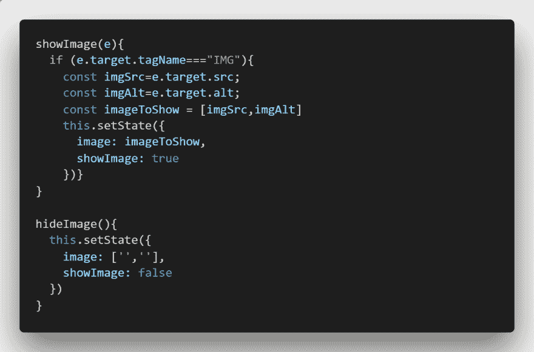
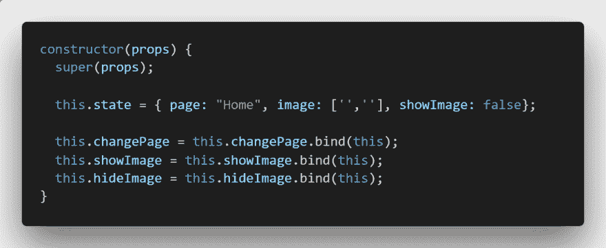
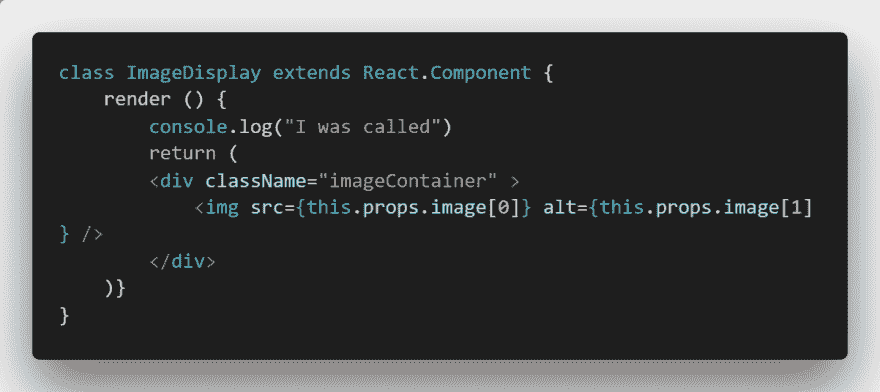
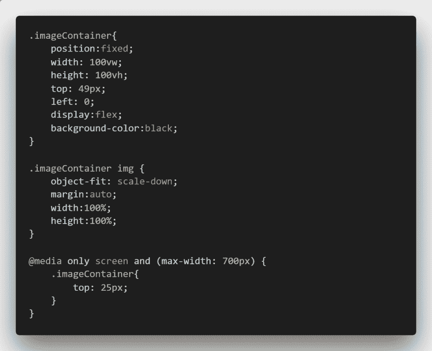

# 我如何在 React 中创建类似 Zillow 的图像显示组件。

> 原文：<https://dev.to/andersjr1984/how-i-created-my-zillow-like-image-display-component-in-react-1lh1>

这来自我的数字作品集，你可以点击这里查看！

当我建立最初的作品集时，我收到的最常见的评论之一是，当我试图查看一张图片时，被重定向到我的网站之外是一件痛苦的事情。我开始思考这个问题，希望找到一个解决方案，就像 Zillow 在当前显示窗口中打开图片时所做的那样。我认为我的解决方案相当简单，我很乐意把它介绍给我所有最好的开发朋友。当然，这不是我采取的确切过程，有几个错误和一些痛苦的调试，但它现在工作，这是我将如何在未来这样做！我知道下面的一些代码会让你们中的一些人不寒而栗，但它是有效的，我想知道为什么你会不寒而栗，请回复！

1.  我希望这个功能是整个网站，而不是局限于任何一个页面。我唯一不想展示的是我的横幅。这很好，因为我的页面是通过另一个组件显示的，我的 PageDisplay 组件。在我的主应用程序类中，我将 PageDisplay 放在它自己的名为“Content”的 div 中，并放入一个 onClick 事件处理程序来运行 showImage 函数。在步骤 2 之后，我将向您展示这段代码。
2.  在我的 PageDisplay 调用下面，我为 ImageDisplay 组件添加了一个新的组件调用，如果应用程序的 showImage 状态为 true，该组件将会显示。我还为 ImageDisplay 做了一个 onClick 事件处理程序，让它消失。希望这段代码能减轻任何困惑:

4.  然后我编写了两个事件处理程序，showImage 和 hideImage。只有当标记名是图像时，显示图像才会运行，hideImage 会将状态重置回初始值，并更改显示图像布尔值:

6.  这些函数需要绑定到 App 组件，新的状态必须添加到构造函数中。

8.  现在，我创建了 ImageDisplay 组件。这非常简单！为了给图像一整页的黑色背景，我必须将它们放在一个容器 div 中，我称之为 imageContainer。我马上给你 CSS。

10.  然后我写了 CSS 来使我的图片更加漂亮。

12.  然后到了我以前到达过几次的点，只是意识到我在某个地方犯了一个错误，测试。只是这一次，有些不同，而且成功了！