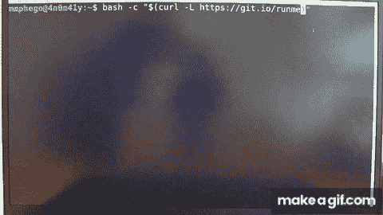

# 我如何使用点文件提高工作效率[更新]

> 原文：<https://dev.to/mmphego/how-i-increased-my-productivity-using-dotfiles-2f4m>

*最初发布于[blog.mphomphego.co.za](https://blog.mphomphego.co.za/blog/2019/02/28/How-I-increased-my-productivity-using-dotfiles.html)2019 年 2 月 28 日。*

* * *

*更新:2019 年 3 月 17 日*
为我的[新电脑](https://github.com/mmphego/new-computer)设置脚本添加演示视频。
点击 Gif: [](https://www.youtube.com/watch?v=ooqxvkyNwiY)

* * *

# 我如何使用点文件提高工作效率

**TLDR**；*使用点文件和安装脚本，你可以在几分钟内建立一个新系统。创建自己的存储库并不难，而且您会学到很多东西。这是真正的旅程，而不是目的地！*

没有比从头再来更令人沮丧的感觉了，尤其是在安装全新的操作系统或者硬盘崩溃导致重新安装操作系统的时候！

你心里想，天哪！我的别名、系统设置和配置文件，每个小助手文件和脚本**就这样不见了！**

安装在你新电脑上的新操作系统是它原来的外壳，所有的东西都是新的，你会有多恼火。


当你回想起以前电脑带给你的舒适和高效时，你的心暖暖的。如果有一种方法可以在旅途中携带你所知道和喜爱的一切，并且永远不用担心重新安装一切的痛苦，那该多好...

**谢天谢地，有！**

* * *

随着时间的推移，我变得恼火和沮丧，以至于我创建了自己的 linux 设置脚本，自动安装我需要的软件包、点文件、配置文件和设置。

如果你想了解一下，[ [new-computer](https://github.com/mmphego/new-computer/) ] -如果你有好的想法要分享或想要合作，请随时给我发推文 [@orifhampho](https://dev.to/orifhampho) 或[叉，并给我发一份公关！](https://github.com/mmphego/new-computer/)

## 自动化一切！

这包括两个部分:

*   第一个是[我的点文件&配置](https://github.com/mmphego/dot-files)的存储库/备份。

    这个存储库包含并跟踪我的`/home`分区中大多数重要文件的变化，比如`.bashrc`、`.bash_aliases`和其他相关文件。

    点文件用于定制您的系统。`"dotfiles"`名称源自类 Unix 系统中以点号开头的配置文件(如`.bash_profile`和`.gitconfig`)。对于普通用户，这表明这些不是常规文档，默认情况下隐藏在目录列表中。然而，对于高级用户来说，它们是核心工具带。
    将我的 dotfiles 备份到 GitHub 可以让所有东西都得到清晰的跟踪和版本控制。

*   第二个[库](https://github.com/mmphego/new-computer)打包了一个功能强大的包，它包含一个脚本，当运行时，它将安装每个小的包、配置、 [githooks](https://github.com/mmphego/git-hooks) 和[dot file](https://github.com/mmphego/dot-files)，这是我从学术、工作到娱乐的日常生产力所需要的。
    `installer.sh`是让这一切神奇地工作的原因。我会在下一篇文章中详细记录。

## 我的点文件

### 一个示例点文件库

在这篇文章中，我将列出我自己的[点文件报告](https://github.com/mmphego/dot-files)的一个子集。

**当前结构**

下面是我的点文件库的结构。这也是我们将在下面的演练中使用的。

```
.
├── .config
│   ├── Code
│   │   └── User
│   ├── gummi
│   │   ├── gummi.cfg
│   │   ├── snippets.cfg
│   │   └── welcome.tex
│   ├── Mendeley Ltd.
│   │   └── Mendeley Desktop.conf
│   ├── ranger
│   │   ├── bookmarks
│   │   ├── commands_full.py
│   │   ├── commands.py
│   │   ├── history
│   │   ├── rc.conf
│   │   ├── rifle.conf
│   │   ├── scope.sh
│   │   └── tagged
│   ├── redshift.conf
│   ├── Slack
│   │   └── local-settings.json
│   ├── sublime-text-3
│   │   ├── Packages
│   │   ├── TrailingSpaces
│   │   └── WordHighlight
│   ├── terminator
│   │   └── config
│   └── xfce4
│       ├── helpers.rc
│       ├── help.rc
│       ├── panel
│       ├── terminal
│       ├── xfce4-screenshooter
│       ├── xfce4-taskmanager.rc
│       └── xfconf
├── .dotfiles
│   ├── .bash_aliases
│   ├── .bash_functions
│   ├── .bashrc
│   ├── .docker_aliases
│   ├── .dotfiles_setup.sh
│   ├── .git-completion.bash
│   ├── .gitconfig
│   ├── .gitignore
│   ├── .nanorc
│   ├── .profile
│   └── .travis.conf
├── .ipython
│   └── profile_default
│       ├── db
│       ├── ipython_config.py
│       ├── ipython_kernel_config.py
│       ├── log
│       ├── pid
│       └── startup
├── LICENSE
├── My-Git-Repos.txt
├── Pictures
│   ├── glasses-and-computer-screen.jpg
│   ├── vertical_background.jpeg
│   └── wallpaper.jpg
├── README.md
└── .travis.yml 
```

Enter fullscreen mode Exit fullscreen mode

#### 深入网络文件

我们将看看下面的例子:

*   *。点文件/。个人资料*
*   *。点文件/。巴沙尔*
*   *。点文件/。bash_aliases*
*   *。点文件/。bash_functions*
*   *。dotfiles/。dock _ aliases*

* * *

**T1。简介**

这个文件位于你登录时首先加载的`/home`目录下，它或者叫做`.profile`或者叫做`.bash_profile`。
在`.profile`中放什么完全取决于个人，并且可以显著扩展。我个人喜欢让我的`.profile`尽可能小，并且只有我需要运行一次的东西。
例如，我在`.profile`
中定义了我所有的颜色和颜色函数

```
case ${TERM} in
    '') ;;
  *)
    # Define a few Colours
    BLACK="$(tput -T xterm setaf 0)"
    BLACKBG="$(tput -T xterm setab 0)"
    # ....
esac

# if running bash
if [ -n "$BASH_VERSION" ]; then
    # include .bashrc if it exists
    if [ -f "$HOME/.bashrc" ]; then
    . "$HOME/.bashrc"
    fi
fi

# set PATH so it includes user's private bin directories
PATH="$HOME/.venv/bin:$HOME/bin:$HOME/.local/bin:$PATH"
export PATH="$HOME/.poetry/bin:$PATH"

recho() {
    echo "${RED}$1${NC}"
}

gecho() {
    echo "${GREEN}$1${NC}"
}

export -f recho
export -f gecho 
```

Enter fullscreen mode Exit fullscreen mode

完整例子:我的[。个人资料](https://github.com/mmphego/dot-files/blob/master/.dotfiles/.profile)

如果你想更深入地了解启动脚本，Peter Ward 解释了关于 [Shell 启动脚本](http://blog.flowblok.id.au/2013-02/shell-startup-scripts.html)的内容。

**T1。巴沙尔 T3】**

`.bashrc`是一个 shell 脚本，每当 Bash 以交互方式启动时，即当您打开一个新的终端时，它就会运行。它初始化一个交互式 shell 会话。
例如，我定义了我的 [PS1](https://www.linuxnix.com/linuxunix-shell-ps1-prompt-explained-in-detail/) ，外壳选项，按键绑定，别名，函数和自定义消息。

[](https://res.cloudinary.com/practicaldev/image/fetch/s--W7h-hwXE--/c_limit%2Cf_auto%2Cfl_progressive%2Cq_auto%2Cw_880/https://blog.mphomphego.co.za/assets/screenshot.png)T3】

```
__git_status_info() {
    STATUS=$(git status 2>/dev/null |
    awk '
    /^On branch / {printf($3)}
    /^Changes not staged / {printf("|?Changes unstaged!")}
    /^Changes to be committed/ {printf("|*Uncommitted changes!")}
    /^Your branch is ahead of/ {printf("|^Push changes!")}
    ')
    if [ -n "${STATUS}" ]; then echo -ne " (${STATUS}) [Last updated: $(git show -1 --stat | grep ^Date | cut -f4- -d' ')]"
    fi
}

__disk_space=$(/bin/df --output=pcent /home | tail -1)
_ip_add=$(ip addr | grep -w inet | gawk '{if (NR==2) {$0=$2; gsub(/\//," "); print $1;}}')
__ps1_startline="\[\033[0;32m\]\[\033[0m\033[0;38m\]\u\[\033[0;36m\]@\[\033[0;36m\]\h on ${_ip_add}:\w\[\033[0;32m\]  \[\033[0;34m\] [disk:${__disk_space}] \[\033[0;32m\]"
__ps1_endline="\[\033[0;32m\]└─\[\033[0m\033[0;31m\] [\D{%F %T}] \$\[\033[0m\033[0;32m\] >>>\[\033[0m\] "
export PS1="${__ps1_startline}\$(__git_status_info)\n${__ps1_endline}"
# ------------
IP_ADD=`ip addr | grep -w inet | gawk '{if (NR==2) {$0=$2; gsub(/\//," "); print $1;}}'`
printf "${LIGHTGREEN}Hello, ${USER}@${IP_ADD}\n"
printf "Today is, $(date)\n";
printf "Sysinfo: $(uptime)\n"
printf "\n$(fortune | cowsay)${NC}\n" 
```

Enter fullscreen mode Exit fullscreen mode

完整例子:我的[。巴沙尔](https://github.com/mmphego/dot-files/blob/master/.dotfiles/.bashrc)

**T1。bash _ 别名**

Bash 别名本质上只不过是一个键盘快捷键，一个缩写，一种避免键入长命令序列的方法。[阅读更多](https://www.tldp.org/LDP/abs/html/aliases.html)。下面是一些例子:

```
 alias update='sudo apt-get -y update'
alias upgrade='sudo apt-get -y --allow-unauthenticated upgrade && sudo apt-get autoclean && sudo apt-get autoremove'
alias hist='history --color=always'
alias hist-grep='history | grep --color=always'
alias youtube="$(command -v youtube-dl)"
alias youtube-mp3="$(command -v youtube-dl) -x --audio-format mp3"
alias rsync='rsync --progress'
alias less='less -N' 
```

Enter fullscreen mode Exit fullscreen mode

完整例子:我的[。bash_aliases](https://github.com/mmphego/dot-files/blob/master/.dotfiles/.bash_aliases)

**T1。bash _ functionsT3】**

对于别名来说太复杂(对于独立脚本来说可能太小)的命令可以在函数中定义。函数可以接受参数，使它们更强大。

```
 cd() {
    # The 'builtin' keyword allows you to redefine a Bash builtin without
    # creating a recursion. Quoting the parameter makes it work in case there are spaces in
    # directory names.
    builtin cd "$@" && ls -thor;
}

compile() {
     if [ -f $1 ] ; then
         case $1 in
             *.tex)    latexmk -pdf $1               ;;
             *.c)      gcc -Wall "$1" -o "main" -lm  ;;
            # List should be expanded.
             *)        recho "'$1' cannot opened via ${FUNCNAME[0]}" ;;
         esac
     else recho "'$1' is not a valid file"
     fi
}

committer() {
    # Add file(s), commit and push
    FILE=$(git status | $(which grep) "modified:" | cut -f2 -d ":" | xargs)
    for file in $FILE; do git add -f "$file"; done
    if [ "$1" == "" ]; then
        # SignOff by username & email, SignOff with PGP and ignore hooks
        git commit -s -S -n -m"Updated $FILE";
    else git commit -s -S -n -m"$2";
    fi;
    read -t 5 -p "Hit ENTER if you want to push else wait 5 seconds"
    [ $? -eq 0 ] && bash -c "git push --no-verify -q &"
}

createpr() {
    # Push changes and create Pull Request on GitHub
    REMOTE="devel";
    if ! git show-ref --quiet refs/heads/devel; then REMOTE="master"; fi BRANCH="$(git rev-parse --abbrev-ref HEAD)"
    git push -u origin "${BRANCH}" || true;
    if [ -f /usr/local/bin/hub ]; then
        /usr/local/bin/hub pull-request -b "${REMOTE}" -h "${BRANCH}" --no-edit || true else recho "Failed to create PR, create it Manually"
        recho "If you would like to continue install hub: https://github.com/github/hub/"
    fi
} 
```

Enter fullscreen mode Exit fullscreen mode

完整例子:我的[。bash_functions](https://github.com/mmphego/dot-files/blob/master/.dotfiles/.bash_functions)

**T1。码头工人 _ 别名**

类似于`.bash_aliases`，在这个文件中我定义了我所有的`docker run`快捷方式

```
# bat supports syntax highlighting for a large number of programming and markup languages
# see: https://github.com/sharkdp/bat
alias bat='docker run -it --rm -e BAT_THEME -e BAT_STYLE -e BAT_TABS -v "$(pwd):/myapp" danlynn/bat'
# A collection of simplified and community-driven man pages.
# see: https://github.com/sharkdp/tldr
alias tldr='docker run --rm -it -v ~/.tldr/:/root/.tldr/ nutellinoit/tldr'
# Simplified docker based markdown linter
# see: https://github.com/mmphego/my-dockerfiles/markdownlint
alias markdownlint='docker run --rm -it -v "$(pwd):/app" mmphego/markdownlint'
# Simplified docker based latexmk
# see: https://github.com/mmphego/my-dockerfiles/latex-full
alias mklatex='docker run --rm -i -v "$PWD":/data --user="$(id -u):$(id -g)" mmphego/latex:ubuntu' 
```

Enter fullscreen mode Exit fullscreen mode

完整例子:我的[。docker_aliases](https://github.com/mmphego/dot-files/blob/master/.dotfiles/.docker_aliases)

#### 其他点文件

我上面只列出了点文件的一个子集，例如，许多包也在点文件中存储它们的设置

*   `.gitconfig`为 Git
    *   完整例子:我的[。gitconfig](https://github.com/mmphego/dot-files/blob/master/.dotfiles/.gitconfig)
*   `.nanorc`为纳米
    *   完整例子:我的[。纳米棒](https://github.com/mmphego/dot-files/blob/master/.dotfiles/.nanorc)

## 安装点文件

注意:注意你应该在你的/home 目录中定义一些点文件。在继续之前，您需要确保它们已在某处备份。
**记权力大责任大。**

我编写了一个 dotfiles 安装脚本来自动将 repo 中的 dotfiles 符号链接到您的`/home`目录。见此[。以 dotfiles_setup.sh](https://github.com/mmphego/dot-files/blob/master/.dotfiles/.dotfiles_setup.sh) 为例。
注意，脚本使用‘ln’而不是`GNU stow`进行符号链接——我将很快更新脚本。

要在新系统上安装点文件，我们可以通过克隆 repo:
来轻松完成

```
cd $HOME
git clone --depth 1 https://github.com/mmphego/dot-files
rsync -uar --delete-after dot-files/{.,}* "${HOME}"
bash .dotfiles/.dotfiles_setup.sh install
# To delete
# bash .dotfiles/.dotfiles_setup.sh delete 
```

Enter fullscreen mode Exit fullscreen mode

这个脚本将备份现有的点文件，然后进行符号链接。

完成后，您应该运行测试以确保安装成功。

```
bash .dotfiles/.dotfiles_setup.sh test 
```

Enter fullscreen mode Exit fullscreen mode

## 结论

这篇博文到此为止，我希望你能从这篇文章中有所收获。点文件是非常个人化的东西，看看其他的储存库，开始以你喜欢的方式构建你的点文件。我一直有在 GitHub 和其他博客上搜索各种包含点文件的存储库的诀窍，我经常会找到一些有用的东西。让一切按照你的规格工作总是很棘手，但是一旦你控制住了一切，你就可以开始了。

去建立你自己的点文件，下次当你的电脑崩溃/重装操作系统时，就不会那么糟糕了！

## 反馈

如果你有好的想法要分享或想要合作，请随时给我发推文 [@orifhampho](https://dev.to/orifhampho) 或[叉，并给我发一份公关！](https://github.com/mmphego/dot-files)

## 引用

*   [开始使用点文件](https://medium.com/@webprolific/getting-started-with-dotfiles-43c3602fd789)
*   [的目的是什么。bashrc 和它是如何工作的？](https://unix.stackexchange.com/questions/129143/what-is-the-purpose-of-bashrc-and-how-does-it-work)
*   [高级 Bash 脚本指南:别名](https://www.tldp.org/LDP/abs/html/aliases.html)
*   [开始使用点文件](https://driesvints.com/blog/getting-started-with-dotfiles/)