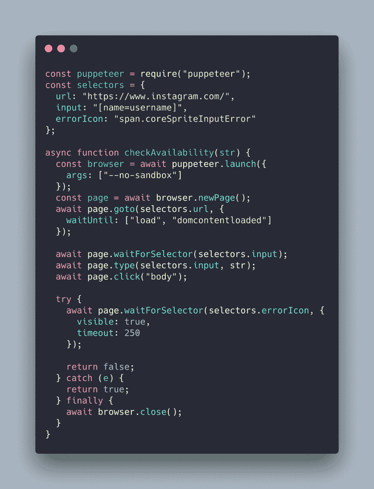
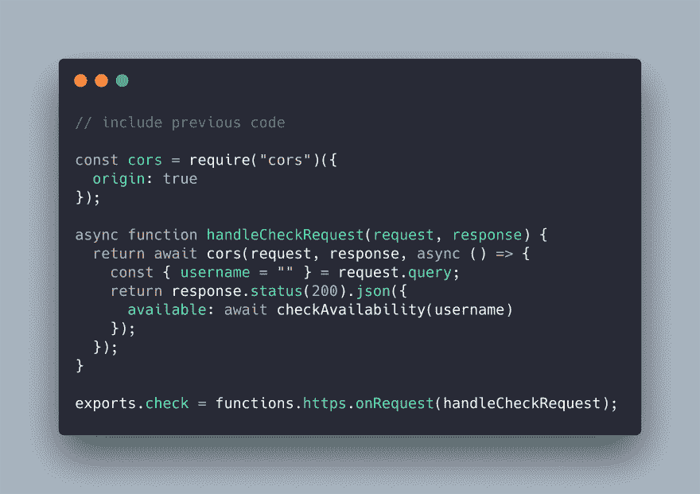
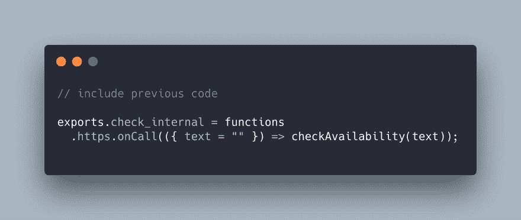
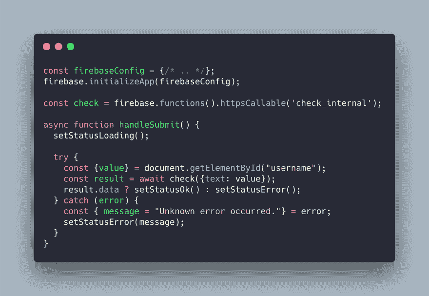

# 我如何在 Firebase 控制台上制作 Instagram scraper

> 原文：<https://dev.to/ruzicic/how-i-made-instagram-scraper-on-firebase-console-4ddf>

过去几天，我读到了 Instagrams 新的 [Graph API](https://developers.facebook.com/docs/instagram-api/) ，并在思考如何创造性地使用它。令我惊讶的是，他们不支持任何与用户注册或至少帐户用户名可用性相关的东西。经过一些研究，我看到一个“工具”在做同样的事情——检查提供的文本是否是有效的字符串和可用的 Instagram 用户名。
但是现在，我不关心图形 API——我想弄清楚他们是怎么做到的，没有 API！

## 研究

当然，我尝试的第一件事是检查他们的源代码和检查网络请求。我所能看到的就是这是在 Heroku 上的东西。没有帮助。之后，我去了 Instagram 官方注册页面，检查了他们的代码。我谷歌了一下，发现它并没有公开。

好，现在我想自己创建工具。*为什么？*因为我是几天前谷歌“检查 Instagram 用户名可用性”的人，所以我希望我不是唯一一个拒绝去官方网站这样做的人。*期望？*整天编码，学习新技术。

## 想法

在调查了他们的表单验证行为后，我的第一个想法是一个 NodeJS 脚本，运行 puppeteer，填充 Instagrams 官方注册表单，并等待成功或错误元素显示在屏幕上。(上周我在工作中写了一些 e2e 测试，所以我现在完全投入其中)。木偶师的计划是:

*   导航至 Instagram 注册页面
*   单击用户名输入并填写一些文本
*   单击主体(触发模糊事件验证检查)
*   观察 DOM 并返回字段是否有效

## e2e——针对不同需求

这就是我想出来的办法，而且-很有效！

[](https://res.cloudinary.com/practicaldev/image/fetch/s--yRYUpsrY--/c_limit%2Cf_auto%2Cfl_progressive%2Cq_auto%2Cw_880/https://thepracticaldev.s3.amazonaws.com/i/t2lkfnqcyub1rplfa5h0.png)

注意:因为如果一个元素没有出现在 DOM 中，木偶师 [waitForSelector](https://github.com/GoogleChrome/puppeteer/blob/master/docs/api.md#pagewaitforselectorselector-options) 方法将抛出，所以我将假设它不存在，并且用户名输入字段是有效的。

现在，当我知道脚本可以工作时，让我们部署它吧！

## 调整 Firebase 功能

在相当长的一段时间里，我想实际使用 Firebase 函数。这是一个尝试的绝佳时机。我以前有一些使用 Firebase 的经验，所以我去了 [Firebase 控制台](https://console.firebase.google.com)，创建了一个新项目并在本地初始化它。

有两种类型的 Firebase 函数:

1.  您从 Firebase 应用程序(Firebase 上托管的应用程序，或通过 Firebase 认证的应用程序)调用的应用程序
2.  你希望任何人都可以通过 HTTP 请求访问。

我两样都想要。一个用于我的网络应用，另一个用于其他人。

重要的事情先来。在 Firebase 控制台上创建一个新项目，转到函数选项卡，然后单击函数“开始”。
第二件事，本地安装[Firebase CLI](https://www.npmjs.com/package/firebase-tools):

```
npm install -g firebase-tools 
```

验证您的 Firebase 帐户

```
firebase login 
```

并初始化一个新项目，回答屏幕上的问题(默认就好)

```
firebase init 
```

配置您的应用程序以使用您一分钟前创建的 Firebase 项目非常重要。使用`firebase use --add`。

### 功能- onRequest

好吧。现在让我们通过一个 HTTP 请求来使用这个函数。我们必须在请求时使用[。参数与 Express.js 相同——请求和响应，这意味着请求对象允许您访问客户端发送的 HTTP 请求的属性，响应对象允许您将响应发送回客户端。
你可以很容易地创建一个新的 Express 应用程序，并将其导出为 Firebase 函数，但对于这个用例来说，这样做有些过头了。](https://firebase.google.com/docs/functions/http-events)

[](https://res.cloudinary.com/practicaldev/image/fetch/s--8J_W56DW--/c_limit%2Cf_auto%2Cfl_progressive%2Cq_auto%2Cw_880/https://thepracticaldev.s3.amazonaws.com/i/7w8a5s77o2rihxsvix86.png)

注意 CORS 包装器——从我们的 Firebase 应用程序域之外访问这个函数需要它。

我们现在就可以用 Postman
来测试它

```
GET https://us-central1-your-project-name.cloudfunctions.net/check?username=awesome_username_99 
```

并确认其工作状态 200 OK

```
{  "available":  true  } 
```

### 功能- onCall

现在，更简单的部分——导出一个[可调用函数](https://firebase.google.com/docs/functions/callable),以便在 Firebase 应用程序中使用。

[](https://res.cloudinary.com/practicaldev/image/fetch/s--OijHuGtu--/c_limit%2Cf_auto%2Cfl_progressive%2Cq_auto%2Cw_880/https://thepracticaldev.s3.amazonaws.com/i/o3ouzmnfl8z4ey2y9ymj.png)

### Web App - httpsCallable

测试这个怎么样？我想要一个简单的网页。实际上，用普通 javascript 验证输入花了我一段时间，但是我喜欢它。如果您大部分时间都在使用 angular/vue/react/whatever，您可能忘记了检查和设置表单元素的有效性需要做什么，至少我是这样做的。我将跳过无聊的部分(源代码的链接将在文本的末尾)。

[](https://res.cloudinary.com/practicaldev/image/fetch/s--iuu1_Te5--/c_limit%2Cf_auto%2Cfl_progressive%2Cq_auto%2Cw_880/https://thepracticaldev.s3.amazonaws.com/i/bsi9w3rr6g17hwy3cde4.png)

一旦我对我的表单的外观感到满意，我就把它部署到 Firebase 主机上并进行测试。

```
firebase deploy 
```

我更进了一步——买了一个 SEO 友好的域名，设置了 Google Tag Manager 和 Google Analytics Goals，来跟踪有多少访问者(如果有的话)点击了可用的用户名。

事实上，我花了更多的时间来熟悉谷歌标签管理器和写这篇博文，而不是编码。无红利

你可以在[https://instagram-username.firebaseapp.com/](https://instagram-username.firebaseapp.com/)看到这个应用的直播，在 [GitHub](https://github.com/cedevita/instagram-username) 看到源代码。

## 2 月 27 日更新。

Instagram 要求我停止使用包含他们名字的域名(在我注册 instagram-username.com 两天后)，我就这么做了。演示仍然可以在 firebase 子域。