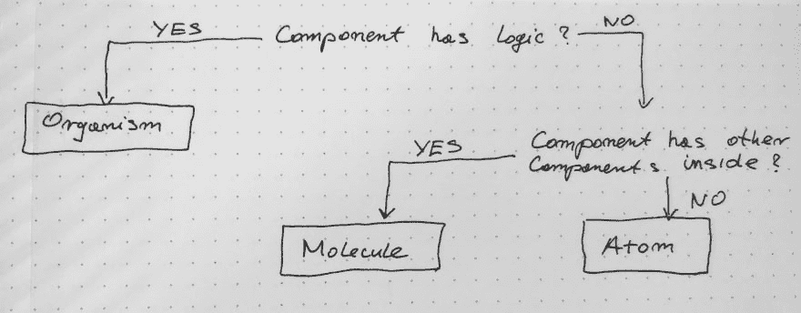

# 我如何构建一个 React 项目

> 原文：<https://dev.to/maciekchmura/how-i-structure-a-react-project-3c2i>

有许多关于如何构建 web 应用程序以及如何做出特别反应的指南。

*   基于智能/非智能组件将文件移动到文件夹中。
*   按页眉/主页面/页脚组织它们
*   还是把所有东西都扔给组件，组合成页面？？？

我从未被完全说服使用这些惯例中的任何一个。然后，大约两个月前，我开始了一个新项目。简单的技术栈:React + Express + MySQL。
在几次提交之后，我不得不将组件移动到某个地方。
经过一点点研究，我发现了一些有希望的东西。
它基于两种资源:

1.  [丹·阿布拉莫夫官方指南](http://react-file-structure.surge.sh/)
2.  布拉德·弗罗斯特的原子设计

丹给了我自由，布拉德给了我结构😅

原子设计引入了一种新的、抽象的方式来思考项目结构。组件是应用程序的构建模块。
原子、分子、有机体、模板和页面。这个概念为我们如何思考结构带来了新鲜空气。
出于我的目的，我使用了前 3 个，但我鼓励您阅读 Brad 的指南，并根据您的喜好进行调整。

我先画了一张草图:
[](https://res.cloudinary.com/practicaldev/image/fetch/s--IHiwlC8g--/c_limit%2Cf_auto%2Cfl_progressive%2Cq_auto%2Cw_880/https://thepracticaldev.s3.amazonaws.com/i/4gd0sforrkoi0g8a4gdw.png)

主旨:
3 个文件夹:原子、分子、有机体
如果组件有逻辑/状态- >把它移到有机体。
如果该组件有其他组件- >将其移动到分子中。
否则，成分就是原子。

我喜欢有机类比。它为 React 组件创建了一个心理和逻辑的盒子。如果需要，我可以为 Utils、Routes、API 等添加更多的非有机文件夹。
一个按钮会在原子中出现。
一张卡片会在分子中。
用钩子将生物体内的成分钩出来。

```
src/
  Atoms/
    Button
    ProjectName
    ...
  Molecules/
    ControlBar
    DaysList
    ...
  Organisms/
    User
    CreateUser
    ...
  Utils
    formatMonthData.js 
```

目前，我的项目没有任何问题。当我的项目增长时，我会重新评估这个概念。