# 我如何使用 Proxyman 在我的 iPhone 上查看 HTTP 请求/响应？

> 原文：<https://dev.to/renee/how-i-use-proxyman-to-see-http-requests-responses-on-my-iphone-dpc>

[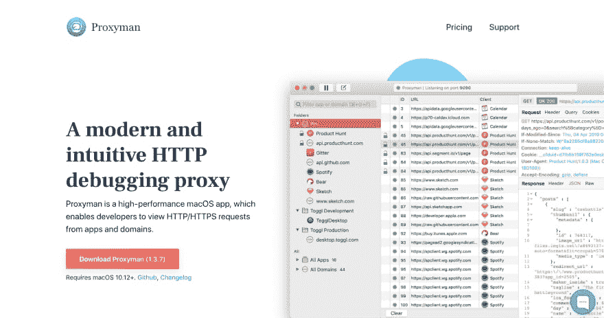](https://res.cloudinary.com/practicaldev/image/fetch/s--8hwAvzFI--/c_limit%2Cf_auto%2Cfl_progressive%2Cq_auto%2Cw_880/https://thepracticaldev.s3.amazonaws.com/i/srl970m5y5yh470h984d.png) 
上个月，我发现了一个新开发的应用，叫做 Proxyman。这是一个原生的 macOS 应用程序，其功能对于调试来说非常方便，我真的很想与他人分享。在这篇文章中，我使用该应用程序在我的设备上查看 Unsplash 应用程序的响应内容。

### 1。配置:

**1.1/下载 app**

我从它的网站[https://proxyman.io/](https://proxyman.io/)
下载了最新版本，用户界面非常干净，打开应用程序后我就能看到所有的请求

[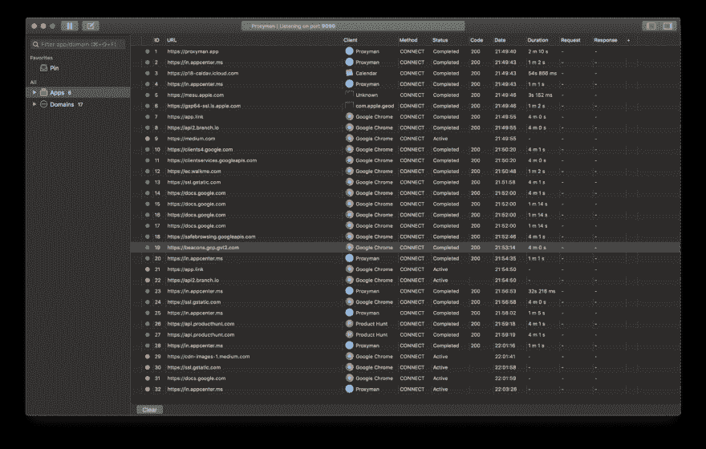](https://res.cloudinary.com/practicaldev/image/fetch/s--XWKlckY6--/c_limit%2Cf_auto%2Cfl_progressive%2Cq_auto%2Cw_880/https://thepracticaldev.s3.amazonaws.com/i/zk0i59c7u2c0zbp13bud.png)

**1.2/我的 iPhone 的设置证书**

然后转到证书->在 iPhone 设备上安装证书。会有一个指导你如何在 iPhone/ iOS 模拟器
[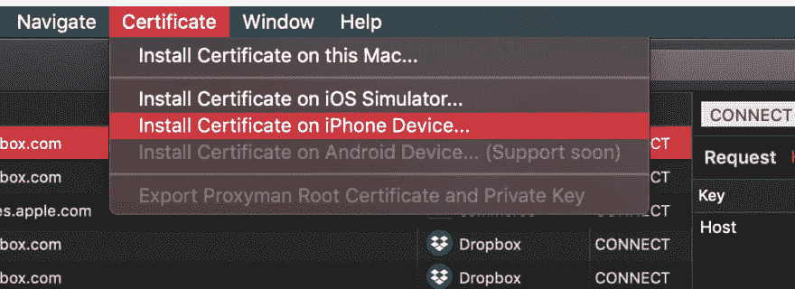](https://res.cloudinary.com/practicaldev/image/fetch/s--huRCKYxW--/c_limit%2Cf_auto%2Cfl_progressive%2Cq_auto%2Cw_880/https://thepracticaldev.s3.amazonaws.com/i/tvv0aloq1208jkyy6xkb.png) 上配置证书的说明

**1.3/配置 Wifi 指向代理人**

进入设置-> Wifi ->选择当前 Wifi ->配置代理->手动。然后我使用指南上的相同服务器和端口在我的 iPhone 上配置代理

[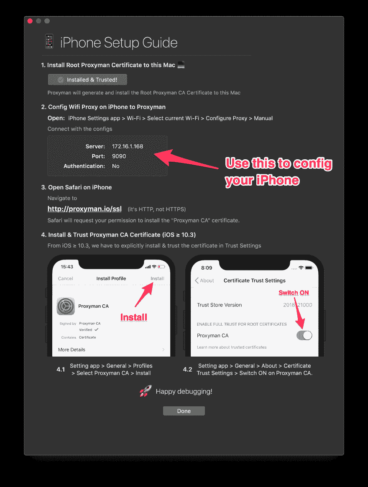](https://res.cloudinary.com/practicaldev/image/fetch/s--t18FFiT7--/c_limit%2Cf_auto%2Cfl_progressive%2Cq_auto%2Cw_880/https://thepracticaldev.s3.amazonaws.com/i/majpgvn17w3crk5iade9.png)
[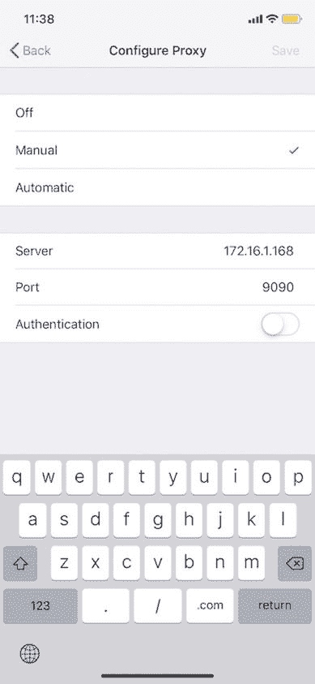T6】](https://res.cloudinary.com/practicaldev/image/fetch/s--0sqpsIKo--/c_limit%2Cf_auto%2Cfl_progressive%2Cq_auto%2Cw_880/https://thepracticaldev.s3.amazonaws.com/i/oja75xt5rxfbe1mos6rp.jpeg)

**1.4/允许安装代理人的许可**

在这一步，我在 Proxyman 应用程序上看到了来自我的设备的所有请求。但是，为了查看响应的内容，我需要安装代理人证书
[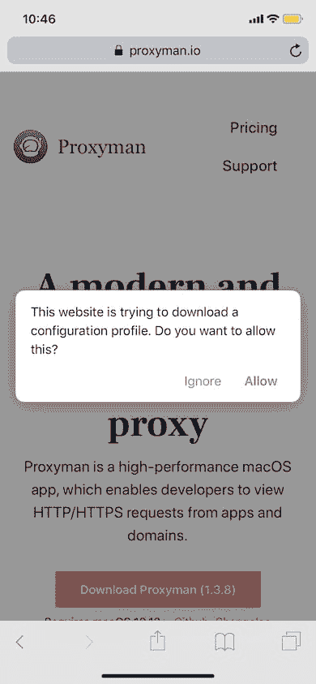](https://res.cloudinary.com/practicaldev/image/fetch/s--Hv6RlYgg--/c_limit%2Cf_auto%2Cfl_progressive%2Cq_auto%2Cw_880/https://thepracticaldev.s3.amazonaws.com/i/nsanj6krd7dk3m5knj77.png)

在我的 iPhone 上，我去 Safari->[http://proxyman.io/ssl](http://proxyman.io/ssl)->接受安装代理人证书的权限

**1.5/安装来自/ssl 的证书**

然后进入设置->通用->配置文件->选择代理人->安装

**1.6/iPhone 上的信任证书**

据说从 iOS 10.3+开始，我们需要手动信任证书。因此，最后一步是转到设置应用->通用->关于->证书信任设置->打开“对根证书启用完全信任”
[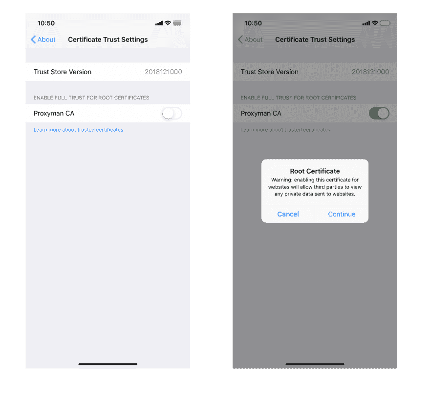](https://res.cloudinary.com/practicaldev/image/fetch/s--4uy22ilw--/c_limit%2Cf_auto%2Cfl_progressive%2Cq_auto%2Cw_880/https://thepracticaldev.s3.amazonaws.com/i/d2ovyat3ug5tqj0b0s4e.png)

你可以看到，在我配置完代理
[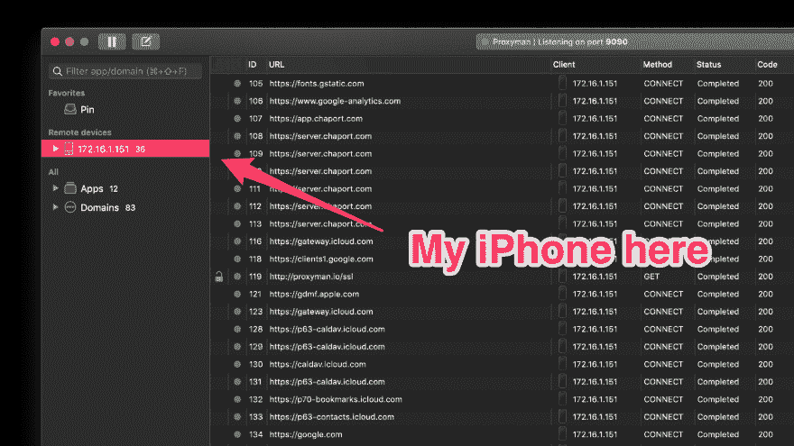](https://res.cloudinary.com/practicaldev/image/fetch/s--Pz3RDnB0--/c_limit%2Cf_auto%2Cfl_progressive%2Cq_auto%2Cw_880/https://thepracticaldev.s3.amazonaws.com/i/4rtdary8n5xz97c0jz52.png) 后，我的 iPhone 的所有请求都显示出来了

### 2。调试取消刷新的时间

好了，配置够了。是时候实际查看来自 Unsplash 应用程序的 HTTP 请求/响应了

**2.1/搜索一个域**

我用 Command+Shift+F 搜索 app Unsplash(也可以用搜索栏搜索 app)

[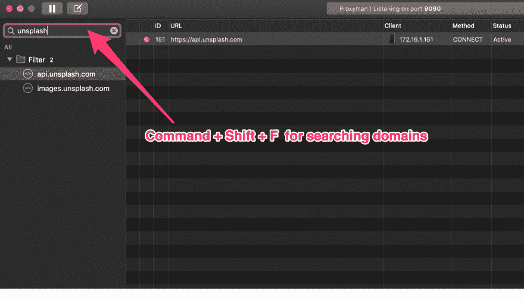](https://res.cloudinary.com/practicaldev/image/fetch/s--xEsNJ7o_--/c_limit%2Cf_auto%2Cfl_progressive%2Cq_auto%2Cw_880/https://thepracticaldev.s3.amazonaws.com/i/ddv57hyh5zla6x0hw4wf.png)

**2.2/引脚 a 域**

[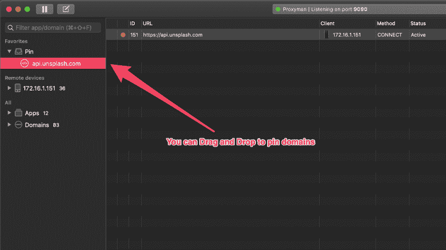](https://res.cloudinary.com/practicaldev/image/fetch/s--I8otv6Fw--/c_limit%2Cf_auto%2Cfl_progressive%2Cq_auto%2Cw_880/https://thepracticaldev.s3.amazonaws.com/i/dz4rhvna0yagags13rxb.png)
[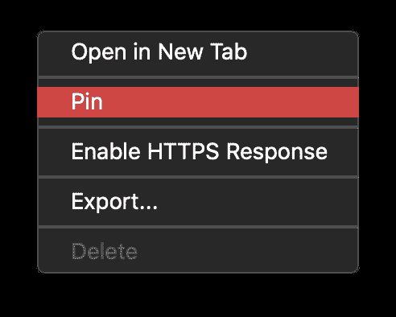T6】](https://res.cloudinary.com/practicaldev/image/fetch/s--CuJMpKxb--/c_limit%2Cf_auto%2Cfl_progressive%2Cq_auto%2Cw_880/https://thepracticaldev.s3.amazonaws.com/i/8ranlejh6ptwlccynn28.png)

这是这个应用程序有趣的特点之一。我可以将特定的域拖放到 Pin 部分。我发现组织和集中注意力非常有用，尤其是当我必须处理几个应用程序和领域时。

**2.3/参见 HTTP 内容**

如果您双击一个请求，您会在右边的面板上看到请求和响应。但是，要查看响应的内容，您需要启用域并重新加载请求。

[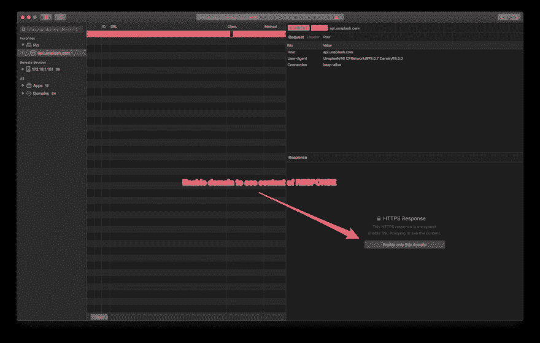](https://res.cloudinary.com/practicaldev/image/fetch/s--x-61Ra-M--/c_limit%2Cf_auto%2Cfl_progressive%2Cq_auto%2Cw_880/https://thepracticaldev.s3.amazonaws.com/i/74pzqp6ch1nw5vu4cozw.png)

**2.4/用编辑工具打开内容**

[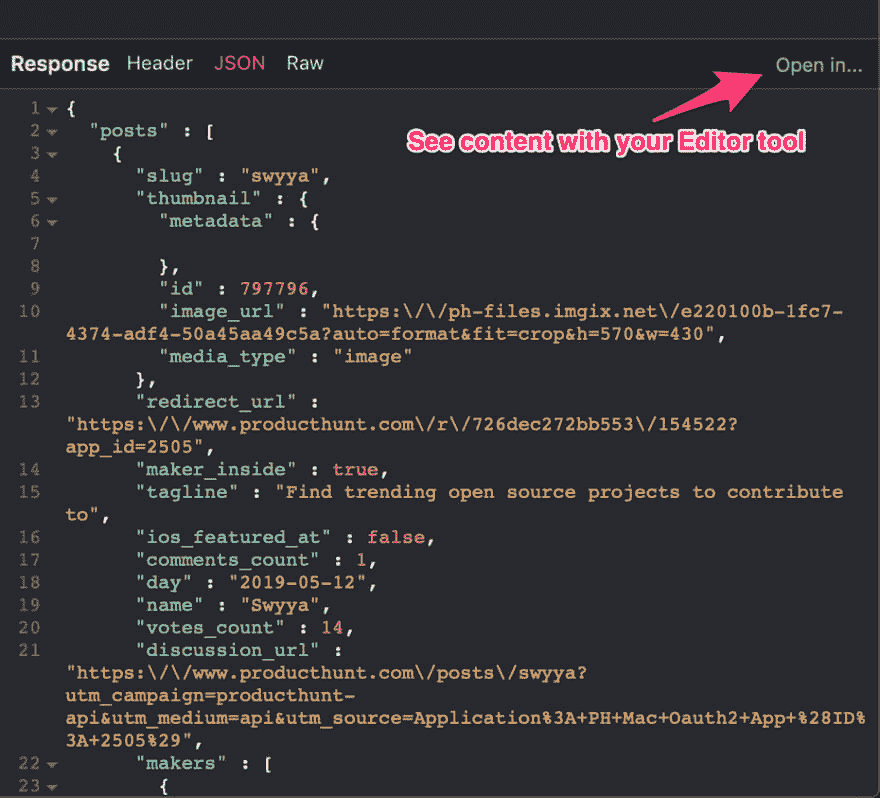](https://res.cloudinary.com/practicaldev/image/fetch/s--EzmUt3oS--/c_limit%2Cf_auto%2Cfl_progressive%2Cq_auto%2Cw_880/https://thepracticaldev.s3.amazonaws.com/i/4ez1kw0359tg37lnkegh.png)

右上角有一个小按钮。当我点击它时，应用程序会显示一些我正在使用的编辑工具。我可以打开我的回复内容进行编辑，这非常方便。
[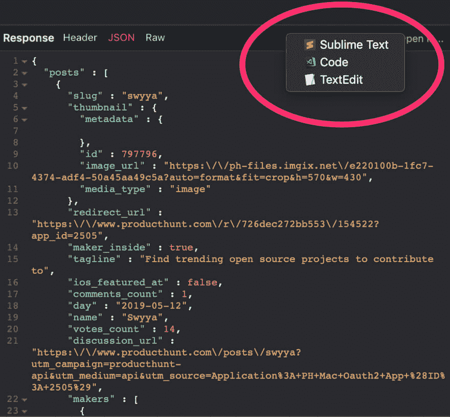T3】](https://res.cloudinary.com/practicaldev/image/fetch/s--_dvHA5mK--/c_limit%2Cf_auto%2Cfl_progressive%2Cq_auto%2Cw_880/https://thepracticaldev.s3.amazonaws.com/i/5vwotyro4jfgn45hyrdy.png)

下一步是什么？

如果您是测试人员或前端开发人员，很可能您已经熟悉了像 Charles 这样的调试工具。是一款功能强大的调试 app，但不知何故不适合我。同时，Proxyman 还没有完全开发出来，但它似乎有很多潜力。在下一篇文章中，我将比较 Charles 和 Proxyman 的一些关键特性，以及我对这两个应用的优缺点的看法。你呢？你对查尔斯和普罗西曼有什么看法？