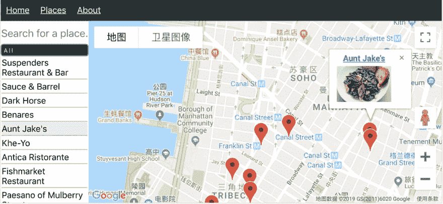
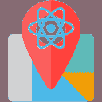

# 我如何为谷歌地图编写自己的 React 包装器

> 原文：<https://dev.to/lucifer1004/how-i-wrote-my-own-react-wrapper-for-google-map-15ei>

[](https://res.cloudinary.com/practicaldev/image/fetch/s--ljF7H-4v--/c_limit%2Cf_auto%2Cfl_progressive%2Cq_auto%2Cw_880/https://images.unsplash.com/photo-1451988336904-b1a6e8846746%3Fixlib%3Drb-1.2.1%26ixid%3DeyJhcHBfaWQiOjEyMDd9%26auto%3Dformat%26fit%3Dcrop%26w%3D1000%26q%3D60)

几个月前，当我开始 Udacity 的社区地图项目时，我首先检查了可用的图书馆。有很多选择:

*   [tomchentw/react-Google-maps](https://github.com/tomchentw/react-google-maps)
*   [谷歌地图反应/谷歌地图反应](https://github.com/google-map-react/google-map-react)
*   [fullstackreact/Google-maps-react](https://github.com/fullstackreact/google-maps-react)

然而，没有一个能满足我的要求(也有可能是我没有想出处理问题的正确方法)。我希望组件是灵活的，例如，`Marker`组件不一定要放在`Map`组件中。这种灵活性在设计布局时至关重要，在构建组件时也是如此，以免触发不必要的重新渲染。

他们所提供的(一般而言):

```
<Map>
    <Marker />
    <InfoWindow />
</Map> 
```

我想要的:

```
<Map />
<ComponentA>
    <Marker />
    <ComponentB>
        <InfoWindow />
    </ComponentB> </ComponentA> 
```

我想到我可以为谷歌地图编写自己的 React 包装器。这听起来有点大胆，因为我以前从未编写过 React 组件库。随着 Udacity 项目的截止日期越来越近，我终于下定决心自己写一个 Google 地图库，有 React hooks 和 TypeScript，还有 TDD。

尽管我没有编写过 React 组件库，但我已经编写了一个非常简单的 Vue 组件库(按照博客的说明)。我已经写了几个月的 TypeScript，并写了一个带有上下文和钩子的 React 应用程序。我已经在几个项目中使用了 TDD。这些经历给了我信心。

然而挑战确实接踵而至。我写了一些测试，但是我没有写库模拟。我设法模仿了`loadjs`，我用它来加载谷歌地图脚本。

另一个问题是钩子与功能组件一起存在，而功能组件没有实例。其他 Google Map 库都使用类组件，并实现类实例的方法来替代 Google Map 对象的方法。但是我不能这样做。最后，我选择维护一个 id-object Map 来存储对所有 Google Map 对象的引用。它运行流畅，不需要使用 React `ref`(类实例依赖于`ref`)。唯一的代价是当使用我的库时，像`Marker`、`Polygon`这样的东西需要一个唯一的`id`。

起初，我只是考虑我自己的需求，API 设计太随意了(你可以查看我最初的回购协议和回到更早的版本)。后来，我的个人项目完成了，但我知道很多事情仍然悬而未决。

##  [ lucifer1004 ](https://github.com/lucifer1004) / [抵制](https://github.com/lucifer1004/boycott)

### 一款地图应用。

<article class="markdown-body entry-content" itemprop="text">

# 抵制

这是一个 Udacity 项目。它被静态地部署在[这里](https://boycott.gabriel-wu.com) via Now。

## 在本地运行它

```
git clone https://github.com/lucifer1004/boycott
cd boycott
yarn install
yarn start
```

然后您可以在`localhost:3000`访问它

## 特征

*   使用 Yelp Fusion API 搜索地点(`cors-anywhere`用于解决 CORS 问题)
*   过滤器选项:全部/开放/高评级/低价格
*   谷歌地图 API 的使用是通过 [`@lucifer1004/react-google-map`](https://github.com/lucifer1004/react-google-map) ，这是我自己写的一个谷歌地图的 React 包装器。

</article>

[View on GitHub](https://github.com/lucifer1004/boycott)

它是一个简单的 React 应用程序，使用谷歌地图和 Yelp 实现基本的地点搜索。

[](https://res.cloudinary.com/practicaldev/image/fetch/s--XapbWhl_--/c_limit%2Cf_auto%2Cfl_progressive%2Cq_auto%2Cw_880/https://github.com/googlemap-react/googlemap-react/raw/mastimg/boycott.png)

在 Udacity 提交项目后，我继续我的图书馆。由于我个人项目的需要，我只实现了`MapBox`、`Marker`、`InfoWindow`、`HeatMap`、`Polygon`。大约有 20 多个谷歌地图组件。

当我试图实现一个新的组件时，我不得不重构整个库，这种情况发生了好几次。幸运的是，我为每个组件编写了单元测试，这些测试在重构过程中帮助很大。

我花了大约两周的空闲时间来实现:

*   其他形状:圆形、折线、矩形
*   层:自行车层、交通层、过渡层
*   搜索:搜索框，独立搜索框
*   街景:街景，独立街景
*   覆盖图:CustomControl、GroundOverlay、KmlLayer、OverlayView
*   绘图:绘图管理器

库是从`create-react-app`开始的，我在`src/lib`里用了一个单独的`package.json`来配置库，而 app 是根级`package.json`配置的。随着图书馆的发展，我觉得我应该适当地建立一个 monorepo。

重构项目结构的那一周相当艰难。我阅读了 monorepos 上的许多博客和帖子，但仍然不能如我所愿地让一切正常运行。我放弃过一次，第二次差点又放弃了，但我成功了。

有了`lerna`和`yarn workspaces`，以及一个自定义的符号链接，我终于对新的结构感到满意了。通过同时运行`yarn dev:lib`和`yarn dev:CRA`，示例 CRA 应用程序将在我每次修改库代码时重新加载。

我真的很感激我在一个月前决定写自己的包装库，否则我不会学到这么多(我将在系列中写更多的帖子来详细谈论我学到的东西)。我会努力进一步改善我的图书馆。还没有在真实项目中测试过。与现有的库相比，缺少一些功能。还有一些已知的问题或限制。

我准备好了。

* * *

最近，我把这个项目转移到了一个独立的组织。下面是回购。

[](https://res.cloudinary.com/practicaldev/image/fetch/s--XtIqs6Mo--/c_limit%2Cf_auto%2Cfl_progressive%2Cq_auto%2Cw_880/https://avatars1.githubusercontent.com/u/47935106%3Fs%3D200%26v%3D4)

##  [谷歌地图-反应](https://github.com/googlemap-react) / [谷歌地图-反应](https://github.com/googlemap-react/googlemap-react)

### React 项目更容易的谷歌地图集成。

<article class="markdown-body entry-content" itemprop="text">

# googlemap-react

[](https://www.npmjs.com/package/@googlemap-react/core)[](https://opensource.org/licenses/MIT)[](https://codecov.io/gh/googlemap-react/googlemap-react)[T11】](https://codebeat.co/projects/github-com-googlemap-react-googlemap-react-master)

[](https://spectrum.chat/googlemap-react)

React 项目更容易的谷歌地图集成。

[阅读文档](https://doc.googlemap-react.com)

## 为什么是新包装

已经有了类似的包，如[tomchentw/react-Google-maps](https://github.com/tomchentw/react-google-maps)[Google-map-react/Google-map-react](https://github.com/google-map-react/google-map-react)[fullstackreact/Google-maps-react](https://github.com/fullstackreact/google-maps-react)那么为什么还要写一个新的库呢？

其目的是为 React 用户提供一个更容易使用的谷歌地图库，通过`React`的最新功能(`React >= 16.8.0`是必需的)和`TypeScript`来实现。

## 有什么不同

*   组件位置是自由的(通常)
*   直接访问谷歌地图对象
*   更加统一的 API
*   类型安全

## 用法示例

### 先决条件

*   npm 或纱线

```
yarn add @googlemap-react/core
# Or you can use
npm install --save @googlemap-react/core
```

*   一个有效的 Google Map API 键(替换下面代码片段中的占位符)

```
import {
  GoogleMapProvider
  HeatMap,
  InfoWindow,
  MapBox,
  Marker,
  Polygon,
} from '@lucifer1004/react-google-map'

// In your component
return (
  <GoogleMapProvider>
    <MapBox
      apiKey="YOUR_GOOGLE_MAP_API_KEY
```

…</article>

[View on GitHub](https://github.com/googlemap-react/googlemap-react)

欢迎任何意见或建议！如果你想用我的图书馆，遇到任何问题，尽管问我！

如果你想加入，那太好了！