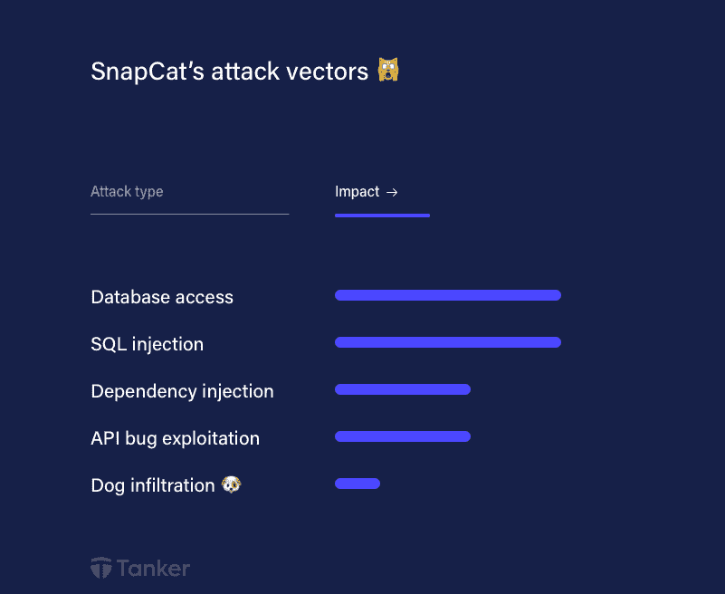
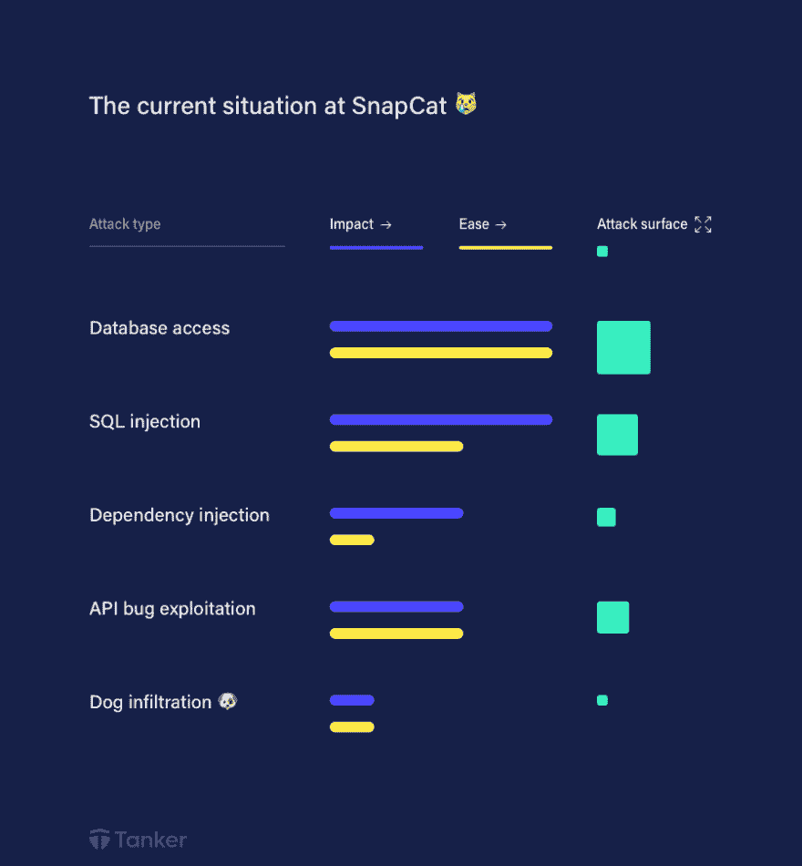
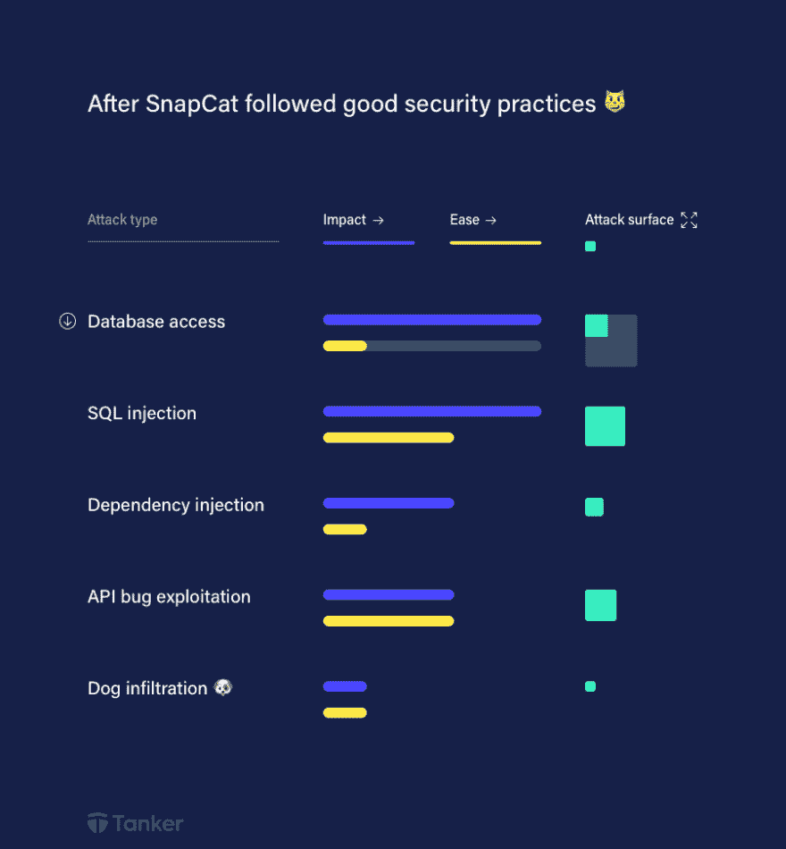
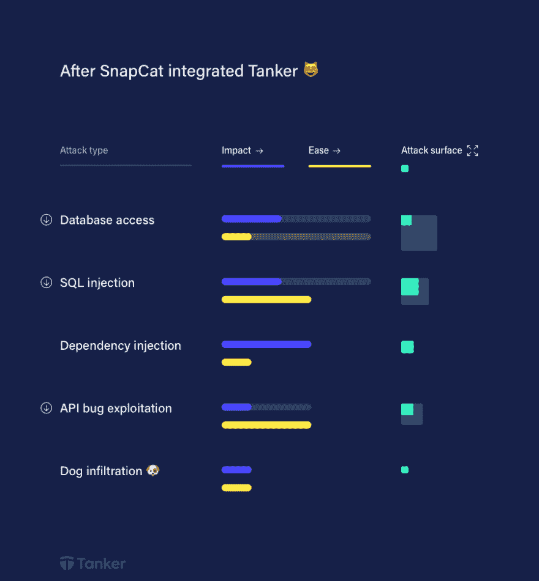

# 你的猫咪照片有多安全？

> 原文：<https://dev.to/tanker/how-safe-are-your-cat-pics-4bb9>

互联网就像狂野的西部。黑帽子是强盗，白帽子是赏金猎人。数据库是新的银行，数据是这个时代的黄金。然而，银行周围总是有坚实牢固的安全措施，从金库到警卫和栅栏。

互联网应用有时在这一领域缺乏，正如我们在过去几年中观察到的越来越频繁的数据泄露所显示的那样。

## 量化安全

让我们考虑一个简单的应用程序 SnapCat，它允许用户分享他们的猫图片。SnapCat 有一个服务器、一个数据库和一个带有登录表单的移动应用程序。SnapCat 的制造商显然很关心安全问题，希望确保用户的猫照片是安全的。

SnapCat 如何衡量他们的应用程序的安全级别？

评估软件环境安全级别的一种方法是测量它的攻击面。这通常由安全专家来完成，但是基本概念理解起来既简单又重要。

测量攻击面的第一步是列出所有的攻击媒介。攻击媒介是攻击者从环境中窃取数据的途径。

snapchat 列出了一些攻击媒介

*   通过猜测管理员凭证或使用 SQL 注入直接访问数据库

*   通过利用 API 漏洞欺骗服务器授予访问数据的权限

*   通过感染应用程序使用的库来直接攻击应用程序[，就像这里发生的一样](https://arstechnica.com/information-technology/2016/03/rage-quit-coder-unpublished-17-lines-of-javascript-and-broke-the-internet/)

*   让 SnapCat 的办公室被一名为头号竞争对手 DogPix 工作的卧底特工渗透

虽然明显简化了，但这些攻击向量是基于云的应用程序的可信示例。现实生活中的攻击媒介分析可以列出数百种。

下一步是，对于每个攻击媒介，评估一次成功攻击的影响。

*   获得对数据库的访问(通过直接访问或 SQL 注入)具有最大的潜在影响，因为攻击者可以一次访问世界上所有的猫的照片。

*   利用 API 漏洞影响较小，因为提取相同数量的数据需要更多时间。感染应用程序的库也会产生类似的影响。

*   最后，来自 DogPix 的办公室渗透几乎没有影响，因为数据不存储在办公室中。愚蠢的狗！

## 测量攻击面

接下来，我们要评估每次攻击的难度(或者说相对容易程度)。这是通过考虑每个攻击媒介的现有检查和对抗措施来实现的。

为此，SnapCat 的安全专家分析了每一种攻击媒介。结果如下:

*   他们的数据库使用默认凭证。这使得访问它变得非常容易。

*   SQL 注入和 API 错误更难利用，SnapCat 等当前的开发实践确保了对这些攻击的良好防御。

*   感染依赖关系来针对特定的应用程序是非常困难的。

*   最后，对于一只卧底狗来说，潜入 SnapCat 的办公室是非常困难的。

完成这项工作后，我们可以绘制 SnapCat 的攻击面:

## 减少攻击面

SnapCat 现在对其应用程序引发的风险及其各自的影响有了清晰的认识。是采取行动的时候了。目标是尽可能减少攻击面。

有两种方法可以减少每个攻击媒介的攻击面:要么加大攻击难度，要么降低其影响。

大多数时候，让攻击变得更加困难是遵循良好安全实践的结果。减少攻击的影响可以通过减少存储的数据量、将部分数据存储在不同的位置或加密来实现。

SnapCat 的第一步是更改数据库凭证，并实现更好的密码策略，使猜测重要凭证变得更加困难。

正如我们所看到的，这已经大大减少了“数据库访问”攻击面，但为了大幅减少每个可能的攻击的影响，SnapCat 选择在用户设备上加密所有 Cat 图片，甚至在它们到达服务器之前。为此，他们开始使用[油轮](https://tanker.io)。

这确保了最强的数据保护，使任何数据库或服务器攻击几乎没有用。每一张猫图片都是用自己的密钥独立加密的，只有发送者和接收者才能解密。

因此，SnapCat 更新后的攻击面现在看起来像这样:

SnapCat 的团队现在可以集中所有精力改进他们的优秀产品。或许小睡一会儿。📦

在 [https://www.tanker.io](https://www.tanker.io) 了解如何将 Tanker 集成到您的应用程序中。

* * *

PS:本文由[Alois Jobard](http://alois-jobard.fr/)原创，发表在[油轮的媒介](https://medium.com/tanker-blog/how-safe-are-your-cat-pics-434317652e4b)上。由于您自己可能不在 Medium 上，我们在这里复制了它，以便您有机会在您的通知源中看到它。