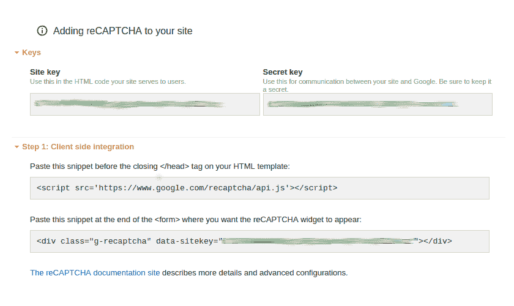

# 如何向窗体添加 reCaptcha

> 原文：<https://dev.to/uf4no/how-to-add-recaptcha-to-a-form-3kmi>

*本文原载于[我的网站](http://www.antonioufano.com)。如果你喜欢，你可能会在[我的博客](http://www.antonioufano.com/blog)* 中找到有趣的往期文章

* * *

在网站中拥有表单最令人讨厌的事情之一就是看到它被垃圾邮件机器人盯上。在这篇文章中，我将解释如何摆脱它们(或者至少是大部分)...)通过在我们的表单中集成 Google 的 reCaptcha。

***注意:**对于这个例子，我将使用一个 Laravel 应用程序，但我将解释 reCaptcha 如何工作以及如何集成它的基本概念，因此，如果你使用一个不同的框架，你应该能够跟上。*

We'll just need to follow a few simple steps:

*   在 reCaptcha 中注册您的站点，并获得您的站点和密钥。
*   将密钥添加到我们应用程序的环境中(。Laravel)中的 env 文件。
*   在我们的页面表单中包含 reCaptcha 输入。
*   在我们的后端添加 reCaptcha 验证(Laravel 中的一个控制器方法)。

### 注册您的网站

注册你的网站来使用 reCaptcha 是非常简单的。只需访问[此链接](https://www.google.com/recaptcha/admin "recaptcha admin")(使用您的 Google 帐户登录)并填写表格。在标签中，放一些容易识别你的站点的东西，在 reCaptcha 类型中，我选择了 v2 复选框(注意，根据类型的不同，集成是不同的)。

注册后，您将看到一个屏幕，显示您的唯一密钥和客户端/服务器集成的详细信息:

[](https://res.cloudinary.com/practicaldev/image/fetch/s--IwAx96qN--/c_limit%2Cf_auto%2Cfl_progressive%2Cq_auto%2Cw_880/http://www.antonioufano.com/image_uploads/reCaptcha_keys.png)

这就是我们从 reCaptcha 方面要做的一切。现在我们只需要将它集成到我们的应用程序中。

### 向应用程序环境添加密钥

我们需要使用我们的客户端和服务器密钥来从我们的应用程序的前端和后端调用 reCaptcha API，因此为了让它们在我们的整个应用程序中可用，我们可以添加 as 环境变量，或者，因为我的应用程序是在 Laravel 中构建的，所以我将使用。env 文件，将它们添加到它的末尾:

```
// .env file
GOOGLE_RECAPTCHA_KEY=YOUR_RECAPTCHA_SITE_KEY
GOOGLE_RECAPTCHA_SECRET=YOUR_RECAPTCHA_SECRET_KEY 
```

In JavaScript you can load them as environment variables and access them with ***process.env.VARIABLE_NAME***.

### 在表单中添加 reCaptcha 输入

下一步是使用 reCaptcha 仪表板中的两个代码片段在我们的表单中包含 reCaptcha 复选框。在这个例子中，我有一个带有几个输入(姓名、电子邮件和文本)的联系人表单，它通过 POST 请求将所有有效负载发送到一个名为“contact.send”的路由，该路由由控制器处理。看起来是这样的: