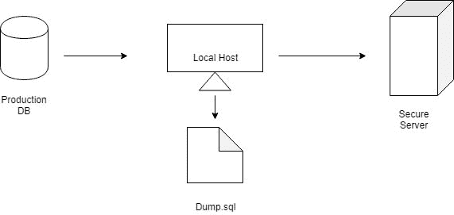

# 如何自动转储 SQL 数据库

> 原文：<https://dev.to/obbap/how-to-automate-dumping-for-sql-databases-im4>

# **简介**😸

#### T3】

由于生产中出现问题的可能性越来越大，冗余的必要性怎么强调都不为过。这让我们创建了一个简单的数据库自动备份流程。像 AWS 这样的托管和部署服务已经提供了这一点，但我们将为较小的项目做一点小小的改动。

# **管道**👽

#### T3】

对于这个例子，我们将使用一个远程 psql(postgres)数据库和一个 linux 终端。Windows 操作系统上的用户可以运行 Windows Linux 子系统(WSL)。

[](https://res.cloudinary.com/practicaldev/image/fetch/s--Vmrpl4zy--/c_limit%2Cf_auto%2Cfl_progressive%2Cq_auto%2Cw_880/https://thepracticaldev.s3.amazonaws.com/i/6ewgqhlkky2ohj5mu2ev.jpg)

#### T3】

因此，我们将为我们的活动数据库创建一个转储，并存储 ***dump.sql*** 文件，然后显然，出于安全目的，我们不希望它在我们的本地主机上，所以我们最终将转储传输到一个安全的服务器。

#### T3】

然后，我们将这个脚本分配给一个 cron 作业，然后我们的转储将在我们选择的日期创建。

# **Automate.sh**

#### T3】

处理这个问题的 bash 脚本将被命名为‘automate . sh’。让我们写剧本吧。

```
#!/bin/bash
#Filename: Automate.sh
#Description: Create a dump of my PSQL DB

pg_dump -U 'YOUR USERNAME' -h 'YOUR HOSTNAME' -d 'DATABASE NAME' > dump.sql 
```

#### T3】

使用***‘pg _ dump’***工具，我们可以轻松地创建数据库的转储。当这段代码运行时，会出现一个密码提示，然后我们可以输入数据库的密码。手动输入密码违背了自动化的目的，所以我们可以附加一个 ***' - no-password'*** 标志来阻止提示出现，然后我们可以在运行脚本时传递密码。

#### T3】

我们的 **Automate.sh** 文件现在应该是这样的

```
pg_dump -U 'YOUR USERNAME' -h 'YOUR HOSTNAME' -d 'DATABASE NAME' --no-password > dump.sql 
```

#### T3】

然后我们可以像这样运行脚本:

```
root@L: PGPASSWORD='YOUR_PASSWORD' ./Automate.sh 
```

#### T3】

在调度 cron 作业时，我们还可以将密码添加到环境变量中。创建转储文件后，我们希望将该文件发送到安全的服务器，例如 AWS 实例，然后我们可以从本地主机中删除该文件。

### T3】

我们可以使用 ***scp*** (安全复制)工具将文件传输到远程服务器，如果我们没有它，我们可以快速安装它

```
sudo apt-get install openssh-client 
```

#### T3】

我们的 **Automate.sh** 文件现在应该是这样的:

```
#!/bin/bash
#Filename: Automate.sh
#Description: Create a dump of my PSQL DB

pg_dump -U 'YOUR USERNAME' -h 'YOUR HOSTNAME' -d 'DATABASE NAME' > dump.sql

#Transfer file to server
scp -i "PRIVATE_KEY.pem" dump.sql  'SERVER IP'

#Delete file from localhost
if [ $? -eq 0 ];
then echo "Backup successful!" && rm dump.sql
else echo "Oops!"
fi 
```

#### T3】

为了确保您的私钥不会被意外覆盖，我们可以将权限设置为 400，然后我们还可以设置 dump.sql 文件的权限，使其可写和可读。

```
root@L: chmod 400 'PRIVATE_KEY.pem'
root@L: chmod 777 dump.sql 
```

# 与克朗✈️一起调度

### T3】

最后，我们可以将作业设置为在每天上午 12:59 运行。

```
root@L: crontab <<EOF > PGPASSWORD='YOUR_DB_PASSWORD'
> 59 12 * * * ./Automate.sh
> EOF 
```

#### T3】

完成这项工作的其他方法是创建一个. cron 文件或使用 ***crontab -e*** 命令。

```
root@L: crontab -e 
```

#### T3】

这将打开一个允许您调度 cron 的文件。