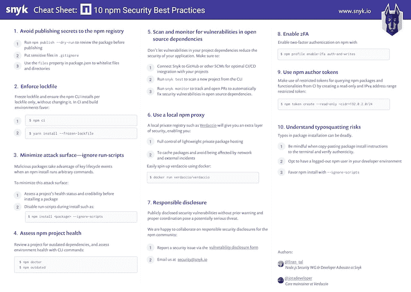

# 如何避免向 npm 注册表泄露机密

> 原文：<https://dev.to/lirantal/how-to-avoid-leaking-secrets-to-the-npm-registry-2jip>

对于前端和后端开发人员来说，将 npm 安全性考虑在内非常重要。泄露秘密是一个很容易发生的错误，在工作中或者当你在开源项目中工作的时候。

# 避免向 npm 注册表泄露机密

无论您是在使用 API 密钥、密码还是其他秘密，它们都很容易泄露到源代码管理中，甚至是公共 npm 注册表上的已发布包中。

您可能在工作目录中的指定文件中有秘密，比如应该添加到`.gitignore`中的`.env`，以避免提交给 SCM，但是当您从项目目录中发布 npm 包时会发生什么呢？

npm CLI 将项目打包到 tar 归档文件(tarball)中，以便将其推送到注册表中。以下标准决定将哪些文件和目录添加到 tarball 中:

*   如果有一个`.gitignore`或`.npmignore`文件，则在准备发布包时，该文件的内容将被用作忽略模式。
*   如果两个忽略文件都存在，则不在`.npmignore`中的所有内容都会发布到注册表中。这种情况是常见的混淆来源，也是可能导致泄密的问题。开发人员可能最终更新了`.gitignore`文件，但也忘记了更新`.npmignore`，这可能导致一个潜在的敏感文件没有被推送到源代码控制，但仍然包含在 npm 包中。

要采用的另一个好的实践是利用`package.json`中的`files`属性，它作为白名单工作，并指定要包含在要创建和安装的包中的文件阵列(而忽略文件作为黑名单)。

属性和一个忽略文件可以一起使用来决定哪些文件应该明确地包含在包中，哪些应该从包中排除。但是请注意，当两者都使用时，`package.json`中的`files`属性优先于忽略文件。

发布程序包时，npm CLI 将逐字显示正在创建的归档文件。要格外小心，在发布命令中添加一个`--dry-run`参数，以便首先检查 tarball 是如何创建的，而不需要将它发布到注册表中。

2019 年 1 月，npm 在他们的博客上分享说，他们添加了一个[机制，如果他们检测到一个令牌已经与一个包一起发布，就会自动撤销这个令牌](https://blog.npmjs.org/post/182015409750/automated-token-revocation-for-when-you)。

-

我还在博客中介绍了一个完整的 [10 npm 安全最佳实践](https://snyk.io/blog/ten-npm-security-best-practices/),你应该在帖子中采用，其中包括一个高分辨率的可打印 PDF，如下图所示。

感谢阅读，也感谢 Verdaccio 团队的 Juan Picado 和我一起工作。[看看这个](https://snyk.io/blog/ten-npm-security-best-practices/)

