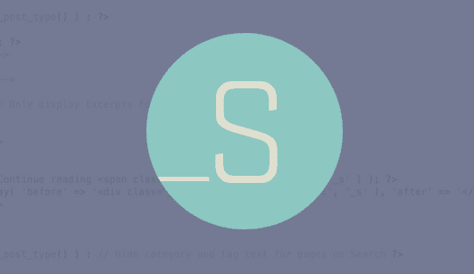

# 如何用 Wordpress 和 Gatsby.js 创建博客——第 1 部分

> 原文：<https://dev.to/iam_timsmith/how-to-build-a-blog-with-wordpress-and-gatsby-js-part-1-4f9e>

> 注意:这是关于 Gatsby.js 和 WordPress 的系列文章的第一部分。你可以在这里找到第二部。

想知道如何在 WordPress 上使用 Gatsby js 吗？这篇文章将涵盖你需要知道的关于让 WordPress 为 Gatsby 站点做好准备的一切。

在之前的一篇文章中，我们谈到了使用 React js 来构建一个 WordPress 网站的前端。我们讨论了实现这一点的简单设置，但也提到了这样做的一些缺点。

一个这样的缺点是当试图为 SEO 排名时面临的困难，因为搜索引擎爬虫很难索引加载到 React 中的信息。我简单提到过有很多方法可以解决这个问题，其中之一就是 [Gatsby.js](https://www.gatsbyjs.org/) 。

在这一系列的博客文章中，我们将讨论如何用 WordPress 后端构建一个 Gatsby js 站点。该设置的目的是允许非开发人员用户在他们的网站上进行更改，同时允许开发人员使用快速、现代和令人愉快的工具进行构建。

## 到底为什么要用盖茨比 js 搭配 WordPress？

当我发表上一篇关于在 WordPress 中使用 React js 的文章时，一些人问为什么有人会这样做？

在 React js 中创建一个单独的前端有几个好处:

首先，它真的允许开发者进行大量的定制来选择工具，这些工具将 a)使站点受益最多，b)创造一个愉快的开发体验。老实说，作为开发人员，我们不都在寻求更好的开发体验吗？

第二，我相信外挂是一把双刃剑。它们允许一些很酷的功能，这些功能对于非编码人员来说是不存在的，但是人们对它们非常满意，并开始使用它们。我曾经见过一次激活超过 60 个插件的网站，他们想知道为什么他们的网站这么慢！拥有 60 个不同的插件可能意味着发送大量的 http 请求，因为每个插件都在加载一个新的库。使用一个独立的前端意味着开发者可以控制这一切。这确实意味着客户将不得不付费进行一些更改，但同时它将确保网站保持优化，并且开发者可以在不添加一堆不必要的垃圾的情况下进行更改。

第三，我见过这样的情况，开发人员和设计人员为客户创建了一个令人惊叹的网站，然后客户决定开始尝试将字体大小从 12px 更改为 14px，最终导致整个网站瘫痪。这是一个极端的例子，但肯定会发生。如果前端是一个完全独立的实体，那么客户端就没有这样做的能力。

最后，WordPress 驱动了大约 1/3 的互联网。这意味着有很多人知道如何判断一个网站是否是 WordPress 网站，这样他们就可以黑掉它并窃取信息。他们可以编写机器人来检查网站的各种信息，并确定它是否是一个 WordPress 网站。使用类似 Gatsby js 的东西的好处是，它在构建时创建静态文件，并为静态 html 服务，所以用户和机器人永远不会知道有一个 WordPress 站点管理内容。

## 什么是盖茨比 js？

既然我们已经讨论了为什么使用这样的设置是有益的，那么让我们来讨论什么是 Gatsby.js。

根据他们的网站，“Gatsby 是一个基于 React 的免费开源框架，帮助开发人员构建极快的网站和应用程序”。换句话说，它允许你使用 React 和任何你想要的内容源来开发一个网站。然后在构建时，它从指定的来源获取所有数据，并将您的站点转换成一堆静态 html 文件，这些文件针对性能进行了优化。

事实上，[我的作品集网站](https://www.iamtimsmith.com)是用 Gatsby 和 markdown 文件构建的。这是一个在 React 中构建高性能网站的好方法，不用担心爬虫会索引你的站点。此外，它还有一些非常棒的文档和社区。

现在让我们言归正传...

## 设置 WordPress

这篇文章假设你至少对 WordPress 有初步的了解。如果你从未使用过它，你可以看看我的建立 WordPress 网站的快速指南。

## 关于 WordPress 作为 CMS 的一点看法

Wordpress 是一个使用 PHP 和 MySQL 构建的内容管理系统。通常在构建一个 WordPress 站点时，我们会构建一个主题，这个主题本质上充当了内容的“皮肤”。因为我们使用 Gatsby 来构建前端，所以我们不会使用这个功能。

正如我在另一篇博文中提到的，WordPress 公开了 REST apis，可以用来为 React 应用程序获取数据。这里将使用相同的原则，尽管我们将添加一些东西来改进 REST api，使其更加灵活。

我也喜欢在子域使用 WordPress，比如`admin.example.com`，这样它就完全与实际的站点分开了。

## WordPress 主题

因为我们不担心网站在 WordPress 中的外观，所以我们使用的主题并不重要。我们在主题中真正需要的两个文件是用于告诉 WordPress 关于我们主题的信息的`style.css`文件和用于创建菜单、创建自定义内容类型、创建默认高级自定义字段等的`functions.php`文件。稍后，我们可以为页面模板的主题添加更多的文件，但这完全是可选的。

当建立 WordPress 网站时，我通常坚持使用[下划线](https://underscores.me/)主题，所以我们今天将使用它作为开始，因为它已经有了很多现成的东西。

## WordPress 插件

我知道我之前在我的 soap box 上提到过使用一堆插件，一般来说我并不太喜欢它们。有几个插件可以让我们的开发者生活变得更轻松。

### 高级自定义字段

我想提到的第一个插件是[高级定制字段](https://www.advancedcustomfields.com/)，或 ACF。这可能是我一直以来最喜欢的插件之一，因为它允许我们为任何帖子类型或页面创建自定义字段。我们可以覆盖默认值。我们可以为用户创建任意数量的字段，从 WYSIWYG 编辑器和日期选择器(免费)到图库和重复字段(专业)。有了这个工具，我们可以真正地定制网站，正是我们的客户需要的。

### ACF 到 REST API

另一个与 ACF 携手工作的插件叫做 [ACF to REST API](https://github.com/airesvsg/acf-to-rest-api) 。我打赌你已经猜到它是干什么的了。它向 REST api 公开了自定义字段中的数据，因此我们可以在 Gatsby js 站点中使用它。

### WP API 菜单

WordPress 的一个伟大的功能是让用户能够轻松地为他们的网站创建和更新菜单。如果我们将菜单硬编码到我们的 Gatsby 站点中，就为我们的用户去除了这种能力。为了让他们更灵活，我们可以安装 [WP API 菜单](https://github.com/unfulvio/wp-api-menus)插件来为菜单项创建 REST 路径。请注意:根据 [gatsby-source-wordpress 文档](https://github.com/gatsbyjs/gatsby/tree/master/packages/gatsby-source-wordpress)，它必须是这个版本的插件，而不是更新的版本。新版本将无法工作。

### WP 触发 Netlify 构建

当我建立一个 Gatsby 网站时，我喜欢使用 Netlify 来处理站点的部署。每当一个新的提交被推送到或者合并到存储库的主分支时，Netlify 都会重建，但是当有人更新他们的 WordPress 站点时呢？

Netlify 有能力创建 webhooks，我们可以抓住它说，“嘿，有新内容，所以你需要重建”。我构建了 [WP Trigger Netlify Build](https://github.com/iamtimsmith/wp-trigger-netlify-build) 来让它非常容易与 WordPress 集成。只需输入必要的信息，它就会告诉 Netlify 在发生变化时进行重建。它甚至在仪表板上显示一个带有构建状态的徽章。

## 我们有了主题和插件，现在呢？

不要太反高潮，但是除了创建内容，WordPress 方面真的没有太多的事情可做。这些插件和主题将会展示我们构建盖茨比 js 博客所需要的一切。

也就是说，如果我们为我们的博客创建自定义内容类型，我们将需要一种在 ACF 中区分它们的方法。创建一个自定义页面模板将服务于这个目的，所以我们可以在页面模板上过滤，以显示自定义字段。我们还可以使用页面模板来过滤我们的 Gatsby 项目，以确保我们接收到给定页面所需的字段。

如果你有任何问题，你可以在推特上给我打电话 [@iam_timsmith](https://twitter.com/iam_timsmith) ！

在[如何用 Wordpress 和 Gatsby.js 建立博客-第二部分](https://www.iamtimsmith.com/blog/how-to-build-a-blog-with-wordpress-and-gatsby-part-2)中再见！