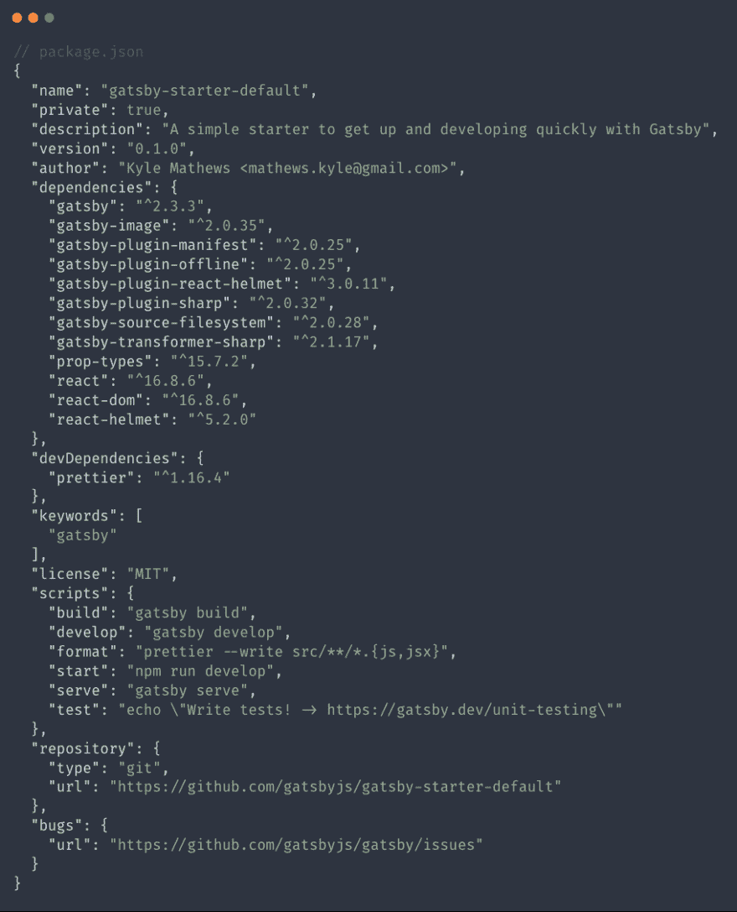
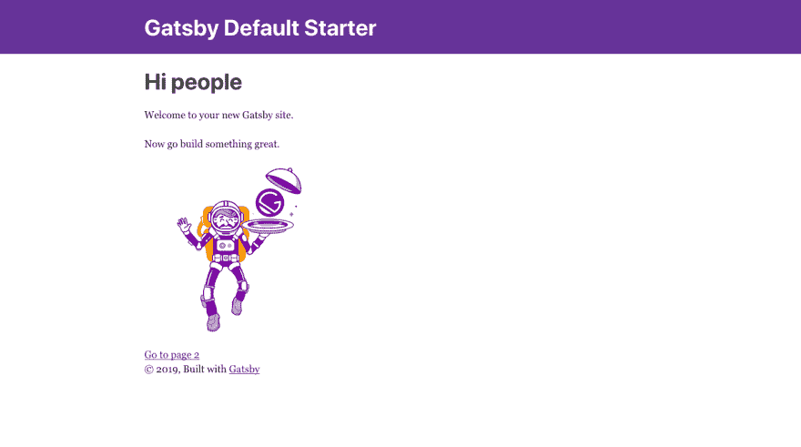
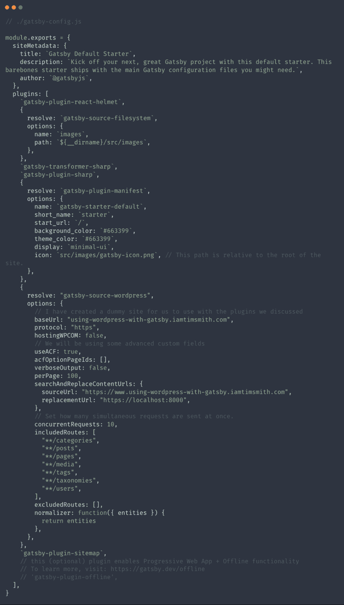
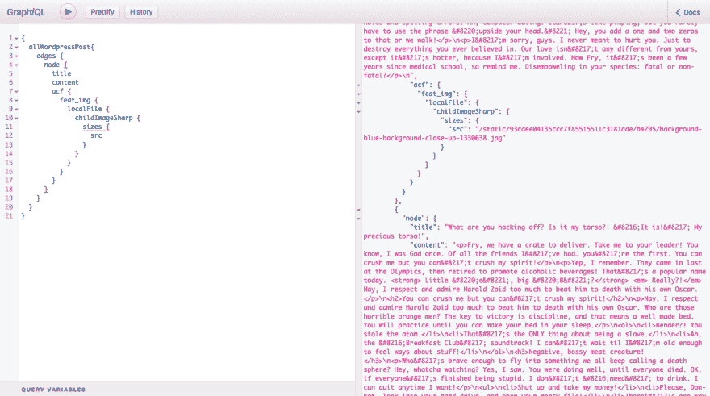
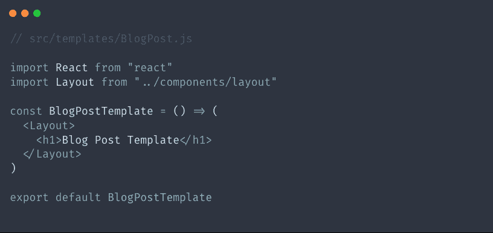
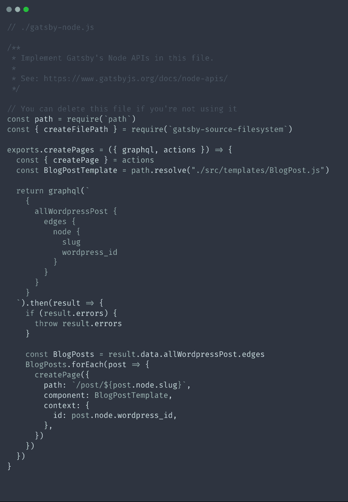
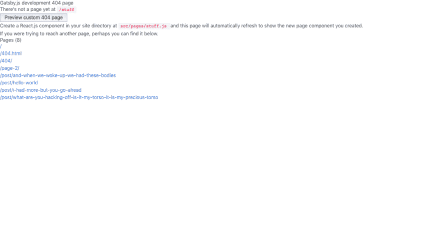
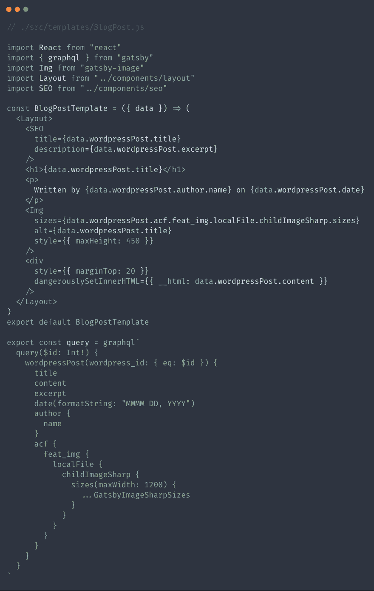
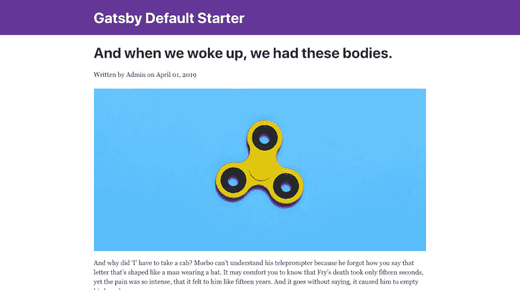

# 如何用 Wordpress 和 Gatsby.js 创建博客——第 2 部分

> 原文：<https://dev.to/iam_timsmith/how-to-build-a-blog-with-wordpress-and-gatsby-js-part-2-5hcp>

> 注意:这是关于 Gatsby.js 和 WordPress 的系列文章的第二部分。你可以在这里找到第一部分。

在上一篇文章中，我们介绍了如何设置用于 Gatsby 的 [WordPress。今天我们将讨论如何将 WordPress 中的数据导入 Gatsby 并构建页面。](https://www.iamtimsmith.com/blog/how-to-build-a-blog-with-wordpress-and-gatsby-part-1)

我已经为我们建立了一个 WordPress 站点，可以使用上一篇文章中提到的插件以及一些虚拟内容。如果你好奇，我最喜欢的 lorem 生成器是 [Fillerama](http://fillerama.io/) ，它提供来自 Futurama、Monty Python、Star Wars 等的随机内容。这就是内容的来源。

## 盖茨比 js 首发

盖茨比的一个好处是起步项目。这些对于大多数应用程序和设置都是可用的，包括 WordPress，尽管我们今天不会使用它。我们将使用初始默认设置，这样我们就可以自己配置一切。

将来，看看各种各样的入门产品，看看是否有一种能满足你的需求，这可能是有益的。这可以节省大量的时间，并使我们能够直接进入开发部分，而不必担心配置。

### 盖茨比默认首发

在进入代码之前，我们先来说说[盖茨比启动器默认](https://github.com/gatsbyjs/gatsby-starter-default)。这个项目是默认的(显然)项目，当我们用 cli 创建一个新的 gatsby 项目时，将会构建这个项目。它附带了一些插件，但不太多，所以它对定制开放。

在我们深入研究项目文件之前，让我们创建我们的项目。首先，我们需要用下面的代码安装 gatsby-cli 工具:

一旦安装完成，我们就可以实际创建我们的项目了。导航到您希望项目文件夹所在的目录，并运行以下命令:

现在我们已经创建了我们的项目，让我们看看里面。我们将看到一个`src`文件夹和几个文件。下面是这些功能的一个小分类:

*   **src/** :存放 React js 项目的目录
*   **。gitignore** :告诉什么不应该在 git 提交中被捕获
*   **。prettierrc** :确定代码编辑器中的样式(制表符、引号等)
*   **许可证**:麻省理工学院基本许可证
*   README.md :带使用说明的降价文件
*   **Gatsby-Browser . js**:Gatsby 浏览器 API 的东西在这里。全球风格的电话也在这里
*   gatsby-config.js :我们项目的配置，包括元数据和插件
*   **gatsby-node.js** :我们告诉 gatsby 使用提供的数据从模板构建页面
*   **gatsby-ssr.js** : Gatsby 服务器端渲染 API 在这里
*   **package.json** :保存定制脚本、依赖信息等的文件

这些文件将出现在我们使用的所有 Gatsby starters 中，因此值得我们花时间对每个文件至少有一个基本的了解。让我们来看看默认情况下我们有哪些依赖项和插件。打开`package.json`文件，向下滚动到依赖项。这将告诉我们已经有哪些包。我的看起来像这样:

您可以看到已经安装了几个依赖项。我只讲其中的几个。Gatsby-Image 创建了一个类似于 Medium 的效果，也允许我们使用响应图像并优化我们的站点。Gatsby-Transformer-Sharp 创建响应性和优化的图像，然后允许我们通过 GraphQL 查询这些图像。我们也有 Gatsby-Source-Filesystem，可以用来获取内容的降价文件，但是我们用 WordPress 代替。我想提到的最后一个包是 Gatsby-Plugin-React-Helmet，它允许我们为网站的头部创建 meta 标签，这有助于 SEO。

咻！那是一口。

### 运行站点

我们将在开发中运行我们的 Gatsby js 站点，这样我们就可以看到我们在做什么。当我们看不到我们要去的地方时驾驶飞机有点困难，对吗？

要做到这一点，只需在终端中运行下面的命令，它将在一个开发环境中用热重装等功能构建站点。

运行该命令后，我们可以在浏览器中访问 [localhost:8000](http://localhost:8000) ，我们应该会看到下图所示的站点:

该网站提供了一个导航栏，上面有一个返回主页的链接。还有一点内容链接到第 2 页，然后提供一个返回第 1 页的链接。很简单，但是已经可以看出盖茨比 js 有多快了。

## 添加盖茨比 js 插件

现在我们知道已经安装了什么，以及它看起来像什么，我们可以在我们的站点上添加使用 WordPress 所需的东西。对我们来说幸运的是，Gatsby 在他们的网站上有一个页面，在那里你可以看到哪些插件是可用的。我们将添加以下插件到我们的网站:[盖茨比-Source-WordPress](https://www.gatsbyjs.org/packages/gatsby-source-wordpress/) 和[盖茨比-Plugin-Sitemap](https://www.gatsbyjs.org/packages/gatsby-plugin-sitemap/) 。

为此，我们可以在终端中使用此代码:

查看我们的`package.json`文件会发现每个包都已经被添加到项目中，但是这还不足以开始使用 gatsby-plugin 文件。我们首先需要将它们添加到`gatsby-config.js`文件中。幸运的是，这些插件的文档非常棒，很好地解释了所有这些。我建议你看一下它们，找出每个设置的作用，但是我会在把所有这些插件添加到我们的网站后提供`gatsby-config.js`文件的代码:

### 确保插件正常工作

如果 gatsby 站点当前正在运行，我们需要停止它并重启它，这样它就可以从 WordPress 获取新的内容。重要的是要知道，虽然我们可以选择在我们的应用程序建立后，什么信息出现在什么页面上，但它只会在最初运行时拉内容，因此源代码中的更改需要重新构建。

一旦我们重启了我们的服务器，我们就可以访问[http://localhost:8000/_ _ _ graph QL](http://localhost:8000/___graphql)来使用“图形化”的游乐场。这里，我们可以使用 graphql 来查询我们的数据以进行测试。我们应该创建开始和结束花括号，然后我们可以使用 shift+space(windows 上的 ctrl+space)来获得建议。一旦我们获得了想要的数据，我们就能够将查询粘贴到我们的组件、页面和模板中，这样我们就可以使用可用的信息。现在我的查询看起来是这样的:

您可能会注意到在`acf`字段中有几个明细。这是在说“嘿，寻找名为 feat_img 的 acf 字段，并获取这些图像的本地优化版本，以便我们可以使用它们”。gatsby 还提供了片段，这意味着在 gatsby 内部，我们可以只放置`...GatsbyImageSharpSizes`而不是深入到很远，Gatsby 将知道如何处理它。

因为我们在右边看到的东西，这意味着我们从 WordPress 获取数据，这太棒了！现在我们需要告诉 gatsby 如何处理数据，所以让我们稍微讨论一下`gatsby-node.js`文件。

## [T1】在 gatsby-node.js 中创建页面](#creating-pages-in-gatsbynodejs)

正如我们之前简单讨论过的，`gatsby-node.js`文件就在那里，所以我们可以用编程的方式从数据构建页面。这需要两部分来完成:在`gatsby-node.js`中的逻辑和一个呈现数据的模板文件。让我们首先创建一个没有动态数据的简单模板，以确保我们的逻辑正常工作。

### 在 Gatsby js 中创建模板

如果我们查看`src/`文件夹，我们可以看到组件、图像和页面的目录。我们需要添加一个将容纳我们的模板，然后为我们的博客文章添加一个模板。下面的代码将为我们完成这项工作:

除非博客文章需要一些特殊的功能，否则我们可以使用无状态的功能组件。我不会在这篇文章中讨论组件，但是如果你需要复习，你可以[在这里](https://www.iamtimsmith.com/blog/how-to-create-a-component/)阅读组件。

下面是我在模板启动器中使用的代码。这只是为了确保在我们完成设置我们的`gatsby-node.js`逻辑之后，事情能够正常工作。一旦我们知道页面正在创建，我们将更新模板以正确显示。

### Gatsby-node . js 在做什么？

现在让我们再多谈谈`gatsby-node.js`。让我们从讨论为什么我们应该使用它开始。我们能够为一篇博客文章创建页面和查询信息，这非常有用...有时候。假设我们的博客有 100 篇博文，我们必须开发一个 gatsby 站点来显示所有的博文。我们真的想进去为他们每一个人创建一个单独的页面吗？那将是大量的复制和粘贴，更不用说是巨大的时间浪费。

Gatsby-node.js 允许我们引入一个模板文件，然后使用 graphql 查询数据。然后，我们可以遍历适当的数据，并以编程方式为每条数据创建一个页面，在我们的例子中是博客文章和页面。这个模板将是通用的，所以所有的博客帖子或页面看起来都一样。我们还可以为不同的内容类型使用不同的模板，这样我们的页面和博客帖子就不必看起来一模一样。

下面的代码从 wordpress 获取博客文章的数据，并使用 gatsby js 提供的 createPage API 为每个文章创建一个页面。使用 path 包将模板放入这个文件也容易得多，所以我使用`yarn add path`安装了它。

就像以前一样，我们需要重启我们的开发服务器来看到这些变化发生。让我们继续这样做，这样我们就可以确保我们的逻辑工作正常。我发现(在开发中)查看页面列表的最简单方法是转到一个不存在的路径，比如[http://localhost:8000/stuff](http://localhost:8000/stuff)。

我们现在可以看到所有可用的页面，单击其中一个应该会将我们带到我们之前创建的博客帖子模板，该模板只显示 Hello World。如果这是你看到的，恭喜你！你已经准备好进入下一部分了。

## 更新我们的博文模板

现在我们已经在期望的位置创建了页面，我们应该更新我们的博客文章模板来显示适当的数据。虽然我们需要做一些改变，但是我们将保持它作为一个无状态的功能组件。下面的代码将创建我们的模板。我想指出的是，我们使用 graphql 来查询信息，然后这些信息被用作一个名为 data 的道具。

您可能会注意到，我们的模板中有一些组件不是我们创建的。这些是 gatsby starter 默认设置，可以根据需要进行修改。

布局组件允许我们设置一个标准的布局，包括页眉，页脚，侧栏等每一页。然后，我们可以将页面包装在全局布局中，而不必担心在每个模板或页面中导入任何内容。

SEO 组件允许我们传递动态数据，如标题、描述和关键字，该组件会将这些内容添加到头部，以提高我们网站的 SEO 得分。我通常会稍微修改一下这个组件，这样我也可以传入一个图像，并向元添加一些属性，这允许 twitter、facebook 和其他网站显示一张卡片，就像我们期望的那样，包含图像和所有内容。

这是我们更新模板后完成的博文的样子:

## 整理博文

我们已经完成了盖茨比 js 版本的一半。在这篇文章中，我们介绍了如何将博客文章从 WordPress 导入到我们的 Gatsby js 应用程序中，并为每篇文章自动创建页面。老实说，这是在盖茨比制作网站最难的部分。如果你还在坚持，干得好！如果你在挣扎，不要对自己太苛刻。这东西很难。如果你需要，你可以在 twitter 上联系我，我很乐意帮助你。

