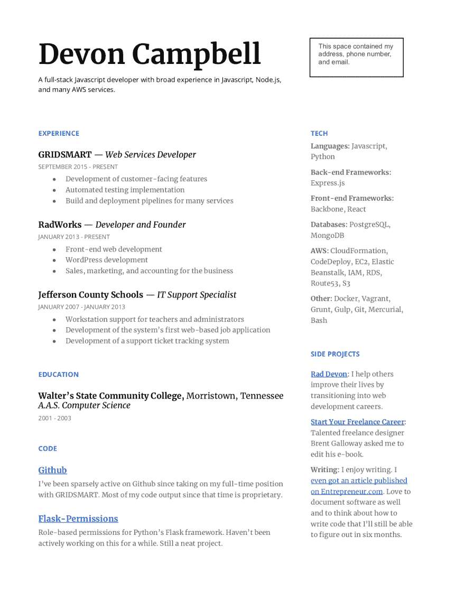
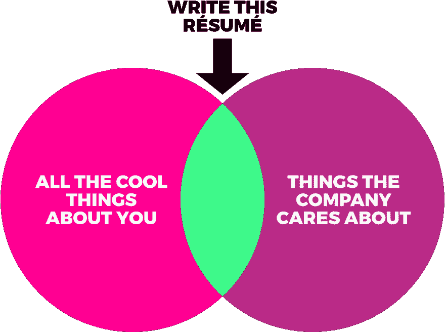

# 如何建立你的网页开发者简历(即使没有经验)

> 原文：<https://dev.to/raddevon/how-to-build-your-web-developer-rsum-even-with-no-experience-4b9h>

即使在像 web 开发这样的领域，你有很多机会(见[为什么 Web 开发是一个伟大的职业](https://raddevon.com/articles/why-web-development-is-a-great-career/))，对永久职位的竞争仍然很激烈。公司为每个空缺职位筛选大量简历。大多数申请人在得到一次面试机会之前就被筛选掉了。你从简历中唯一想要的就是**帮你通过初步筛选**，这样你就可以开始面试了。继续阅读，我会教你如何写一份简历，让**通过过滤**，让你**离高薪工作**更近一步。

在我决定离开上一份全职工作后，我想我应该直接进入另一份工作。我以为至少有一天。😜那一天，我发出了一份简历，最终我参加了该公司的四轮面试。我没有得到那份工作，但是简历确实起到了它的作用，让我进入了这栋大楼。这是我提交的简历:

|  |

我展示这个**并不是作为完美简历**的例子——肯定不是——而是作为一个成功的例子。让我们仔细检查一下这份简历成功的地方和可以改进的地方。

## 简历越少越好

我的简历只有一页，很简略。你可以很快看到我知道什么技术，我在哪里工作过，我参与过什么项目。如果你从公司的角度考虑，公司正试图筛选 100-200 个，这正是你想要看到的。

我本可以写几段华丽的散文来描述我的职业目标，但那也不会让事情变得更好。我的目标是**在不浪费人们时间的情况下传达为什么我会有价值**。

## 使之相关

我从大约 15 岁开始工作。我本可以试着在“经历”部分列出我做过的每一件事。相反，我只写了与我申请的职位相关的内容。他们不在乎我在沃尔玛做过收银员，也不在乎我在高中时为学生制作身份证。

我可能做得更好的一件事是把我通过 RadWorks 做的单个项目分解开来。正如所写的，我的自由职业实践是一种黑箱，我在那里做“前端开发”，不管那是什么意思。我希望我用要点指出了他们感兴趣的具体项目。

### 如果没有相关经验…

让我们打开包装。你的意思是你没有与你申请的工作相关的任何经验，还是你的意思是你没有专业的工作经验？

如果你的问题是没有*专业*经验，那没问题。与其列出不相关的工作经历，**不如列出你完成的*项目*中与此相关的**。如果可行的话，提供项目代码和工作部署的链接。

如果你的问题是，事实上，你没有与这份工作相关的经验，**你可能需要解决这个问题，而不是申请**。无论如何你都可以申请这份工作，但你不太可能得到它。相反，去做一两个能让你在感兴趣的领域获得一些经验的项目，并把它们列在你下一份类似的申请中。*(你可能有兴趣阅读[学习](https://raddevon.com/articles/the-best-projects-for-learning-web-development/)的最佳项目类型，甚至从[我列出的 10 个有时古怪的项目想法](https://raddevon.com/articles/10-great-web-development-learning-project-ideas/)中获得一些灵感。)*

人们很容易变得愤世嫉俗，开始嘲笑入门级职位需要 5 年经验的事实，但这不会帮助你被录用。从公司的角度考虑这个问题。他们有一个需要解决的问题，否则他们不会招聘。即使你没有解决他们需要解决的问题的经验，你还是要求他们雇用你。与此同时，他们有一大堆简历，其中许多显示了他们需要的技能。为什么他们会给你第二次机会？

你可以通过从自由职业者开始你的职业生涯来减轻这一点。进入门槛更低，可以边干边学。这不是灵丹妙药；你不会今天辞掉开铲车的工作，明天开始做自由职业者，希望在工作中学习*的一切*。(如果你想试一试，[参加我的自由职业速成班](https://raddevon.com/enroll-in-the-freelancing-crash-course/)，让你的事业起步。)

它*将*做的是让你有更多的回旋余地，从你的 web 开发基础(HTML、CSS 和 Javascript)构建到更深奥的堆栈，带着薪水的动机推动你前进。如果你不想永远生活在自由职业的世界里，在简历中展示成功的自由职业项目会让你更有吸引力。

## 关注你产生的结果

大多数开发者关注技术。简历是一场竞赛，看谁能列出最多的语言和框架。这对你没有任何好处。

你的简历应该让人们知道你精通他们需要的技术(*如果*，事实上，你是)，但是**不应该列出你接触过的单一技术**，除非这个列表既简短又相关。我的简历在保持简洁方面做得很好。

相反，你应该关注**你为你以前的雇主和客户创造了什么样的结果**。这是我简历中最薄弱的地方。它实际上根本不谈论结果。庞大的框架列表毫无意义。这是否意味着你精通所有这些？这是否意味着你至少已经完成了每一个的教程？也许这只是意味着你听说过他们所有人。

结果不言自明。如果您构建了一个新的后端，可以让您将基础架构成本削减一半，或者如果您构建了一个 UI，可以将流失率(客户取消服务)减少四分之一，这些都是非常强大的。它们之所以强大，是因为它们为你合作的企业带来了更多的钱。在你的简历中展示它们是强有力的，因为这表明你理解你所做工作的价值。

## 展现让你与众不同的东西

在这件事上你必须小心谨慎。如果你开始讲述你每周参加的篮球比赛或者列出你的宠物名字，大多数人会很生气。谈论一些兴趣或项目，虽然这些兴趣或项目与工作要求没有严格的联系，但是给你未来的雇主提供一些额外的好处可以帮助你脱颖而出。

在这份简历中，我用我的副业项目做到了这一点。我提到 Rad Devon 是因为我想让他们知道我喜欢指导新开发人员。我讲了我的写作经历，因为我想让他们知道我善于沟通。我也放弃了这样一个事实，即我想了很多关于编写可读的、可维护的代码，当你在团队中工作时，这是非常重要的。

## 为读者写下你的简历

大多数简历是为作者写的。我们编制了一份庞大的清单，列出了我们做过的每一份工作，以及我们遇到过的每一项技能。我们自豪地看着这份 6 页的文件。看看我们完成的和创造的一切。

这让*编剧*感觉良好，但是**并没有完成得到工作**的目标。这些是直接扔进垃圾箱的简历。**为读者写的简历是让你获得面试机会的简历。**一些快速建议:

*   删掉任何不相关的内容。
*   不要写 6 页纸，重读招聘启事。他们中的大多数人会明确告诉你他们想从你这里得到什么。
*   确保你告诉他们你有他们想要的技能。
*   如果可以的话，分享一个你用这些技能得到的结果。
*   分享一些你在这个职位上有价值的东西。

为读者写作是所有其他建议的基础。如果你能以发现自己对公司的价值为目标，而不是以得到这份工作为目标，那么工作就会随之而来。