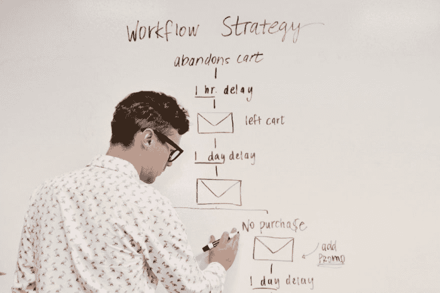

# 如何收集你需要的数据来引导你的数字营销分析

> 原文：<https://dev.to/julienkervizic/how-to-collect-the-data-you-need-to-bootstrap-your-digital-marketing-analytics-hhm>

[](https://res.cloudinary.com/practicaldev/image/fetch/s--GZWB9bse--/c_limit%2Cf_auto%2Cfl_progressive%2Cq_auto%2Cw_880/https://cdn-images-1.medium.com/max/1024/0%2AZxBcyOPlfApyfJT6) 

<figcaption>照片由[活动创作者](https://unsplash.com/@campaign_creators?utm_source=medium&utm_medium=referral)在 [Unsplash](https://unsplash.com?utm_source=medium&utm_medium=referral)</figcaption>

上拍摄

在很大程度上，用数据引导你的营销活动，取决于你的业务范围，围绕两个或三个特定领域的数据收集来解决。

*   ***活动活动*** :无论是来自数字营销，推送广告如脸书或谷歌广告，或更多通过电子邮件服务提供商/营销自动化。
*   ***点击流:*** 提供对现场客户旅程和促成转化的不同因素的了解。利用点击流数据能够正确地将转化归因于特定的活动。
*   ***销售:*** 电子商务网站的数字营销围绕着产生网上销售。应跟踪这些活动，并根据这一目标优化活动支出。

### 用例

围绕营销分析有很多用例，但我们可以轻松展示这些营销活动、点击流和电子商务销售的数据源如何推动一些最大的营销分析用例，如媒体组合建模、营销归因和防止流失。

#### 媒体混合建模

媒体组合建模(MMM)可以让你了解如何在不同的广告渠道之间转移你的预算组合，以优化你的结果。它依靠统计技术来理解 1 单位边际支出的最佳位置。

MMM 依赖于两个特定的信息来源 1。支出数据(活动)2。一个结果数据(如:电子商务销售)，我们希望优化。为了提高效率，MMM 必须了解影响结果的所有不同渠道支出。

#### 营销归因

营销归因的作用是将信用分配给特定的营销活动，以更好地了解它们对特定目标的贡献。诸如“最后一次点击”之类的归因方法在达到目标时为特定的活动提供全部信用，在这种情况下，它为对所述目标做出贡献的最后一个接触点提供活动的全部信用，而其他技术可以提供部分信用。不同归因技巧的解释在以下中帖中提供:[此处](https://medium.com/@odolenakostova/online-attribution-in-a-multi-channel-marketing-world-d2141f08f9d6)和[此处](https://medium.com/analytics-for-humans/an-in-depth-look-at-attribution-modeling-in-digital-marketing-2ed0170c6f3b)。

营销归因依赖于营销活动数据(花费)、点击流信息和销售数据，以便正确地归因于营销活动。除了设置不同的系统来收集信息之外，正确的 url 标记(UTM)和在网站上设置正确的 Cookies 也是实现此用例的必要的第一步。

#### 防流失

客户流失识别和预防是最传统的 CRM 用例之一。它利用销售和营销活动数据(CRM)来更好地了解哪些客户可能会流失，以及他们倾向于对什么样的服务做出反应，以便坚持提供服务。

### 数据采集

总的来说，营销分析最难的部分之一是获取数据的能力。它需要从各种来源获取信息。根据尝试启动该用例的业务的具体情况，可以有多种适用的方法来集成所需的每个数据源。

### 活动数据收集

整合和收集活动数据的方法有很多，从使用特定的数据整合解决方案，到利用歌手点击，使用内置于数据导出功能中的不同工具，或者通过构建特定的 API 管道。

**数据集成解决方案**

存在不同的工具来简化从营销活动中收集数据， [Talend](http://talend.com) 、[adversity](http://www.adverity.com)、 [Fivetran](http://fivetran.com) 和 [Alooma](https://www.alooma.com/integrations) (最近被谷歌收购)提供了一系列连接器，使得从这些不同的广告来源整合数据变得相当容易。

#### 歌手叩击

[](https://res.cloudinary.com/practicaldev/image/fetch/s--hvs0BEwn--/c_limit%2Cf_auto%2Cfl_progressive%2Cq_auto%2Cw_880/https://cdn-images-1.medium.com/max/1024/0%2AhqorE7mNxyPOJD0_) 

<figcaption>照片由[奥斯汀尼尔](https://unsplash.com/@arstyy?utm_source=medium&utm_medium=referral)上 [Unsplash](https://unsplash.com?utm_source=medium&utm_medium=referral)</figcaption>

[Singer taps](https://www.singer.io/#taps) 为脸书、谷歌、Outbrain、Salesforce、Marketo、Selligent、..然后，只需修改一些配置设置并执行一个命令行调用，例如
，就可以很容易地从这些来源获取数据

```
tap-adwords -c config.json -p properties.json -s state.json 
```

#### **数据导出**

[](https://res.cloudinary.com/practicaldev/image/fetch/s--OIbjgc8f--/c_limit%2Cf_auto%2Cfl_progressive%2Cq_auto%2Cw_880/https://cdn-images-1.medium.com/max/1024/0%2A5u5Yc2AVP6D_uBRS) 

<figcaption>照片由[上](https://unsplash.com/@chuttersnap?utm_source=medium&utm_medium=referral)下[上](https://unsplash.com?utm_source=medium&utm_medium=referral)下</figcaption>

某些广告工具允许将数据导出到 Big Query、不同的数据仓库工具或作为文件导出，例如:

*   [双击](https://cloud.google.com/bigquery/docs/doubleclick-campaign-transfer)和[email sys](https://help.emarsys.com/hc/en-us/articles/360000176214-Open-Data-End-user-guide)向 Google BigQuery 提供导出
*   Salesforce Marketing Cloud 允许 [FTP/CSV 导出](https://help.salesforce.com/articleView?id=mc_es_export_de.htm&type=5)，流可以在 automation studio 中自动执行，然后输入到数据库/数据仓库中

#### **定制开发— API 管道**

[](https://res.cloudinary.com/practicaldev/image/fetch/s--YiKCJBg9--/c_limit%2Cf_auto%2Cfl_progressive%2Cq_auto%2Cw_880/https://cdn-images-1.medium.com/max/1024/0%2Ag1fMzVezKLP4SkTD) 

<figcaption>照片由[泰勒·拉斯托维奇](https://unsplash.com/@lastly?utm_source=medium&utm_medium=referral)在 [Unsplash](https://unsplash.com?utm_source=medium&utm_medium=referral)</figcaption>

开发管道，通过 API 调用直接从脸书，谷歌拉数据。这需要数据工程师或开发人员来设置不同的数据流。大多数广告源都提供 SDK，以便与他们的平台轻松集成。

*   *谷歌广告* : [谷歌 API Python 客户端](http://google-api-python-client)
*   *脸书:* [脸书商业 SDK](https://developers.facebook.com/docs/business-sdk/)
*   *Salesforce 营销云:* [FuelSDK](https://github.com/salesforce-marketingcloud/FuelSDK-Python)

### 点击流收集

为了收集点击流数据，存在不同的替代方案，从依赖诸如 google analytics 360 或 Adobe 的高级分析工具，利用客户数据平台、点击流收集器或通过设置一些定制开发。

#### 谷歌分析/Adobe 分析

[](https://res.cloudinary.com/practicaldev/image/fetch/s---MBlb_-6--/c_limit%2Cf_auto%2Cfl_progressive%2Cq_auto%2Cw_880/https://cdn-images-1.medium.com/max/1024/0%2A99-7FyjAUlsFYVMS) 

<figcaption>照片由[奥斯迪斯特](https://unsplash.com/@austindistel?utm_source=medium&utm_medium=referral)上 [Unsplash](https://unsplash.com?utm_source=medium&utm_medium=referral)</figcaption>

如果您负担得起，收集原始点击流数据的最简单方法是通过 google/adobe Analytics。作为 Google 360 产品的一部分，Google 提供了将原始点击流数据导出到 Big Query 的可能性。走这条路的主要障碍之一是 Google Analytics 360 每年 15 万美元的费用。

#### 客户数据平台

[](https://res.cloudinary.com/practicaldev/image/fetch/s--jiCRNfYX--/c_limit%2Cf_auto%2Cfl_progressive%2Cq_auto%2Cw_880/https://cdn-images-1.medium.com/max/1024/0%2AmmO5q1LR9o1ctSxv) 

<figcaption>照片由[布雷克·维斯](https://unsplash.com/@blakewisz?utm_source=medium&utm_medium=referral)于 [Unsplash](https://unsplash.com?utm_source=medium&utm_medium=referral)</figcaption>

大多数客户数据平台提供了将摄取的事件导出到数据仓库的可能性。他们从多个来源(包括网站活动)获取数据，并能够将其流回进行处理或分析。根据企业的规模，客户数据平台可能比购买 Google 360 许可证更贵，但也有额外的好处。某些 CDP，如 [segment](https://segment.com/pricing/) ，提供一个免费版本，最多支持一定数量的事件或活跃用户。

#### 点击流收集器

存在不同的开源点击流收集器，最著名的是 [Snowplow](https://snowplowanalytics.com/) 和 [divolte](https://divolte.io/) 。它们提供了一种获取点击流数据的方式，而无需对其进行全面开发。使用这些工具的缺点是，您需要管理基础架构。

#### 自定义开发

收集点击流数据的另一个解决方案是通过定制开发。逻辑应用、函数应用、Lambda 函数和 EventHub/Kinesis/PubSub 设置将允许可扩展的数据摄取，但代价是管理代码和基础设施。

### (在线)销售数据采集

有不同的方法来获取与在线销售相关的信息，所有这些方法都有各自的优缺点:

*   ***分析标签:*** 网站上的分析标签来获取网上销售数据的感觉。来自分析工具的数据可以通过 API 调用手动导出，也可以通过大型查询导出 Google 360 导出。
*   ***数据库复制/镜像:*** 一些电商平台曝光或者让你自己选择数据库解决方案。这允许使用数据库复制/镜像来获取数据的实时拷贝，以便进行分析或报告。
*   ***数据集成解决方案:*** 存在预先构建的数据集成解决方案，对于某些平台，获得这些解决方案中的一个可以显著简化处理这部分数据收集过程所需的开发和维护。
*   ***Singer Taps:*** 某些平台为其创建了 Singer Taps，本质上是一个预建的 ETL/API 客户端，只需要在提取数据之前进行配置。
*   ***API 管道:*** 可以按期生成 API 管道，拉取相关信息。他们确实需要一些自定义开发，以便拉动。
*   ***web hooks:***web hooks 提供了支持它的平台，一种实时导出和摄取数据的方式。他们的主要缺点是你需要开发和维护基础设施，API/Webhook receiver。
*   ***Streams:*** 一些电子商务解决方案允许你将一个 feed 交易流导出到一个事件流中。这允许通过传递 API/Webhook 接收器来获得实时摄取。

#### 分析标签

[](https://res.cloudinary.com/practicaldev/image/fetch/s--S2-bm3In--/c_limit%2Cf_auto%2Cfl_progressive%2Cq_auto%2Cw_880/https://cdn-images-1.medium.com/max/1024/0%2AIyvoarznC1u60EfA) 

<figcaption>照片由 [Neven Krcmarek](https://unsplash.com/@nevenkrcmarek?utm_source=medium&utm_medium=referral) 于 [Unsplash](https://unsplash.com?utm_source=medium&utm_medium=referral)</figcaption>

通过像谷歌这样的分析标签来获取在线销售数据是可能的。谷歌提供了一种结构化的方式，通过其[增强型电子商务](http://enhanced%20ecommerce)插件将信息传递给分析部门。这允许在捕获电子商务数据时提供良好的第一通道，然而这种方法有相当多的缺点:

1.  *广告拦截器*:这种方法面临用户使用特定广告拦截的问题，它将谷歌分析域和任何来自 analytics.js 标签的尝试列入黑名单，尽管有[一些变通办法](https://medium.freecodecamp.org/save-your-analytics-from-content-blockers-7ee08c6ec7ee)
2.  *页面加载问题:*在标签有机会触发之前离开感谢页面的用户，他们的订单数据不会被推送到 Google Analytics
3.  *延迟付款:*订单的付款方式允许延迟付款，如银行转账或 Paypal，根据所采取的方法，订单可能会被错误地归类为成功销售或未被记录。

使用这种方法的主要优势是它的通用性和部署速度，通常对于大多数网络商店只需要一些标签集成，对于某些平台如 shopify，只需要一些简单的配置。

设置增强型电子商务跟踪的另一个优势是能够将购买与特定会话联系起来，因此能够依赖于谷歌的最后一次点击归属。有了它，就有可能根据最后一次点击的属性将特定的订单归属于特定的活动和销售渠道，这可能是有益的。

#### 数据库复制&镜像

[](https://res.cloudinary.com/practicaldev/image/fetch/s--ROHME1Oo--/c_limit%2Cf_auto%2Cfl_progressive%2Cq_auto%2Cw_880/https://cdn-images-1.medium.com/max/1024/0%2ABTBtbVzE4j8sYmgi)

有些电子商务平台允许平台运营者建立自己的数据库，比如 [Magento](https://devdocs.magento.com/guides/v2.3/install-gde/install/web/install-web_2-db.html) 、 [EpiServer](https://world.episerver.com/documentation/Items/Developers-Guide/Episerver-CMS/8/Deployment/About-the-database/) 或 SiteCore。在这些情况下，可以设置主从数据库复制或[数据库镜像](https://docs.microsoft.com/en-us/sql/database-engine/database-mirroring/database-mirroring-sql-server?view=sql-server-2017)，这样数据就可以用于报告目的，而不会影响生产环境。

这些可以在没有定制开发的情况下进行设置，并且可以允许为报告目的提供数据的快速周转。

#### 数据整合解决方案

至于活动数据，数据集成工具的存在为电子商务数据提供了交钥匙集成。上述每一家供应商都为某些电子商务平台提供连接器:

*   *Talend* : Shopify，BigCommerce，Magento 都有来自 [Cloudbee](https://cloudbee.com/talend-open-studio-components/) 的 Talend 连接器，
*   *广告*:支持 Hybris、Shopware、Shopify 和 Magento
*   *FiveTran* :支持 Salesforce CommerceCloud、Magento、WooCommerce、Shopify 和 SpreeCommerce
*   *Alooma:* 支持 Shopify 和 Magento

当团队/部门缺乏技术能力时，使用这些数据集成解决方案是一种替代方案。

#### 歌手叩击

[](https://res.cloudinary.com/practicaldev/image/fetch/s--pDVZvlSv--/c_limit%2Cf_auto%2Cfl_progressive%2Cq_auto%2Cw_880/https://cdn-images-1.medium.com/max/1024/0%2AcG-p110dxzgQZ9Pm) 

<figcaption>照片由[丹尼尔·契卡洛夫](https://unsplash.com/@dchuck?utm_source=medium&utm_medium=referral)在 [Unsplash](https://unsplash.com?utm_source=medium&utm_medium=referral)</figcaption>

目前 [WooCommerce](https://github.com/singer-io/tap-woocommerce) 是唯一的网络商店，有一个 [singer-tap](https://www.singer.io/#taps) 连接器，使得它的使用相当受限。然而，可以为特定用途开发定制歌手水龙头。当已经通过 SingerTaps 进行在线活动数据收集时，这可能是一个很好的举措。

#### 定制开发——API 管道

[](https://res.cloudinary.com/practicaldev/image/fetch/s--2JfC9qEy--/c_limit%2Cf_auto%2Cfl_progressive%2Cq_auto%2Cw_880/https://cdn-images-1.medium.com/max/1024/0%2Af7r7p7QkXdJYe94r) 

<figcaption>照片由[昆腾德格拉夫](https://unsplash.com/@quinten149?utm_source=medium&utm_medium=referral)上 [Unsplash](https://unsplash.com?utm_source=medium&utm_medium=referral)</figcaption>

如今，大多数网上商店都允许通过 API 调用直接获取订单信息，这是纯 SaaS 平台的情况，如 [Shopify](https://help.shopify.com/en/api/reference/orders) 、 [Lightspeed](https://developers.lightspeedhq.com/ecom/endpoints/order/) 、Commercecloud 或 [Commercetools](https://docs.commercetools.com/http-api-projects-orders) ，但也有像 [Magento](https://devdocs.magento.com/guides/m1x/api/rest/Resources/Orders/sales_orders.html#RESTAPI-Resource-SalesOrders-HTTPMethod-GET-orders) 这样的平台。

其中一些受 python SDK 支持:

*   [Shopify Python SDK](https://github.com/Shopify/shopify_python_api)
*   带有 [Python SDK](https://github.com/labd/commercetools-python-sdk) 的商业工具
*   [Magento Python SDK](https://pypi.org/project/magento/2.1/)

这种方法的一个主要缺点是，它需要定制数据工程师或软件工程师的工作，它需要轮询并且在一定程度上不是“实时”的。此外，某些平台具有费率限制，这可能使得拉取大量订单不切实际。

然而，它的优势之一是能够将特定订单的更新信息提取到日期范围内。

#### 定制开发— Webhooks

[](https://res.cloudinary.com/practicaldev/image/fetch/s--YFH4ZWLu--/c_limit%2Cf_auto%2Cfl_progressive%2Cq_auto%2Cw_880/https://cdn-images-1.medium.com/max/1024/0%2A8CLTHM1lmpfuf-Xp) 

<figcaption>照片由[克里斯·斯科特](https://unsplash.com/@chris_j_scott?utm_source=medium&utm_medium=referral)于 [Unsplash](https://unsplash.com?utm_source=medium&utm_medium=referral)</figcaption>

Webhooks 本质上是一种当某种类型事件发生时通过 HTTP 发送通知的方法，对于我们的目的，它们提供了一种从电子商务平台创建实时数据摄取的方法。如果不需要进行回调，Web-hooks 还可以提供一种绕过一些速率限制的方法。

它们确实需要某种 web-hook 监听器 API 和摄取层来捕获数据。这些可以使用用于捕获点击流数据的相同类型的技术来构建，例如 Logic App / EventHub 组合。

大多数电子商务平台都支持 web-hooks， [Shopfiy](https://help.shopify.com/en/api/reference/events/webhook) 、 [Lightspeed](https://developers.lightspeedhq.com/ecom/tutorials/webhooks/) 和 [WooCommerce](https://docs.woocommerce.com/document/webhooks/) 、 [Shopware](https://docs.enterprise.shopware.com/connect/rest_api/) 和 [Big commerce](https://developer.bigcommerce.com/api-docs/getting-started/webhooks/about-webhooks) 原生支持，而 Magento 通过第三方插件支持，平台如 [sitecore](https://community.sitecore.net/developers/f/8/t/4489) 或 [episerver](https://www.c2experience.com/blog/getting-hooked-on-episerver-webhooks) 需要定制开发。

#### 自定义开发—流

[](https://res.cloudinary.com/practicaldev/image/fetch/s--bVLZisp1--/c_limit%2Cf_auto%2Cfl_progressive%2Cq_auto%2Cw_880/https://cdn-images-1.medium.com/max/1024/0%2A4jgcEDgC6IZ1hzig) 

<figcaption>照片由[布达扬·巴德汉](https://unsplash.com/@yan_slg?utm_source=medium&utm_medium=referral)于 [Unsplash](https://unsplash.com?utm_source=medium&utm_medium=referral)</figcaption>

一些电子商务平台能够将事件直接发布到消息队列中(例如:Google Pub/Sub、Azure Service Bus、AWS SQS)。这就是[商业工具](https://docs.commercetools.com/http-api-projects-subscriptions)的情况，他们更喜欢这种方法，而不是标准的 HTTP [webhooks](https://techblog.commercetools.com/webhooks-the-devil-in-the-details-ca7f7982c24f) 。例如，这允许本地“复制”相关数据用于处理(如订单履行)和数据仓库中的长期存储，并允许不同的数据消费者从该单一信息源“订阅”。

除了 Google Pub/Sub 有一个交钥匙[导出到数据仓库(BigQuery)](https://cloud.google.com/dataflow/docs/guides/templates/provided-streaming#cloudpubsubsubscriptiontobigquery) 之外，其他技术选择仍然需要开发工作，以便接收数据。

更多来自我的[黑客分析](https://medium.com/analytics-and-data):

*   [一个数据工程的演变](https://medium.com/analytics-and-data/on-the-evolution-of-data-engineering-c5e56d273e37)
*   [利用脸书 Python API 进行营销分析](https://medium.com/analytics-and-data/leveraging-facebook-python-api-for-marketing-analytics-f4372f042112?source=friends_link&sk=43a90fda6d1bcdfa03379162ea00e46b)
*   [电子商务数据战略的 5 个领域](https://medium.com/analytics-and-data/5-domains-of-ecommerce-data-strategy-82b61356042c?source=friends_link&sk=2a29ed95b7882db2ff9d7adc3803554c)
*   [使用气流的 10 大好处](https://medium.com/analytics-and-data/10-benefits-to-using-airflow-33d312537bae?source=friends_link&sk=9449eedcb64c30fb1823c72901041f44)

* * *