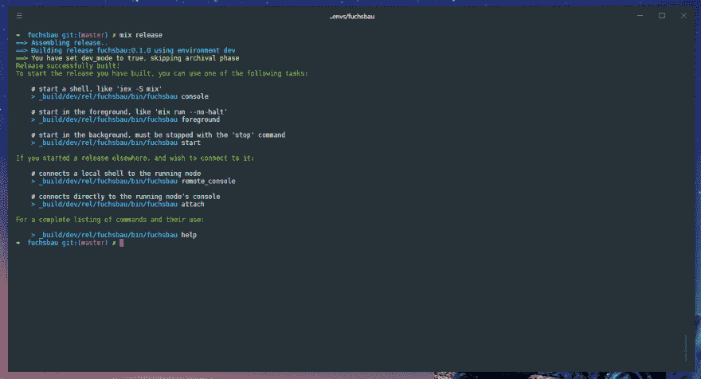
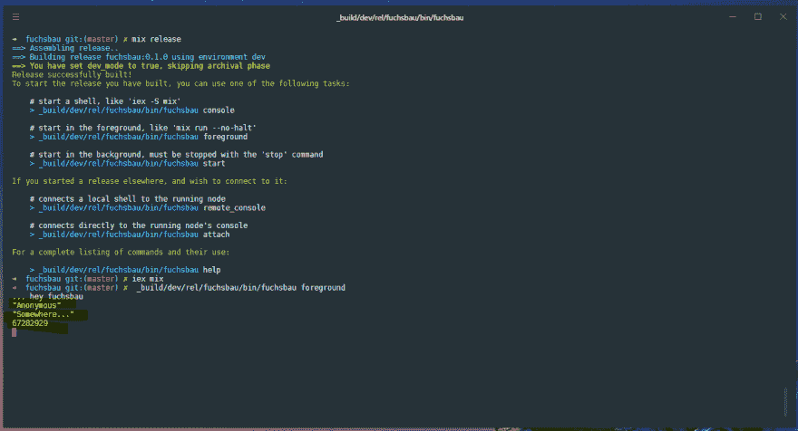

# 如何创建酏剂版本并使用在运行时配置的环境变量。

> 原文：<https://dev.to/ophasnoname/how-to-create-a-elixir-release-and-use-environment-variables-configured-at-runtime-31k4>

首先，请原谅我，这不是我的母语！

每个新应用程序面临的一个问题是如何正确使用[酏剂](https://elixir-lang.org/),使用“docker-compose”文件中的环境变量在运行时配置应用程序。

有几种方法可以做到这一点，但我想向您展示我的首选方法与 Distillery 和“配置元组”提供者。

这种组合允许我们构建新的版本，并在运行时设置配置参数，如数据库凭证。

我将通过一个简单的例子来指导您，我们将创建一个新的 Elixir 应用程序，添加必要的配置提供程序，并使用 [Docker](https://www.docker.com/) 运行/构建它。

## 创建我们的示例应用程序

让我们创建一个新的应用程序，我将把它命名为“fuchs Bau”…不要问我为什么:-)

```
$ mix new fuchsbau --module Fuchsbau 
```

```
We will add some stupid code to echo a bunch of example environment variables (just to verify that this approach is working as expected).

## Example code to test environment variables

Create a new file “../lib/starter.ex” with the following content, to echo our configuration.

defmodule Starter do
   use Application

  def start(_type, _args) do
    IO.puts("... hey fuchsbau")
    Starter.echo_variables
  end

  @doc """
    Echo defined environment variables from config.exs
  """
  def echo_variables do 
    owner = Application.get_env(:fuchsbau, :config)[:fuchsbau_owner]
    street =  Application.get_env(:fuchsbau, :config)[:fuchsbau_street]
    phone =  Application.get_env(:fuchsbau, :config)[:fuchsbau_phone]

    IO.inspect(owner)
    IO.inspect(street)
    IO.inspect(phone)

    {:ok, self()}
  end

end 
```

要运行这段代码，我们必须将它添加到我们的“mix . exs”

```
 # Run "mix help compile.app" to learn about applications.
  def application do
    [  
      mod: {Starter, []},
      extra_applications: [:logger]
    ]
  end 
```

## 向 config.exs 添加示例

为了让我们的测试有一些配置变量，请在 config.exs 中添加一些配置值。

在“真实世界”的例子中，我们将使用不同的配置，如“prod.exs”..但是对于这个简短的 how to，只使用 config.exs
应该没问题

```
config :fuchsbau, :config,
  fuchsbau_owner: {:system, "FUCHSBAU_OWNER", default: "Anonymous"},
  fuchsbau_street: {:system, "FUCHSBAU_STREET", default: "Somewhere..."},
  fuchsbau_phone: {:system, "FUCHSBAU_PHONE", default: 67282929, type: :integer} 
```

## 使用 Distillery 和 ConfigTuples 提供程序

这里是有趣的部分，您必须将 Distillery 和 configTuples 添加到您的应用程序(mix.exs)中。

```
defp deps do
    [
      {:distillery, "~> 2.0"},
      {:config_tuples, "~> 0.2.0"}
    ]
end 
```

在命令行中，运行以下命令来获取新的依赖项并初始化发布(这将创建一个新的目录“/rel”，其中包含一个我们需要设置 configTuples 的 config.exs 文件):

```
$ mix deps.get
$ mix release.init 
```

要使用新的配置提供程序，请将其添加到“/rel/config . exs”

```
release :fuchsbau do
  set version: current_version(:fuchsbau)
  set applications: [
    :runtime_tools
  ]
  # ConfigTuples Provider !
  set config_providers: [
    ConfigTuples.Provider
  ]
end 
```

## 第一次测试时间

这就是使用 Distillery 和 ConfigTuples provider 的全部内容(不要担心，我们将在几分钟内继续 Docker 的内容..)

让我们试试我们的发布运行:

```
$ mix release 
```

你会看到一些例子来开始发布，只需使用一个与“前景”..是的，地狱..我不得不使用 Windows，把我的 MacBook 忘在办公室了..

[](https://res.cloudinary.com/practicaldev/image/fetch/s--posuz3Ih--/c_limit%2Cf_auto%2Cfl_progressive%2Cq_auto%2Cw_880/https://thepracticaldev.s3.amazonaws.com/i/wzvbydxj97fhro2f1rf5.PNG)

运行您的版本后，您应该会看到已定义的配置值。

[](https://res.cloudinary.com/practicaldev/image/fetch/s--Xyb3uUYB--/c_limit%2Cf_auto%2Cfl_progressive%2Cq_auto%2Cw_880/https://thepracticaldev.s3.amazonaws.com/i/lom3xonirpy22mum5f4y.PNG)

为了验证我们能够在运行时设置环境变量，请尝试以下操作:

```
$ export FUCHSBAU_OWNER=Medium
$ _build/dev/rel/fuchsbau/bin/fuchsbau foreground 
```

这将输出“中等”作为狐蝠的主人！

[](https://res.cloudinary.com/practicaldev/image/fetch/s--NVAhYqHE--/c_limit%2Cf_auto%2Cfl_progressive%2Cq_auto%2Cw_880/https://thepracticaldev.s3.amazonaws.com/i/c3cl2oebfy9dagppe9bh.PNG)

## 使用 Docker 来构建和运行我们的应用程序

这个操作的最后一步是:我们将创建一个 docker 文件来构建并运行我们的应用程序。

在项目根目录下创建一个新文件:“Dockerfile”，内容如下:

```
FROM bitwalker/alpine-elixir:1.7 as build

# Copy the source folder into the Docker image
COPY . .

# Install dependencies and build Release
RUN export MIX_ENV=prod && \
    rm -Rf _build && \
    mix deps.get && \
    mix release

# Extract Release archive to /rel for copying in next stage, please change the application name 
RUN APP_NAME="fuchsbau" && \
    RELEASE_DIR=`ls -d _build/prod/rel/$APP_NAME/releases/*/` && \
    mkdir /export && \
    tar -xf "$RELEASE_DIR/$APP_NAME.tar.gz" -C /export

# Deplyment
FROM pentacent/alpine-erlang-base:latest

# Copy and extract .tar.gz 
COPY --from=build /export/ .

# Set default entrypoint and command
ENTRYPOINT ["/opt/app/bin/fuchsbau"]
CMD ["foreground"] 
```

这个 Dockerfile 文件将以 Alpine 为基础创建一个新的形象。让我们用更改后的“FUCHSBAU_OWNER”环境变量的值来测试它。

```
docker build -t fuchsbau .
docker run -e FUCHSBAU_OWNER=FridayIsMyDay fuchsbau 
```

[](https://res.cloudinary.com/practicaldev/image/fetch/s--tsgM52RJ--/c_limit%2Cf_auto%2Cfl_progressive%2Cq_auto%2Cw_880/https://thepracticaldev.s3.amazonaws.com/i/phpks1o2xv6qwz9lv0i1.PNG)

如果你想获得这个例子的来源，请随意:[https://github.com/opHASnoNAME/elixir-docker-envs](https://github.com/opHASnoNAME/elixir-docker-envs)。

要托管您的应用程序，我建议使用数字海洋(DigitalOcean)软件(T1)，它对我的项目很有吸引力。

第一次发布于媒体:[访问](https://medium.com/@ophasnoname_44358/how-to-create-a-elixir-release-and-use-environment-variables-configured-at-runtime-dbb2580ba42d)