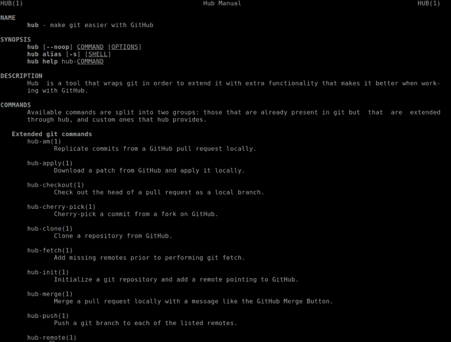
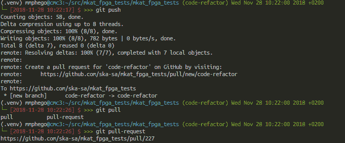

# 如何从 CLI 创建 GitHub pull 请求

> 原文：<https://dev.to/mmphego/how-to-create-a-github-pull-requests-from-the-cli-500j>

*最初发布在我的[博客](https://blog.mphomphego.co.za/blog/2018/11/28/How-to-create-a-GitHub-pull-requests-from-the-CLI.html)*

如果你和我一样，在一天之内创建了很多 pull 请求，并对反复访问 GitHub 来创建 PR 的想法感到恼火——不要误解我的意思，这个网站很棒，但有时不得不离开你的 CLI 并打开你的浏览器会令人恼火(这严重影响了你的工作效率)。

我有一个很棒的解决方案给你，GitHub 有一个很酷的工具，你可以用它通过 CLI 来创建 PR 和其他东西，它可以根据你的架构来安装。

**注意:**他们(GitHub 的人)说它不存储你的登录详情。

# 安装轮毂

GitHub 上有 Hub，所以你可以下载二进制文件，或者从源代码安装。不幸的是，用`Ubuntu`你不容易得到它，你需要下载二进制文件并安装它。

在这篇文章中，我将详细介绍安装和使用。

**注意:**我用的是`git version: 1.9.1`和`debian 7.9`

## 设置

安装很简单，见下图:

```
# Linux x64
cd /tmp
wget https://github.com/github/hub/releases/download/v2.6.0/hub-linux-amd64-2.6.0.tgz -O - | tar -zxf -
sudo prefix=/usr/local hub-linux-amd64-2.6.0/install && rm -rf hub-linux-amd64-2.6.0
# See: https://github.com/github/hub#aliasing
echo "alias git=hub" >> ~/.bashrc
source ~/.bashrc 
```

Enter fullscreen mode Exit fullscreen mode

## 用法

成功安装后，您就可以使用 Git+Hub 了。
如果您在 cli 中点击`man hub`，您应该会看到类似这样的内容。

[](https://res.cloudinary.com/practicaldev/image/fetch/s--d0q7xKEp--/c_limit%2Cf_auto%2Cfl_progressive%2Cq_auto%2Cw_880/https://thepracticaldev.s3.amazonaws.com/i/s12ilsddkd3ciqckf0sl.png)

## 测试

从下图中，我确定这个工具 100%有效。

[](https://res.cloudinary.com/practicaldev/image/fetch/s--FD5KDZ6B--/c_limit%2Cf_auto%2Cfl_progressive%2Cq_auto%2Cw_880/https://thepracticaldev.s3.amazonaws.com/i/9bjvwo1g30z444v1ni4h.png)

## 诡计

[](https://res.cloudinary.com/practicaldev/image/fetch/s--pPkbWj7S--/c_limit%2Cf_auto%2Cfl_progressive%2Cq_auto%2Cw_880/https://climbingthecrazytree.files.wordpress.com/2014/01/but-wait-theres-more.png)

### 与 Git 别名整合。

从那以后，`hub`通过让我的手保持在键盘上而节省的时间是*无价的*。这将是一个伟大的想法，推动和创造公共关系的自动化-这就是别名来了。

我是 Git 别名的忠实粉丝，所以我决定创建一个名为`create-pr`的别名，它在 GitHub 上推送和创建一个 pull 请求。

您可以使用 git 直接从命令行创建别名。要打开您的全局`.gitconfig`进行编辑，请点击:

```
git config --global --edit 
```

Enter fullscreen mode Exit fullscreen mode

这将弹出一个编辑器，允许您编辑您的`.gitconfig`。
找到`[alias]`部分，复制`[alias]`下的以下功能。

```
[alias]

    create-pr="!f() { \ BRANCH_NAME=$(git rev-parse --abbrev-ref HEAD); \ git push -u origin "${BRANCH_NAME}"; \ hub pull-request --no-edit; \ };f" 
```

Enter fullscreen mode Exit fullscreen mode

这个别名使用稍微复杂一些的脚本格式来创建一个函数并立即执行它。在这个功能中，我们做三件事:

*   `BRANCH_NAME=$(git rev-parse --abbrev-ref HEAD);`
    *   从 git 获取当前分支的名称，并将其存储在变量 BRANCH_NAME 中。
*   `git push -u origin "${BRANCH_NAME}";`
    *   将当前分支推送到远程源，并将其与同名的远程分支相关联
*   `hub pull-request --no-edit`
    *   使用 hub 创建拉请求，并使用分支上第一次提交的消息作为拉请求标题和描述，而无需打开文本编辑器

要使用别名，只需检查您希望为其创建 PR 的分支并运行:

```
git create-pr 
```

Enter fullscreen mode Exit fullscreen mode

这将在必要时推送分支，并为您创建拉取请求，一切都在一个(PR title 将是您的最后一条提交消息)。
**注:**如果你想了解更多关于 Git 别名的信息，我建议你阅读由[菲尔·哈克](https://haacked.com/archive/2014/07/28/github-flow-aliases/)撰写的这篇文章。

### Bash 函数

我个人更喜欢将有用的工具放在我的`~/.bash_functions`中以便更容易访问，如果你没有`.bash_functions`文件，你可以复制下面的代码并将其放在你的`.bashrc`中。

```
mkpr() {
    BRANCH_NAME=$(git rev-parse --abbrev-ref HEAD);
    git push -u origin "${BRANCH_NAME}" || true;
    hub pull-request --no-edit || true;
    } 
```

Enter fullscreen mode Exit fullscreen mode

如果你像我一样喜欢高效地做事，也给你的`.bashrc`添加以下功能。

```
function commiter() {
    # Add file, commit and push
    if [ $# -eq 0 ]; then
        # Ensure that file is supplied else exits
        echo "No file supplied"
        exit 1
    fi git add -f "$1";
    if [ "$2" == "" ]; then git commit -nm"Updated $1";
    else git commit -nm"$2";
    fi;
    bash -c "git push -q &"
    } 
```

Enter fullscreen mode Exit fullscreen mode

上面的函数`commiter`做了三件事:

*   `git add -f "$1"`；
    *   该命令使用工作树中的当前内容更新索引，为下一次提交准备内容。
*   `git commit -nm"$2"`；
    *   在新的提交中存储索引的当前内容，以及来自用户的描述更改的日志消息，如果没有提供`message`，则使用`Updated <filename>`作为提交消息。
*   `bash -c "git push -q &"`；
    *   在后台使用本地引用悄悄地更新远程引用。

#### 用法

下面的命令 commit my file `main.py`，push 并创建一个 pull 请求——不需要我打开浏览器。

```
commiter main.py && mkpr 
```

Enter fullscreen mode Exit fullscreen mode

# 结论

Hub 是一个很棒的工具，它包装了 Git，简化了我一天要做几次的事情。在 GitHub 上查看并享受。