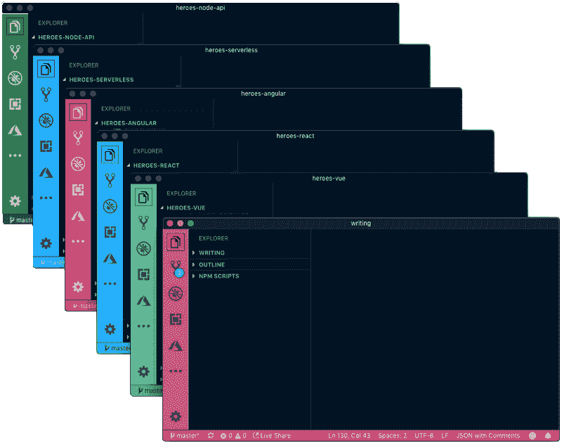
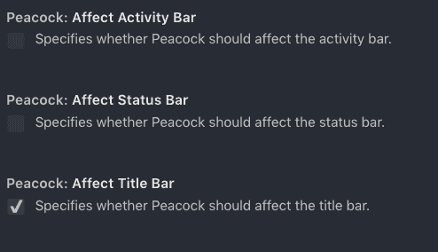

# 如何创建一个全球？gitignore 文件

> 原文：<https://dev.to/anthonyharvey/how-to-create-a-global-gitignore-file-3n76>

1.  打开终端
2.  运行`touch ~/.gitignore_global`创建一个全局。git 忽略主目录中的文件
3.  运行`open ~/.gitignore_global`
4.  添加`.vscode/`和任何其他您想要忽略并且不包含在项目特定的`.gitignore`文件中的文件或目录(不要忘记保存！)
5.  运行`git config --global core.excludesfile ~/.gitignore_global`

就是这样！使用`.gitignore_global`将允许您定制您的编辑器，而不必为每个单独的项目编辑和提交对`.gitignore`文件的更改。

## 编辑具体例子

Visual Studio 代码(和其他编辑器)能够进行自定义以满足您的需求；尤其是通过[扩展](https://marketplace.visualstudio.com/)。我最近开始使用[孔雀扩展](https://marketplace.visualstudio.com/items?itemName=johnpapa.vscode-peacock)来快速区分我可能一次打开的多个 VS 代码实例。你可以自定义孔雀来改变你的活动栏，状态栏和/或标题栏的颜色。

<figure> 

<figcaption>形象功劳: [johnpapa](https://github.com/johnpapa/vscode-peacock)</figcaption>

</figure>

<figure> 

<figcaption>我喜欢只改变标题栏颜色的微妙之处</figcaption>

</figure>

这将在一个`.vscode`文件夹中创建一个`settings.json`。虽然这适用于您的本地编辑器，但可能不适合提交到存储库(毕竟，您的队友可能正在使用 Atom、Sublime 或 Vim)。您可以创建一个`global .gitignore`，而不是为每个项目将这些编辑器特定的文件添加到`.gitignore`。

## 资源

1.  [Github -忽略文件](https://help.github.com/en/articles/ignoring-files)

*本文原载于 2019 年 4 月 7 日[anthonygharvey.com](https://anthonygharvey.com/productivity/how_to_create_a_global_gitignore_file)。*