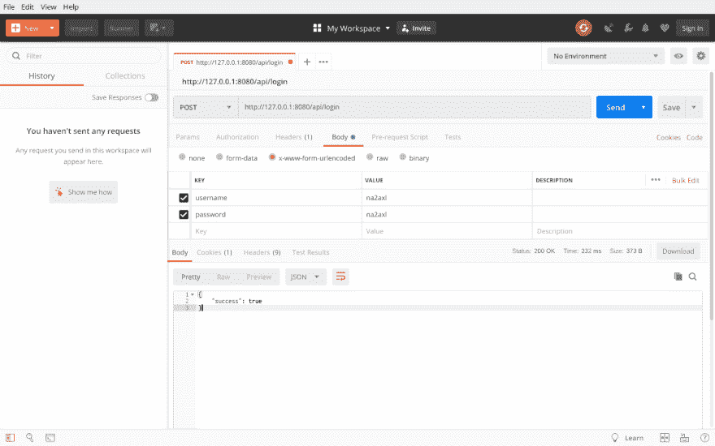
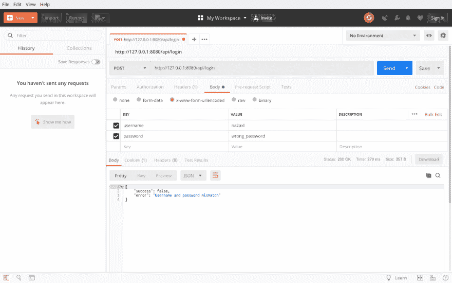

# 如何用 PHP 和基本框架创建 RESTful API

> 原文：<https://dev.to/na2axl/how-to-create-a-restful-api-with-php-and-the-elementary-framework-30ij>

## 简介

有了新的网络技术，当我们想要建立一个网站时，我们会考虑前端框架，如 [React.js](https://reactjs.org/) 、 [AngularJS](https://angularjs.org/) 、 [Vue.js](https://vuejs.org/) 等等...但是网站的阴暗面，后端会发生什么呢？

对于一个简单的网站，像一个页面组合或登陆页面，后端的开发不是很必要。但是当我们想要与数据库交互或上传文件时，这就变成了强制性。

问题是当我们使用像 React.js 这样的前端 web 技术时，我们不能直接与任何后端服务器语言(PHP、Python、Ruby，甚至是带有 Node.js 的 Javascript 等)进行交互...).这就是 RESTful API 模型发生的地方。

有了实现 REST 软件架构的后端服务器，您在前端唯一要做的事情就是向您的服务器发出一个[AJAX](https://en.wikipedia.org/wiki/Ajax_(programming))URI 请求，将一些值作为**请求**参数传递给它，然后等待服务器**响应**。

这就是我们将在本指南中学到的内容。我们将创建一个 RESTful API 服务器，使用 PHP 语言和一个我已经建立的框架,[基本框架](https://github.com/ElementaryFramework)。

## 先决条件

开始之前，请确保您已经:

*   PHP IDE 或编辑器:微软的家伙们在 [Visual Studio Code](https://code.visualstudio.com/) 上做了一项令人敬畏的工作，这是一个免费且强大的代码编辑器。
*   Composer 是 PHP 项目的依赖管理器。你可以在 https://getcomposer.org/的[下载](https://getcomposer.org/)
*   **RESTful API 开发环境**:由于我们不会在本指南中创建前端应用，我们将使用 RESTful API 开发环境。你可以检查一下 [Postman 项目](https://www.getpostman.com/)，它是一个完整的 API 开发环境软件，也是我们将用于我们项目的软件。

## 第 1 部分-准备项目

我们将从创建新项目开始。创建一个新文件夹，用你想要的名字命名(在本教程中，项目名将是`php_rest_api`)，并在其中打开一个终端。

由于基本框架模块是 composer 包，我们将用 composer 安装负责 API 的模块( [WaterPipe](https://github.com/ElementaryFramework/WaterPipe) )。在之前打开的终端中，键入:

```
composer init 
```

这将初始化一个空的 composer 项目。按照初始化过程进行到底就行了。当这个过程完成后，你现在可以用
安装[水管](https://github.com/ElementaryFramework/WaterPipe)

```
composer require elementaryframework/water-pipe 
```

并等待过程完成，这将下载项目的源代码，并安装在您自己的。安装成功后，再次输入:

```
composer dump-autoload -o 
```

这将生成一个*优化的*自动加载器文件(对生产有用)。对于正常的自动加载文件，只需省略`-o`开关。

现在我们已经安装了[水管](https://github.com/ElementaryFramework/WaterPipe)，下一步是创建我们 API 的*入口点*。对于我们的项目，这将是一个简单的`index.php`文件。因此，创建一个名为`index.php`的文件，并在其中插入:

```
<?php

// Require composer autoload file
require "./vendor/autoload.php";

// Require the main WaterPipe class
use ElementaryFramework\WaterPipe\WaterPipe;

// Create the base pipe
$basePipe = new WaterPipe;

// Run the pipe and serve the API
$basePipe->run(); 
```

我们在做什么？

*   我们首先需要来自 composer 的 autoloader 文件
*   我们现在可以使用名称空间来要求 WaterPipe 的主类(这是自动加载器的神奇之处)
*   我们在`$basePipe`中创建新的水管实例
*   我们用`$basePipe->run()`运行管道

这是我们项目最基本的内容。如果你把这个上传到你的服务器，在你的浏览器中打开网页，你肯定会得到一个错误，不要担心，这是因为我们正在运行一个空的*管道*，我们必须给它添加一些*水*；-)

## 第二部分-思考我们的 API

在写一个 API 之前，我们必须确切地知道我们想要做什么，以及如何去做。你必须为你的项目独自完成这项工作，因为你确切地知道你的需求。

### 我们想做什么？

在这里，我们必须从分析前端需求(用户注册、文件上传、数据库访问等)中找到我们必须编写的 API 请求...).

例如，在这个项目中，我们将:

*   创建用于用户登录的 URI
*   创建用于检索博客文章列表的 URI
*   创建用于检索单个博客文章的 URI
*   创建用于访问存储在服务器中的资产文件的 URI
*   禁止访问所有其他请求

### 这件事会怎么做？

在这里，我们必须找到请求将如何被执行。拿一张纸，想象一个请求发送到你的服务器，服务器如何处理它，什么样的数据必须从浏览器发送，什么将从服务器发送回来，什么资源将被使用，等等...这不仅在这种情况下是一个重要的过程，在一般的软件开发中也是如此。

例如，在这个项目中， */api/login* URI 需要通过 *POST* 方法接收想要登录的用户的*用户名*和*密码*，如果信息正确，我们可以用这些信息创建一个*会话*，然后向客户端返回一个*成功信号*。如果信息不正确，返回一个*不成功信号*给客户端，随后是一个*错误信息*。

重复这些步骤，直到你已经检查完你的 API 中所有需要做的事情。如果是这样，你可以继续，继续下一部分。

## 第 3 部分-编写我们的 API

### 接收请求

[水管](https://github.com/ElementaryFramework/WaterPipe)的 API 设计的很容易理解。当你用它编写你的 API 时，有一些方法你必须知道:

*   `get(string $uri, callable $action)`:在给定的`$uri`接收到`GET`请求时，运行指定的`$action`
*   `post(string $uri, callable $action)`:在给定的`$uri`接收到`POST`请求时，运行指定的`$action`
*   `put(string $uri, callable $action)`:在给定的`$uri`接收到`PUT`请求时，运行指定的`$action`
*   `delete(string $uri, callable $action)`:在给定的`$uri`接收到`DELETE`请求时，运行指定的`$action`
*   `patch(string $uri, callable $action)`:在给定的`$uri`接收到`PATCH`请求时，运行指定的`$action`
*   `head(string $uri, callable $action)`:在给定的`$uri`接收到`HEAD`请求时，运行指定的`$action`
*   `request(string $uri, callable $action)`:在给定的`$uri`接收到任何一种请求时，运行指定的`$action`

所以要多练习！在您的代码编辑器/IDE 中打开我们的`index.php`文件，我们将编写我们的第一个请求:

```
<?php

// Require composer autoload file
require "./vendor/autoload.php";

// Require the main WaterPipe class
use ElementaryFramework\WaterPipe\WaterPipe;

// Require the Request class
use ElementaryFramework\WaterPipe\HTTP\Request\Request;
// Require the Response class
use ElementaryFramework\WaterPipe\HTTP\Response\Response;

// Create the base pipe
$basePipe = new WaterPipe;

// Handle any kind of requests made at the root of the pipe
$basePipe->request("/", function (Request $req, Response $res) {
    $res->sendText("Welcome to my API");
});

// Run the pipe and serve the API
$basePipe->run(); 
```

我们在做什么？

*   我们需要`Request`类
*   我们需要`Response`类
*   我们为`/` URI(根 URI)编写一个请求处理程序
*   我们发送文本`Welcome to my API`作为响应

将此上传到您的服务器并打开您的浏览器，您肯定会看到文本`Welcome to my API`显示在您的浏览器中，您已经编写了您的第一个请求！没什么了不起的，我知道...

我想你现在对如何用 [WaterPipe](https://github.com/ElementaryFramework/WaterPipe) 编写请求处理程序有一些想法了。这个请求只是用于演示，您现在可以删除它，只留下 use 语句。

#### 处理发布请求

现在我们可以继续编写第 2 部分中定义的第一个请求，登录 URI:

```
<?php

// Start a session
session_start();

// Require composer autoload file
require "./vendor/autoload.php";

// Require the main WaterPipe class
use ElementaryFramework\WaterPipe\WaterPipe;

// Require the Request class
use ElementaryFramework\WaterPipe\HTTP\Request\Request;
// Require the Response class
use ElementaryFramework\WaterPipe\HTTP\Response\Response;

// Create the base pipe
$basePipe = new WaterPipe;

// Our login request
$basePipe->post("/api/login", function (Request $req, Response $res) {
    // Get request data sent by the client
    $body = $req->getBody();
    $username = $body["username"];
    $password = $body["password"];

    // Check data
    // Since this How-To will not handle connections to database,
    // We will made a simple comparison here...
    if ($username === $password) {
        // Create the user session
        $_SESSION["username"] = $username;
        // Send a successful signal to the client
        $res->sendJson(array(
            "success" => true
        ));
    } else {
        // Send an unsuccessful signal to the client
        $res->sendJson(array(
            "success" => false,
            "error" => "Username and password mismatch"
        ));
    }
});

// Run the pipe and serve the API
$basePipe->run(); 
```

我们在做什么？

*   我们从`session_start()`开始一个会话
*   我们用`POST`方法创建登录请求
*   我们通过`$req->getBody()`检索请求体
*   我们比较检索到的数据是否相等(这里您必须使用自己的登录算法)
    *   论比较成功
        *   我们创建用户会话
        *   我们向客户机发送成功信号(作为 JSON 响应)
    *   比较失败时
        *   我们将带有错误消息的不成功信号发送给客户机(作为 JSON 响应)

现在我们将测试我们的 API。启动您的 API 开发环境软件，并配置它来测试我们刚刚编写的 API。发送一些数据，看看返回的是什么，当发送到服务器的用户名和密码相等时，您肯定会得到一个成功的信号:

[](https://res.cloudinary.com/practicaldev/image/fetch/s--MDNF2Y14--/c_limit%2Cf_auto%2Cfl_progressive%2Cq_auto%2Cw_880/https://thepracticaldev.s3.amazonaws.com/i/zgnnan8ibi6hggd36lua.png)

当这些信息不匹配时，你会得到一个不成功的信号:

[](https://res.cloudinary.com/practicaldev/image/fetch/s---FiW2wji--/c_limit%2Cf_auto%2Cfl_progressive%2Cq_auto%2Cw_880/https://thepracticaldev.s3.amazonaws.com/i/lakgh4gew3hm8sy5yre2.png)

#### 处理一个获取请求

现在我们要写一个博客帖子请求。我们将负责编写返回已发布帖子列表的请求。我想你肯定对我们必须做的事情有些想法；-)

对于接下来的例子，为了不重复代码，考虑我们正在编写代码片段，就在指令`$basePipe->run()`之前

```
// Our posts retrieving request
$basePipe->get("/api/posts/get", function (Request $req, Response $res) {
    // Retrieve posts from the database, or any other data storage...
    // Since this How-To will not handle connections to database,
    // We will just return static data here...
    $res->sendJSON(array(
      "success" => true,
      "posts" => array(
        array(
          "title" => "First blog post",
          "description" => "The first public post of this blog",
          "author" => "Nana Axel"
        ),
        array(
          "title" => "Second blog post",
          "description" => "The second public post of this blog",
          "author" => "Nana Axel"
        ),
        array(
          "title" => "Another blog post",
          "description" => "Just another public post of this blog",
          "author" => "Nana Axel"
        )
      )
    ));
}); 
```

我知道这很简单，但是逻辑就在这里，您只需要在某个地方检索博客帖子的列表，将列表作为 JSON 对象发送给客户端，然后用您的前端框架解析它，将其显示到您的 web 页面中。

现在我们将做一些更激动人心的事情，我们将检索单个帖子的数据:

```
// Our single post retrieving request
$basePipe->get("/api/posts/get/:id", function (Request $req, Response $res) {
    // Get the id parameter from the URI
    $params = $req->uri->getParams();
    $postId = intval($params["id"]);

    // Retrieve post from the database, or any other data storage...
    // Since this How-To will not handle connections to database,
    // We will just return static data here...
    $post = array();
    $success = true;

    switch ($postId) {
      case 1:
        $post = array(
          "title" => "First blog post",
          "description" => "The first public post of this blog",
          "content" => "This first post is not very excitant, just a way for me to say Hello, World !",
          "author" => "Nana Axel",
          "published_date" => "01/10/2019 06:01",
          "category" => null
        );
        break;

      case 2:
        $post = array(
          "title" => "Second blog post",
          "description" => "The second public post of this blog",
          "content" => "I love C#, Microsoft guys have built an awesome language! Now I'm developing a game engine with it. It will support all platforms and allow user to also make game scripts with Lua and Javascript :-D",
          "author" => "Nana Axel",
          "published_date" => "01/10/2019 06:05",
          "category" => "Dev"
        );
        break;

      case 3:
        $post = array(
          "title" => "Another blog post",
          "description" => "Another public post of this blog",
          "content" => "React.js or AngularJS? Who is the best? Just leave your opinion as comment ;-)",
          "author" => "Nana Axel",
          "published_date" => "01/10/2019 06:07",
          "category" => "Poll"
        );
        break;

      default:
        $success = false;
        break;
    }

    // Send the retrieved post
    $res->sendJSON(array(
      "success" => $success,
      "post" => $post
    ));
}); 
```

你看到我们是如何得到要检索的帖子的`id`的吗？现在，使用您的 API 开发环境软件，尝试访问`/api/posts/get/1`并查看结果，这是返回的第一个帖子！

这是[水管](https://github.com/ElementaryFramework/WaterPipe)用来从请求 URI 获取值的方式。您可以使用无限数量的参数， [WaterPipe](https://github.com/ElementaryFramework/WaterPipe) 将检查请求 URI 是否与给定的匹配，并将自动解析此 URI 以检索参数值。

现在来看一个更复杂的请求，我们想给客户端发送一个图像。读到这里，有人会说:

> 为什么会有这样的要求？我们可以只使用文件的 URL！

有时候，这是不可能的...由于项目架构的原因，或者当有必要不要让用户知道文件在你的服务器中是如何构造的。

```
// Our image retrieving request
$basePipe->get("/asseimg/(.+)", function (Request $req, Response $res) {
    // Retrieve the path to the image from the request
    $params = $req->uri->getParams();
    $path = $params[0];

    // Just send the image file from our secret folder
    $res->sendFile("/path/to/our/secret/assets/foldimg/{$path}");
}); 
```

太好了。 [WaterPipe](https://github.com/ElementaryFramework/WaterPipe) 完全支持基于 regex 的请求！与前一个例子的唯一区别是当在请求中使用命名参数时，参数值是从带有他的名字(`$params["id"]`)的请求 URI 中访问的。并且当在请求中使用基于正则表达式的参数时，参数值是从请求 URI 和他在 URI 中的位置(`$params[0]`)中访问的。

#### 黑客请求

可以组合命名参数和基于正则表达式的参数。即使在这种情况下，前面的规则仍然适用。

```
$basePipe->get("/assets/:type/(.+)", function (Request $req, Response $res) {
    // Retrieving parameters from the request
    $params = $req->uri->getParams();
    $type = $params["type"];
    $path = $params[1]; // Position 1 because the parameter :type occupy the position 0

    // Just send the file from our secret folder
    $res->sendFile("/path/to/our/secret/assets/folder/{$type}/{$path}");
}); 
```

要处理类似于`/path/of/request?param1=value1&param2=value2`的请求，您不必显式地指定 GET 参数，也不必使用 regex。只需用`/path/of/request` URI 创建一个请求处理程序，并在其中检索 GET 参数:

```
$basePipe->get("/path/of/request", function (Request $req, Response $res) {
    // Retrieving GET parameters from the request
    $params = $req->getParams();
    $param1 = $params["param1"];
    $param2 = $params["param2"];

    $res->sendText("param1={$param1}&param2={$param2}");
}); 
```

GET 参数是用`Request`类的`getParams()`方法检索的。这与返回 URI 参数的`RequestUri`类的`getParams()`方法完全不同。

### 发送响应

在前面的例子中，我们使用了一些快捷的方法以预定义的格式直接发送响应。所有快捷方式都是:

*   `sendHTML(string $html, int $status = 200)`:用于发送 HTML 响应。
*   `sendJSONString(string $json, int $status = 200)`:用于发送 JSON 响应。
*   `sendJSON(array $json, int $status = 200)`:用于发送 JSON 响应。
*   `sendText(string $text, int $status = 200)`:用于发送纯文本响应。
*   `sendFile(string $path, int $status = 200, string $mime = null)`:用于发送文件内容作为响应，可以是图片、css/js 文件、HTML 文件等...

当您想获得服务器响应的全部能力时，您必须自己配置响应。

为了让您看到如何实现这一点，我们将使用 *raw* 方法向客户端发送成功信号。

第一步是定义响应的报头:

```
// Create a new response header
$header = new ResponseHeader();

// Define the response header
$res->setHeader($header); 
```

因为我们想要发送一个 JSON 响应，所以我们必须将`Content-Type`头值定义为`application/json`。如果你不知道我们在谈论什么，我建议你阅读一下 [HTTP 头](https://en.wikipedia.org/wiki/List_of_HTTP_header_fields)和 [MIME 类型](https://developer.mozilla.org/en-US/docs/Web/HTTP/Basics_of_HTTP/MIME_types)。

```
// Create a new response header
$header = new ResponseHeader();
// Define header values
$header->setContentType("application/json");

// Define the response header
$res->setHeader($header); 
```

第二步是定义[响应状态](https://developer.mozilla.org/en-US/docs/Web/HTTP/Status)。

```
// Create a new response header
$header = new ResponseHeader();
// Define header values
$header->setContentType("application/json");

// Create a new response status
$status = new ResponseStatus(ResponseStatus::OkCode);

$res
  ->setHeader($header) // Define the response header
  ->setStatus($status) // Define the response status
  ; 
```

最后一步是定义响应体。

```
// Create a new response header
$header = new ResponseHeader();
// Define header values
$header->setContentType("application/json");

// Create a new response status
$status = new ResponseStatus(ResponseStatus::OkCode);

// Build the response body
$body = json_encode(array(
  "success" => true
));

$res
  ->setHeader($header) // Define the response header
  ->setStatus($status) // Define the response status
  ->setBody($body) // Define the response body as string
  ; 
```

当您完成设置您的响应时，只需将它发送给客户端。

```
// Create a new response header
$header = new ResponseHeader();
// Define header values
$header->setContentType("application/json");

// Create a new response status
$status = new ResponseStatus(ResponseStatus::OkCode);

// Build the response body
$body = json_encode(array(
  "success" => true
));

$res
  ->setHeader($header) // Define the response header
  ->setStatus($status) // Define the response status
  ->setBody($body) // Define the response body as string
  ->send() // Send the response to the client and close
  ; 
```

#### 手动发送响应零件

使用 WaterPipe，您可以通过以下方法手动发送响应部分(标题和正文):

*   `sendHeaders()`发送由`setHeaders(ResponseHeader)`定义的报头；
*   `sendBody()`发送`setBody(string)`定义的响应体；
*   `close()`确保您的回复在所有信息发送完毕后关闭。

```
// Define your headers using $res->setHeaders($headers) according to the request...

// Send the response headers first
$res->sendHeaders();

// Compute the response body (read database, file, custom content, etc...)

// Define the response body using $res->setBody($body)

// Send the response body
$res->sendBody();

// You can redefine the body and send it mutiple times in the same response!

// Doing some shutdown process...

// Close the response
$res->close();

// Everything after a $res->close() call will not be executed! 
```

### 处理常见 HTTP 错误

用户陷入 404 错误，或者您的服务器遇到一些问题并返回 500 错误是很常见的。WaterPipe 可以让你轻松处理这些错误，例如我们将禁止对我们服务器的所有其他请求的访问。

```
$basePipe->error(ResponseStatus::NotFoundCode, function (Request $req, Response $res) {
    // Just send a forbidden response
    $res->sendText("Forbidden.", ResponseStatus::ForbiddenCode);
}); 
```

我们在做什么？

*   我们为 404 HTTP 错误创建一个请求处理程序
*   我们向客户端发回一个 403 HTTP 错误(禁止错误)

换句话说，我们正在将 API 中所有可能的 404 错误转换为 403 错误。

现在你知道了用[水管](https://github.com/ElementaryFramework/WaterPipe)构建你的 API 的所有**基础**。如果有兴趣，就继续玩，或者浏览源代码了解更多。

## 第三部分——一些高级提示

### 使用子管道

现在，我们的`index.php`文件看这个:

```
<?php

// Start a session
session_start();

// Require composer autoload file
require "./vendor/autoload.php";

// Require the main WaterPipe class
use ElementaryFramework\WaterPipe\WaterPipe;

// Require the Request class
use ElementaryFramework\WaterPipe\HTTP\Request\Request;
// Require the Response class
use ElementaryFramework\WaterPipe\HTTP\Response\Response;
// Require the ResponseStatus class
use ElementaryFramework\WaterPipe\HTTP\Response\ResponseStatus;

// Create the base pipe
$basePipe = new WaterPipe;

// Our login request
$basePipe->post("/api/login", function (Request $req, Response $res) {
    // Get request data sent by the client
    $body = $req->getBody();
    $username = $body["username"];
    $password = $body["password"];

    // Check data
    // Since this How-To will not handle connections to database,
    // We will made a simple comparison here...
    if ($username === $password) {
        // Create the user session
        $_SESSION["username"] = $username;
        // Send a successful signal to the client
        $res->sendJson(array(
            "success" => true
        ));
    } else {
        // Send an unsuccessful signal to the client
        $res->sendJson(array(
            "success" => false,
            "error" => "Username and password mismatch"
        ));
    }
});

// Our posts retrieving request
$basePipe->get("/api/posts/get", function (Request $req, Response $res) {
    // Retrieve posts from the database, or any other data storage...
    // Since this How-To will not handle connections to database,
    // We will just return static data here...
    $res->sendJSON(array(
      "success" => true,
      "posts" => array(
        array(
          "title" => "First blog post",
          "description" => "The first public post of this blog",
          "author" => "Nana Axel"
        ),
        array(
          "title" => "Second blog post",
          "description" => "The second public post of this blog",
          "author" => "Nana Axel"
        ),
        array(
          "title" => "Another blog post",
          "description" => "Just another public post of this blog",
          "author" => "Nana Axel"
        )
      )
    ));
});

// Our single post retrieving request
$basePipe->get("/api/posts/get/:id", function (Request $req, Response $res) {
    // Get the id parameter from the URI
    $params = $req->uri->getParams();
    $postId = intval($params["id"]);

    // Retrieve post from the database, or any other data storage...
    // Since this How-To will not handle connections to database,
    // We will just return static data here...
    $post = array();
    $success = true;

    switch ($postId) {
      case 1:
        $post = array(
          "title" => "First blog post",
          "description" => "The first public post of this blog",
          "content" => "This first post is not very excitant, just a way for me to say Hello, World !",
          "author" => "Nana Axel",
          "published_date" => "01/10/2019 06:01",
          "category" => null
        );
        break;

      case 2:
        $post = array(
          "title" => "Second blog post",
          "description" => "The second public post of this blog",
          "content" => "I love C#, Microsoft guys have built an awesome language! Now I'm developing a game engine with it. It will support all platforms and allow user to also make game scripts with Lua and Javascript :-D",
          "author" => "Nana Axel",
          "published_date" => "01/10/2019 06:05",
          "category" => "Dev"
        );
        break;

      case 3:
        $post = array(
          "title" => "Another blog post",
          "description" => "Another public post of this blog",
          "content" => "React.js or AngularJS? Who is the best? Just leave your opinion as comment ;-)",
          "author" => "Nana Axel",
          "published_date" => "01/10/2019 06:07",
          "category" => "Poll"
        );
        break;

      default:
        $success = false;
        break;
    }

    // Send the retrieved post
    $res->sendJSON(array(
      "success" => $success,
      "post" => $post
    ));
});

$basePipe->get("/assets/:type/(.+)", function (Request $req, Response $res) {
    // Retrieving parameters from the request
    $params = $req->uri->getParams();
    $type = $params["type"];
    $path = $params[1]; // Position 1 because the parameter :type occupy the position 0

    // Just send the file from our secret folder
    $res->sendFile("/path/to/our/secret/assets/folder/{$type}/{$path}");
});

$basePipe->error(ResponseStatus::NotFoundCode, function (Request $req, Response $res) {
    // Just send a forbidden response
    $res->sendText("Forbidden.", ResponseStatus::ForbiddenCode);
});

// Run the pipe and serve the API
$basePipe->run(); 
```

想象一下，在我们项目的下一阶段，我们想要改变我们的 URI，将`/api/**`替换为`/backend/**`。根据我们目前的文件，我们必须在每次请求时替换`/api/**`，我知道这不会太难，但是想象一下如果你有更多的请求。

对于这些情况(以及更多其他情况),*子管道*变得很重要。它允许您在一个 URI 内运行整个管道。现在让我们编辑文件，为我们的 api 实现一个子管道:

```
<?php

// Start a session
session_start();

// Require composer autoload file
require "./vendor/autoload.php";

// Require the main WaterPipe class
use ElementaryFramework\WaterPipe\WaterPipe;

// Require the Request class
use ElementaryFramework\WaterPipe\HTTP\Request\Request;
// Require the Response class
use ElementaryFramework\WaterPipe\HTTP\Response\Response;
// Require the ResponseStatus class
use ElementaryFramework\WaterPipe\HTTP\Response\ResponseStatus;

// Create the base pipe
$basePipe = new WaterPipe;

// Create the sub-pipe for requests starting with /api/
$apiPipe = new WaterPipe;

// Our login request
$apiPipe->post("/login", function (Request $req, Response $res) {
  // Request execution...
});

// Our posts retrieving request
$apiPipe->get("/posts/get", function (Request $req, Response $res) {
  // Request execution...
});

// Our single post retrieving request
$apiPipe->get("/posts/get/:id", function (Request $req, Response $res) {
  // Request execution...
});

// Add the API sub-pipe to the base pipe
$basePipe->pipe("/api", $apiPipe);

$basePipe->get("/assets/:type/(.+)", function (Request $req, Response $res) {
  // Request execution...
});

$basePipe->error(ResponseStatus::NotFoundCode, function (Request $req, Response $res) {
  // Request execution...
});

// Run the pipe and serve the API
$basePipe->run(); 
```

为了将子管道附加到根管道，我们使用了来自`WaterPipe`类的`pipe(string $baseUri, WaterPipe $pipe)`方法。当且仅当客户端请求以给定的基本 URI 开始时，该方法将告诉根管道运行给定子管道请求。

当你的文件越来越大，你想在文件中分离你的 api，比如`api.users.php`、`api.posts.php`、`api.assets.php`等等，这是很有帮助的...并将这些文件全部合并成`index.php`。

> 子管道还可以包含其他子管道，依此类推...

### 使用中间件

现在，我们希望只允许连接的用户访问我们的 API，当连接的用户发送请求时，我们希望在响应中添加一个自定义的 HTTP 头，它将保存用户名。我们可以创建一个`Middleware`，在请求被执行之前执行一个特定的动作**，在**响应被发送之前执行另一个**，而不是编辑所有的请求处理程序来检查用户是否被连接并破解响应头。** 

```
class ApiMiddleware extends Middleware
{
    public function beforeExecute(Request &$request)
    {
        // If the session doesn't exists and we are not executing the login request
        if (!isset($_SESSION["username"]) && !$request->uri->is("/api/login")) {
            // Just send a forbidden response
            (new Response)->sendText("Forbidden", ResponseStatus::ForbiddenCode);
        }
    }

    public function beforeSend(Response &$response)
    {
        // If the session exists
        if (isset($_SESSION["username"])) {
            $header = $response->getHeader();
            $header->setField("X-Username", $_SESSION["username"]);
            $response->setHeader($header);
            // DO NOT send the response here, except if you have to change the response to be sent (send an error instead for example)
        }
    }
} 
```

然后将它用于我们的基管。

```
$basePipe->use(new ApiMiddleware); 
```

## 第 4 部分-部署它！

因为在使用 WaterPipe 时，它会处理所有传入的请求，所以配置 HTTP 服务器将所有(或部分)这些请求重定向到项目的根管道(在本例中是`index.php`)是很重要的。

### 阿帕奇

对于 Apache，您必须编辑位于应用程序根目录下的`.htaccess`文件，并添加这些行:

```
RewriteEngine On
RewriteBase /
RewriteRule ^index\.php$ - [L]
RewriteCond %{REQUEST_FILENAME} !-f
RewriteCond %{REQUEST_FILENAME} !-d
RewriteRule . /index.php [L] 
```

这将把所有请求发送到`index.php`文件(您可以用包含您的根管道的任何其他文件替换它)。

### NGiNX

配置 NGiNX 非常简单，你只需要添加(或更新)你的`server`块的`location /`命令。它必须看起来像:

```
location / {
    try_files $uri $uri/ /index.php?$args;
} 
```

这将告诉 NGiNX 将所有不存在的路径重定向到`index.php`文件(您可以用包含您的根管道的任何其他文件替换它)。

如果你想不加区别地重定向所有路径，你必须做:

```
location / {
    try_files /index.php?$args;
} 
```

## 结论

通过这篇文章，我们已经了解了如何使用 PHP 和基本框架构建一个 RESTful API 服务器。我们已经一步一步地看到了如何使用 **[水管](https://github.com/ElementaryFramework/WaterPipe)** 的基础知识和一些高级技巧，这是负责处理请求和发送响应的基本框架的一部分。有了我们所做的，你肯定知道如何使用这个包来创建不仅仅是 RESTful API，而且是你的项目的 URL 路由框架等等！

谢谢你把这篇文章看完。我欢迎任何关于这篇文章和我的框架的问题、建议和建设性的批评，发表评论吧！抱歉，如果你搜索这个框架的 API 文档，现在还没有，但我正在积极地工作。此外，任何贡献是善意的赞赏，只是打开一个问题，或更多，拉请求！

## 接下来呢？

*   浏览 GitHub 上的 [WaterPipe](https://github.com/ElementaryFramework/WaterPipe) 源代码——如果你喜欢的话给它一颗星吧——；
*   检查其他[基本框架](https://github.com/ElementaryFramework)模块

##  [初步框架](https://github.com/ElementaryFramework) / [水管](https://github.com/ElementaryFramework/WaterPipe)

### URL 路由框架、请求/响应处理程序和 PHP 的 HTTP 客户端

<article class="markdown-body entry-content container-lg" itemprop="text">

[](https://raw.githubusercontent.com/ElementaryFramework/WaterPipe/master/assets/banner.png)

# 水管

[](https://packagist.org/packages/elementaryframework/water-pipe)[](https://packagist.org/packages/elementaryframework/water-pipe)[](https://github.com/ElementaryFramework/WaterPipe)[T11】](https://github.com/ElementaryFramework/WaterPipe/blob/master/LICENSE)

一个强大的 PHP 路由框架和请求/响应处理程序

WaterPipe 是一个允许你用 PHP 轻松处理 HTTP 请求和响应的库，给你所有的能力来构建一个完全 RESTful 的 API，为你的 web 应用程序创建一个路由框架，等等...

## 例子

```
<?php
use ElementaryFramework\WaterPipe\WaterPipe
use ElementaryFramework\WaterPipe\HTTP\Request\Request
use ElementaryFramework\WaterPipe\HTTP\Response\Response;
use ElementaryFramework\WaterPipe\HTTP\Response\ResponseStatus;
use ElementaryFramework\WaterPipe\HTTP\Response\ResponseHeader;

// Create the root pipe
$root = new WaterPipe;

// Add a new route to the pipe with HTTP GET method (the home page)
$root->get("/", function (Request $req, Response $res) {
    $res->sendHtml("<b>Welcome
```

…</article>

[View on GitHub](https://github.com/ElementaryFramework/WaterPipe)**