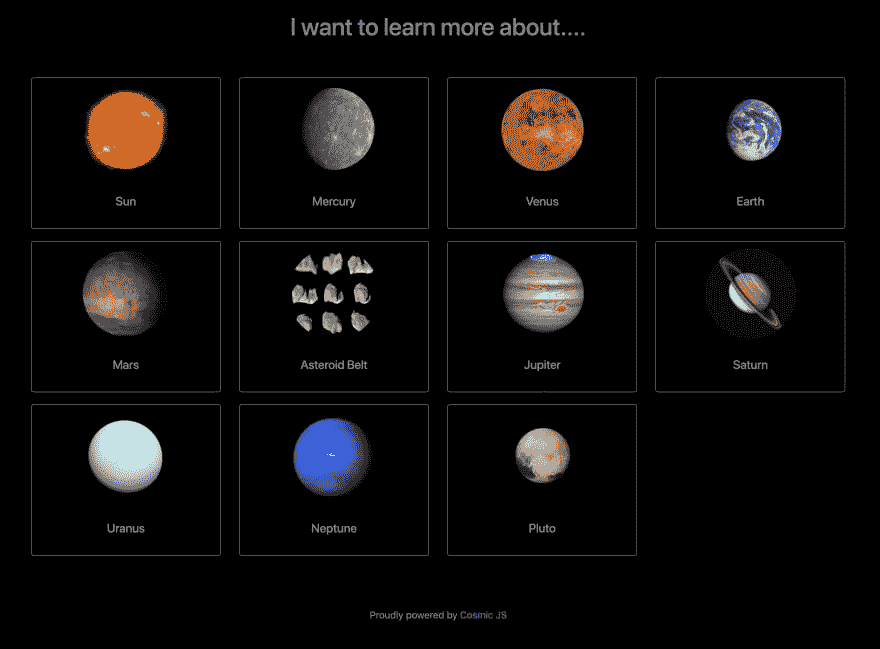

# 如何使用 Cosmic JS 和 Vue.js 创建学术网站

> 原文：<https://dev.to/abeyy/how-to-create-a-scholastic-website-using-cosmic-js-and-vuejs-4ifl>

[](https://res.cloudinary.com/practicaldev/image/fetch/s--8uJXLbiJ--/c_limit%2Cf_auto%2Cfl_progressive%2Cq_auto%2Cw_880/https://thepracticaldev.s3.amazonaws.com/i/pn7o78uo535qgfvz76km.jpg)

Cosmic JS 是一个令人惊奇的内容管理系统，它提供了以对你有意义的方式对数据进行分类和分发的选项。当建立一个用于教育目的的说明性网站时，你必须展示大量的文本、图像、视频等等。在本教程中，我们将学习如何利用 Cosmic JS CMS 的强大功能来轻松显示、跟踪和更新大量数据。

## TL；速度三角形定位法(dead reckoning)

[学术网站演示](https://cosmicjs.com/apps/vue-the-cosmos)

[在 GitHub 上查看代码](https://github.com/cosmicjs/vue-space-app)

**我们将建造什么:**
[](https://res.cloudinary.com/practicaldev/image/fetch/s--Y6E5AM_A--/c_limit%2Cf_auto%2Cfl_progressive%2Cq_auto%2Cw_880/https://cdn.filestackcontent.com/R1INrLrWQiuldnOyxrCY)

## [T1】简介](#intro)

因为这个网站上有很多文章可以帮助你开始使用 Cosmic JS，所以本教程假设你对 Cosmic JS 的工作原理有一个基本的了解。请参考入门指南。由于 Cosmic JS 是一个 API 优先的 CMS，它非常容易启动和运行——你只需要在 Vue 中进行一个简单的异步调用。在本教程的整个过程中，您将能够看到使用 Cosmic JS CMS 来划分数据和更新数据是多么容易。
安装和设置我们的项目:
在本教程中，我们将使用 Vue 的 CLI 和 NPM 来安装 Cosmic JS 并快速无缝地设置我们的项目。我们还可以安装 Vuex 来利用其全球商店:

```
$ npm install -g vue-cli
$ vue init webpack cosmic-game
$ cd cosmic-game
$ npm install --save vuex cosmicjs
$ npm install
$ npm run dev 
```

或者，我们也可以将 Bootstrap(及其对 jQuery 和 popper.js 的依赖)添加到我们的项目中，以利用一些预先编写的 CSS 来组织我们的布局:

```
$ npm install bootstrap jquery popper.js 
```

如果您选择将引导程序添加到项目中，在运行 npm install 之后，您还需要将其导入 main.js:

```
import 'bootstrap'; import 'bootstrap/dist/css/bootstrap.min.css'; 
```

## 上传资产数据到 Cosmic JS:

创建教育网站时，您的网站需要托管大量的文本、图像、视频和其他资源。当您继续迭代您的站点时，不仅能够轻松地编辑这些资产，而且能够方便地访问它们也是至关重要的。首先，我们需要为我们的项目创建一个存储桶。一旦完成，我们就可以利用 Cosmic JS 提供的一些独特属性来划分我们的数据。因为本教程中正在构建的站点是以我们的太阳系为中心的，所以让我们添加一个名为“宇宙资产”的新对象类型。宇宙资产对象将负责包含有关我们太阳系居民的信息、图像和其他资产。例如，如果我想添加一些关于木星的信息，我将进入“宇宙资产”对象类型，并创建一个名为“木星”的新宇宙资产。
现在，我们有了一个宇宙资产，可以存放任何我们想与木星联系在一起的数据。我们可以添加木星的图像，给出说明性的数据，甚至使用 CMS 提供的文本输入元域列出快速的信息花絮。
能够将我们宇宙资产的数据分解成内容字段、图像元字段和文本输入元字段，这使得浏览 CMS 并了解每条数据在我们 Vue.js 应用程序中的呈现位置变得极其容易。

## 设置我们的应用程序:

因为我们的太阳系包含如此多的物体，我们应该利用 Vue 提供的 v-for 属性来遍历它们。这防止我们为每个天体重复我们的代码，并允许我们利用基于组件的设计的全部能力。
**我们在这个项目中使用了三个组件:**
第一个组件，在我们的项目中称为 Homescreen.vue，负责渲染一切。它调用并获取我们添加到 Cosmic JS CMS 中的数据，并使用它来呈现我们的应用程序。
第二部分，在我们的项目中称为 CosmicAsset.vue，是对天体的简短介绍。它显示一个小图像和天体的名称。如果这个组件被点击，它会呈现下一个组件:cosmic page . vue .
cosmic page . vue 会呈现一个全屏的组件，这个组件会给出一个特定实体的详细信息。它有一个很大的阐述段落，一些有趣的事实，以及其他信息，如大小和它离地球的距离。在我们的 Vue 中访问从 Cosmic JS 上传的数据。JS 应用程序
我们可以利用 Cosmic JS API 来访问我们上传到 CMS 的数据。首先，我们需要初始化存储项目的存储桶。我们首先在组件中实例化 Cosmic JS，然后使用 promise 从我们想要的特定桶中返回数据。然后，我们可以改变信息，并将其作为属性添加到 Vue 组件的数据对象上。我们在 Vue 生命周期的 mounted()属性上调用 Cosmic JS API，这样一旦组件被挂载，我们需要的信息就随时可用: