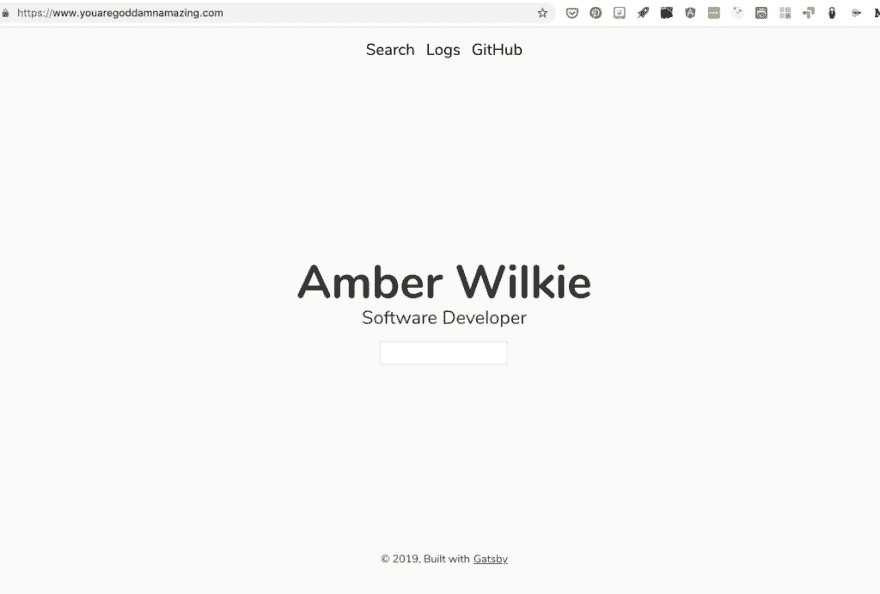
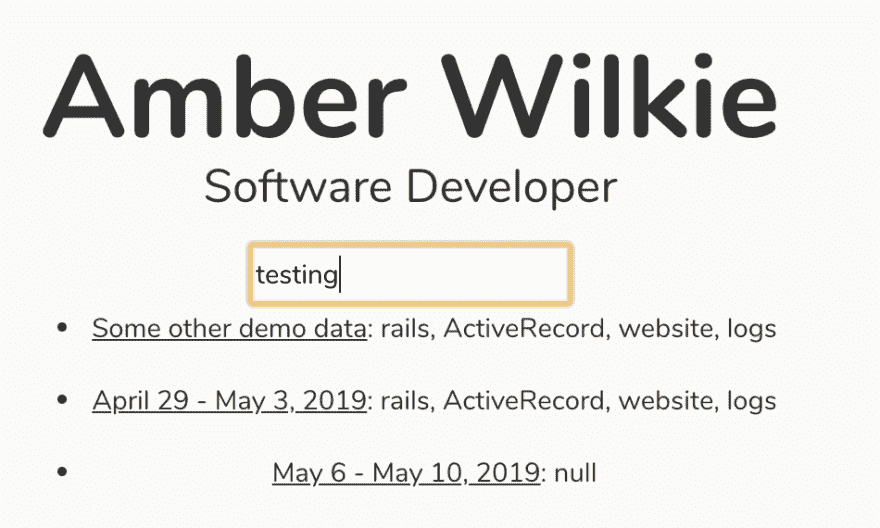
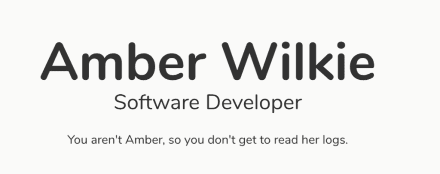
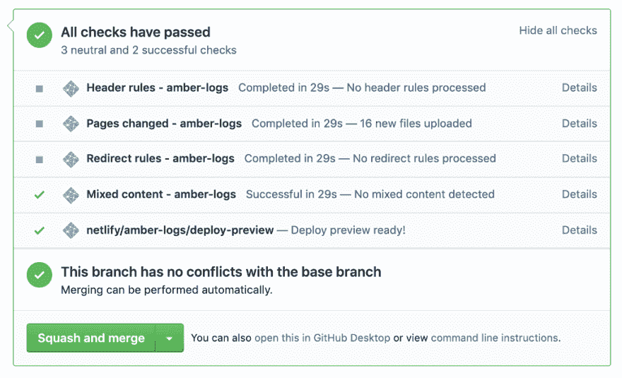

# 如何用 Gatsby 创建可搜索的日志

> 原文：<https://dev.to/amberwilkie/how-to-create-a-searchable-log-with-gatsby-328b>

#### 满足您所有的开发者笔记需求

[](https://res.cloudinary.com/practicaldev/image/fetch/s--DzKpy9YY--/c_limit%2Cf_auto%2Cfl_progressive%2Cq_auto%2Cw_880/https://cdn-images-1.medium.com/max/1024/1%2AjxvEoOYeWq64HVZAVNoI7g.jpeg)

记笔记是记住我们生活中大多数事情的关键。有多少次你在一个项目上工作，然后三个月后需要重新编写代码，而你花了几个小时才恢复正常？如果你花几分钟记下一些文档，你就可以切入正题。

[](https://res.cloudinary.com/practicaldev/image/fetch/s--UKbDo5Df--/c_limit%2Cf_auto%2Cfl_progressive%2Cq_auto%2Cw_880/https://cdn-images-1.medium.com/max/1024/1%2AIUCezy45wgJJY9YyGTghdg.png)

就我个人而言，我到处都记着笔记——大部分都记在笔记本上，但也在这个博客上。很多时候，当我完成一个大型的、困难的专题时，我喜欢把它的关键元素写在博客上，这样我以后就可以回来弄清楚我是怎么做的。另外，这可能会帮助其他人。然而，我每天学到的很多东西都溜走了。我不断地学习，再学习，效率很低。

我最近想找一种方法来快速记下我一天中学到的东西，或者我想记住的教训。但这还不够——我还需要能够*搜索*这些日志，这样我就可以马上找到我要找的东西。这正是我今天要向你们展示的。这个项目，从前到后，花了我大概一个半小时。

### 盖茨比

这个项目是使用 [Gatsby](https://www.gatsbyjs.org) 构建的，这是一个非常流行的创建静态网站的前端框架。我将跳过所有推销的东西，直接进入代码，但如果你想后退一步，我写了一篇[长博客，讲述我为什么如此热爱盖茨比](https://medium.freecodecamp.org/how-to-leverage-your-react-skills-with-static-site-generator-gatsby-js-81843e928606)。简而言之:如果你知道 React，那就太棒了，如果你需要一个静态站点，那也是值得学习的。

### 第一步:使用漂亮的“Julia”模板创建一个新的 Gatsby 站点

假设您已经运行了 Gatsby CLI，运行这个命令来获取精简但布局精美的 Julia 模板:

```
gatsby new <site-name> https://github.com/niklasmtj/gatsby-starter-julia 
```

Pop 打开 gatsby-config.js，将您的详细信息替换为 siteMeta 下的“Julia Doe”。你已经成功了一半。

### 第二步:添加日志记录

现在我们想给网站添加一些功能。在内容目录中，添加一个或二十个 markdown 文件。你爱怎么筑巢就怎么筑巢。您将遵循以下格式:

```
---
title: "Whatever title you want"
date: "2019-05-010"
draft: false
path: "/logs/some-slug-for-the-file"
tags: testing, documentation
---

_# Monday, May 6, 2019_  
\* Added documentation .... 
```

请注意，每个文件的路径必须是唯一的。我用日期命名我的文件(每周得到一个文件)，但是显然你可以做任何你喜欢的事情。

#### 步骤 2A:按照 Gatsby 文档从 Markdown 创建页面

我可以重申，但是盖茨比文档本身非常简单易懂。您将安装所需的插件，在 gatsby-config.js 中配置它们，为您的帖子创建一个模板，并设置 gatsby-node.js 从您的 markdown 文件构建页面。

从互联网上的其他地方窃取一个提示:如果你前往一个你知道不会带你去任何地方的本地主机页面(我更喜欢本地主机:8000/garbage)，你可以看到你的页面的所有可用链接。这是检查 Gatsby 是否恰当地创建了您所有的减价页面的快速方法。

[](https://res.cloudinary.com/practicaldev/image/fetch/s--yd0yIsJm--/c_limit%2Cf_auto%2Cfl_progressive%2Cq_auto%2Cw_880/https://cdn-images-1.medium.com/max/1024/1%2ANxvJemAEOQDj_3pWWYFeCQ.png)

#### 保持清洁

我在这个项目中了解到，你可以分配多个文件夹让 Gatsby 的文件系统插件扫描:

```
{
  resolve: `gatsby-source-filesystem`,
  options: {
    name: `images`,
    path: `${__dirname}/src/images`,
  },
},
{
  resolve: `gatsby-source-filesystem`,
  options: {
    name: `markdown-pages`,
    path: `${__dirname}/src/content`,
  },
}, 
```

因此，如果您已经在使用 gatsby-source-filesystem 来读取(例如)您的图像文件，那就没有问题。我还测试了嵌套，Gatsby 会递归地抓取你的内容文件夹中的任何内容——所以你可以按照你喜欢的任何方式进行组织。

美好时光！如果您转向 Gatsby docs，您现在应该有一个功能完整的日志系统。

### 第三步:添加搜索

现在是有趣的部分。我们将添加使用 [Gatsby lunr 弹性搜索插件](https://github.com/gatsby-contrib/gatsby-plugin-elasticlunr-search)搜索日志的功能。

#### 配置

首先，yarn 添加@ Gatsby-contrib/Gatsby-plugin-elastic lunr-search，然后我们将添加到 gatsby-config.js:

```
{
  resolve: `@gatsby-contrib/gatsby-plugin-elasticlunr-search`,
  options: {
    // Fields to index
    fields: [`title`, `tags`, `html`],
    resolvers: {
      MarkdownRemark: {
        title: node => node.frontmatter.title,
        tags: node => node.frontmatter.tags,
        path: node => node.frontmatter.path,
**html: node => node.internal.content,**
      },
    },
  },
}, 
```

请注意，我添加了一个 lunr docs: html 中没有的字段。我们需要它来对日志进行全文搜索，而不仅仅是通过标签进行搜索。

#### 添加搜索栏

显然你的可以去任何地方。我把我的放在我名字下面的索引上。

**搜索栏组件:**

```
import React from "react"
import { graphql, StaticQuery } from "gatsby"
import Search from "./search"

export default () => {
  return (
    <StaticQuery
      query={graphql`
          query SearchIndexQuery {
            siteSearchIndex {
              index
            }
          }
        `}
      render={data => (
        <Search searchIndex={data.siteSearchIndex.index}/>
      )}
    />
  )
} 
```

这里没有发生什么——我们只是从弹性搜索数据中抓取搜索索引。

搜索组件实际上是直接从 lunr 文档复制而来的:

```
import React, { Component } from "react"
import { Index } from "elasticlunr"
import { Link } from "gatsby"
import styled from "@emotion/styled"

export default class Search extends Component {
  state = {
    query: ``,
    results: []
 }

  render() {
    return (
      <div>
        <input type="text" value={this.state.query} onChange={this.search} />
        <ul>
          {this.state.results.map(page => (
            <li key={page.id}>
              <Link to={"/" + page.path}>{page.title}</Link>
              {': ' + page.tags}
            </li>
          ))}
        </ul>
      </div>
    )
  }

  getOrCreateIndex = () => {
    return this.index
      ? this.index
      : // Create an elastic lunr index and hydrate with graphql query results
      Index.load(this.props.searchIndex)
  }

  search = evt => {
    const query = evt.target.value
    this.index = this.getOrCreateIndex()
    this.setState({
      query,
      // Query the index with search string to get an [] of IDs
      results: this.index
        .search(query, { expand: true })
        // Map over each ID and return the full document
        .map(({ ref }) => {
          return this.index.documentStore.getDoc(ref)
        }),
    })
  }
} 
```

您构建一个搜索索引，根据部分字符串获取结果，根据索引返回的内容合并这些结果，然后映射到这些结果上进行显示。

真的是这样。当 Gatsby build 运行时，您的 markdown 页面将被构建，并且您的搜索将在您第一次尝试搜索时建立索引。

[](https://res.cloudinary.com/practicaldev/image/fetch/s--9NF8RiIN--/c_limit%2Cf_auto%2Cfl_progressive%2Cq_auto%2Cw_880/https://cdn-images-1.medium.com/max/950/1%2AgDARf4Ic8ft3REARmuHakw.png)

### 第四步:添加安全性

我不会在这些日志中放入任何国家机密或环境变量，但我不想让潜在的雇主无意中发现它们，主要是因为我想自由地谈论我的奋斗或非常清楚我不知道的事情。如果我不得不审查自己，这将影响我的日志质量。

与此同时，我不能被登录或任何过于花哨的事情所困扰。所以我选择了我能想到的最愚蠢、最松散、最简单的安全措施:一个基本的本地存储令牌。如果你有，你会看到日志，如果没有，太糟糕了。这就是工作原理。

在 landing-bio.js 和任何我想保护的地方:

```
const isBrowser = () => typeof window !== "undefined"
const isAuthenticated = isBrowser() && window.localStorage.getItem('authenticated');

[...]

{isAuthenticated ? <SearchBar /> : <div>You aren't Amber, so you don't get to read her logs.</div>} 
```

我从来不会用它来处理实际上很敏感的信息，但是我的同事不会偷看我的个人日志，这让我稍微安心了一点。

[](https://res.cloudinary.com/practicaldev/image/fetch/s--MhE5Kwc7--/c_limit%2Cf_auto%2Cfl_progressive%2Cq_auto%2Cw_880/https://cdn-images-1.medium.com/max/1024/1%2AxqnLsxtodfpAgXsiRDewEA.png)

请注意，浏览器检查(第一行)对于通过 Netlify 上的测试是必需的——没有它也能正常工作。

### 奖励:使用网络部署

我在我的[前盖茨比博客](https://medium.freecodecamp.org/how-to-leverage-your-react-skills-with-static-site-generator-gatsby-js-81843e928606)上谈到我有多爱 [Netlify](https://www.netlify.com) ，我仍然爱他们。把你的东西放在网上太容易了。

你所要做的就是前往 Netlify，授权他们访问存储你的日志的 Github，他们将监控 Github，并在你推送至 master 时为你发布新的版本。他们还会在您制作 PRs 时创建部署预览！它真的很棒，我强烈推荐它们。

[](https://res.cloudinary.com/practicaldev/image/fetch/s--gF_GzbM3--/c_limit%2Cf_auto%2Cfl_progressive%2Cq_auto%2Cw_880/https://cdn-images-1.medium.com/max/1024/1%2A-IcqAHgJ3DHJYu8tzYEihQ.png)

如果您打算在 markdown 中创建日志，我强烈推荐一个像这个一样简单的部署系统，我不知道还有哪个系统像它一样无缝。

* * *