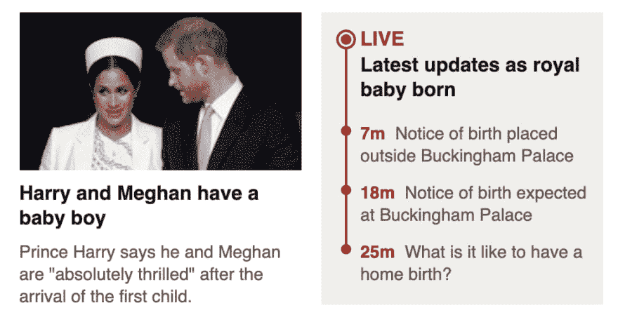

# 如何用 CSS 创建联合列表，BBC 新闻风格

> 原文：<https://dev.to/peterc/how-to-create-joined-bulletpoint-lists-with-css-bbc-news-style-1eem>

当有现场直播时，BBC 新闻通常会针对报道运行一个“时间轴”样式的列表。例如:

[](https://res.cloudinary.com/practicaldev/image/fetch/s--7uzKE53C--/c_limit%2Cf_auto%2Cfl_progressive%2Cq_auto%2Cw_880/https://res.cloudinary.com/cpress/image/upload/v1557229095/cixcmfqzdkynqchdljz3.png)

我很想知道他们是如何将列表项的项目符号动态地用一条线连接起来的，于是我开始用我可信赖的 Chrome DevTools 来解决这个问题。

好家伙，他们的标记是一次旅行！

[](https://res.cloudinary.com/practicaldev/image/fetch/s--2kPAadKp--/c_limit%2Cf_auto%2Cfl_progressive%2Cq_auto%2Cw_880/https://res.cloudinary.com/cpress/image/upload/q_10/qd7zzohkphyllnngxwmq.jpg)

长话短说，这是一个标准的 HTML 列表(BBC 用的是`<ol>`，但我用的是`<ul>`)，其中每个列表项(`<li>`)都有一个`:before`伪元素，内容为空，但标记为 2 像素宽，背景颜色为红色。这就在每个`<li>`前创建了一条‘线’。进一步的样式化然后定位这个伪元素/线。

[](https://res.cloudinary.com/practicaldev/image/fetch/s--XljrlMpG--/c_limit%2Cf_auto%2Cfl_progressive%2Cq_auto%2Cw_880/https://res.cloudinary.com/cpress/image/upload/v1557229617/esgru7egi5rrs3jqmtal.png)

CSS 的关键部分是伪元素:

```
li:before {
  background-color: #c00;
  width: 2px;
  content: '';
  position: absolute;
  top: 0px;
  bottom: 0px;
  left: 5px;
} 
```

您还需要确保列表项本身使用了`relative`定位，这样伪元素上的`position: absolute`就不会基于页面，而是基于列表项本身:

```
li {
  /* You need to turn on relative positioning so the line is placed relative to the item rather than absolutely on the page */
  position: relative;

  /* Use padding to space things out rather than margins as the line would get broken up otherwise */
  margin: 0;
  padding-bottom: 1em;
  padding-left: 20px;
} 
```

*(还要注意，如果你现在想要在你的行项目之间有间隙，你需要使用填充，否则行会被页边空白打断！)*

项目符号不是标准的 HTML 项目符号，而是使用内嵌 SVG 绘制的圆圈。理论上你可以使用任何形状(星星，正方形，无论什么)，甚至可能是类似表情符号的东西，但我只是复制了 BBC 使用的圆形方法。

我没有用它如何工作的技术解释来烦你，而是把它归结为我能想到的最简单的代码示例，添加了大量的注释，并放在 CodePen 上供你摆弄。

在这里玩它:

[https://codepen.io/peterc/embed/vwEJJN?height=600&default-tab=result&embed-version=2](https://codepen.io/peterc/embed/vwEJJN?height=600&default-tab=result&embed-version=2)

*后期添加:*

Twitter 上的 Saadat 通过使用`:after`伪元素将项目符号的 SVG 烘焙到 CSS 中，进一步扩展了上述概念！这使得代码更加清晰。在这支笔中，他们的代码是[，但问题的关键是:](https://codepen.io/anon/pen/gJpLrR) 

```
/* Small bullets for normal list items */
li::after {
  content: '';
  position: absolute;
  background-image: url("data:image/svg+xml,%3Csvg xmlns='http://www.w3.org/2000/svg' aria-hidden='true' viewBox='0 0 32 32' focusable='false'%3E%3Ccircle stroke='none' fill='%23c00' cx='16' cy='16' r='10'%3E%3C/circle%3E%3C/svg%3E");
  background-repeat: no-repeat;
  background-size: contain;
  left: 0;
  top: 2px;
  width: 12px;
  height: 12px;
} 
```