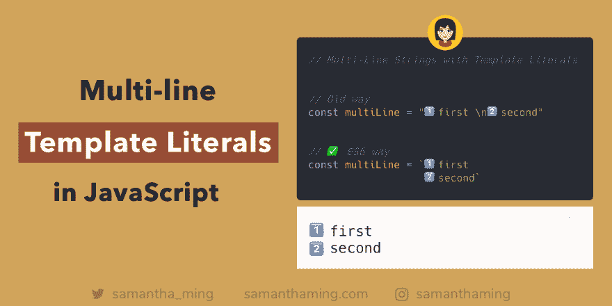

# 如何用模板文字创建多行字符串

> 原文：<https://dev.to/samanthaming/how-to-create-multi-line-string-with-template-literals-2bbc>

[](https://res.cloudinary.com/practicaldev/image/fetch/s--AGp_s-4Q--/c_limit%2Cf_auto%2Cfl_progressive%2Cq_auto%2Cw_880/https://thepracticaldev.s3.amazonaws.com/i/vndomhj6tvwl122vmw43.png)

随着模板文字的出现，产生多行字符串终于变得超级容易了。以前，我们不得不使用`\n`或单独的字符串连接，这既麻烦又难以阅读。最后，现在更容易了。ES6 赢得胜利🙌

```
// Old way
const multiLine1 = "1️⃣first \n2️⃣second";

// ✅ ES6 way
const multiLine2 = `1️⃣first
2️⃣second`;

/* RESULT
1️⃣first
2️⃣second
*/ 
```

## 多行对单行字符串

我只是想确保我澄清，当我说“多行”时，我的意思是字符串的**输出**跨越多行。举个例子，如果我`console.log`这个变量，它会产生这样的东西:

```
// Multi-Line

1️⃣first
2️⃣second 
```

这里有一个“单行”输出:

```
// Single-Line

1️⃣first 2️⃣second 
```

我之所以强调这一点，是因为 JavaScript 中还有其他方法可以创建字符串。但是请注意，它们实际上不会产生真正的“多行”输出😱

**例如。使用`+`**

```
const notTrueMultiLine = '1️⃣first' +
'2️⃣second' +
'3️⃣three';

console.log(notTrueMultiLine);
// 1️⃣first2️⃣second3️⃣three 
```

**例如。使用`\`**

```
const notTrueMultiLine = "\ 1️⃣first \ 2️⃣second \ 3️⃣three";

console.log(notTrueMultiLine);
// 1️⃣first2️⃣second3️⃣three 
```

即使如此，它也可能以多行形式出现在您的代码中。但是输出的时候，其实是单行的。要创建真正的多行输出，您必须使用模板文字或`\n`。我只是想确保我指出了这一点，因为我记得当我第一次学习 JavaScript 时犯了这个错误😖

## 模板文字中的空格

因此，模板文字将输出它出现，空格和所有！因此，要注意你的空格或空白行。

```
const blankSpace = `
first
    second
  third

`; 
```

这是输出。我用点来表示空白，用◻️:来表示⚪️和换行符

```
□
first
····second
··third
□
□ 
```

## 用模板文字进行 HTML 模板化

这是我最喜欢的使用模板文字多字符串功能的用例。它使得 HTML 标记的可读性更强，也更容易呈现。我记得之前，唯一的办法就是用 [Handlebars.js](https://handlebarsjs.com/) 之类的模板系统。嗯，不再是了。我们不需要导入任何东西，只需要使用普通的 JS 就可以达到同样的效果。太牛逼了！总之，让我们来看一些例子:

**✅Ex.使用模板文字的 HTML 标记**

```
const HTMLmarkup = `
<article>
  <h1>Code Tidbits</h1>
</article>
`; 
```

例如。使用旧 JavaScript 的 HTML 标记

```
const HTMLmarkup = "<article>" +
"<h1>Code Tidbits</h1>" + 
"</article>"; 
```

例如。HTML 标记使用 Handlebars.js

```
<script id="entry-template" type="text/x-handlebars-template">
  <article>
    <h1>Code Tidbits</h1>
  </article> </script>

<!-- also need to import handlebars --> 
```

## 资源

*   [MDN Web 文档:模板文字](https://developer.mozilla.org/en-US/docs/Web/JavaScript/Reference/Template_literals)
*   [堆栈溢出:在 JavaScript 中创建多行字符串](https://stackoverflow.com/questions/805107/creating-multiline-strings-in-javascript)
*   [CSS 技巧:JavaScript 中的多行字符串变量](https://css-tricks.com/snippets/javascript/multiline-string-variables-in-javascript/)
*   [DWB:多行 JavaScript 字符串](https://davidwalsh.name/multiline-javascript-strings)
*   [ES6 JavaScript 中的多行字符串](https://jack.ofspades.com/multiline-strings-in-es6-javascript/)
*   [Github 要点:多线](https://gist.github.com/jeromeetienne/6257420)
*   [使用 JavaScript 的模板字符串轻松创建 HTML】](https://wesbos.com/template-strings-html/)

* * *

**感谢阅读❤**
问好！[insta gram](https://www.instagram.com/samanthaming/)|[Twitter](https://twitter.com/samantha_ming)|[脸书](https://www.facebook.com/hisamanthaming) | [媒体](https://medium.com/@samanthaming) | [博客](https://www.samanthaming.com/blog)