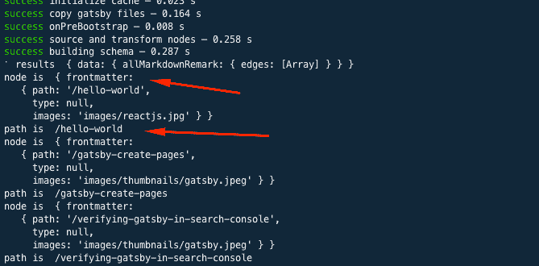
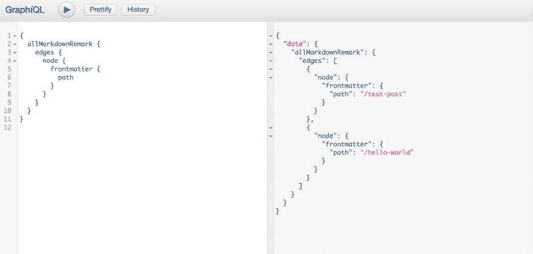

# 如何在盖茨比中动态创建页面

> 原文：<https://dev.to/malroun1/how-to-create-pages-dynamically-in-gatsby-19k4>

在这篇文章中，我们将探讨如何从 Gatsby 中的数据(markdown 文件)以编程方式创建页面。

为了从 markdown 动态创建这些页面，我们将研究 Gatsby 的 Node `createPages` API。

然而，在我们这样做之前，我们需要安装几个插件来获取和转换 markdown 文件，以便 Gatsby 能够理解 markdown 文件的路径及其内容，并能够创建这些页面。

要创建页面，您需要执行以下操作来动态创建:

1.  读取降价文件并转换它们

通过安装以下插件

```
npm install --save gatsby-source-filesystem gatsby-transformer-remark 
```

Enter fullscreen mode Exit fullscreen mode

我们通过传递一个包含变量和文件路径的 options 对象，告诉 Gatsby 我们的内容路径和文件系统中的`gatsby-source-filesystem`。

此外，我们可以使用`gatsby-transformer-remark`将这些 markdown 文件内容转换为 HTML，将 frontmatter 元数据转换为 frontmatter，这将把这些文件转换为包含 MarkdownRemark 节点类型的边，并将每个 frontmatter 字段转换为 GraphQL 字段，我们可以稍后在页面/组件中查询这些字段，并在构建时映射它们。

为了读取 markdown 文件路径并将它们转换成 GraphQL 字段，我们需要在安装两个插件后将下面的配置添加到我们的`gatsby-config.js`中。

```
//gatsby-config.js
 `gatsby-transformer-remark`,
{
      resolve: `gatsby-source-filesystem`,
      options: {
        name: `posts`,
        path: `${__dirname}/content/posts`, // for the path you can change it based on your preferred folder structure
      },
}, 
```

Enter fullscreen mode Exit fullscreen mode

1.  为降价文件创建页面组件(模板)

我们需要创建一个页面模板组件，它将在构建时使用 GraphQL 与数据(可用的 graphql 字段，这些字段是用 gatsby-transformer-remark 转换的)进行映射，以动态创建这些页面。

在下面的内容中，你可以看到我为博客文章使用的文章模板的一个简化的例子。**注意(你可以创建任意多的模板)**

```
import React from 'react';
import { graphql } from 'gatsby';

const Post = ({ data }) => {
  const { markdownRemark } = data;
  const { title, date } = markdownRemark.frontmatter;
  const { html, timeToRead } = markdownRemark;

  return (
    <div>
      <div className="post-wrapper">
        {title}
        <div>
          <p>{date}.</p>
          <p>{timeToRead} min read.</p>
        </div>
        <div className="blogpost" dangerouslySetInnerHTML={{ __html: html }} />
      </div>
    </div>
  );
}; 
```

Enter fullscreen mode Exit fullscreen mode

下面我们可以看到特定的数据(GraphQL 字段)正在被提取，并在上面的模板组件中使用现成的 GraphQL 查询。

```
export  const  query  =  graphql`  query($pathSlug:  String!)  {  markdownRemark(frontmatter:  {  path:  {  eq:  $pathSlug  }  })  {  html  frontmatter  {  title  date  }  timeToRead  }  }  `; 
```

Enter fullscreen mode Exit fullscreen mode

1.  使用 gatsby 的 node `createPages` API 以编程方式创建页面

要创建新页面，我们需要执行以下步骤

*   使用 createPages API 为页面生成 slug(路径)
*   通过将内容(转换后的降价文件)映射到页面组件模板来创建页面

在`gatsby-node.js`中，我们导出 createPages API 并传递给它两个参数，`graphql`用于查找文件，`actions`其中 createPages 是它的一个属性。

由于文件创建的异步性质，createPages 函数将返回给我们一个新的承诺(或者，您可以按照 gatsby docs 中的示例使用回调)。

为了创建这些页面，我们需要使用“path.resolve”访问页面模板。

要将 promise 的状态更改为 fulfilled，我们需要通过调用 graphql 来解决这个问题，并向它传递我们对 allmarkdownremark 的查询，其中包含我们希望帖子所在位置的路径字段。(这个路径字段是我们在 markdown frontmatter 元数据中设置的)。

此外，我们将一个函数传递给`.then`,一旦状态变为“已完成”,这个函数将被调用，我们将结果值传递给这个函数。结果将包含一个与我们的查询匹配的数据对象，正如您在屏幕截图中看到的那样。

在函数体中，我们将使用 foreach 迭代每个文件节点(边是指向文件系统节点的路径)，以提取 frontmatter 中那些节点的路径。

您可以通过控制台日志节点参数，查看查询中每个 markdown 文件返回的值，该值类似于下面的屏幕截图，显示了我们可以从节点内容中得到的结果。

[](https://res.cloudinary.com/practicaldev/image/fetch/s--ifkhseXG--/c_limit%2Cf_auto%2Cfl_progressive%2Cq_auto%2Cw_880/v1/./https://thepracticaldev.s3.amazonaws.com/i/pgyi3l2bc8bb5a1e2t69.png)

有了可用的路径值，现在我们可以调用“createPage”操作，该操作接受 3 个参数:页面 url 的路径、要呈现的组件(页面模板组件)和将作为属性对页面组件可用的上下文对象。当我们将上下文对象传递给模板组件时，我们希望模板知道文件的路径，该文件将被称为 pathslug，因为 path 是保留关键字，pathSlug 的值将是节点 frontmatter 提供的字段。在 createPage 调用之后，我们将解析 promise，如下例所示。

```
exports.createPages = ({ graphql, actions }) => {
  const { createPage } = actions;
  return new Promise((resolve, reject) => {
    // to create the page we need access to the blog post template
    const postTemplate = path.resolve('src/templates/postTemplate.js');
    resolve(
      graphql(
        `
          {
            allMarkdownRemark {
              edges {
                node {
                  frontmatter {
                    path
                  }
                }
              }
            }
          }
        `
      ).then(result => {
        if (result.errors) {
          console.log(result.errors);
          reject(result.errors);
        }
        result.data.allMarkdownRemark.edges.forEach(({ node }) => {
          // you can see node value in the screenshot
          const path = node.frontmatter.path;

          createPage({
            path,
            component: postTemplate,
            context: {
              /*
              the value passed in the context will be available for you to use in your page queries as a GraphQL variable, as per the template snippet */
              pathSlug: path,
            },
          });
          resolve();
        });
      })
    );
  });
}; 
```

Enter fullscreen mode Exit fullscreen mode

在下面的 GraphiQl 中运行时，您可以在上面的代码片段中看到 graph qhl 查询的结果

[](https://res.cloudinary.com/practicaldev/image/fetch/s--q8wCa8Wa--/c_limit%2Cf_auto%2Cfl_progressive%2Cq_auto%2Cw_880/v1/./https://thepracticaldev.s3.amazonaws.com/i/5j230o7z98wgumrk8qv2.png)

**这里有一个[的演示](https://peaceful-davinci-7ffc1f.netlify.com/)盖茨比的 createPages 跟帖，你可以在这里找到回购**