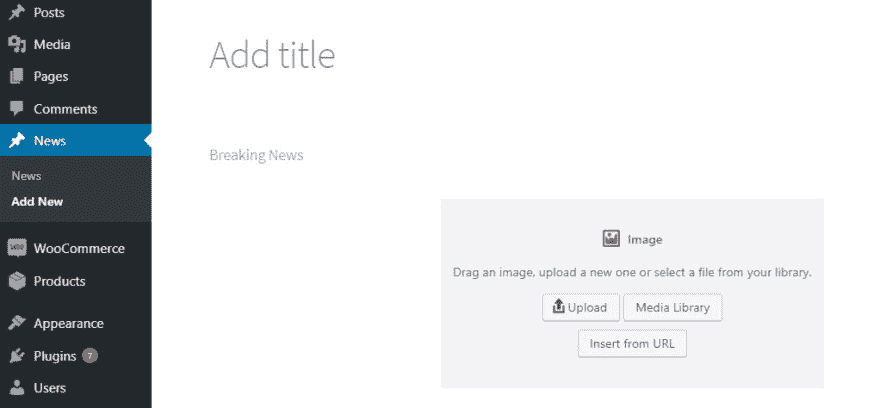

# 如何创建 WordPress Gutenberg 块模板

> 原文：<https://dev.to/alvinarichard/how-to-create-wordpress-gutenberg-block-templates-460m>

创建定制的[古腾堡块模板](https://www.cloudways.com/blog/create-wordpress-gutenberg-block-templates/)有两种方法。

**1。注册古腾堡块**

第一步，我们创建可用于构建预填充块的自定义块模板。将以下代码添加到 functions.php 中。

`add_action( 'init', function() {
$args = array(
'public' => true,
'label' => 'News',
'show_in_rest' => true,
'template_lock' => 'all',
'template' => array(
array( 'core/paragraph', array(
'placeholder' => 'Breaking News',
) ),
array( 'core/image', array(
'align' => 'right',
) ),
),
);
register_post_type( 'news', $args );
} );`

在上面的代码中，数组参数“core/paragraph”负责块的内容，数组参数“core/image”允许您上传图像

要将自定义块添加到此模板，请使用“模板”子数组。

 `'template' => array(
array( 'core/heading', array( 'level' => '4', 'content' => 'Heading' ) ),
array( 'core/paragraph' ),
)` 

**2。创建古腾堡插件**
使用自定义模板时，最好的方法是创建一个古腾堡编辑器插件。

要创建插件，请转到 wp-content/plugins 目录并创建一个新文件夹。文件夹的名称必须是自定义 Gutenberg 模板插件的名称。在这里，我将我的插件命名为古腾堡块。

创建一个名为 Gutenberg-blocks.php 的文件，并添加以下代码

 `add_action( 'init', function() {
$args = array(
'public' => true,
'label' => 'News',
'show_in_rest' => true,
'template_lock' => 'all',
'template' => array(
array( 'core/paragraph', array(
'placeholder' => 'Breaking News',
) ),
array( 'core/image', array(
'align' => 'right',
) ),
),
);
register_post_type( 'news', $args );
} );` 

