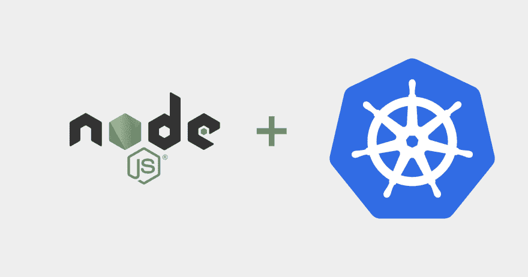
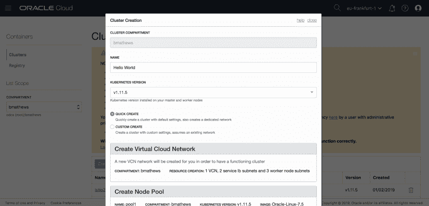
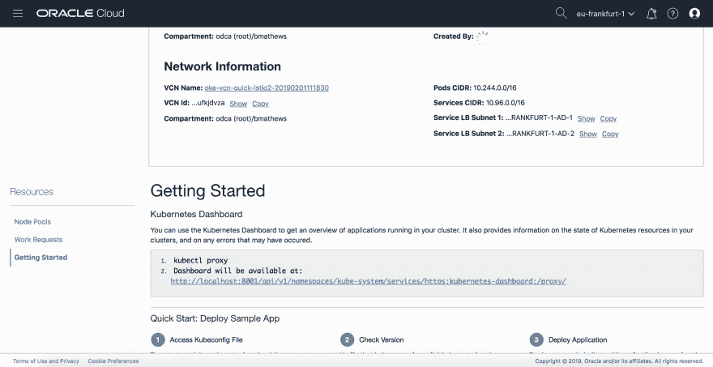

# 如何在 Kubernetes 上部署 Express Node.js 应用程序以及容器化介绍

> 原文：<https://dev.to/bmwhopper/how-to-deploy-a-express-nodejs-app-on-kubernetes-and-an-intro-to-containerisation-2fin>

[](https://res.cloudinary.com/practicaldev/image/fetch/s--wNxG4c9a--/c_limit%2Cf_auto%2Cfl_progressive%2Cq_auto%2Cw_880/https://cdn-images-1.medium.com/max/2600/1%2ARgCNLyra9rfaJdWUxh38xw.jpeg)

 **虽然容器技术已经存在了很多年，但 Docker 真正把它变成了主流。许多公司和开发者现在使用容器来发布他们的
应用。Docker 提供了一个易于使用的接口来处理容器。

然而，对于任何重要的应用程序，您将不会部署“一个
容器”，而是在多个主机上部署一组容器。在本文中，
我们将了解一下 [Kubernetes](https://kubernetes.io/) ，一个用于自动化部署、扩展和管理容器化
应用的开源系统
。

### **库伯奈特解决了什么问题？**

使用 Docker，您可以使用类似于`docker run`或`docker stop`的简单命令来分别启动/停止一个容器。与这些让您在单个容器上执行操作的简单命令不同，没有`docker deploy`命令将新映像推送到一组主机。

最近出现了很多工具来解决这个“容器编排”的问题；流行的有 [Mesos](http://mesos.apache.org/) 、 [Docker Swarm](https://docs.docker.com/engine/swarm/) (现在是 Docker 引擎的一部分)、 [Nomad](https://www.nomadproject.io/) 和 Kubernetes。它们都有各自的优缺点，但是，最近我们看到，Kubernetes 在使用和功能方面处于相当大的领先地位。

Kubernetes(也称为“k8s”)提供了强大的抽象，将部署和扩展等应用程序操作与底层基础架构操作完全分离。因此，有了 Kubernetes，你不需要在单独的主机或虚拟机上运行你的代码，而是 Kubernetes 将底层基础设施视为一个放置容器的计算海洋。

### **Kubernetes 概念**

Kubernetes 有一个客户端/服务器架构。Kubernetes 服务器运行在您的*集群*(一组主机)上，您将在其上部署您的应用程序。您通常使用客户端(如`kubectl` CLI)与集群进行交互。

### **豆荚**

pod 是 Kubernetes 处理的基本单元，即一组容器。如果有两个或更多的容器总是需要一起工作，并且应该在同一台机器上，那么就把它们做成一个`pod`。

### **节点**

节点是一个运行 Kubernetes 的物理或虚拟机，可以在其上调度 pods。

### **标签**

标签是用于标识资源的键/值对。例如，您可以用“角色=生产”来标记所有的`pods`服务生产流量。

### **选择器**

通过选择，您可以按标签搜索/过滤资源。根据上一个示例，要获得所有生产单元，您的选择器应该是“role=production”。

### **服务**

服务定义了一组 pods(通常由“选择器”选择)和访问它们的方法，例如单一稳定的 IP 地址和相应的 DNS 名称。

### **使用 Kubernetes 在 OKE 上部署一个 Express Node.js 应用**

现在，我们已经了解了 Kubernetes 的基本概念，让我们通过部署 Node.js 应用程序来看看它的实际应用。首先，如果您无法访问 OCI，请访问[试用| OCI](https://myservices.us.oraclecloud.com/mycloud/signup?sourceType=:so:bl:or::RC_WWSA180813P00054:Q4_MM_BM&SC=:so:bl:or::RC_WWSA180813P00054:Q4_MM_BM&pcode=WWSA180813P00054)

### **1。安装 Kubernetes 客户端**

`kubectl`是针对 Kubernetes 集群运行命令的命令行界面。`kubectl`:

验证安装运行`kubectl version`。

### **2。为您的应用程序创建一个 Docker 映像**

这是我们将要使用的应用程序: [express.js-hello-world](https://github.com/bmwhopper/express.js-hello-world) 。您可以在 [Dockerfile](https://github.com/bmwhopper/express.js-hello-world/blob/master/Dockerfile) 中看到，我们正在使用来自 [dockerhub](https://hub.docker.com/) 的现有 Node.js 映像。

**现在，我们将通过运行:**构建我们的应用程序映像

```
docker build -t hello-world-image . 
```

**通过运行:**在本地运行应用程序

```
docker run --name hello-world -p 3000:3000 hello-world-image 
```

如果你访问`localhost:3000`，你应该会得到回应。

### **3。创建一个集群**

现在，我们将创建一个包含三个节点(虚拟机)的集群，在其上部署我们的应用程序。你可以在你的免费 OCI 账户中使用容器引擎页面来轻松实现。

创建 OKE 集群需要做的第一件事是让 Kubernetes 访问您的租赁资源。

**您可以通过将以下** [策略添加到您的隔离专区](https://docs.cloud.oracle.com/iaas/Content/ContEng/Concept/contengpolicyconfig.htm)** 来实现这一点:**

```
Allow service OKE to manage all-resources in tenancy 
```

然后，您将能够访问 OKE 容器控制台，并开始创建集群，如下所示:

[](https://res.cloudinary.com/practicaldev/image/fetch/s--iVoLNiKU--/c_limit%2Cf_auto%2Cfl_progressive%2Cq_auto%2Cw_880/https://cdn-images-1.medium.com/max/2600/1%2AfPkuiYF_xrP1sMsGvfce5g.png)

创建集群时，您有 **2 个**选项、**快速**或**自定义**创建:

#### **快速创建:**

允许您过快地创建一个具有默认设置的集群，同时创建一个专用网络。

#### **自定义创建:**

使用自定义设置创建群集，假设有一个现有网络。

** *为此，您可以选择更适合您需求的选项，对于我的集群，我选择了“快速创建”。*

在本教程中，我们将创建一个包含 3 个节点的集群，即主节点和 2 个工作节点。我们正在使用虚拟机。标准 2.1 机器类型，因为对于这个应用程序，我们不需要更大的计算能力。

一旦您的集群启动并运行，我们就可以将它连接到`kubectl`，这样我们就可以从我们的 Kubernetes 命令行访问集群。您可以通过访问“kubeconfig:这可以从“Getting Started”菜单下载，如下所示:

[](https://res.cloudinary.com/practicaldev/image/fetch/s--2JtQ5b_d--/c_limit%2Cf_auto%2Cfl_progressive%2Cq_auto%2Cw_880/https://cdn-images-1.medium.com/max/2600/1%2AnoZWbFoVep65IjDco4FZNA.png)

### **4。将 Docker 映像上传到 Oracle 容器映像注册表**

所以，现在我们有了一个 docker 映像和一个集群。我们希望将该映像部署到我们的集群中，并启动容器来满足请求。

Oracle container image registry 是一个云注册表，您可以在其中推送您的映像，这些映像会自动对您的容器引擎集群可用。要推送一个图像，你必须用一个合适的名字来构建它。

**要构建这个应用程序的容器映像并标记它以便上传，运行下面的命令:**

```
docker tag bmwhopper/helloworld:latest <region-code>.ocir.io/<tenancy-name>/<repo-name>/<image-name>:<tag> 
```

`v1`是图像的*标签*。

**下一步是将我们刚刚创建的图像上传到 OCIR:**

```
docker push <region-code>.ocir.io/<tenancy-name>/<repo-name>/<image-name>:<tag> 
```

有关图像标记和构建的更多详细步骤，请参见此处的[详细指南。](https://www.oracle.com/webfolder/technetwork/tutorial%20/obe/oci/registry/index.html)

### **5。首次部署**

现在我们在云中有了一个集群和一个映像。让我们用 Kubernetes 在集群上部署这个映像。我们将通过创建一个`deployment`规范文件来实现。部署是一个 kubernetes 资源，所有的 kubernetes 资源都可以由一个规范文件定义。这个规范文件展示了资源的期望状态，然后 Kubernetes 指出如何从当前状态进入期望状态。

**让我们为第一次部署创建一个:**

[](https://res.cloudinary.com/practicaldev/image/fetch/s--c8mbKyEL--/c_limit%2Cf_auto%2Cfl_progressive%2Cq_66%2Cw_880/https://cdn-images-1.medium.com/max/1600/1%2AOFE7T4E0L7Rr__PW5WcDSw.gif)

**Deployment.yaml**

`apiVersion: apps/v1beta1
kind: Deployment
metadata:
name: hello-world-deployment
spec:
replicas: 2
template:
metadata:
labels: # labels to select/identify the deployment
app: hello-world
spec: # pod spec
containers:
- name: hello-world
image: hello-world-image:v1 # image we pushed
ports:
- containerPort: 3000`

这个规范文件说:启动两个 pod，每个 pod 由给定的 pod 规范定义。每个 pod 应该有一个容器，里面装着我们推动的`hello-world-image:v1`。

**现在，运行:**
$ ku bectl create-f deployment . yml-save-config

您可以通过运行`kubectl get deployments`来查看您的部署状态。要查看部署创建的 pod，请运行以下命令:`kubectl get pods`。

**您应该会看到正在运行的 pod:**

```
$ kubectl get pods
NAME                                     READY     STATUS    RESTARTS   AGE
hello-world-deployment-629197995-ndmrf   1/1       Running   0          27s
hello-world-deployment-629197995-tlx41   1/1       Running   0          27s 
```

注意，我们有两个 pod 在运行，因为我们在
**deployml**文件中将副本设置为 2。

**要确保服务器已启动，请运行以下命令检查日志:**
$ ku bectl logs { pod-name } # ku bectl logs hello-world-deployment-629197995-ndmrf

### **6。向互联网公开服务**

现在，我们已经有了在我们的集群上运行的应用程序，我们希望将服务公开给互联网，您必须将您的虚拟机置于负载平衡器之后。为此，我们创建了 Kubernetes `Service`。

**为此，运行以下命令:**

```
$ kubectl expose deployment hello-world-deployment --type="LoadBalancer" 
```

在幕后，它创建一个`service`对象(服务是一个 Kubernetes 资源，就像部署一样)。

运行`kubectl get services`查看您服务的公共 IP。控制台输出应该如下所示:

```
NAME                     CLUSTER-IP       EXTERNAL-IP      PORT(S)          AGE
hello-world-deployment   10.244.0.16       *.*.*.*          3000:30877/TCP   27m
kubernetes               10.244.240.1      <none>           443/TCP          1d 
```

访问`http://<EXTERNAL-IP>:<PORT>`访问服务。也可以买个自定义域名，让它指向这个 IP。

### **7。扩展您的服务**

假设您的服务开始获得更多的流量，您需要启动更多的应用程序实例。在这种情况下，要想扩大规模，只需编辑您的 *deployment.yml* 文件，将`replicas`的数量改为比如说 3，然后运行`kubectl apply -f deployment.yml`，您很快就会有三个 pod 在运行。

### **收尾**

我们已经在本教程中介绍了很多入门材料，但就 Kubernetes 而言，这只是冰山一角。你还可以做更多的事情，比如用一个命令将你的服务扩展到更多的 pods，或者在 pods 上安装`secret`用于凭证等。然而，这应该足以让你开始。如需了解更多信息，请随时联系 [LinkedIn](https://www.linkedin.com/in/brianbmathews/) 或 [Twitter](https://twitter.com/DevOps4Days?lang=en)

*   [码头工人](https://medium.com/tag/docker?source=post)
*   [JavaScript](https://medium.com/tag/javascript?source=post)
*   [Kubernetes](https://medium.com/tag/kubernetes?source=post)
*   [DevOps](https://medium.com/tag/devops?source=post)
*   [节点 j](https://medium.com/tag/nodejs?source=post)

### [布莱恩·马修斯](https://medium.com/@brianbmathews)

专注于无服务器和开发运维的技术顾问和传播者。为什么不用 300 美元的免费积分试试 Oracle 云呢！[https://bit.ly/2KQWy6k](https://bit.ly/2KQWy6k)**