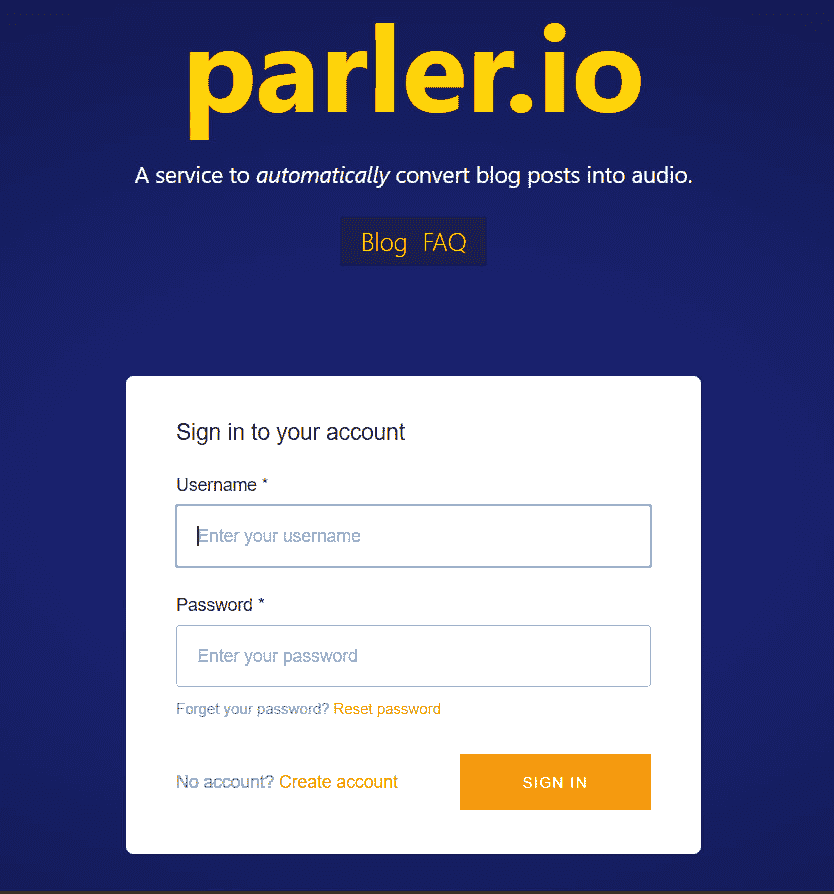

# 如何轻松定制 AWS Amplify 认证 UI

> 原文：<https://dev.to/kylegalbraith/how-to-easily-customize-the-aws-amplify-authentication-ui-42pl>

对于 parler.io 来说，我一直在尝试在项目中加入认证。这将允许转换与用户相关联，并支持一系列其他功能。

在我的实验中，我阅读了很多关于 AWS Amplify 的文章。这是一个包装了多个 AWS 服务的库，允许您专注于在 Amazon web Services 上大规模构建移动和 Web 应用程序。

这使得添加各种类别的功能更加简单。需要认证？有一个模块可以解决这个问题。储物呢？是的，也有一个。

Amplify 旨在将 AWS 服务无缝拼接在一起。一个简单的命令行调用可以提供 AWS 帐户中处理身份验证所需的所有服务。

Amplify 框架简化了在 AWS 中创建可伸缩的移动和 web 应用程序的过程。在这篇文章中，我将介绍如何使用 AWS Amplify 为 Parler 添加身份验证，以及如何定制用户界面组件来满足我的需求。

### 入门

Amplify 是 AWS 提供的框架。首先，我们必须为 Amplify 安装和配置 CLI。

```
$ npm install -g @aws-amplify/cli 
```

Enter fullscreen mode Exit fullscreen mode

如果您没有安装和配置 [AWS CLI](https://aws.amazon.com/cli/) ，您将需要配置 Amplify CLI。如果您已经配置了 AWS CLI，则不需要再配置 Amplify CLI。

```
# only run this configure if you don't have the AWS CLI
$ amplify configure 
```

Enter fullscreen mode Exit fullscreen mode

一旦安装了 Amplify CLI，我们就可以开始向我们的移动或 web 应用程序添加模块了。

在我的项目中，我使用 [Gatsby](https://www.gatsbyjs.org/) 来构建 web 应用程序。这是一个现代的静态站点生成器，可以用来快速创建静态网站、博客、文件夹，甚至 web 应用程序。因为《盖茨比》是建立在 React 之上的，所以我们可以在《盖茨比》中使用 React 中的所有相同的想法。

让我们为一个 React web 应用程序初始化和配置初始的 Amplify 设置。

### 初始化放大

现在我们已经在全球范围内安装了 CLI，我们可以通过一个命令行调用来初始化 React 应用程序内部的 Amplify。

```
# run this from the root directory of your application
$ amplify init 
```

Enter fullscreen mode Exit fullscreen mode

这个命令将初始化我们的 AWS 配置，并在应用程序的根目录下创建一个配置文件。这个命令不会在我们的 AWS 帐户中提供任何服务，但是它为我们这样做奠定了基础。

### 向我们的应用程序添加认证

现在我们已经初始化了应用程序中的框架，我们可以开始添加模块了。对于这篇博文，我们将把`authentication`模块添加到我们的应用程序中。

我们可以在命令行上再调用一次。

```
$ amplify add auth 
```

Enter fullscreen mode Exit fullscreen mode

该命令将引导我们回答一系列问题。每个问题都是为我们的应用程序配置身份验证。如果您不确定需要什么配置，请选择第一个问题的`Yes, use the default configuration`。您可以随时返回并通过运行命令`amplify update auth`重新配置这些设置。

现在，我们已经为应用程序配置了身份验证模块。但是，我们仍然需要将这个配置部署到我们的 AWS 帐户。幸运的是，这也是由 Amplify CLI 处理的。

```
$ amplify push 
```

Enter fullscreen mode Exit fullscreen mode

这将为我们的 AWS 帐户创建和部署必要的更改，以支持我们的身份验证模块。使用默认设置，这将提供 AWS Cognito 来处理应用程序中的身份验证。

当部署完成时，我们将在源目录中有一个新文件，`aws-exports.js`。这个文件代表了我们 AWS 账户内部支持我们 Amplify 项目的基础设施。

### 使用放大与反应

添加了 Amplify 框架，配置了身份验证，并提供了必要的 AWS 服务来支持我们的应用程序。现在是时候设置 React/Gatsby 应用程序来利用这个框架了。

出于这篇博文的目的，我们将假设我们有一个`App`组件，它是我们应用程序的主要入口点。我们还将假设，如果没有经过身份验证，您就不能访问应用程序。

这是我们最初的`App`组件的样子。它通过 Gatsby 配置在`/app`路线上提供服务。现在它对世界完全开放，不需要认证。

```
import React from "react";

class App extends React.Component {
  constructor(props, context) {
    super(props, context);
  }

  render() {
    return (
      <div>
        <h1>Internal App</h1>
      </div>
    );
  }
}

export default App; 
```

Enter fullscreen mode Exit fullscreen mode

跟我到目前为止？太好了。现在我们想把我们的应用程序放在通过 Amplify 添加的认证模块后面。为此，我们在项目中安装了另外两个库。

```
$ npm install aws-amplify aws-amplify-react 
```

Enter fullscreen mode Exit fullscreen mode

现在我们已经添加了这两个库，我们可以快速地将身份验证添加到我们的应用程序中。首先，我们需要在我们的`App`组件中配置 Amplify。然后我们可以使用一个更高阶的组件(HOC)，`withAuthenticator`，专门为 React 应用程序创建。该组件添加了将我们的`App`组件置于身份验证之后的所有逻辑。它还包括我们登录用户、注册新用户和处理流程(如确认帐户和重置密码)所需的所有 UI 部分。

让我们看看这些变化在我们的`App`组件中是什么样子的。

```
 import React from "react";
import Amplify from "aws-amplify";
import { withAuthenticator } from "aws-amplify-react";
import config from "../../aws-exports";
Amplify.configure(config);

class App extends React.Component {
  constructor(props, context) {
    super(props, context);
  }

  render() {
    return (
      <div>
        <h1>Internal App</h1>
      </div>
    );
  }
}

export default withAuthenticator(App, true); 
```

Enter fullscreen mode Exit fullscreen mode

就像这样，我们现在在用 Gatsby 构建的 React 应用程序中添加了身份验证。如果我们从命令行运行`gatsby develop`并在本地检查我们的更改，我们应该能够看到 Amplify 提供的默认登录提示。

[](https://res.cloudinary.com/practicaldev/image/fetch/s--65vS-Mrf--/c_limit%2Cf_auto%2Cfl_progressive%2Cq_auto%2Cw_880/https://thepracticaldev.s3.amazonaws.com/i/3j7d22pj3vu1osy2uft5.PNG)

很漂亮吧？通过几个命令行操作，我们将身份验证集成到了我们的应用程序中。支持我们的应用程序所需的所有 AWS 服务都由 Amplify 框架提供和持续维护。

这太棒了，但是对于 Parler，我还希望能够定制 Amplify 提供的 UI。这些预先配置的 UI 组件非常适合入门，但我想使用 Tailwind CSS 为它们添加我自己的风格。

因此，现在让我们探索如何通过用我们自己的`CustomSignIn`组件覆盖默认组件(如`SignIn`)来定制 Amplify 的身份验证 UI。

### 定制 Amplify 认证界面

为了定制 Amplify 身份验证模块的外观，我们需要为我们想要更改的 UI 片段定义自己的组件。

例如，登录界面是由 Amplify 内部的一个名为`SignIn`的组件处理的，你可以在这里看到那个模块[的完整源代码。](https://github.com/aws-amplify/amplify-js/blob/master/packages/aws-amplify-react/src/Auth/SignIn.jsx)

我们接下来要做的是定义我们自己的组件`CustomSignIn`，它将从 Amplify 扩展`SignIn`组件。这允许我们使用已经内置到父组件中的所有逻辑，但是定义我们自己的 UI。让我们看看`CustomSignIn`是什么样子的。

```
import React from "react";
import { SignIn } from "aws-amplify-react";

export class CustomSignIn extends SignIn {
  constructor(props) {
    super(props);
    this._validAuthStates = ["signIn", "signedOut", "signedUp"];
  }

  showComponent(theme) {
    return (
      <div className="mx-auto w-full max-w-xs">
        <form className="bg-white shadow-md rounded px-8 pt-6 pb-8 mb-4">
          <div className="mb-4">
            <label
              className="block text-grey-darker text-sm font-bold mb-2"
              htmlFor="username"
            >
              Username
            </label>
            <input
              className="shadow appearance-none border rounded w-full py-2 px-3 text-grey-darker leading-tight focus:outline-none focus:shadow-outline"
              id="username"
              key="username"
              name="username"
              onChange={this.handleInputChange}
              type="text"
              placeholder="Username"
            />
          </div>
          <div className="mb-6">
            <label
              className="block text-grey-darker text-sm font-bold mb-2"
              htmlFor="password"
            >
              Password
            </label>
            <input
              className="shadow appearance-none border rounded w-full py-2 px-3 text-grey-darker mb-3 leading-tight focus:outline-none focus:shadow-outline"
              id="password"
              key="password"
              name="password"
              onChange={this.handleInputChange}
              type="password"
              placeholder="******************"
            />
            <p className="text-grey-dark text-xs">
              Forgot your password?{"  "}
              <a
                className="text-indigo cursor-pointer hover:text-indigo-darker"
                onClick={() => super.changeState("forgotPassword")}
              >
                Reset Password
              </a>
            </p>
          </div>
          <div className="flex items-center justify-between">
            <button
              className="bg-blue hover:bg-blue-dark text-white font-bold py-2 px-4 rounded focus:outline-none focus:shadow-outline"
              type="button"
              onClick={() => super.signIn()}
            >
              Login
            </button>
            <p className="text-grey-dark text-xs">
              No Account?{"  "}
              <a
                className="text-indigo cursor-pointer hover:text-indigo-darker"
                onClick={() => super.changeState("signUp")}
              >
                Create account
              </a>
            </p>
          </div>
        </form>
      </div>
    );
  }
} 
```

Enter fullscreen mode Exit fullscreen mode

通过`CustomSignIn`，我们从`aws-amplify-react`扩展了`SignIn`组件。这样我们可以覆盖`showComponent`方法，但仍然使用父类函数，如`changeState`和`signIn`。

注意，我们没有覆盖`render`方法，而是覆盖了`showComponent`。这是因为父`SignIn`组件定义了该函数内部的 UI。因此，为了显示我们的 UI，我们需要在组件中覆盖它。

在我们的构造函数中，我们看到下面的语句。

```
this._validAuthStates = ["signIn", "signedOut", "signedUp"]; 
```

Enter fullscreen mode Exit fullscreen mode

Amplify 使用`authState`来跟踪当前激活的认证状态。我们定义的定制组件可以声明哪些身份验证状态对该组件有效。因为我们在登录视图中，所以我们只想在`authState`等于`signIn`、`signedOut`或`signedUp`时呈现我们的自定义 UI。这就是在默认的 Amplify 提供的 UI 上显示我们的 UI 的神奇之处。

我们扩展了`SignIn`组件，覆盖了`showComponent`函数，检查了`authState`，如果状态是我们正在寻找的，就显示我们的 UI。

很漂亮吧？

深入到自定义 UI 中，我们看到“创建帐户”按钮在被点击时会调用`super.changeState("signUp")`。这是我们正在扩展的父组件中定义的函数。它将`authState`更新为`signUp`，并呈现`SignUp`组件。当然，我们也可以按照创建`CustomSignIn`的过程定制这个组件。

我们现在需要做的另一个改变是退出我们的`App`组件。我们将直接使用`Authenticator`组件，而不是使用 Amplify 提供的`withAuthenticator` HOC。

为了让事情更清楚，我们将定义一个新的组件，`AppWithAuth`，它包装了我们的`App`组件并直接使用了`Authenticator`组件。

```
import React from "react";
import { SignIn } from "aws-amplify-react";
import config from "../../aws-exports";
import { CustomSignIn } from "../Login";
import App from "../App";
import { Authenticator } from "aws-amplify-react/dist/Auth";

class AppWithAuth extends React.Component {
  constructor(props, context) {
    super(props, context);
  }

  render() {
    return (
      <div>
        <Authenticator hide={[SignIn]} amplifyConfig={config}>
          <CustomSignIn />
          <App />
        </Authenticator>
      </div>
    );
  }
}

export default AppWithAuth; 
```

Enter fullscreen mode Exit fullscreen mode

现在我们的`App`组件将在它的`render`方法中接收`authState`，就像我们的其他组件一样。如果我们检查该方法内部的状态，我们可以仅在登录时显示我们的`App`组件。让我们看看我们新的`App`组件代码。

```
import React from "react";

class App extends React.Component {
  constructor(props, context) {
    super(props, context);
  }

  render() {
    if (this.props.authState == "signedIn") {
      return (
        <div>
          <h1>Internal App</h1>
        </div>
      );
    } else {
      return null;
    }
  }
}

export default App; 
```

Enter fullscreen mode Exit fullscreen mode

现在我们的`App`组件非常少。事实上，我们对 Amplify 的唯一理解是检查我们的`authState`,它决定了我们是否应该渲染这个组件。

[](https://res.cloudinary.com/practicaldev/image/fetch/s--fqM-cVya--/c_limit%2Cf_auto%2Cfl_progressive%2Cq_66%2Cw_880/https://thepracticaldev.s3.amazonaws.com/i/8un3uyz8q5eimo034gbp.gif)

就这样，我们使用 Amplify 框架向我们的应用程序添加了身份验证。我们还定制了 Amplify 的组件，以便在需要时提供我们自己的外观、感觉和逻辑。

### 结论

Amplify 框架是我们 AWS 工具箱中一个非常棒的新工具。我们在这里演示了只需几个 CLI 命令就可以向任何 web 或移动应用程序添加身份验证。然后，我们可以部署 AWS 服务，通过一个简单的`push`调用来支持认证等模块。

但是有时我们想在这些类型的框架中加入我们自己的风格。没问题。我们展示了我们可以扩展 Amplify 内部的基本组件来创建我们的用户界面，并隐藏我们不关心的组件。

Amplify 继续发展，包含了更多的模块，如主机、api、auth，甚至存储。对大多数 web 应用程序都很重要的所有关键模块和 AWS 服务。此外，他们还刚刚宣布了 [Amplify 控制台](https://aws.amazon.com/about-aws/whats-new/2018/11/announcing-aws-amplify-console/)，其中包含一个全球 CDN 来托管您的应用程序以及 CI/CD 管道。

如果你对这篇文章有任何疑问，欢迎在下面给我留言。

### 您是否渴望了解更多关于亚马逊网络服务的信息？

如果你想开始你的 AWS 之旅，但却不知道从哪里开始，可以考虑查看我的课程。我们专注于在 AWS 上托管、保护和部署静态网站。让我们在使用时能够了解超过 6 种不同的 AWS 服务。在你掌握了基础知识之后，我们可以进入**的两个额外章节**来讨论更高级的主题，比如基础设施代码和持续部署。