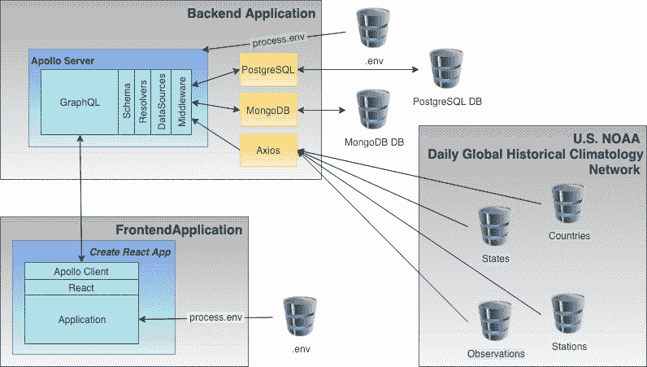
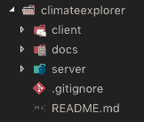
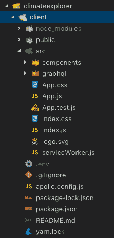
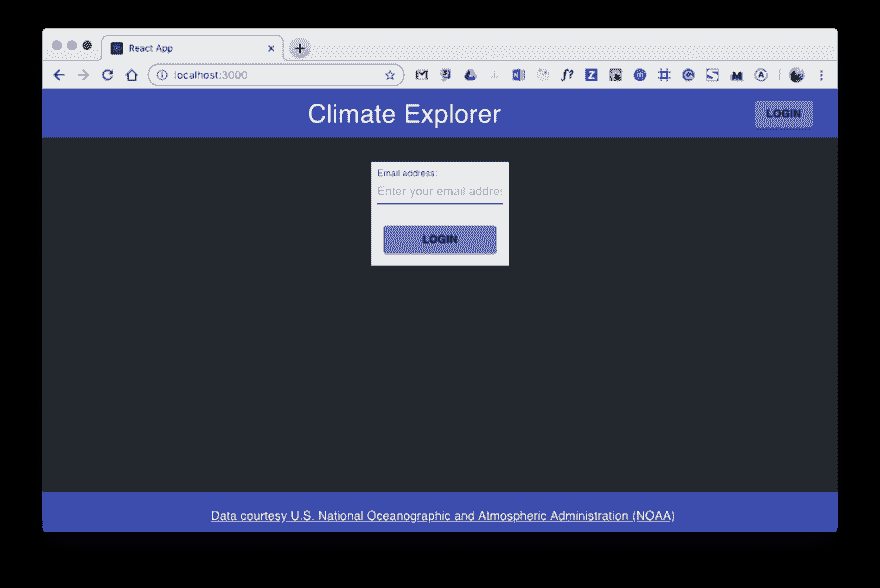
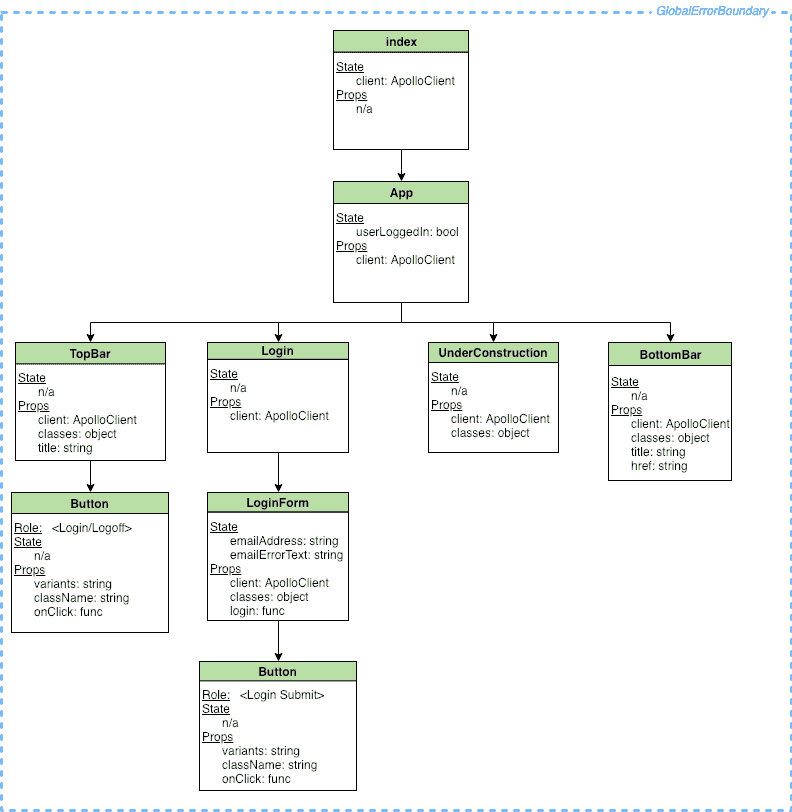
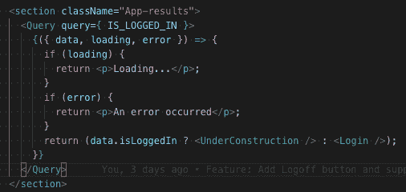
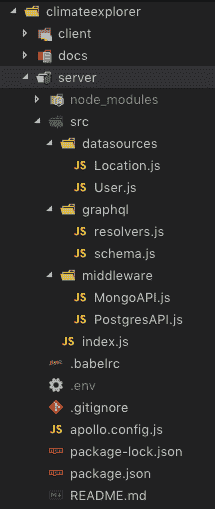
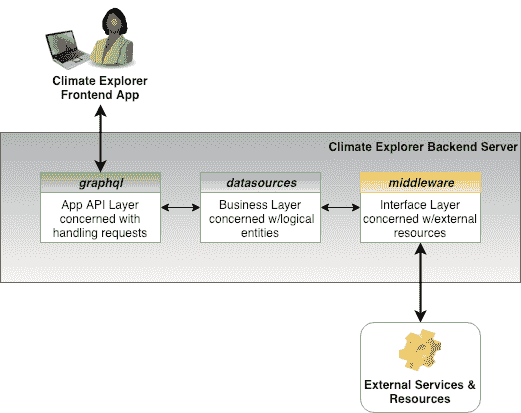
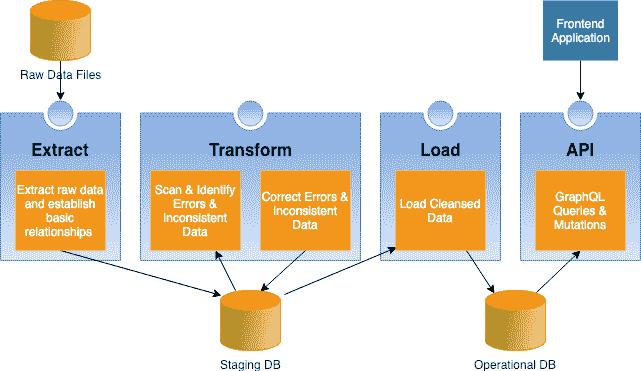
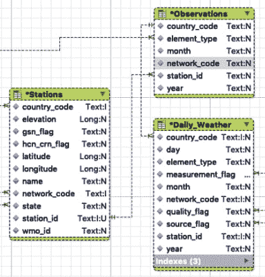

# 如何用 MongoDB & Postgres 进行 ETL(第 2 部分)

> 原文：<https://dev.to/chingu/how-to-etl-with-mongodb--postgres-part-2-1422>

#### 第二部分，设计&设置环境

<figure> 

<figcaption>照片由[艾蒂安·吉拉尔代](https://unsplash.com/photos/sgYamIzhAhg?utm_source=unsplash&utm_medium=referral&utm_content=creditCopyText)上[下](https://unsplash.com/search/photos/foundation?utm_source=unsplash&utm_medium=referral&utm_content=creditCopyText)</figcaption>

</figure>

### 简介

任何建筑最重要的两个组成部分是蓝图和地基。没有一个深思熟虑的计划的结果是不协调的建设，错过最后期限，成本超支，以及建设不符合其业主和居住者的需求。更糟糕的是，糟糕的规划和粗制滥造的地基会带来安全风险。

web 应用程序也是如此——成功部分取决于基于最终用户用例的计划，以及支持应用程序满足其主要目标的前端和后端基础架构。即满足用户的需求。

[第 1 部分，了解情况](https://dev.to/jdmedlock/how-to-etl-with-mongodb-and-postgres-part-1-5775)提出开发 Climate Explorer 应用程序作为一种手段，探索使用 MongoDB 作为中间中转区来捕获、清理和组织大量数据，然后将其加载到一个[操作数据库](https://en.wikipedia.org/wiki/Operational_database)，如 PostgreSQL。本文将定义支持这个项目所需的前端和后端环境的需求和约束，并描述它们的组件。

[Climate Explorer repo](https://github.com/jdmedlock/climateexplorer/tree/feature/04-config-dbs) 驻留在 GitHub 的 [feature/05-article-part2](https://github.com/jdmedlock/climateexplorer/tree/feature/05-article-part2) 分支中。

<figure> 

<figcaption>图 1 —气候浏览器应用架构</figcaption>

</figure>

如图 2 所示，前端的源代码和支持文件保存在`client`子目录中，而`server`子目录包含后端文件。

<figure> 

<figcaption>图 2 —项目结构</figcaption>

</figure>

### 前端架构

如您所料，前端的职责是为用户提供一种访问和操作后端维护的气候数据的方法。前端还公开了启动和监控数据提取、转换和加载(ETL)过程的管理功能。

<figure> 

<figcaption>图 3 —客户项目结构</figcaption>

</figure>

#### 创建 React App

前端使用 [ReactJS](https://reactjs.org/) 实现用户界面，并使用 [Create React App](https://facebook.github.io/create-react-app/) 生成。此外，因为我们希望用户界面/UX 遵循良好设计的概念和实践，所以使用了[Material-UI React Components](https://material-ui.com/)包来利用谷歌的材料设计，只需最少的开发人员准备时间。

这个开发阶段的目标是创建一个应用程序框架，项目的后续阶段将根据新的需求对其进行增强。因此，前端有一个最小的用户界面，只包含用户认证和一个“正在建设中”的页面。任何出现的新功能都将取代“建设中”页面。

<figure> 

<figcaption>图 4 —气候浏览器应用登录</figcaption>

</figure>

图 5 显示了当前在气候浏览器中实现的前端组件。由于还没有定义气候数据表示的用例，所以使用了一种简单的组件状态管理方法。

围绕所有应用程序组件定义了一个全局[反应错误边界](https://reactjs.org/docs/error-boundaries.html),以捕获和报告任何可能发生的错误。关于错误边界检查的更多信息"[利用 React 错误边界来改进 UX](https://dev.to/jdmedlock/exploit-react-error-boundaries-to-improve-ux-hdk)

<figure> 

<figcaption>图 5 —气候浏览器 React 组件</figcaption>

</figure>

#### 服务器 API

前端应用程序不会跨会话保存数据。数据驻留在两个后端数据库中，通过构建在 [Apollo GraphQL](https://www.apollographql.com/) 之上的 API 进行访问和操作。

使用 GraphQL 而不是 REST，因为它允许前端选择需要哪些数据属性，它易于理解，受健壮的工具支持，最重要的是，它是一个经过验证的解决方案。有关 REST 与 GraphQL 的更多信息，请参见“ [REST 与 GraphQL:关键回顾](https://blog.goodapi.co/rest-vs-graphql-a-critical-review-5f77392658e7)

GraphQL 包括一组 React 组件，与 REST 相比，它使代码更容易阅读和理解，因为它遵循基于 React 建立的原则的声明式风格。例如，图 6 中的`<Query>`组件展示了如何检索一个布尔值，该值指示后端服务器是否已经完成了用户认证。

<figure> 

<figcaption>图 6 —使用 GraphQL</figcaption>

</figure>

查询信息

这个特定的 GraphQL 查询更加有趣，因为它使用 Apollo 操作本地状态，而不是基于服务器的数据。以这种方式操作本地状态消除了潜在的昂贵的服务器之旅，并通过消除将应用程序状态作为道具传递给其他组件的需要而简化了代码。

### 后端架构

后端服务器有两个职责——执行 ETL 操作以填充操作数据库，以及为前端应用程序访问操作数据提供 API。支持这些职责的后端组件有:

*   [MongoDB](https://www.mongodb.com/) 数据库用作 ETL 过程的中转区
*   [PostgreSQL](https://www.postgresql.org/) 包含运营数据的数据库
*   基于 [Apollo GraphQL 服务器](https://www.apollographql.com/)的 API。

与前端类似，项目这一阶段的目标是建立一个框架，以便在项目的后期添加功能。因为这个工具，你可能期望在后端，像 [webpack](https://webpack.js.org/) 和 [Express](https://expressjs.com/) ，已经被省略，直到我们知道他们是必需的。

<figure> 

<figcaption>图 7 —服务器项目结构</figcaption>

</figure>

`graphql`子目录包含实现各种 API 特性的[查询、突变](https://graphql.org/learn/queries/)和[解析器](https://graphql.org/learn/execution/)。GraphQL 解析器使用位于`datasources`子目录中的模块来针对气候数据执行特定的业务操作。最后，位于`middleware`子目录中的模块与外部服务和资源(如数据库和服务)接口，以访问和维护物理数据。

<figure> 

<figcaption>图 8 —后端应用流程</figcaption>

</figure>

#### MongoDB

由于 MongoDB 的效率、对非结构化数据的支持和查询能力，传入原始数据的暂存区域使用 MongoDB。MongoDB 是比 SQL 更好的选择，因为将大量原始数据加载到 SQL 数据库中要求原始数据没有错误，并且实体之间的关系保持一致。因为 SQL 必须执行 [ACID](https://en.wikipedia.org/wiki/ACID_(computer_science)) 原则，所以可以理解它不能容忍这些类型的问题，因为关系是基于数据值的。

许多开发人员发现，像[mongose](https://mongoosejs.com/)这样的[对象关系映射](https://en.wikipedia.org/wiki/Object-relational_mapping) (ORM)包通过提供一种基于模式的方法来进行数据建模和管理，使得开发变得更加容易和快速。基于以下两个[假设](https://www.urbandictionary.com/define.php?term=Assume)，该项目仅使用原生 MongoDB:

1.  加载和转换原始数据只需要基本的 MongoDB 功能。
2.  要处理的文档量以及 Mongoose 的额外代码路径将对 CPU 消耗产生重大影响。

不使用像 Mongoose 这样的 ORM 并不意味着它的功能或质量有任何问题。这仅仅是一个设计决策，可以根据情况进行修改。

要了解更多关于猫鼬的信息，请参见"[MongoDB 概述&猫鼬](https://medium.com/chingu/an-overview-of-mongodb-mongoose-b980858a8994)"

<figure> 

<figcaption>图 9 —服务器工作流程</figcaption>

</figure>

#### PostgreSQL

Climate Explorer 使用 PostgreSQL 作为其永久操作数据库。一个 [SQL](https://en.wikipedia.org/wiki/SQL) 数据库管理系统(DBMS)优于一个 [NoSQL](https://en.wikipedia.org/wiki/NoSQL) DBMS，为气候数据的消费者提供一个快速、高度结构化的数据模型。由于 Climate Explorer 是 ETL 的演示平台，因此业务数据高度结构化的要求是一种人为的要求。

如前所述，SQL DBMSes 需要一致的数据，因为实体之间的关系是使用共享数据值建立的。例如，气候观测通过一个唯一的站标识符与它所在的站相关联。

要存在这种关系，测站表中的某一行必须具有与观测表相关行中的测站 id 相匹配的测站 id。共享的气象站 id 在气象站及其观测值之间建立了一对多的关系。

<figure> 

<figcaption>图 10 —台站&观测表关系</figcaption>

</figure>

此时，ORM 不用于将数据加载到操作数据库中，原因与应用程序不使用 ORM 访问 MongoDB 的原因相同。然而，随着新用例的确定，它们可能会要求 API 使用 ORM 对 PostgreSQL 中维护的数据进行操作访问。

### 回顾——向前失败

只要你从中吸取教训，并努力不再犯错误，犯错误并不可耻。很多时候，最永久的教训来自错误。

和这个项目没什么区别。与其从错误(也就是我所犯的错误)中退缩，不如将它们视为“可教的时刻”

#### 阿波罗“阿尔法”

利用 Apollo 客户机的本地状态管理是我想在这个项目中探索的事情。不幸的是，我没有很好地遵循阿波罗教程，浪费了两天多的时间试图让它正常工作。

此问题的[根本原因](https://en.wikipedia.org/wiki/Root_cause_analysis)是安装了 Apollo 软件包的稳定版本，而不是 Apollo Client 3.0 的 alpha 版本，因为在教程中忽略了以下陈述:

> " *apollo-client@alpha* :带有智能缓存的完整数据管理解决方案。在本教程中，我们将使用阿波罗客户端 3.0 预览版，因为它包括本地状态管理功能，并为您设置缓存。”

为了解决这个问题，使用了`apollo-link-state`的稳定版本中的本地状态管理特性，而不是在`apollo-client`的 alpha 版本中实现的方法。尽管 alpha 版本提供的方法更简单，但使用它而不是稳定版本可能会给 Climate Explorer 带来不良的副作用。

> **经验教训**:阅读文档，然后再读一遍，然后再读一遍

#### CEButton 组件

在前端开发的早期，确定 UI 中的多个点需要用户输入的按钮。不想[重复代码](https://hackernoon.com/this-is-not-the-dry-you-are-looking-for-a316ed3f445f)，创建了一个`CEButton`组件来封装 Material-UI 包中的`Button`组件。

不幸的是，这种方法太抽象，而且`CEButton`变得过于复杂，需要太多的道具和太多的条件语句。解决方案是用`Button`代替`CEButton`，这简化了代码，使其更容易理解，适应性也更强。

> **经验教训**:像 DRY 这样的编程原则是有用的，但是死记硬背一项技术并不能代替理解它的用例。

#### MongoDB find param(用户对用户)

MongoAPI 模块中 findOne 函数的初始测试并没有检索到`users`文档，尽管该文档及其数据已经使用 [MongoDB Compass](https://www.mongodb.com/products/compass) 进行了验证。在浪费了几个小时和许多 console.log 语句后，确定调用函数在 collectionName 参数中传递的是“user”而不是“users”。

> **经验教训**:检查明显的错误并编写更强的错误处理函数。

### 包装完毕

<figure> 

<figcaption>图片由[费伦茨·霍瓦特](https://unsplash.com/photos/4gKHjKG7ty4?utm_source=unsplash&utm_medium=referral&utm_content=creditCopyText)上传 [Unsplash](https://unsplash.com/search/photos/agile?utm_source=unsplash&utm_medium=referral&utm_content=creditCopyText)</figcaption>

</figure>

Climate Explorer 现在有了一个架构、一个前端和一个后端，有望支持其演示 ETL 过程的目标。本文的目的不仅是描述环境是如何构建的，还分享了影响重要决策的因素。

重要的是要记住，随着项目的进展，我们会发现新的信息，在我们尚不擅长的技术方面获得经验，并且会犯错误。正因为如此，关注第二个[敏捷原则](https://en.wikipedia.org/wiki/Agile_software_development#Agile_software_development_principles)不仅重要而且关键。

> “欢迎不断变化的需求，即使是在开发后期。敏捷流程利用变化为客户带来竞争优势。”

***接下来—第三部分，设计数据库***

* * *