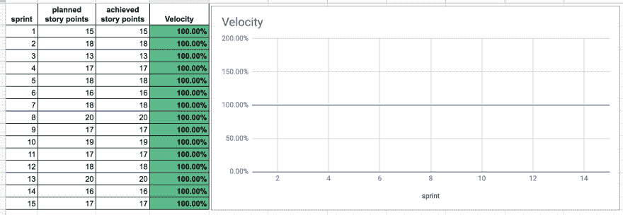
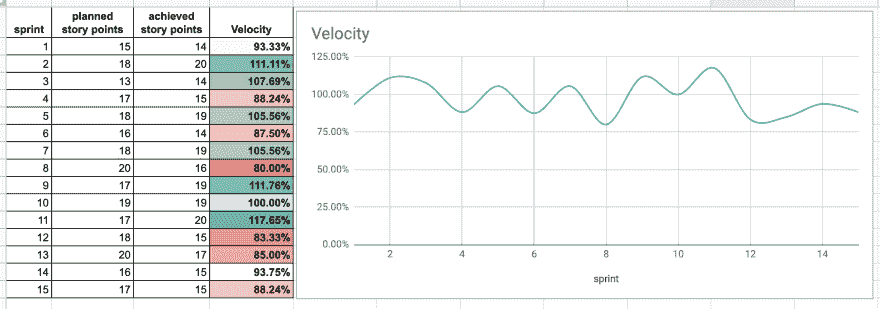
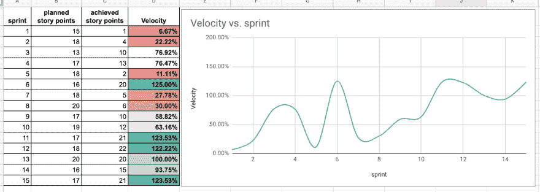

# 如何更快地团结一个新的 scrum 团队

> 原文：<https://dev.to/damnjan/how-to-glue-new-scrum-team-faster-1e3p>

> 这不完全是我一个人的想法，最初是与汉尼斯·科克罗合作的，他是一位 scrum 大师，在过去的两年里我有机会与之密切合作。

对于每一个 scrum 敏捷团队设置来说，有一个变量是正确的:“时间不能缩短或延长”。为了让我们的 scrum 体验更好或更差，所有其他的东西都可以被改变和采用。如果我们专注于改进，每个 scrum 大师都会给我们三个建议或指导方针，这些建议或指导方针几乎完全基于经验数据。
这是最常见的建议:

*   该团队可能由 5 到 9 人组成。
*   sprint 的时间框架应该是一周、两周或最多三周，而 90%的 scrum 团队在两周的交互中完成
*   团队召开每日会议，并在每次 sprint 交互结束时召开 sprint 回顾/评审会议。

### 理想场景

背后的想法是固定时间表，分配人员和执行一个冲刺阶段的计划。理想的情况是，在一个冲刺阶段之后，团队集合起来，得出他们实现了所有目标的结论。(图 1)

<figure>

<figcaption>figure 1</figcaption>

</figure>

### 现实场景

在非理想世界中，在 sprint 期间，团队会遇到障碍、问题、不确定性，以及他们无法控制的组件的不可预测的行为。所有这些都导致了对 scrum 团队更现实的期望，允许计划复杂性的+/- 20%的公差(图 2)。

<figure>

<figcaption>figure 2</figcaption>

</figure>

### 刚刚成立的团队

每个试图建立一个新的 scrum 团队，或者增加/减少多个团队成员的人，都面临着同样的问题，团队甚至不能达到+/- 50%的准确性。新成立的 scrum 团队有很多“未知”，团队成员彼此不认识，产品本身是未知的，或者一些团队成员仍然对它知之甚少。
最初发生的是高波动，从最初几次冲刺的+/- 100%精确度开始，然后开始稳定在+/- 20%范围内(图 3)。

<figure>

<figcaption>figure 3</figcaption>

</figure>

基本上，在图 3 中，我们看到，该团队在前 10 次冲刺中努力理解并考虑他们自己的能力。此后，一切开始稳定在+/- 20%的范围内(在这种情况下，从 80%到 120%)。

### 解

通过观察这幅图，不难理解，对于准确和可预测的团队，我们需要 10 次冲刺，时间通常为 2 周，这给了我们 2~3 个月的时间来建立团队。在每一次互动中，团队都有机会坐在一起讨论哪里出了问题，哪里做得好，提出新的建议并进行尝试。这是让团队更准确的主要原因。随着每一次回顾，团队越来越接近他们期望的准确性。
并不是每次回顾都会带来一个黄金解决方案，或者让团队中的每个人“点击”,但是每次团队都会尝试，不管成功与否。最后，在 3 个月(10 次冲刺)后，他们可以称自己是可预测的。

但是这个等式里还是有变数的，我们可以调整，以便更快的得到想要的结果。如果我们看到团队需要 10 次冲刺来建立，为什么不将冲刺的持续时间改为一周，而不是两周？图 4 是相同时间(30 周)的速度图，与上面的图类似，不同之处在于前 10 次冲刺是一周(黄色)，而其他是两周。
当团队仍然团结在一起时，每次都推动团队进行回顾，你创造了一个每周持续改进的空间，没有人需要等待两周才能点燃某个话题，团队成员可以尝试新方法，而不太担心失败。

<figure>

<figcaption>figure 4</figcaption>

</figure>

### 结论

因此，结论可以是，如果你很难通过大的团队变革来运作，或者刚刚组建了一个新的团队，试试这种方法，你会发现你可以通过重复互动来加快团队凝聚力。新成员彼此不了解，回顾帮助他们沟通，感受彼此，理解他人的痛苦。